# 并发编程知识汇总

## 1. 多线程基础

### 1.1 创建线程的三种方式

1. **继承 Thread 类**：创建一个类继承 `Thread` 类，并重写 `run` 方法。
   ```java
   public class MyThread extends Thread {
       @Override
       public void run() {
           System.out.println(getName() + ": 执行任务");
       }
   }
   ```
2. **实现 Runnable 接口**：创建一个类实现 `Runnable` 接口，并重写 `run` 方法。更灵活，易于与线程池配合。
   ```java
   public class MyRunnable implements Runnable {
       @Override
       public void run() {
           System.out.println(Thread.currentThread().getName() + ": 执行任务");
       }
   }
   ```
3. **实现 Callable 接口 (FutureTask)**：实现 `Callable` 接口，重写 `call` 方法。这种方式可以通过 `FutureTask` 获取任务执行的返回值。
   ```java
   public class CallerTask implements Callable<String> {
       public String call() throws Exception {
           return "Hello, task result!";
       }
   }
   // 使用方式
   FutureTask<String> task = new FutureTask<>(new CallerTask());
   new Thread(task).start();
   String result = task.get(); // 获取结果
   ```

| 创建方式                         | 优点                                                 | 缺点                                                              |
| :------------------------------- | :--------------------------------------------------- | :---------------------------------------------------------------- |
| **实现 Runnable/Callable** | 避免 Java 单继承局限；适合资源共享；解耦线程与任务。 | 编程稍微复杂，如需访问当前线程需使用 `Thread.currentThread()`。 |
| **继承 Thread**            | 编程简单，直接使用 `this` 即可获取当前线程。       | 受限于 Java 单继承；不适合多线程处理同一资源。                    |

### 1.2 run() 与 start() 的区别

* **为什么要重写 run()**：默认的 `run()` 方法不执行任何操作。为了让线程执行具体任务，必须重写它。
* `run()`：封装线程执行的代码，直接调用相当于在主线程中执行普通方法。
* `start()`：启动线程，使线程进入“就绪”状态，由 JVM 在合适时机调用此线程的 `run()` 方法。**只有 start() 才能真正开启多线程。**

## 2. 获取线程执行结果 (Future)

### 2.1 Future 接口

提供了异步计算的各种功能：

* `cancel(boolean mayInterrupt)`：尝试取消任务。若任务已完成或无法取消则返回 false。
* `isCancelled()`：任务是否在正常完成前被取消。
* `isDone()`：任务是否已完成（包括正常完成、异常、取消）。
* `get()`：**阻塞**获取结果，直到任务完成。
* `get(timeout, unit)`：在指定时间内获取结果，超时则返回 null 或抛异常。

### 2.2 FutureTask

`FutureTask` 实现了 `RunnableFuture` 接口（继承自 `Runnable` 和 `Future`），既可以作为 `Runnable` 被线程执行，又可以作为 `Future` 获取结果。

## 3. 线程运行原理

### 2.1 栈与栈帧

* 线程启动后，虚拟机会为每个线程分配一段**栈内存**。
* 栈由多个**栈帧**（Stack Frame）构成，对应着每次方法调用时占用的内存。
* 每个线程只能有一个**活动栈帧**，对应着当前正在执行的那个方法。

### 2.2 线程上下文切换（Context Switch）

发生情况：

* 线程的 CPU 时间片用完。
* 垃圾回收。
* 有更高优先级的线程需要运行。
* 线程自己调用了 `sleep`、`yield`、`wait`、`join`、`park`、`synchronized`、`lock` 等方法。

当 Context Switch 发生时，需要由操作系统保存当前线程的状态，并恢复另一个线程的状态，Java 中对应的概念就是**程序计数器**（Program Counter Register），它的作用是记住下一条 jvm 指令的执行地址，是线程私有的。

## 3. 查看进程与线程

### 3.1 操作系统命令

* **Windows**:
  * `tasklist`: 查看所有进程。
  * `taskkill /F /PID <pid>`: 强制杀死进程。
* **Linux**:
  * `ps -fe`: 查看所有进程。
  * `top`: 动态查看进程信息。
  * `kill <pid>`: 杀死进程。

### 3.2 Java 工具

* `jps`: 查看所有 Java 进程。
* `jstack <PID>`: 查看某个 Java 进程内的线程堆栈信息（排查死锁、CPU 飙高常用）。
* `jconsole`: 图形化界面，查看 Java 进程内线程的运行情况。

## 4. 线程常用方法

| 方法名                                | 作用                 | 说明                                                                                             |
| :------------------------------------ | :------------------- | :----------------------------------------------------------------------------------------------- |
| `start()`                           | 启动新线程           | 每个线程只能调用一次（**不可重复调用**）。                                                 |
| `run()`                             | 线程启动后执行的逻辑 | 直接调用不会启动新线程。                                                                         |
| `join()` / `join(n)`              | 等待线程结束         | 使调用方等待该线程结束（或超时）。                                                               |
| `sleep(n)`                          | 线程休眠             | 状态变为 `TIMED_WAITING`，**不释放锁**。建议在 `while(true)` 循环中调用以防 CPU 空转。 |
| `yield()`                           | 提示让出 CPU         | 状态变为 `RUNNABLE`，具体是否让出依赖调度器。                                                  |
| `interrupt()`                       | 打断线程             | 设置打断标记；若线程在 sleep/wait/join 会抛异常并清除标记。                                      |
| `isInterrupted()`                   | 判断是否被打断       | 不会清除打断标记。                                                                               |
| `Thread.interrupted()`              | 判断是否被打断       | **静态方法，会清除打断标记**。                                                             |
| `setDaemon(true)`                   | 设置为守护线程       | 主线程结束，守护线程也会被强制结束（如 GC 线程）。                                               |
| `getId()`                           | 获取线程唯一 ID      | 线程的长整型标识符。                                                                             |
| `getName()` / `setName()`         | 获取/修改线程名      | 方便调试和排查问题。                                                                             |
| `getPriority()` / `setPriority()` | 获取/修改优先级      | 范围 1-10，具体实现依赖任务调度器。                                                              |
| `isAlive()`                         | 线程是否存活         | 线程已启动且尚未结束。                                                                           |
| `currentThread()`                   | 获取当前线程         | 静态方法。                                                                                       |

### 4.1 过时方法（不推荐使用）

以下方法由于容易导致死锁或资源无法释放，已不推荐使用：

* `stop()`: 强制停止线程，可能导致同步资源未释放。
* `suspend()` / `resume()`: 挂起和恢复线程，极易导致死锁。

### 4.2 两阶段终止模式

如何优雅地在一个线程中终止另一个线程？利用 `interrupt`。


## 5. 线程生命周期与状态


### 5.1 操作系统层面（五种状态）


1. **初始状态**: 已创建但未与操作系统关联。
2. **可运行状态**: 等待 CPU 调度。
3. **运行状态**: 正在执行，时间片用完会回到可运行状态。
4. **阻塞状态**: 调用阻塞 API（如读写文件），结束后回到可运行状态。
5. **终止状态**: 运行完毕。

### 5.2 Java 层面（Thread.State 六种状态）


```java
public enum State {
    NEW, RUNNABLE, BLOCKED, WAITING, TIMED_WAITING, TERMINATED;
}
```


| **线程状态**         | **导致状态发生条件**                                                                                                                                         |
| -------------------------- | ------------------------------------------------------------------------------------------------------------------------------------------------------------------ |
| NEW（新建）                | 线程刚被创建，但是并未启动，还没调用 start 方法，只有线程对象，没有线程特征                                                                                        |
| Runnable（可运行）         | 线程可以在 Java 虚拟机中运行的状态，可能正在运行自己代码，也可能没有<br />这取决于操作系统处理器，调用了 t.start() 方法                                            |
| Blocked（阻塞）            | 当一个线程试图获取一个对象锁，而该对象锁被其他的线程持有，则该线程进入 Blocked 状态<br />当该线程持有锁时，该线程将变成 Runnable 状态                              |
| Waiting（无限等待）        | 一个线程在等待另一个线程执行一个（唤醒）动作时，该线程进入 Waiting 状态<br />进入这个状态后不能自动唤醒，必须等待另一个线程调用 notify 或者 notifyAll 方法才能唤醒 |
| Timed Waiting （限期等待） | 有几个方法有超时参数，调用将进入 Timed Waiting 状态<br />这一状态将一直保持到超时期满或者接收到唤醒通知。<br />带有超时参数的常用方法有 Thread.sleep 、Object.wait |
| Teminated（结束）          | run 方法正常退出而死亡，或者因为没有捕获的异常终止了 run 方法而死亡                                                                                                |

* **NEW → RUNNABLE**
  * 当调用 `t.start()` 方法时，由 **NEW → RUNNABLE**
* **RUNNABLE <--> WAITING**
  * 调用 `obj.wait()`方法时
  * 调用 `obj.notify()`、`obj.notifyAll()`、`t.interrupt()`：
    * 竞争锁成功，t 线程从 **WAITING → RUNNABLE**
    * 竞争锁失败，t 线程从 **WAITING → BLOCKED**
  * 当前线程调用 `t.join()` 方法，注意是当前线程在 t 线程对象的监视器上等待：**RUNNABLE → WAITING**
  * 当前线程调用 `LockSupport.park()` 方法：**RUNNABLE → WAITING，`unpark(线程)` 反之**
* **RUNNABLE <--> TIMED_WAITING**
  * 调用 `obj.wait(long n)` 方法、当前线程调用 `t.join(long n)` 方法、当前线程调用 `Thread.sleep(long n)` 方法、当前线程调用 `LockSupport.parkNanos(long nanos)` 方法
* **RUNNABLE <--> BLOCKED**
  * t 线程用 `synchronized(obj)` 获取了对象锁时竞争失败
* **RUNNABLE --> TERMINATED**
  * 线程所有代码执行完毕

### 5.3 Java 线程和 OS 线程状态比较

| Java 线程状态 | OS 线程状态   |
| ------------- | ------------- |
| NEW           | New           |
| RUNNABLE      | Ready/Running |
| BLOCKED       | Blocked       |
| WAITING       | Waiting       |
| TIMED_WAITING | Waiting       |
| TERMINATED    | Terminated    |

## 6. 共享资源问题

### 6.1 问题引入

```java
static int counter = 0;

public static void main(String[] args) throws InterruptedException{
    Thread t1 = new Thread(() ->{
        for(int i = 0;i < 1000;i++){
            counter++;
        }
    });

    Thread t2 = new Thread(() ->{
        for(int i = 0;i < 1000;i++){
            counter--;
        }
    });

    t1.start();
    t2.start();
    t1.join();
    t2.join();
    log.info("{}",counter);
}
```

* 上面代码计算结果可能是0，正数或负数
* 单线程没问题：

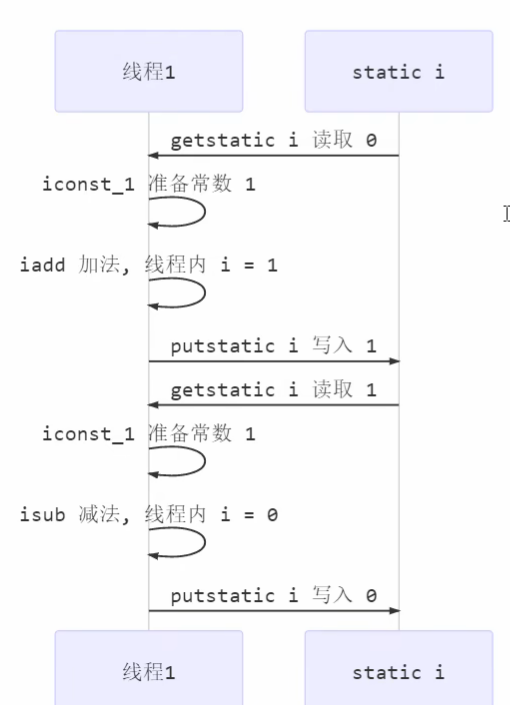

* 多线程可能的情况：

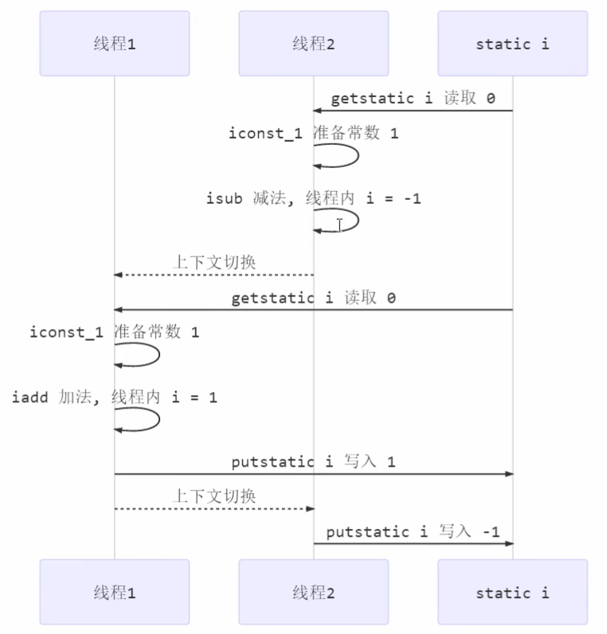

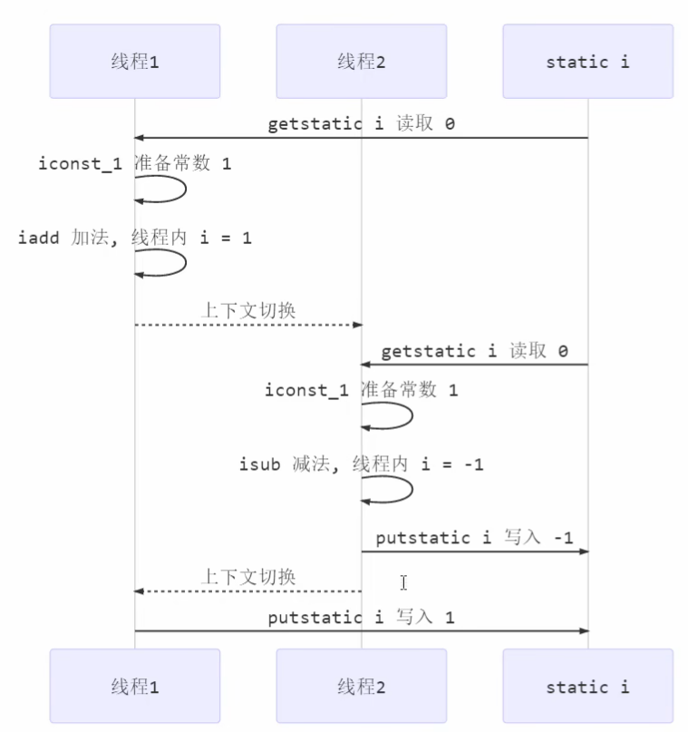

### 6.2 核心概念

**临界区**：一段代码内部存在对**共享资源**的**多线程读写操作**

**竞态条件**：多个线程在临界区执行，由于代码执行序列不同导致结果无法预测的情况

### 6.3 线程安全分析

#### 6.3.1 成员变量与静态变量

* **没有被共享**：线程安全
* **被共享**
  * 只有读操作：线程安全
  * 有读写操作：线程不安全
* **添加 final**：线程安全

#### 6.3.2 局部变量

* **局部变量本身**：线程安全
* **局部变量引用的对象**：线程不一定安全
  * 对象没有逃离方法作用域：线程安全
  * 对象逃离方法作用域：不安全

```java
public static void test(){
    int i = 10;
    i++;
}
```

* 每个线程调用 test 方法时，会在线程栈帧中创建多份，变量 i 不存在共享，不存在线程安全问题

### 6.4 synchronized 解决方案

#### 6.4.1 基本特性

- **阻塞式解决方案**：采用互斥方式让同一时刻最多有一个线程持有**对象锁**
- **互斥和同步**：都可以用 synchronized 解决
  - **互斥**：保证临界区竞态条件，同一时刻只能有一个线程执行临界区代码
  - **同步**：线程执行先后顺序不同，需要一个线程等待其他线程

#### 6.4.2 语法

```java
synchronized(对象){
    临界区
}
```

#### 6.4.3 使用示例

```java

  static final Object room = new Object();

  public static void main(String[] args) throws InterruptedException{
      Thread t1 = new Thread(() ->{
          for(int i = 0;i < 1000;i++){
              synchronized(room){
                  counter++;
              }
          }
      });

      Thread t2 = new Thread(() ->{
         for(int i = 0;i < 1000;i++){
              synchronized(room){
                  counter--;
              }
          }
      });

      t1.start();
      t2.start();
      t1.join();
      t2.join();
      log.info("{}",counter);
  }

  class Room{
      private int counter = 0;

      public void increment(){
           synchronized(room){
              counter++;
          }
      }  

      public void decrement(){
           synchronized(room){
              counter--;
          }
      }

      public int getCounter(){
           synchronized(room){
              return counter;
          }
      }
  }
```

  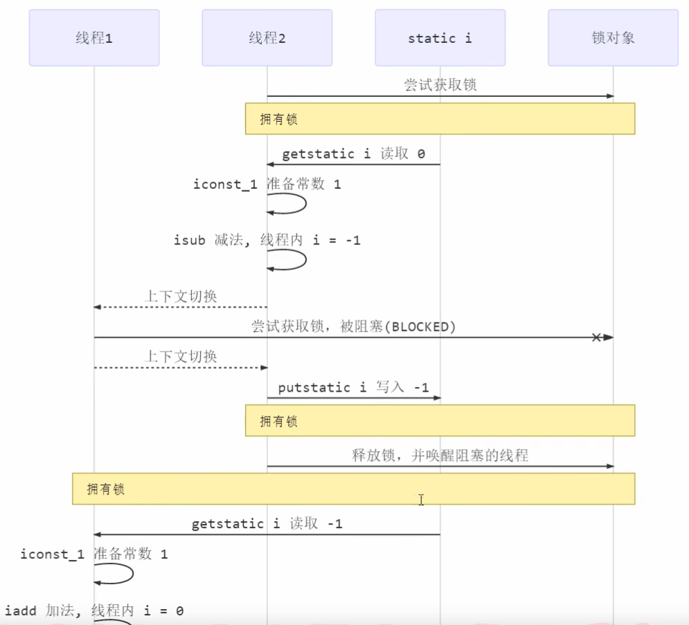

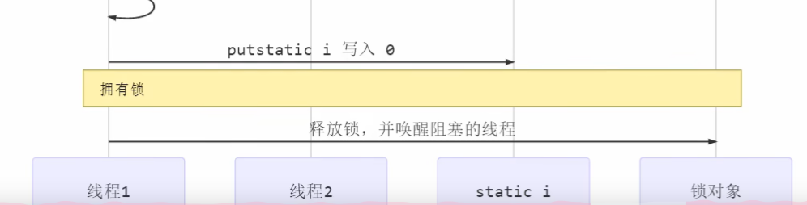

### 6.5 常见线程安全类

#### 6.5.1 线程安全的类

* **String**：创建新字符串
* **基本数据包装对象类**：如 Integer、Long 等
* **StringBuffer**
* **Random**
* **java.util.concurrent 包下的类**

#### 6.5.2 组合操作的非原子性

这些类的每个方法是原子的，但是它们多个方法的**组合不是原子的**

```java
HashTable table = new HashTable();
if(table.get("key")==null){
    table.put("key",value);
}
```

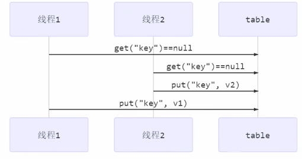

### 6.6 synchronized 底层与优化

#### 6.6.1 Java 对象头

* **32 位虚拟机为例**
* **Klass Word**：表示对象的类型，指向对象从属的 class

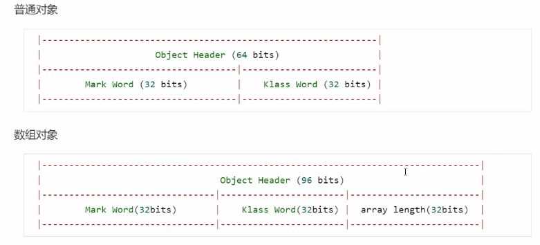

* **Mark Word**

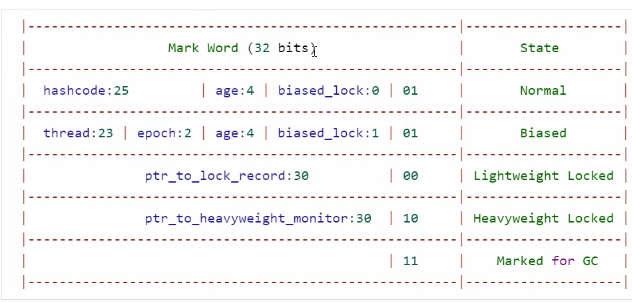

* **Normal 正常状态**：
  * hashcode：哈希码
  * age：垃圾回收时的分代年龄
  * biased_lock：偏向锁
  * 01：偏向锁状态
* **Biased ：**
* **Lightweight Locked 轻量级锁：**
  * ptr_to_lock_record：锁记录的地址
* **Heavyweight Locked 重量级锁：**
  * ptr_to_heavyweight_monitor：指向 monitor 指针
  * 10：偏向锁状态
* **Marked for GC 回收状态**

#### 6.6.2 Monitor（监视器/管程）

* 每个 Java 对象都关联一个 Monitor 对象
* 使用 synchronized 给对象上锁，其对象头 Mark Word 指向 Monitor 对象指针
* 拿到锁的指向 Monitor 的 `Owner` 字段，没拿到锁的指向 `EntryList` 字段

#### 6.6.3 轻量级锁

* 多线程访问时间错开了（没有竞争），可以用轻量级锁优化
* 轻量级锁语法仍是 synchronized
* 轻量锁发生竞争会升级为重量级锁
* 创建锁记录对象，每个线程栈帧都包含一个锁记录，存储锁定对象的 Mark Word

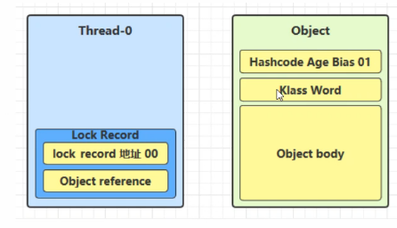

* 锁记录 Object reference 指向锁对象，尝试用 cas 替换 Object 的 Mark Word，将其值写存入锁记录

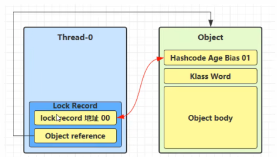

* 如果替换成功，对象头存储锁记录的地址和状态 00

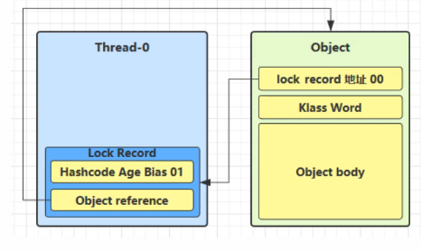

* cas 失败
  * 其他线程已经持有该锁，进入锁膨胀过程
  * 自己执行 synchronized 锁重入，再添加一个锁记录作为重入计数，交换必定失败
  * 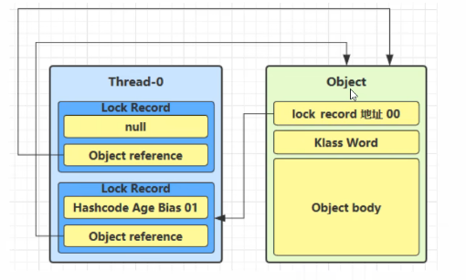
  * 退出 synchronized（解锁）时，如果有取值为 null 的锁记录，表示有重入，重置锁记录表示重入计数减一
  * 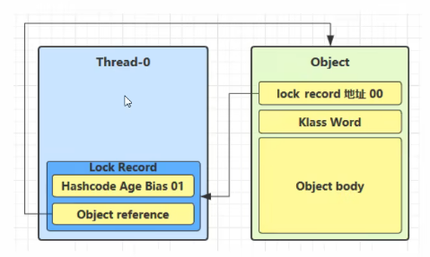
  * 退出 synchronized（解锁）时，锁记录不为 null，使用 cas 将 Mark Word 的值恢复给对象头
  * 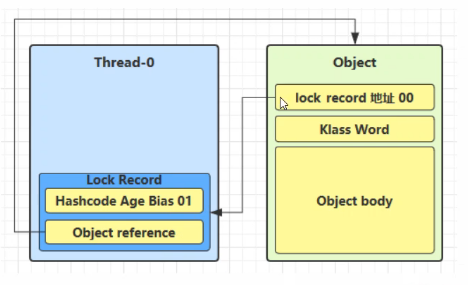
  * 成功，则解锁成功；失败，则说明轻量级锁进行了锁膨胀，进入重量级锁解锁过程

#### 6.6.4 锁膨胀

* 加轻量级锁时 CAS 失败，说明有锁竞争，进行锁膨胀，轻量级锁升级为重量级锁
* 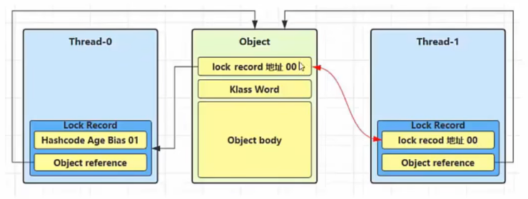
* Thread-1 加轻量级锁失败，进入锁膨胀过程
  * 为 Object 对象申请 Monitor 锁，Object 指向重量级锁地址
  * 进入 Monitor 的 EntryList，进入 BLOCKED 状态

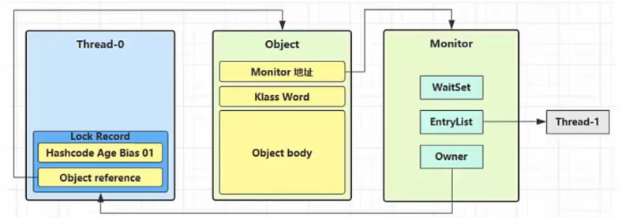

* Thread-0 解锁失败，进入重量级解锁流程，按照 Monitor 地址找到指向对象，设置 Owner 为 null，唤醒 EntryList 中 BLOCKED 状态的线程

#### 6.6.5 自旋优化

* 先不进入阻塞状态，而是循环等待一会，如果此时锁被释放，则可以避免阻塞（阻塞需要一次上下文切换，消耗性能）
* 多核 CPU 才建议自旋，单核自旋纯粹浪费

### 6.7 等待/通知机制

#### 6.7.1 原理

* Owner 线程发现条件不满足，调用 wait 方法，即可进入 WaitSet 变为 WAITING 状态
* BLOCKED 和 WAITING 的线程都处于阻塞状态，不占用 CPU 时间片
* BLOCKED 线程会在 Owner 线程释放锁时唤醒
* WAITING 线程会在 Owner 线程调用 notify 或 notifyAll 时唤醒，唤醒后并不意味者立刻获得锁，**需要进入 EntryList 重新竞争**

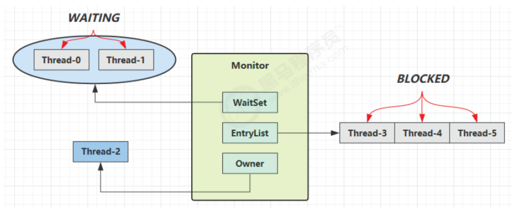

#### 6.7.2 API

* Object 类 API
* 必须要先获得对象所才能调用

```java
public final void notify():唤醒正在等待对象监视器的单个线程。
public final void notifyAll():唤醒正在等待对象监视器的所有线程。
public final void wait():导致当前线程等待，直到另一个线程调用该对象的 notify() 方法或 notifyAll()方法。
public final native void wait(long timeout):有时限的等待, 到n毫秒后结束等待，或是被唤醒
```

* **对比 sleep()：**
  * sleep 是 Thread 方法，wait 是 Object 方法
  * sleep 不需要强制和 synchronized 配合使用，但是 wait 需要
  * sleep 睡眠时不会释放对象锁，wait 等待时会释放

#### 6.7.3 代码示例

* 虚假唤醒：notify 只能随机唤醒一个 WaitSet 中的线程，这时如果有其它线程也在等待，那么就可能唤醒不了正确的线程
  * 解决方法：采用 notifyAll
* notifyAll 仅解决某个线程的唤醒问题，使用 if + wait 判断仅有一次机会，一旦条件不成立，无法重新判断
  * 解决方法：用 while + wait，当条件不成立，再次 wait

```java
@Slf4j(topic = "c.demo")
public class demo {
    static final Object room = new Object();
    static boolean hasCigarette = false;    //有没有烟
    static boolean hasTakeout = false;

    public static void main(String[] args) throws InterruptedException {
        new Thread(() -> {
            synchronized (room) {
                log.debug("有烟没？[{}]", hasCigarette);
                while (!hasCigarette) {//while防止虚假唤醒
                    log.debug("没烟，先歇会！");
                    try {
                        room.wait();
                    } catch (InterruptedException e) {
                        e.printStackTrace();
                    }
                }
                log.debug("有烟没？[{}]", hasCigarette);
                if (hasCigarette) {
                    log.debug("可以开始干活了");
                } else {
                    log.debug("没干成活...");
                }
            }
        }, "小南").start();

        new Thread(() -> {
            synchronized (room) {
                Thread thread = Thread.currentThread();
                log.debug("外卖送到没？[{}]", hasTakeout);
                if (!hasTakeout) {
                    log.debug("没外卖，先歇会！");
                    try {
                        room.wait();
                    } catch (InterruptedException e) {
                        e.printStackTrace();
                    }
                }
                log.debug("外卖送到没？[{}]", hasTakeout);
                if (hasTakeout) {
                    log.debug("可以开始干活了");
                } else {
                    log.debug("没干成活...");
                }
            }
        }, "小女").start();


        Thread.sleep(1000);
        new Thread(() -> {
        // 这里能不能加 synchronized (room)？
            synchronized (room) {
                hasTakeout = true;
				//log.debug("烟到了噢！");
                log.debug("外卖到了噢！");
                room.notifyAll();
            }
        }, "送外卖的").start();
    }
}
```

* 代码套路

```java
synchronized(lock){
    while(条件不成立){
        lock.wait();
    }
    // 执行业务
}

// 另一个线程
```

### 6.8 基于等待/通知的并发模式

#### 6.8.1 保护性暂停（单任务版）

Guarded Suspension，用在一个线程等待另一个线程的执行结果

* 有一个结果需要从一个线程传递到另一个线程，让它们关联同一个 GuardedObject
* 如果有结果不断从一个线程到另一个线程那么可以使用消息队列（见生产者/消费者）
* JDK 中，join 的实现、Future 的实现，采用的就是此模式

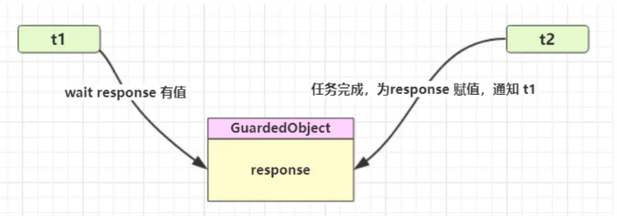

```java
public static void main(String[] args) {
    GuardedObject object = new GuardedObjectV2();
    new Thread(() -> {
        sleep(1);
        object.complete(Arrays.asList("a", "b", "c"));
    }).start();
  
    Object response = object.get(2500);
    if (response != null) {
        log.debug("get response: [{}] lines", ((List<String>) response).size());
    } else {
        log.debug("can't get response");
    }
}

class GuardedObject {
    private Object response;
    private final Object lock = new Object();

    //获取结果
    //timeout :最大等待时间
    public Object get(long millis) {
        synchronized (lock) {
            // 1) 记录最初时间
            long begin = System.currentTimeMillis();
            // 2) 已经经历的时间
            long timePassed = 0;
            while (response == null) {
                // 4) 假设 millis 是 1000，结果在 400 时唤醒了，那么还有 600 要等
                long waitTime = millis - timePassed;
                log.debug("waitTime: {}", waitTime);
                //经历时间超过最大等待时间退出循环
                if (waitTime <= 0) {
                    log.debug("break...");
                    break;
                }
                try {
                    lock.wait(waitTime);
                } catch (InterruptedException e) {
                    e.printStackTrace();
                }
                // 3) 如果提前被唤醒，这时已经经历的时间假设为 400
                timePassed = System.currentTimeMillis() - begin;
                log.debug("timePassed: {}, object is null {}",
                        timePassed, response == null);
            }
            return response;
        }
    }

    //产生结果
    public void complete(Object response) {
        synchronized (lock) {
            // 条件满足，通知等待线程
            this.response = response;
            log.debug("notify...");
            lock.notifyAll();
        }
    }
}
```

#### 6.8.2 保护性暂停（多任务版）

* 多任务情况下，在多个类之间使用 GuardedObject 对象传参不方便，因此设计中间类，解耦等待和实现

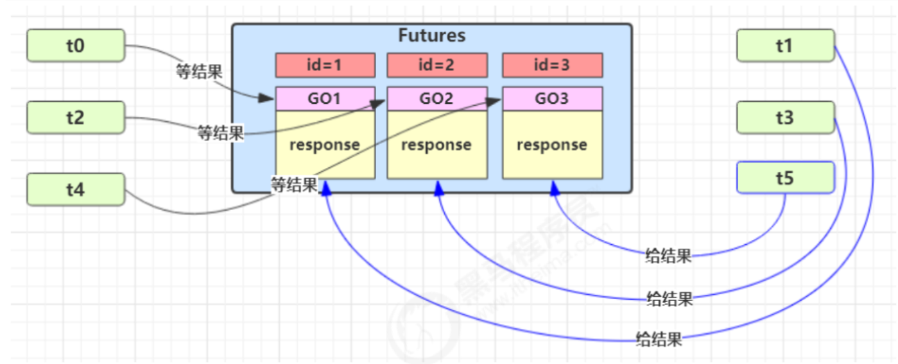

```java
public static void main(String[] args) throws InterruptedException {
    for (int i = 0; i < 3; i++) {
        new People().start();
    }
    Thread.sleep(1000);
    for (Integer id : Mailboxes.getIds()) {
        new Postman(id, id + "号快递到了").start();
    }
}

@Slf4j(topic = "c.People")
class People extends Thread{
    @Override
    public void run() {
        // 收信
        GuardedObject guardedObject = Mailboxes.createGuardedObject();
        log.debug("开始收信i d:{}", guardedObject.getId());
        Object mail = guardedObject.get(5000);
        log.debug("收到信id:{}，内容:{}", guardedObject.getId(),mail);
    }
}

class Postman extends Thread{
    private int id;
    private String mail;
    //构造方法
    @Override
    public void run() {
        GuardedObject guardedObject = Mailboxes.getGuardedObject(id);
        log.debug("开始送信i d:{}，内容:{}", guardedObject.getId(),mail);
        guardedObject.complete(mail);
    }
}

class  Mailboxes {
    private static Map<Integer, GuardedObject> boxes = new Hashtable<>();
    private static int id = 1;

    //产生唯一的id
    private static synchronized int generateId() {
        return id++;
    }

    public static GuardedObject getGuardedObject(int id) {
        return boxes.remove(id);
    }

    public static GuardedObject createGuardedObject() {
        GuardedObject go = new GuardedObject(generateId());
        boxes.put(go.getId(), go);
        return go;
    }

    public static Set<Integer> getIds() {
        return boxes.keySet();
    }
}
class GuardedObject {
    //标识，Guarded Object
    private int id;//添加get set方法
}
```

#### 6.8.3 生产者/消费者

* 消费队列可以用来平衡生产和消费的线程资源，不需要产生结果和消费结果的线程一一对应
* 生产者仅负责产生结果数据，不关心数据该如何处理，而消费者专心处理结果数据
* 消息队列是有容量限制的，满时不会再加入数据，空时不会再消耗数据
* JDK 中各种阻塞队列，采用的就是这种模式

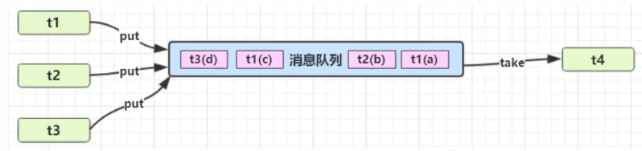

```java
 public class demo {
    public static void main(String[] args) {
        MessageQueue queue = new MessageQueue(2);
        for (int i = 0; i < 3; i++) {
            int id = i;
            new Thread(() -> {
                queue.put(new Message(id,"值"+id));
            }, "生产者" + i).start();
        }
  
        new Thread(() -> {
            while (true) {
                try {
                    Thread.sleep(1000);
                    Message message = queue.take();
                } catch (InterruptedException e) {
                    e.printStackTrace();
                }
            }
        },"消费者").start();
    }
}

//消息队列类，Java间线程之间通信
class MessageQueue {
    private LinkedList<Message> list = new LinkedList<>();//消息的队列集合
    private int capacity;//队列容量
    public MessageQueue(int capacity) {
        this.capacity = capacity;
    }

    //获取消息
    public Message take() {
        //检查队列是否为空
        synchronized (list) {
            while (list.isEmpty()) {
                try {
                    sout(Thread.currentThread().getName() + ":队列为空，消费者线程等待");
                    list.wait();
                } catch (InterruptedException e) {
                    e.printStackTrace();
                }
            }
            //从队列的头部获取消息返回
            Message message = list.removeFirst();
            sout(Thread.currentThread().getName() + "：已消费消息--" + message);
            list.notifyAll();
            return message;
        }
    }

    //存入消息
    public void put(Message message) {
        synchronized (list) {
            //检查队列是否满
            while (list.size() == capacity) {
                try {
                    sout(Thread.currentThread().getName()+":队列为已满，生产者线程等待");
                    list.wait();
                } catch (InterruptedException e) {
                    e.printStackTrace();
                }
            }
            //将消息加入队列尾部
            list.addLast(message);
            sout(Thread.currentThread().getName() + ":已生产消息--" + message);
            list.notifyAll();
        }
    }
}

final class Message {
    private int id;
    private Object value;
   //getter setter
}
```

#### 6.8.4 顺序输出

```java
// wait-notify 版本
public static void main(String[] args) throws InterruptedException {
    static final Object lock = new Object();
    static boolean t2runned = false;
    Thread t1 = new Thread(() -> {
        synchronized(lock){
	    while(!t2runned)
		try{
		    lock.wait();
		} catch(InterruptedException e){
		    e.printStackTrace();
		}
	    }
	    System.out.println("1");
	}
    });
    Thread t2 = new Thread(() -> {
	synchronized(lock){
	    System.out.println("2");
	    t2runned = true;
	    lock.notify();
	}
    });
    t1.start();
    t2.start();
}

// park-unpark 版
public static void main(String[] args) throws InterruptedException {
    Thread t1 = new Thread(() -> {
        while (true) {
            //try { Thread.sleep(1000); } catch (InterruptedException e) { }
            // 当没有许可时，当前线程暂停运行；有许可时，用掉这个许可，当前线程恢复运行
            LockSupport.park();
            System.out.println("1");
        }
    });
    Thread t2 = new Thread(() -> {
        while (true) {
            System.out.println("2");
            // 给线程 t1 发放『许可』（多次连续调用 unpark 只会发放一个『许可』）
            LockSupport.unpark(t1);
            try { Thread.sleep(500); } catch (InterruptedException e) { }
        }
    });
    t1.start();
    t2.start();
}
```

#### 6.8.5 交替输出

* 线程 1 输出 a，线程 2 输出 b，线程 3 输出 c，要求交替执行

```java
public class day2_14 {
    public static void main(String[] args) throws InterruptedException {
        AwaitSignal awaitSignal = new AwaitSignal(5);
        Condition a = awaitSignal.newCondition();
        Condition b = awaitSignal.newCondition();
        Condition c = awaitSignal.newCondition();
        new Thread(() -> {
            awaitSignal.print("a", a, b);
        }).start();
        new Thread(() -> {
            awaitSignal.print("b", b, c);
        }).start();
        new Thread(() -> {
            awaitSignal.print("c", c, a);
        }).start();

        Thread.sleep(1000);
        awaitSignal.lock();
        try {
            a.signal();
        } finally {
            awaitSignal.unlock();
        }
    }
}

class AwaitSignal extends ReentrantLock {
    private int loopNumber;

    public AwaitSignal(int loopNumber) {
        this.loopNumber = loopNumber;
    }
    //参数1：打印内容  参数二：条件变量  参数二：唤醒下一个
    public void print(String str, Condition condition, Condition next) {
        for (int i = 0; i < loopNumber; i++) {
            lock();
            try {
                condition.await();
                System.out.print(str);
                next.signal();
            } catch (InterruptedException e) {
                e.printStackTrace();
            } finally {
                unlock();
            }
        }
    }
}
```

### 6.9 Park & Unpark

#### 6.9.1 介绍和使用

LockSupport 是用来创建锁和其他同步类的**线程原语**

LockSupport 类方法：

* `LockSupport.park()`：暂停当前线程，挂起原语
* `LockSupport.unpark(暂停的线程对象)`：恢复某个线程的运行

```java
public static void main(String[] args) {
    Thread t1 = new Thread(() -> {
        System.out.println("start...");	//1
		Thread.sleep(1000);// Thread.sleep(3000)
        // 先 park 再 unpark 和先 unpark 再 park 效果一样，都会直接恢复线程的运行
        System.out.println("park...");	//2
        LockSupport.park();
        System.out.println("resume...");//4
    },"t1");
    t1.start();
   	Thread.sleep(2000);
    System.out.println("unpark...");	//3
    LockSupport.unpark(t1);
}
```

**LockSupport 出现是为了增强 wait & notify 的功能：**

* **wait，notify 和 notifyAll 必须配合 Object Monitor 一起使用，而 park、unpark 不需要**
* park & unpark **以线程为单位**来阻塞和唤醒线程，而 notify 只能随机唤醒一个等待线程，notifyAll 是唤醒所有等待线程
* **park & unpark 可以先 unpark，而 wait & notify 不能先 notify。类比生产消费，先消费发现有产品就消费，没有就等待；先生产就直接产生商品，然后线程直接消费**
* wait 会释放锁资源进入等待队列，**park 不会释放锁资源**，只负责阻塞当前线程，会释放 CPU

#### 6.9.2 原理

* 先 park()：
  1. 当前线程调用 Unsafe.park() 方法
  2. 检查 _counter ，本情况为 0，这时获得 _mutex 互斥锁
  3. 线程进入 _cond 条件变量挂起，设置 _counter =  0
  4. 调用 Unsafe.unpark(Thread_0) 方法，设置 _counter = 1
  5. 唤醒 _cond 条件变量中的 Thread_0，Thread_0 恢复运行，设置 _counter 为 0


* 先 unpark()：
  1. 调用 Unsafe.unpark(Thread_0) 方法，设置 _counter 为 1
  2. 当前线程调用 Unsafe.park() 方法
  3. 检查 _counter ，本情况为 1，这时线程无需挂起，继续运行，设置 _counter 为 0

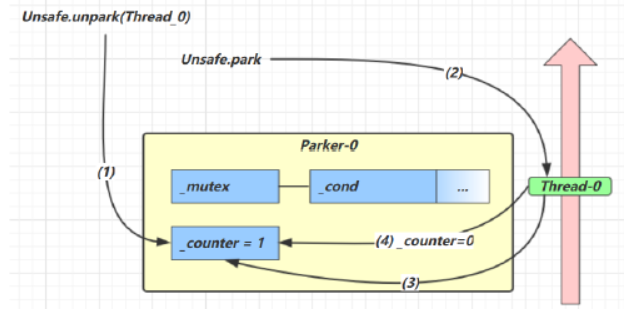

### 6.10 多把锁

多把不相干的锁：一间大屋子有两个功能睡觉、学习，互不相干。现在一人要学习，一人要睡觉，如果只用一间屋子（一个对象锁）的话，那么并发度很低

将锁的粒度细分：

* 好处，是可以增强并发度
* 坏处，如果一个线程需要同时获得多把锁，就容易发生死锁

解决方法：准备多个对象锁

```java
public static void main(String[] args) {
    BigRoom bigRoom = new BigRoom();
    new Thread(() -> { bigRoom.study(); }).start();
    new Thread(() -> { bigRoom.sleep(); }).start();
}
class BigRoom {
    private final Object studyRoom = new Object();
    private final Object sleepRoom = new Object();

    public void sleep() throws InterruptedException {
        synchronized (sleepRoom) {
            System.out.println("sleeping 2 小时");
            Thread.sleep(2000);
        }
    }

    public void study() throws InterruptedException {
        synchronized (studyRoom) {
            System.out.println("study 1 小时");
            Thread.sleep(1000);
        }
    }
}
```

### 6.11 活跃性

* 出于某种原因，线程代码一直在执行，死循环

#### 6.11.1 死锁

死锁：多个线程同时被阻塞，它们中的一个或者全部都在等待某个资源被释放，由于线程被无限期地阻塞，因此程序不可能正常终止

Java 死锁产生的四个必要条件：

1. **互斥条件，即当资源被一个线程使用（占有）时，别的线程不能使用**
2. **不可剥夺条件，资源请求者不能强制从资源占有者手中夺取资源，资源只能由资源占有者主动释放**
3. **请求和保持条件，即当资源请求者在请求其他的资源的同时保持对原有资源的占有**
4. **循环等待条件，即存在一个等待循环队列：p1 要 p2 的资源，p2 要 p1 的资源，形成了一个等待环路**

四个条件都成立的时候，形成死锁。死锁情况下打破上述任何一个条件，便可让死锁消失

```java
public class Dead {
    public static Object resources1 = new Object();
    public static Object resources2 = new Object();
    public static void main(String[] args) {
        new Thread(() -> {
            // 线程1：占用资源1 ，请求资源2
            synchronized(resources1){
                System.out.println("线程1已经占用了资源1，开始请求资源2");
                Thread.sleep(2000);//休息两秒，防止线程1直接运行完成。
                //2秒内线程2肯定可以锁住资源2
                synchronized (resources2){
                    System.out.println("线程1已经占用了资源2");
                }
        }).start();
        new Thread(() -> {
            // 线程2：占用资源2 ，请求资源1
            synchronized(resources2){
                System.out.println("线程2已经占用了资源2，开始请求资源1");
                Thread.sleep(2000);
                synchronized (resources1){
                    System.out.println("线程2已经占用了资源1");
                }
            }}
        }).start();
    }
}
```

* 定位
  * 使用 jps 定位进程 id，再用 `jstack id` 定位死锁，找到死锁的线程去查看源码，解决优化

#### 6.11.2 活锁

* **活锁：指的是任务或者执行者没有被阻塞，由于某些条件没有满足，导致一直重复尝试—失败—尝试—失败的过程**
* **两个线程互相改变对方的结束条件，最后谁也无法结束：**

```java
class TestLiveLock {
    static volatile int count = 10;
    static final Object lock = new Object();
    public static void main(String[] args) {
        new Thread(() -> {
            // 期望减到 0 退出循环
            while (count > 0) {
                Thread.sleep(200);
                count--;
                System.out.println("线程一count:" + count);
            }
        }, "t1").start();
        new Thread(() -> {
            // 期望超过 20 退出循环
            while (count < 20) {
                Thread.sleep(200);
                count++;
                System.out.println("线程二count:"+ count);
            }
        }, "t2").start();
    }
}
```

#### 6.11.3 饥饿

* 饥饿：一个线程由于优先级太低，始终得不到 CPU 调度执行，也不能够结束

## 7.内存

### 7.1 JMM 内存模型

* JMM **本身是一种抽象的概念**，实际上并不存在，描述的是一组规则或规范，通过这组规范定义了程序中各个变量（包括实例字段，静态字段和构成数组对象的元素）的访问方式
* 作用
  * **屏蔽各种硬件和操作系统的内存访问差异，实现让 Java 程序在各种平台下都能达到一致的内存访问效果**
  * **规定了线程和内存之间的一些关系**
* **根据 JMM 的设计，系统存在一个主内存（Main Memory），Java 中所有变量都存储在主存中，对于所有线程都是共享的；每条线程都有自己的工作内存（Working Memory），工作内存中保存的是主存中某些****变量的拷贝**，线程对所有变量的操作都是先对变量进行拷贝，然后在工作内存中进行，不能直接操作主内存中的变量；线程之间无法相互直接访问，线程间的通信（传递）必须通过主内存来完成

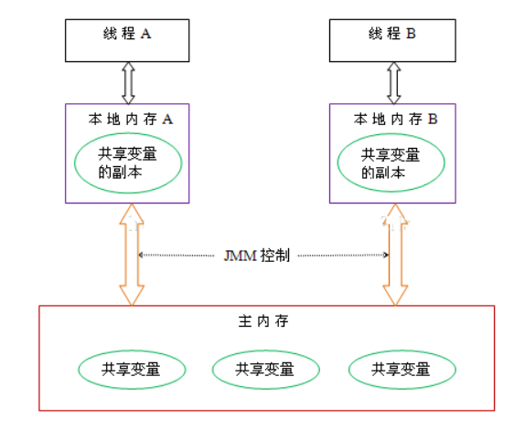

* **主内存：计算机的内存，也就是经常提到的 8G 内存，16G 内存，存储所有共享变量的值**
* **工作内存：存储该线程使用到的共享变量在主内存的的值的副本拷贝**

### 7.2 内存交互

* **Java 内存模型定义了 8 个操作来完成主内存和工作内存的交互操作，每个操作都是****原子**的

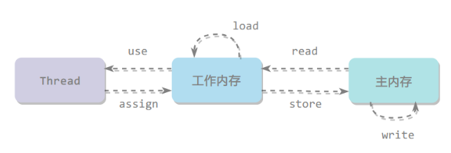

* lock：作用于主内存，将一个变量标识为被一个线程独占状态（对应 monitorenter）
* unclock：作用于主内存，将一个变量从独占状态释放出来，释放后的变量才可以被其他线程锁定（对应 monitorexit）
* read：作用于主内存，把一个变量的值从主内存传输到工作内存中
* load：作用于工作内存，在 read 之后执行，把 read 得到的值放入工作内存的变量副本中
* use：作用于工作内存，把工作内存中一个变量的值传递给执行引擎，每当遇到一个使用到变量的操作时都要使用该指令
* assign：作用于工作内存，把从执行引擎接收到的一个值赋给工作内存的变量
* store：作用于工作内存，把工作内存的一个变量的值传送到主内存中
* write：作用于主内存，在 store 之后执行，把 store 得到的值放入主内存的变量中

### 7.3 可见性

* 可见性：是指当多个线程访问同一个变量时，一个线程修改了这个变量的值，其他线程能够立即看得到修改的值
* 存在不可见问题的根本原因是由于缓存的存在，线程持有的是共享变量的副本，无法感知其他线程对于共享变量的更改，导致读取的值不是最新的。但是 final 修饰的变量是**不可变的**，就算有缓存，也不会存在不可见的问题
* main 线程对 run 变量的修改对于 t 线程不可见，导致了 t 线程无法停止：

```java
static boolean run = true;	//添加volatile
public static void main(String[] args) throws InterruptedException {
    Thread t = new Thread(()->{
        while(run){
        // ....
        }
	});
    t.start();
    sleep(1);
    run = false; // 线程t不会如预想的停下来
}
```

* 原因：
  * 初始状态， t 线程刚开始从主内存读取了 run 的值到工作内存
  * 因为 t 线程要频繁从主内存中读取 run 的值，JIT 编译器会将 run 的值缓存至自己工作内存中的高速缓存中，减少对主存中 run 的访问，提高效率
  * 1 秒之后，main 线程修改了 run 的值，并同步至主存，而 t 是从自己工作内存中的高速缓存中读取这个变量的值，结果永远是旧值
* 解决：
  * 给变量添加 `volatile` 关键字，线程每次必须从主存中获取变量值（不能修饰局部变量）（不能保证原子性）
  * `synchronized` 加锁：线程加锁时，先清空工作内存，在主内存中拷贝最新变量的副本到工作内存

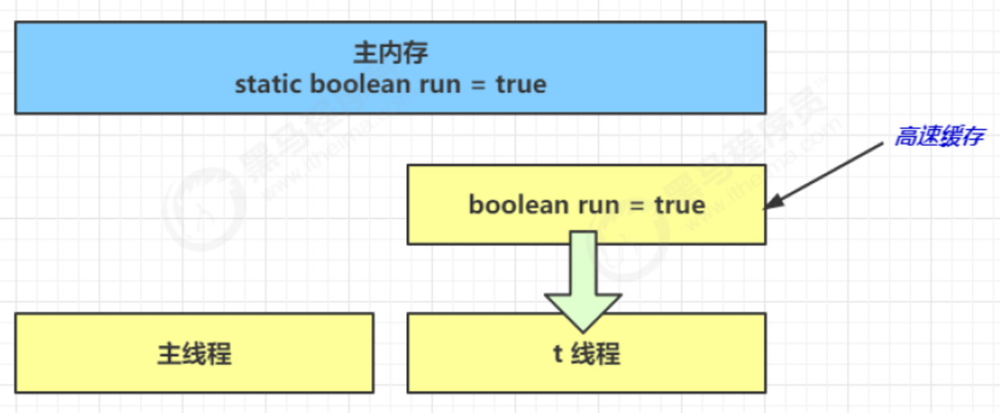

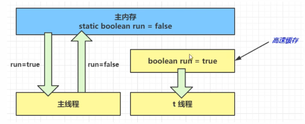

### 7.4 原子性

* 原子性：不可分割，完整性，也就是说某个线程正在做某个具体业务时，中间不可以被分割，需要具体完成，要么同时成功，要么同时失败，保证指令不会受到线程上下文切换的影响

### 7.5 有序性

* 指令重排：JVM 会在不影响程序正确性的前提下，调整语句执行顺序
* 有序性：在本线程内观察，所有操作都是有序的；在一个线程观察另一个线程，所有操作都是无序的，无序是因为发生了指令重排序
* **现代 CPU 支持多级指令流水线，几乎所有的冯•诺伊曼型计算机的 CPU，其工作都可以分为 5 个阶段：取指令、指令译码、执行指令、访存取数和结果写回，可以称之为**五级指令流水线。CPU 可以在一个时钟周期内，同时运行五条指令的**不同阶段**（每个线程不同的阶段），本质上流水线技术并不能缩短单条指令的执行时间，但变相地提高了指令地吞吐率

### 7.6 voltile 原理

#### 7.6.1 同步机制

volatile 是 Java 虚拟机提供的**轻量级**的同步机制（三大特性）

* 保证可见性
* 不保证原子性
* 保证有序性（禁止指令重排）

性能：volatile 修饰的变量进行读操作与普通变量几乎没什么差别，但是写操作相对慢一些，因为需要在本地代码中插入很多内存屏障来保证指令不会发生乱序执行，但是开销比锁要小

synchronized 无法禁止指令重排和处理器优化，为什么可以保证有序性可见性

* 加了锁之后，只能有一个线程获得到了锁，获得不到锁的线程就要阻塞，所以同一时间只有一个线程执行，相当于单线程，由于数据依赖性的存在，单线程的指令重排是没有问题的
* 线程加锁前，将**清空工作内存**中共享变量的值，使用共享变量时需要从主内存中重新读取最新的值；线程解锁前，必须把**共享变量的最新值刷新到主内存**中（JMM 内存交互章节有讲）

#### 7.6.2 指令重排

volatile 修饰的变量，可以禁用指令重排

指令重排实例：

```java
public void mySort() {
int x = 11;//语句1
int y = 12;//语句2  谁先执行效果一样
x = x + 5;//语句3
y = x * x;//语句4
}
```

* 执行顺序是：1 2 3 4、2 1 3 4、1 3 2 4
* 指令重排也有限制不会出现：4321，语句 4 需要依赖于 y 以及 x 的申明，因为存在数据依赖，无法首先执行

```java
int num = 0;
boolean ready = false;
// 线程1 执行此方法
public void actor1(I_Result r) {
    if(ready) {
    r.r1 = num + num;
    } else {
    r.r1 = 1;
    }
}
// 线程2 执行此方法
public void actor2(I_Result r) {
num = 2;
ready = true;
}
```

* 情况一：线程 1 先执行，ready = false，结果为 r.r1 = 1
* 情况二：线程 2 先执行 num = 2，但还没执行 ready = true，线程 1 执行，结果为 r.r1 = 1
* 情况三：线程 2 先执行 ready = true，线程 1 执行，进入 if 分支结果为 r.r1 = 4
* 情况四：线程 2 执行 ready = true，切换到线程 1，进入 if 分支为 r.r1 = 0，再切回线程 2 执行 num = 2，发生指令重排

#### 7.6.3 底层原理

* 使用 volatile 修饰的共享变量，底层通过汇编 lock 前缀指令进行缓存锁定，在线程修改完共享变量后写回主存，其他的 CPU 核心上运行的线程通过 CPU 总线嗅探机制会修改其共享变量为失效状态，读取时会重新从主内存中读取最新的数据
* lock 前缀指令就相当于内存屏障
* 保证可见性

  * 对 volatile 变量的**写指令后**会加入写屏障
  * 写屏障保证在该屏障之前的，对共享变量的改动，都同步到主存当中
  * 对 volatile 变量的**读指令前**会加入读屏障
  * 读屏障保证在该屏障之后的，对共享变量的读取，从主存刷新变量值，加载的是主存中最新数据
* 保证有序性：

  * 写屏障会确保指令重排序时，不会将**写屏障之前**的代码排在写屏障之后
  * 读屏障会确保指令重排序时，不会将**读屏障之后**的代码排在读屏障之前
* 不能解决指令交错：

  * 写屏障仅仅是保证之后的读能够读到最新的结果，但**不能保证其他线程的读跑到写屏障之前**
  * 有序性的保证只保证了本线程内相关代码不被重排序

### 7.7 双端检锁

#### 7.7.1 检锁机制

* DCL（双端检锁）机制不一定是线程安全的，原因是有指令重排的存在，加入 volatile 可以禁止指令重排

```java
public final class Singleton {
    private Singleton() { }
    private static Singleton INSTANCE = null;
  
    public static Singleton getInstance() {
        if(INSTANCE == null) { // t2，这里的判断不是线程安全的
            // 首次访问会同步，而之后的使用没有 synchronized
            synchronized(Singleton.class) {
                // 这里是线程安全的判断，防止其他线程在当前线程等待锁的期间完成了初始化
                if (INSTANCE == null) { 
                    INSTANCE = new Singleton();
                }
            }
        }
        return INSTANCE;
    }
}
```

* 不锁 INSTANCE 的原因：

  * INSTANCE 要重新赋值
  * INSTANCE 是 null，线程加锁之前需要获取对象的引用，设置对象头，null 没有引用
* 实现特点：

  * 懒惰初始化
  * 首次使用 getInstance() 才使用 synchronized 加锁，后续使用时无需加锁
  * 第一个 if 使用了 INSTANCE 变量，是在同步块之外，但在多线程环境下会产生问题

#### 7.7.2 DCL 问题

**getInstance 方法对应的字节码为：**

```java
0: getstatic #2 // Field INSTANCE:Ltest/Singleton;
3: ifnonnull 37
6: ldc #3 // class test/Singleton
8: dup
9: astore_0
10: monitorenter
11: getstatic #2 // Field INSTANCE:Ltest/Singleton;
14: ifnonnull 27
17: new #3 // class test/Singleton
20: dup
21: invokespecial #4 // Method "<init>":()V
24: putstatic #2 // Field INSTANCE:Ltest/Singleton;
27: aload_0
28: monitorexit
29: goto 37
32: astore_1
33: aload_0
34: monitorexit
35: aload_1
36: athrow
37: getstatic #2 // Field INSTANCE:Ltest/Singleton;
40: areturn
```

* 17 表示创建对象，将对象引用入栈
* 20 表示复制一份对象引用，引用地址
* 21 表示利用一个对象引用，调用构造方法初始化对象
* 24 表示利用一个对象引用，赋值给 static INSTANCE

**步骤 21 和 24 之间不存在数据依赖关系**，而且无论重排前后，程序的执行结果在单线程中并没有改变，因此这种重排优化是允许的

* 关键在于 0:getstatic 这行代码在 monitor 控制之外，可以越过 monitor 读取 INSTANCE 变量的值
* 当其他线程访问 INSTANCE 不为 null 时，由于 INSTANCE 实例未必已初始化，那么 t2 拿到的是将是一个未初始化完毕的单例返回，这就造成了线程安全的问题

解决方法：**引入 volatile，来保证出现指令重排的问题，从而保证单例模式的线程安全性：**

```java
private static volatile SingletonDemo INSTANCE = null;
```

### 7.8 happens-before

Java 内存模型具备一些先天的“有序性”，即不需要通过任何同步手段（volatile、synchronized 等）就能够得到保证的安全，这个通常也称为 happens-before 原则，它是可见性与有序性的一套规则总结

不符合 happens-before 规则，JMM 并不能保证一个线程的可见性和有序性

1. 程序次序规则：一个线程内，逻辑上书写在前面的操作先行发生于书写在后面的操作 ，因为多个操作之间有先后依赖关系，则不允许对这些操作进行重排序
2. 锁定规则：一个 unlock 操作先行发生于后面（时间的先后）对同一个锁的 lock 操作，所以线程解锁 m 之前对变量的写（解锁前会刷新到主内存中），对于接下来对 m 加锁的其它线程对该变量的读可见
3. volatile 变量规则：对 volatile 变量的写操作先行发生于后面对这个变量的读
4. 传递规则：具有传递性，如果操作 A 先行发生于操作 B，而操作 B 又先行发生于操作 C，则可以得出操作 A 先行发生于操作 C
5. 线程启动规则：Thread 对象的 start()方 法先行发生于此线程中的每一个操作
   ```
   static int x = 10;//线程 start 前对变量的写，对该线程开始后对该变量的读可见
   new Thread(()->{System.out.println(x);},"t1").start();
   ```
6. 线程中断规则：对线程 interrupt() 方法的调用先行发生于被中断线程的代码检测到中断事件的发生
7. 线程终止规则：线程中所有的操作都先行发生于线程的终止检测，可以通过 Thread.join() 方法结束、Thread.isAlive() 的返回值手段检测到线程已经终止执行
8. 对象终结规则：一个对象的初始化完成（构造函数执行结束）先行发生于它的 finalize() 方法的开始

### 7.9 设计模式

#### Balking

* Balking （犹豫）模式用在一个线程发现另一个线程或本线程已经做了某一件相同的事，那么本线程就无需再做了，直接结束返回

```java
public class MonitorService {
    // 用来表示是否已经有线程已经在执行启动了
    private volatile boolean starting = false;
    public void start() {
        System.out.println("尝试启动监控线程...");
        synchronized (this) {
            if (starting) {
            	return;
            }
            starting = true;
        }
        // 真正启动监控线程...
    }
}
```

* 对比保护性暂停模式：保护性暂停模式用在一个线程等待另一个线程的执行结果，当条件不满足时线程等待
* 例子：希望 doInit() 方法仅被调用一次，下面的实现出现的问题：
  * 当 t1 线程进入 init() 准备 doInit()，t2 线程进来，initialized 还为false，则 t2 就又初始化一次
  * volatile 适合一个线程写，其他线程读的情况，这个代码需要加锁

```java
public class TestVolatile {
    volatile boolean initialized = false;
  
    void init() {
        if (initialized) {
            return;
        }
    	doInit();
    	initialized = true;
    }
    private void doInit() {
    }
}
```

## 8.无锁并发

### 8.1 CAS

#### 8.1.1 原理

CAS 的全称是 Compare-And-Swap，是 **CPU 并发原语**

* CAS 并发原语体现在 Java 语言中就是 sun.misc.Unsafe 类的各个方法，调用 UnSafe 类中的 CAS 方法，JVM 会实现出 CAS 汇编指令，这是一种完全依赖于硬件的功能，实现了原子操作
* CAS 是一种系统原语，原语属于操作系统范畴，是由若干条指令组成 ，用于完成某个功能的一个过程，并且原语的执行必须是连续的，执行过程中不允许被中断，所以 CAS 是一条 CPU 的原子指令，不会造成数据不一致的问题，是线程安全的

底层原理：CAS 的底层是 `lock cmpxchg` 指令（X86 架构），在单核和多核 CPU 下都能够保证比较交换的原子性

* 程序是在单核处理器上运行，会省略 lock 前缀，单处理器自身会维护处理器内的顺序一致性，不需要 lock 前缀的内存屏障效果
* 程序是在多核处理器上运行，会为 cmpxchg 指令加上 lock 前缀。当某个核执行到带 lock 的指令时，CPU 会执行总线锁定或缓存锁定，将修改的变量写入到主存，这个过程不会被线程的调度机制所打断，保证了多个线程对内存操作的原子性

作用：比较当前工作内存中的值和主物理内存中的值，如果相同则执行规定操作，否则继续比较直到主内存和工作内存的值一致为止

**CAS 缺点：**

* 执行的是循环操作，如果比较不成功一直在循环，最差的情况某个线程一直取到的值和预期值都不一样，就会无限循环导致饥饿，**使用 CAS 线程数不要超过 CPU 的核心数**
* **只能保证一个共享变量的原子操作**
  * **对于一个共享变量执行操作时，可以通过循环 CAS 的方式来保证原子操作**
  * **对于多个共享变量操作时，循环 CAS 就无法保证操作的原子性，这个时候只能用锁来保证原子性**
* **引出来 ABA 问题**

#### 乐观锁

**CAS 与 synchronized 总结：**

* **synchronized 是从悲观的角度出发：总是假设最坏的情况，每次去拿数据的时候都认为别人会修改，所以每次在拿数据的时候都会上锁，这样别人想拿这个数据就会阻塞（共享资源每次只给一个线程使用，其它线程阻塞，用完后再把资源转让给其它线程），因此 synchronized 也称之为悲观锁，ReentrantLock 也是一种悲观锁，性能较差**
* CAS 是从乐观的角度出发：总是假设最好的情况，每次去拿数据的时候都认为别人不会修改，所以不会上锁，但是在更新的时候会判断一下在此期间别人有没有去更新这个数据。**如果别人修改过，则获取现在最新的值，如果别人没修改过，直接修改共享数据的值**，CAS 这种机制也称之为乐观锁，综合性能较好

### 8.2 Atomic

#### 8.2.1 常用 API

**常见原子类：AtomicInteger、AtomicBoolean、AtomicLong**

**构造方法：**

* `public AtomicInteger()`：初始化一个默认值为 0 的原子型 Integer
* `public AtomicInteger(int initialValue)`：初始化一个指定值的原子型 Integer

常用API：

| 方法                                  | 作用                                                                        |
| ------------------------------------- | --------------------------------------------------------------------------- |
| public final int get()                | 获取 AtomicInteger 的值                                                     |
| public final int getAndIncrement()    | 以原子方式将当前值加 1，返回的是自增前的值                                  |
| public final int incrementAndGet()    | 以原子方式将当前值加 1，返回的是自增后的值                                  |
| public final int getAndSet(int value) | 以原子方式设置为 newValue 的值，返回旧值                                    |
| public final int addAndGet(int data)  | 以原子方式将输入的数值与实例中的值相加并返回 实例：AtomicInteger 里的 value |

#### 8.2.2 原理

**AtomicInteger 原理**：自旋锁  + CAS 算法

CAS 算法：有 3 个操作数（内存值 V， 旧的预期值 A，要修改的值 B）

* 当旧的预期值 A == 内存值 V   此时可以修改，将 V 改为 B
* 当旧的预期值 A !=  内存值 V   此时不能修改，并重新获取现在的最新值，重新获取的动作就是自旋

#### 8.2.3 原子引用

原子引用：对 Object 进行原子操作，提供一种读和写都是原子性的对象引用变量

原子引用类：AtomicReference、AtomicStampedReference、AtomicMarkableReference

AtomicReference 类：

* 构造方法：`AtomicReference<T> atomicReference = new AtomicReference<T>()`
* 常用 API：
  * `public final boolean compareAndSet(V expectedValue, V newValue)`：CAS 操作
  * `public final void set(V newValue)`：将值设置为 newValue
  * `public final V get()`：返回当前值

```java
public class AtomicReferenceDemo {
    public static void main(String[] args) {
        Student s1 = new Student(33, "z3");
        
        // 创建原子引用包装类
        AtomicReference<Student> atomicReference = new AtomicReference<>();
        // 设置主内存共享变量为s1
        atomicReference.set(s1);

        // 比较并交换，如果现在主物理内存的值为 z3，那么交换成 l4
        while (true) {
            Student s2 = new Student(44, "l4");
            if (atomicReference.compareAndSet(s1, s2)) {
                break;
            }
        }
        System.out.println(atomicReference.get());
    }
}

class Student {
    private int id;
    private String name;
}
```

#### 8.2.4 原子数组

原子数组类：AtomicIntegerArray、AtomicLongArray、AtomicReferenceArray

```java
/**
* i             the index
* expect        the expected value
* update        the new value
*/
public final boolean compareAndSet(int i, int expect, int update) {
    return compareAndSetRaw(checkedByteOffset(i), expect, update);
}
```

#### 8.2.5 原子更新器

原子更新器类：AtomicReferenceFieldUpdater、AtomicIntegerFieldUpdater、AtomicLongFieldUpdater

**利用字段更新器，可以针对对象的某个域（Field）进行原子操作**，只能配合 volatile 修饰的字段使用，否则会出现异常 `IllegalArgumentException: Must be volatile type`

**常用 API：**

* `static <U> AtomicIntegerFieldUpdater<U> newUpdater(Class<U> c, String fieldName)`：构造方法
* `abstract boolean compareAndSet(T obj, int expect, int update)`：CAS

#### 8.2.6 原子累加器

原子累加器类：LongAdder、DoubleAdder、LongAccumulator、DoubleAccumulator

LongAdder 和 LongAccumulator 区别：

相同点：

* LongAddr 与 LongAccumulator 类都是使用非阻塞算法 CAS 实现的
* LongAddr 类是 LongAccumulator 类的一个特例，只是 LongAccumulator 提供了更强大的功能，可以自定义累加规则，当accumulatorFunction 为 null 时就等价于 LongAddr

不同点：

* 调用 casBase 时，LongAccumulator 使用 function.applyAsLong(b = base, x) 来计算，LongAddr 使用 casBase(b = base, b + x)
* LongAccumulator 类功能更加强大，构造方法参数中
  * accumulatorFunction 是一个双目运算器接口，可以指定累加规则，比如累加或者相乘，其根据输入的两个参数返回一个计算值，LongAdder 内置累加规则
  * identity 则是 LongAccumulator 累加器的初始值，LongAccumulator 可以为累加器提供非0的初始值，而 LongAdder 只能提供默认的 0

### 8.3 ABA 问题（AtomicStampedReference类）

ABA 问题：当进行获取主内存值时，该内存值在写入主内存时已经被修改了 N 次，但是最终又改成原来的值

其他线程先把 A 改成 B 又改回 A，主线程**仅能判断出共享变量的值与最初值 A 是否相同**，不能感知到这种从 A 改为 B 又 改回 A 的情况，这时 CAS 虽然成功，但是过程存在问题

解决方案：**使用 AtomicStampedReference 类**

* **构造方法：**
  * `public AtomicStampedReference(V initialRef, int initialStamp)`：初始值和初始版本号
* **常用API：**
  * `public boolean compareAndSet(V expectedReference, V newReference, int expectedStamp, int newStamp)`：**期望引用和期望版本号都一致**才进行 CAS 修改数据
  * `public void set(V newReference, int newStamp)`：设置值和版本号
  * `public V getReference()`：返回引用的值
  * `public int getStamp()`：返回当前版本号

```java
public static void main(String[] args) {
    AtomicStampedReference  atomicReference = new AtomicStampedReference<>(100,1);
    int startStamp = atomicReference.getStamp();
    new Thread(() ->{
        int stamp = atomicReference.getStamp();
        atomicReference.compareAndSet(100, 101, stamp, stamp + 1);
        stamp = atomicReference.getStamp();
        atomicReference.compareAndSet(101, 100, stamp, stamp + 1);
    },"t1").start();    new Thread(() ->{
        try {
            Thread.sleep(1000);
        } catch (InterruptedException e) {
            e.printStackTrace();
        }
        if (!atomicReference.compareAndSet(100, 200, startStamp, startStamp + 1)) {
            System.out.println(atomicReference.getReference());//100
            System.out.println(Thread.currentThread().getName() + "线程修改失败");
        }
    },"t2").start();
}
```

## 同步器

### AQS

### ReentrantLock

#### 对比 synchornized

**ReentrantLock 相对于 synchronized 具备如下特点：**

1. 锁的实现：synchronized 是 JVM 实现的，而 ReentrantLock 是 JDK 实现的
2. 性能：新版本 Java 对 synchronized 进行了很多优化，synchronized 与 ReentrantLock 大致相同
3. 使用：ReentrantLock 需要手动解锁，synchronized 执行完代码块自动解锁
4. **可中断**：ReentrantLock 可中断，而 synchronized 不行
5. **公平锁**：公平锁是指多个线程在等待同一个锁时，必须按照申请锁的时间顺序来依次获得锁
   * ReentrantLock 可以设置公平锁，synchronized 中的锁是非公平的
   * 不公平锁的含义是阻塞队列内公平，队列外非公平
6. 锁超时：尝试获取锁，超时获取不到直接放弃，不进入阻塞队列
   * ReentrantLock 可以设置超时时间，synchronized 会一直等待
7. 锁绑定多个条件：一个 ReentrantLock 可以同时绑定多个 Condition 对象，更细粒度的唤醒线程
8. 两者都是可重入锁

#### 使用锁

**构造方法：**`ReentrantLock lock = new ReentrantLock();`

**ReentrantLock 类 API：**

* `public void lock()`：获得锁
  * **如果锁没有被另一个线程占用，则将锁定计数设置为 1**
  * 如果当前线程已经保持锁定，则保持计数增加 1
  * **如果锁被另一个线程保持，则当前线程被禁用线程调度，并且在锁定已被获取之前处于休眠状态**
* `public void unlock()`：尝试释放锁
  * **如果当前线程是该锁的持有者，则保持计数递减**
  * **如果保持计数现在为零，则锁被释放**
  * **如果当前线程不是该锁的持有者，则抛出异常**

**基本语法：**

```java
// 获取锁
reentrantLock.lock();
try {
    // 临界区
} finally {
    // 释放锁
    reentrantLock.unlock();
}
```

#### 可重入

* 可重入是指同一个线程如果首次获得了这把锁，那么它是这把锁的拥有者，因此有权利再次获取这把锁，如果不可重入锁，那么第二次获得锁时，自己也会被锁挡住，直接造成死锁

```java
static ReentrantLock lock = new ReentrantLock();
public static void main(String[] args) {
    method1();
}
public static void method1() {
    lock.lock();
    try {
        System.out.println(Thread.currentThread().getName() + " execute method1");
        method2();
    } finally {
        lock.unlock();
    }
}
public static void method2() {
    lock.lock();
    try {
        System.out.println(Thread.currentThread().getName() + " execute method2");
    } finally {
        lock.unlock();
    }
}
```

* **加锁两次解锁两次：正常执行**
* **加锁两次解锁一次：程序直接卡死，线程不能出来，也就说明****申请几把锁，最后需要解除几把锁**
* **加锁一次解锁两次：运行程序会直接报错**

#### 可打断

* 等待过程中，其他线程可以用 `interrupt` 方法打断等待
* `public void lockInterruptibly()`：获得可打断的锁
  * **如果没有竞争此方法就会获取 lock 对象锁**
  * **如果有竞争就进入阻塞队列，可以被其他线程用 interrupt 打断**
* `lock` 方法获得的锁不能被打断
* 如果是不可中断模式，那么即使使用了 interrupt 也不会让等待状态中的线程中断

```java
public static void main(String[] args) throws InterruptedException {  
    ReentrantLock lock = new ReentrantLock();  
    Thread t1 = new Thread(() -> {  
        try {  
            System.out.println("尝试获取锁");  
            lock.lockInterruptibly();  
        } catch (InterruptedException e) {  
            System.out.println("没有获取到锁，被打断，直接返回");  
            return;  
        }  
        try {  
            System.out.println("获取到锁");  
        } finally {  
            lock.unlock();  
        }  
    }, "t1");  
    lock.lock();  
    t1.start();  
    Thread.sleep(2000);  
    System.out.println("主线程进行打断锁");  
    t1.interrupt();
}
```

#### 锁超时

* 使用方法
  * `public boolean tryLock()`：尝试获取锁，获取到返回 true，获取不到直接放弃，不进入阻塞队列
  * `public boolean tryLock(long timeout, TimeUnit unit)`：在给定时间内获取锁，获取不到就退出
* **注意：tryLock 期间也可以被打断**

```java
public static void main(String[] args) {
    ReentrantLock lock = new ReentrantLock();
    Thread t1 = new Thread(() -> {
        try {
            if (!lock.tryLock(2, TimeUnit.SECONDS)) {
                System.out.println("获取不到锁");
                return;
            }
        } catch (InterruptedException e) {
            System.out.println("被打断，获取不到锁");
            return;
        }
        try {
            log.debug("获取到锁");
        } finally {
            lock.unlock();
        }
    }, "t1");
    lock.lock();
    System.out.println("主线程获取到锁");
    t1.start();
  
    Thread.sleep(1000);
    try {
        System.out.println("主线程释放了锁");
    } finally {
        lock.unlock();
    }
}
```

* 解决哲学家就餐问题

```java
public static void main(String[] args) {
    Chopstick c1 = new Chopstick("1");//...
    Chopstick c5 = new Chopstick("5");
    new Philosopher("苏格拉底", c1, c2).start();
    new Philosopher("柏拉图", c2, c3).start();
    new Philosopher("亚里士多德", c3, c4).start();
    new Philosopher("赫拉克利特", c4, c5).start();  
    new Philosopher("阿基米德", c5, c1).start();
}
class Philosopher extends Thread {
    Chopstick left;
    Chopstick right;
    public void run() {
        while (true) {
            // 尝试获得左手筷子
            if (left.tryLock()) {
                try {
                    // 尝试获得右手筷子
                    if (right.tryLock()) {
                        try {
                            System.out.println("eating...");
                            Thread.sleep(1000);
                        } finally {
                            right.unlock();
                        }
                    }
                } finally {
                    left.unlock();
                }
            }
        }
    }
}
class Chopstick extends ReentrantLock {
    String name;
    public Chopstick(String name) {
        this.name = name;
    }
    @Override
    public String toString() {
        return "筷子{" + name + '}';
    }
}
```

#### 公平锁

* **构造方法：**`ReentrantLock lock = new ReentrantLock(true)`

```java
public ReentrantLock(boolean fair) {
    sync = fair ? new FairSync() : new NonfairSync();
}
```

* **ReentrantLock 默认是不公平的：**

```java
public ReentrantLock() {
    sync = new NonfairSync();
}
```

**说明：公平锁一般没有必要，会降低并发度**

#### 条件变量

synchronized 的条件变量，是当条件不满足时进入 WaitSet 等待；ReentrantLock 的条件变量比 synchronized 强大之处在于支持多个条件变量

ReentrantLock 类获取 Condition 对象：`public Condition newCondition()`

Condition 类 API：

* `void await()`：当前线程从运行状态进入等待状态，释放锁
* `void signal()`：唤醒一个等待在 Condition 上的线程，但是必须获得与该 Condition 相关的锁

使用流程：

* **await / signal 前需要获得锁**
* await 执行后，会释放锁进入 ConditionObject 等待
* await 的线程被唤醒去重新竞争 lock 锁
* **线程在条件队列被打断会抛出中断异常**
* 竞争 lock 锁成功后，从 await 后继续执行

```java
public static void main(String[] args) throws InterruptedException {  
    ReentrantLock lock = new ReentrantLock();
    //创建一个新的条件变量
    Condition condition1 = lock.newCondition();
    Condition condition2 = lock.newCondition();
    new Thread(() -> {
        try {
            lock.lock();
            System.out.println("进入等待");
            //进入休息室等待
            condition1.await();
            System.out.println("被唤醒了");
        } catch (InterruptedException e) {
            e.printStackTrace();
        } finally {
            lock.unlock();
        }  
    }).start();
    Thread.sleep(1000);
    //叫醒
    new Thread(() -> {
        try {  
            lock.lock();
            //唤醒
            condition2.signal();
        } finally {
            lock.unlock();
        }
    }).start();
}
```
