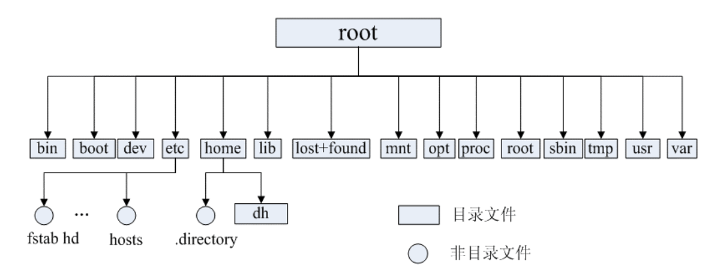

# Linux 文件系统

**一切都是文件**：在 Linux 操作系统中，一切被操作系统管理的资源，如网络接口卡、磁盘驱动器、打印机、输入输出设备、普通文件或目录等，都被视为文件

## inode

* 硬盘以扇区 (Sector) 为最小物理存储单位，而操作系统和文件系统以块 (Block) 为单位进行读写，块由多个扇区组成。文件数据存储在这些块中。现代硬盘扇区通常为 4KB，与一些常见块大小相同，但操作系统也支持更大的块大小，以提升大文件读写性能。文件元信息（例如权限、大小、修改时间以及数据块位置）存储在 inode（索引节点）中
* 每个文件都有唯一的 inode。inode 本身不存储文件数据，而是存储指向数据块的指针，操作系统通过这些指针找到并读取文件数据
* inode 是一种固定大小的数据结构，其大小在文件系统创建时就确定了，并且在文件的生命周期内保持不变
* inode 的访问速度非常快，因为系统可以直接通过 inode 号码定位到文件的元数据信息，无需遍历整个文件系统
* inode 的数量是有限的，每个文件系统只能包含固定数量的 inode。这意味着当文件系统中的 inode 用完时，无法再创建新的文件或目录，即使磁盘上还有可用空间

## 软链接和硬链接

### 硬链接

* 在 Linux/类 Unix 文件系统中，每个文件和目录都有一个唯一的索引节点（inode）号，用来标识该文件或目录。硬链接通过 inode 节点号建立连接，硬链接和源文件的 inode 节点号相同，两者对文件系统来说是完全平等的（可以看作是互为硬链接，源头是同一份文件），删除其中任何一个对另外一个没有影响，可以通过给文件设置硬链接文件来防止重要文件被误删。

* 只有删除了源文件和所有对应的硬链接文件，该文件才会被真正删除。
* 硬链接具有一些限制，不能对目录以及不存在的文件创建硬链接，并且，硬链接也不能跨越文件系统。
* `ln` 命令用于创建硬链接。

### 软链接

* 软链接和源文件的 inode 节点号不同，而是指向一个文件路径。
* 源文件删除后，软链接依然存在，但是指向的是一个无效的文件路径。
* 软连接类似于 Windows 系统中的快捷方式。
* 不同于硬链接，可以对目录或者不存在的文件创建软链接，并且，软链接可以跨越文件系统。
* `ln -s` 命令用于创建软链接。

## 文件类型

* **普通文件（-）** ：用于存储信息和数据， Linux 用户可以根据访问权限对普通文件进行查看、更改和删除。比如：图片、声音、PDF、text、视频、源代码等等。
* **目录文件（d，directory file）** ：目录也是文件的一种，用于表示和管理系统中的文件，目录文件中包含一些文件名和子目录名。打开目录事实上就是打开目录文件。
* **符号链接文件（l，symbolic link）** ：保留了指向文件的地址而不是文件本身。
* **字符设备（c，char）** ：用来访问字符设备比如键盘。
* **设备文件（b，block）** ：用来访问块设备比如硬盘、软盘。
* **管道文件（p，pipe）** : 一种特殊类型的文件，用于进程之间的通信。
* **套接字文件（s，socket）** ：用于进程间的网络通信，也可以用于本机之间的非网络通信。

## 目录树

| 目录                 | 作用                                                      | 典型内容                           |
| -------------------- | --------------------------------------------------------- | ---------------------------------- |
| `/bin`             | 存放**基础用户命令**的二进制可执行文件              | `ls`、`cat`、`mkdir`、`cp` |
| `/sbin`            | 存放**系统管理员使用的命令** （一般 root 才能执行） | `ifconfig`、`reboot`、`fsck` |
| `/etc`             | **系统配置文件目录**                                | 网络配置、用户配置、服务配置       |
| `/home`            | 普通用户的**主目录根路径**                          | `/home/user`                     |
| `/root`            | **root 用户的主目录**                               | 管理员文件                         |
| `/usr`             | 存放**系统应用程序和共享资源**                      | `/usr/bin`、`/usr/lib`         |
| `/opt`             | 存放**第三方软件或可选软件包**                      | `tomcat`、`docker`等           |
| `/boot`            | **系统启动文件**                                    | 内核、引导程序                     |
| `/lib`、`/lib64` | 系统运行需要的**共享库文件**                        | `.so`动态库                      |
| `/dev`             | **设备文件目录**                                    | 硬盘、终端、USB                    |
| `/proc`            | **虚拟文件系统** ，反映内核和进程信息               | `/proc/cpuinfo`                  |
| `/mnt`             | **临时挂载文件系统**的目录                          | 挂载U盘、硬盘                      |
| `/tmp`             | **临时文件目录**                                    | 程序临时数据                       |
| `/var`             | **经常变化的数据**                                  | 日志、缓存                         |
| `/lost+found`      | 文件系统修复时存放**恢复的文件**                    | 异常关机后的文件                   |
