# RabbitMQ 整合笔记

## 核心概念

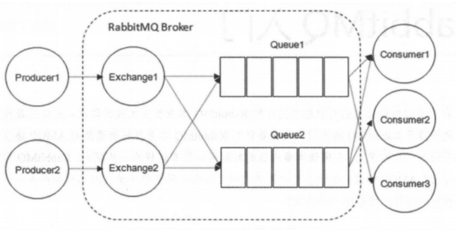

* 消息包括消息头+消息体
  * 消息头不透明
  * 消息体：
    * routing-key路由键
    * priority优先级
    * delivery-mode持久存储

### Exchange 交换器

* 在 RabbitMQ 中，消息并不是直接被投递到 **Queue** 中的，中间还必须经过 **Exchange** 这一层
* **Exchange** 用来接收生产者发送的消息并将这些消息路由给服务器中的队列中
* 四种类型交换器
  * direct：默认
  * fanout
  * topic
  * headers
* 生产者将消息发给交换器的时候，一般会指定一个  **RoutingKey(路由键)** ，用来指定这个消息的路由规则，而这个 **RoutingKey 需要与交换器类型和绑定键(BindingKey)联合使用才能最终生效** 。当 BindingKey 和 RoutingKey 相匹配时，消息会被路由到对应的队列中。

### Queue 消息队列

* **Queue(消息队列)** 用来保存消息直到发送给消费者。它是消息的容器，也是消息的终点。**RabbitMQ** 中消息只能存储在 **队列** 中
* **多个消费者可以订阅同一个队列** ，这时队列中的消息会被轮询消费

### Broker 消息中间件服务节点

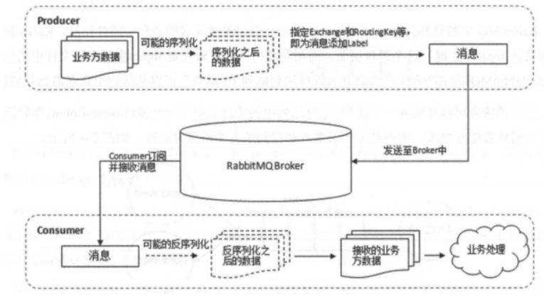

* 一个 RabbitMQ Broker 可以简单地看作一个 RabbitMQ 服务节点

## 消息传输

由于 TCP 链接的创建和销毁开销较大（三次握手、慢启动等），且并发数受系统资源限制，会造成性能瓶颈，所以 RabbitMQ 使用信道的方式来传输数据。信道（Channel）是生产者、消费者与 RabbitMQ 通信的渠道，信道是建立在 TCP 链接上的虚拟链接。

> 注意：
>
> * 单个 TCP 连接可承载多个 Channel，但官方建议不超过 100-200 个/连接
> * 每个 Channel 有独立的编号，但共享同一 TCP 连接的流量控制
> * **Channel 不是线程安全的** ，多线程应使用不同 Channel 实例

## AMQP 和 Spring AMQP

* AMQP（Advanced Message Queuing Protocol）：用于在应用程序之间传递业务消息的开放标准，和语言无关
* Spring AMQP：基于AMQP协议定义的一套API规范

## Exchange Types 交换器类型

### fanout

* 规则：把所有发送到该 Exchange 的消息路由到所有与它绑定的 Queue 中
* 用途：广播消息

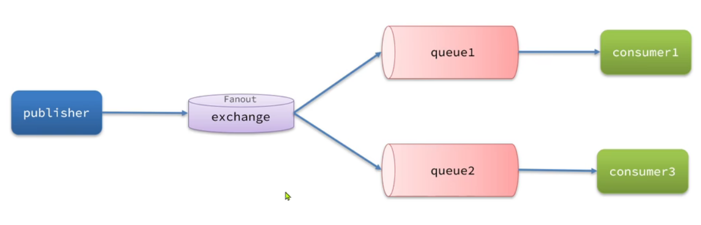

### direct

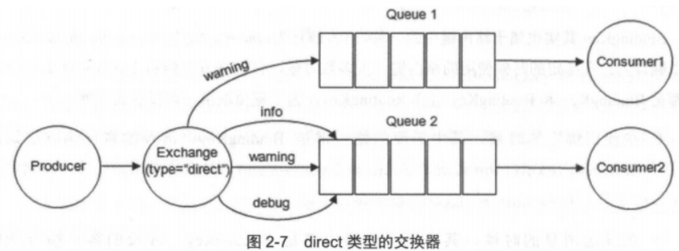

* 规则：把消息路由到那些 Bindingkey 与 RoutingKey 完全匹配的 Queue 中
* 用途：优先级队列
* Direct交换机：将消息根据规则路由到指定的Queue
* 每个队列都和交换机设置一个BindingKey
* 发送消息时，指定消息的RoutingKey
* 交换机将消息路由到Key一致的队列
* BindingKey一样，就是广播效果

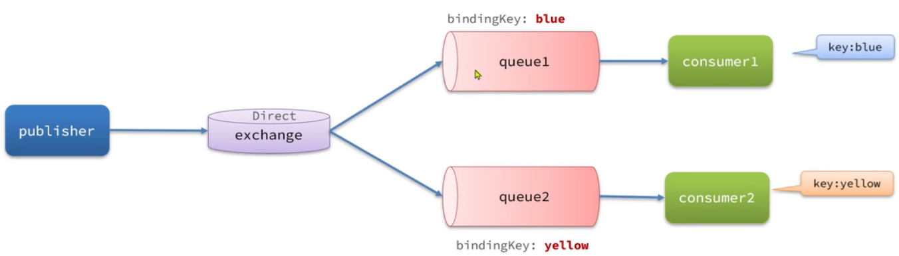

### topic

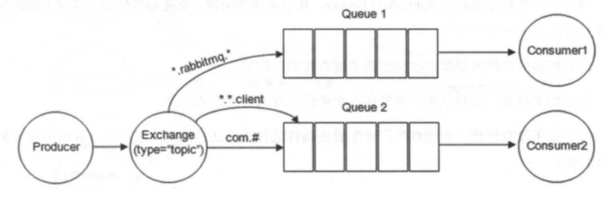

* 规则：将消息路由到 BindingKey 和 RoutingKey 相匹配的队列中
  * RoutingKey 为一个点号"．"分隔的字符串，如 "com.rabbitmq.client"、"java.util.concurrent"、"com.hidden.client";
  * BindingKey 和 RoutingKey 一样也是点号"．"分隔的字符串；
  * BindingKey 中可以存在两种特殊字符串* 和 #，用于做模糊匹配，其中 * 用于匹配一个单词，#用于匹配多个单词(可以是零个)。
* Topic交换机
* RoutingKey可以是多个单词的列表，并且以 `.`分割
* BindingKey可以使用通配符
  * `#`：表示0个或多个单词
  * `*`：代指一个单词

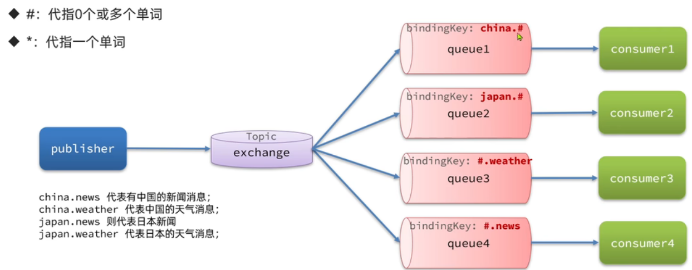

### headers

* 规则：不依赖于路由键的匹配规则来路由消息，而是根据发送的消息内容中的 headers 属性进行匹配
* 在绑定队列和交换器时指定一组键值对，当发送消息到交换器时，RabbitMQ 会获取到该消息的 headers（也是一个键值对的形式)，对比其中的键值对是否完全匹配队列和交换器绑定时指定的键值对，如果完全匹配则消息会路由到该队列，否则不会路由到该队列。
* 性能差，不推荐

## Spring AMQP 使用模式

### 工作队列

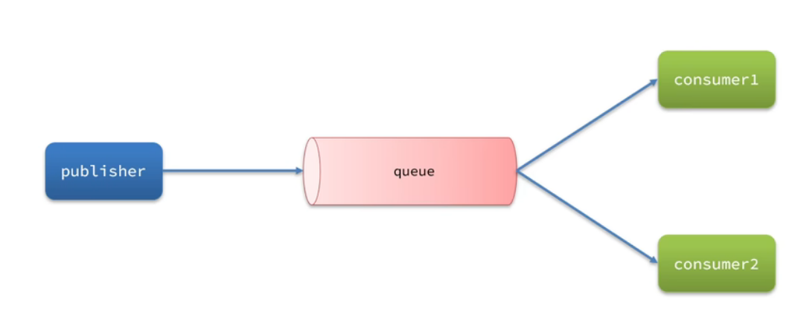

#### 公平分发/轮询分发

公平分发，RabbitMQ将按顺序将每条消息发送到下一个消费者，忽略消息量和消费者处理能力

### 发布/订阅

* Fanout交换机：广播

### 路由

* Direct交换机：将消息根据规则路由到指定的Queue

### 主题

* Topic交换机

### 声明队列/交换机

* Queue：用于声明队列，可以用工厂类QueueBuilder创建
* Exchange：用于声明交换机，可以用工厂类ExchangeBuilder创建
* Binding：用于声明队列和交换机的绑定关系，可以用工厂类BindingBuilder创建

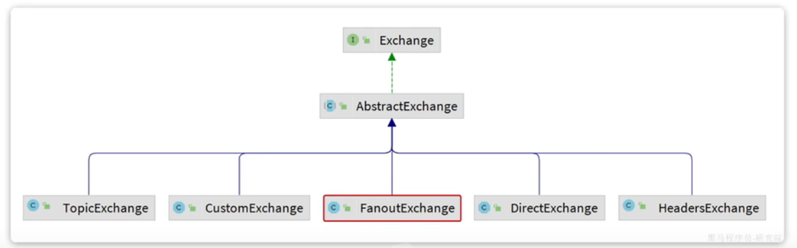

## 数据可靠性

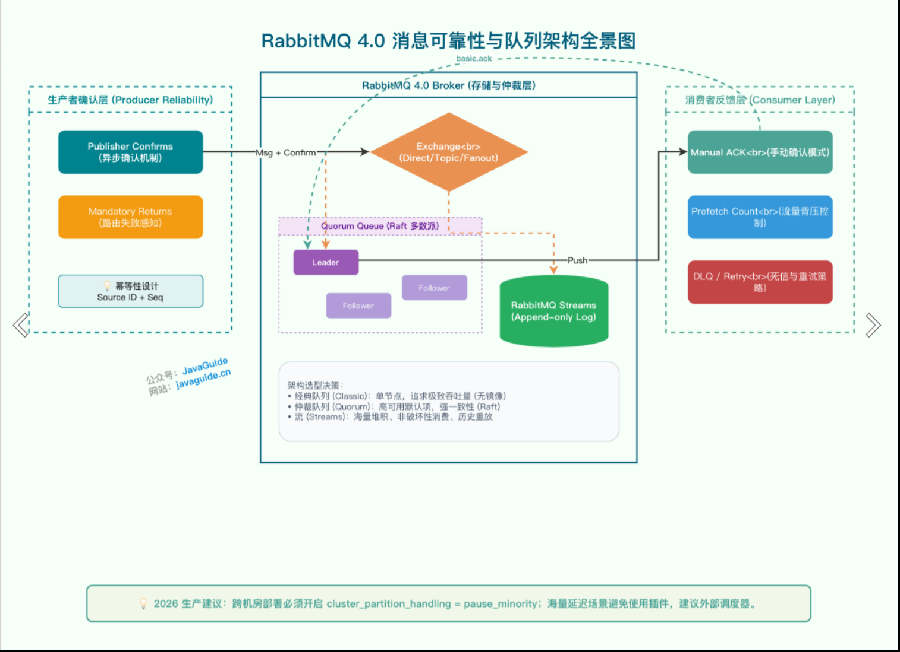

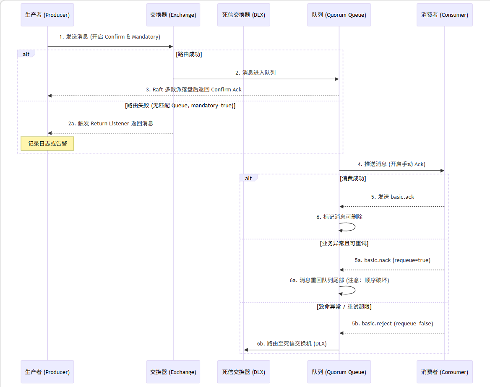

### 生产者可靠性

#### 重连机制

```yml
  rabbitmq:
    connection-timeout: 1s
    template:
      retry:
        enabled: true # 开启消息重试
        initial-interval: 1000ms # 第一次重试的间隔时间
        multiplier: 1 # 重试的间隔时间倍数
        max-attempts: 3 # 最大重试次数
```

#### 确认机制

* 返回ACK投递成功的情况
  * 消息投递到MQ但是路由失败（代码问题/配置问题）
  * ```java
    // Mandatory + Return Listener（路由失败处理）：捕获消息到达 Exchange 但无法路由到 Queue 的情况
    channel.basicPublish("exchange", "routingKey",
        true,  // mandatory=true
        null,
        messageBody);

    // 配置 Return Listener
    channel.addReturnListener((replyCode, replyText, exchange, routingKey, properties, body) -> {
        // 消息到达 Exchange 但路由失败，记录日志或发送到备用交换器
        log.error("Message returned: {}", replyText);
    });
    ```
  * 临时消息投递到MQ，并且入队成功
  * 持久消息投递到MQ，并且完成入队持久化
* 其他情况都返回NACK表示投递失败
* ```java
  // Publisher Confirms（异步确认）：确认消息是否到达 Broker
  channel.confirmSelect();
  channel.addConfirmListener((sequenceNumber, multiple) -> {
      // 消息已到达 Broker 并落盘/同步到镜像
  }, (sequenceNumber, multiple) -> {
      // 消息未到达 Broker，记录日志并重试
  });
  ```

### MQ可靠性

* 默认情况下，RabbitMQ将收到的信息保存在内存中以降低延迟

  * 一旦MQ宕机，内存的消息就丢失了
  * 内存空间有限，消费者故障或者处理过慢时，会导致消息积压，引发MQ阻塞
* 数据持久化

  * 交换机持久化
  * 队列持久化
  * 消息持久化，消息写入磁盘
* 惰性队列

  * 接收到消息后直接存入磁盘而非内存
  * 消费者要消费信息才能从磁盘中读取并加载到内存
  * 支持百万级别消息存储
* 集群模式

  * **镜像队列** （已于 4.0 移除）：主从同步，仅用于老版本维护
  * **Quorum Queue** （3.8+ 推荐，4.0 后为默认）：基于 Raft 协议，支持更严格的仲裁写入（N/2 + 1）
  * **Streams** （3.9+）：适用于事件溯源和高频重放场景

### 消费者可靠性

#### 消费者确认机制

* **手动 Ack** ：确保消费成功后再确认
* 消费者处理消息结束后，向RabbitMQ发送回执
  * ack：成功处理消息，RabbitMQ从队列中删除消息
  * nack：消息处理失败，RabbitMQ需要再次投递消息
  * reject：消息处理失败并拒绝消息，RabbitMQ从队列中删除消息
* SpringAMQP的消息确认机制
  * none：不处理。消息投递给消费者后立即ack，消息从队列中删除。很不安全，不建议用
  * manual：手动模式。需要自己在业务代码调用api，发送ack或者reject。存在业务入侵，但灵活
  * auto：自动模式
    * 业务正常返回ack
    * 业务异常返回nack
    * 消息处理校验异常返回reject

#### 失败重试处理

* 默认情况下，消费者出现异常后，消息会不断重新入队到队列在发送给消费者，再次异常，恶性循环
* 需要开启重试机制
* 若重试次数耗尽仍然失败，需要由 `MessageRecoverer`接口处理
  * `RejectAndDontRequeueRecoverer`：重试耗尽后，直接reject丢弃消息（默认方式）
  * `ImmediateRequeueMessageRecoverer`：重试耗尽后，返回nack，消息重新入队
  * `RepublishMessageRecoverer`：重试耗尽后，将失败消息投递到指定的交换机（如死信队列）

#### 业务幂等性

* 唯一消息id
  * 每条消息都会生成唯一的id，和消息一起投递给消费者
  * 消费者收到消息后处理业务，并将ID保存到数据库
  * 如果下次收到相同消息，则查询数据库，存在相同消息则放弃处理
  * 会产生额外的性能开销
* 业务判断
  * 基于业务本身判断是否需要修改，但是不具备通用性

#### 死信队列

- 进入死信队列的情况
  - 消费失败达到最大次数
  - 消费被拒绝
  - 消息过期/队列满
- 处理流程：

```
生产者 → 主队列 → 消费者
                 ↓（失败）
              重试机制
                 ↓（仍失败）
            死信队列（DLQ）
                 ↓
        人工/系统补偿处理
```

- 作用
  - 防止主队列阻塞
  - 隔离脏消息
  - 支持后续的补偿处理

## 延迟消息

* 生产者发送消息指定时间，指定时间之后才收到消息

### 死信交换机

* 消息满足以下条件之一会成为死信：
  * 消费者使用reject或nack说明消费失败，并且消息的requeue参数设置为false
  * 消息是一个过期消息，超时无人消费
  * 需要投递的队列消息队积满了，最早的消息可能成为死信

### 延迟消息插件

* 插件设计了一种支持延迟功能的交换机，当消息投递到交换机后可以暂存一定时间，到期后再回到队列
* 发送消息时需要通过消息头x-delay设置过期时间

## 消息顺序性

RabbitMQ 仅保证**单个 Queue 内的 FIFO 顺序**，多消费者场景下可能出现乱序

### 单消费者模式

- 一个 Queue 只绑定一个 Consumer
- 优点：保证顺序
- 缺点：性能瓶颈，吞吐量受限

### 分区有序（推荐）

- 按业务 key（如订单ID）哈希到不同 Queue
- 每个 Queue 独立 Consumer
- 优点：既保证顺序又提高吞吐量

**失效模式警告**：

- **拓扑变更乱序**：当后端队列扩缩容导致哈希环发生变化时，同一个业务 Key 的新老消息可能进入不同队列
- **重试乱序**：若消费者内部处理失败执行 Nack 并 Requeue，该消息会被重新推入队列**尾部**，导致后续消息先被消费
- **应用层防护**：极端严格顺序场景下，消费者业务表必须设计基于**状态机**或**版本号**的幂等与防并发覆盖机制

## 集群部署/高可用

### 单机模式

Demo 级别的，没人生产用单机模式。

### 普通集群模式

在多台机器上启动多个 RabbitMQ 实例，每个机器启动一个。创建的 queue，只会放在一个 RabbitMQ 实例上，但是每个实例都同步 queue 的元数据（元数据可以认为是 queue 的一些配置信息，通过元数据，可以找到 queue 所在实例）

消费的时候，如果连接到了另外一个实例，那么那个实例会从 queue 所在实例上拉取数据过来。这方案主要是提高吞吐量的，就是说让集群中多个节点来服务某个 queue 的读写操作。

### 镜像集群模式

RabbitMQ 早期版本的高可用方案（新版已废弃）。跟普通集群模式不一样的是，在镜像集群模式下，无论元数据还是 queue 里的消息都会存在于多个实例上，每个 RabbitMQ 节点都有这个 queue 的一个完整镜像，包含 queue 的全部数据。每次写消息到 queue 的时候，都会自动把消息同步到多个实例的 queue 上。

**工作原理**：

- Queue 主节点接收消息，同步到 N 个镜像节点
- 主节点宕机时，最老的镜像节点升级为主节点
- 通过管理控制台新增策略，指定数据同步到所有节点或指定数量的节点

**优点**：

- 任何机器宕机，其他节点包含该 queue 的完整数据
- Consumer 可以切换到其他节点继续消费

**缺点**：

- 性能开销大，消息需要同步到所有机器上
- 网络带宽压力和消耗重
- 不是真正的分布式架构，是主从复制

### Quorum Queue 模式

基于 Raft 协议的复制队列，是 RabbitMQ 3.8+ 推荐的高可用方案，4.0 后成为默认选项：

- **基于 Raft 协议**：通过日志复制和选举实现一致性
- **仲裁写入**：需要多数节点确认（N/2 + 1）才认为写入成功
- **更严格的一致性**：避免镜像队列的脑裂风险
- **适用场景**：对可靠性要求高的场景

声明方式：

```java
// Java 客户端声明 Quorum Queue
Map<String, Object> args = new HashMap<>();
args.put("x-queue-type", "quorum");  // 关键参数，必须在声明时指定
channel.queueDeclare("my-queue", true, false, false, args);
```
