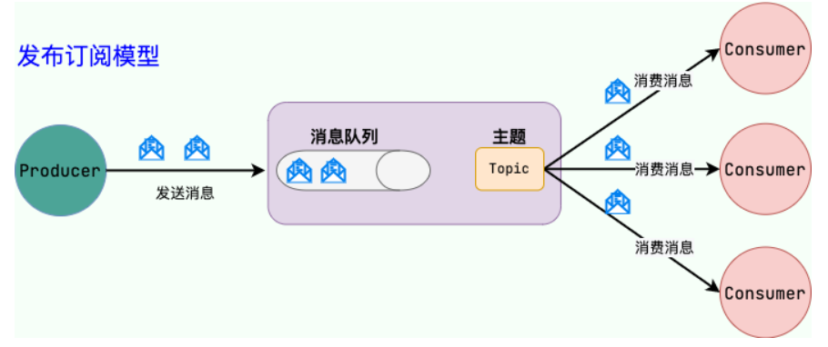
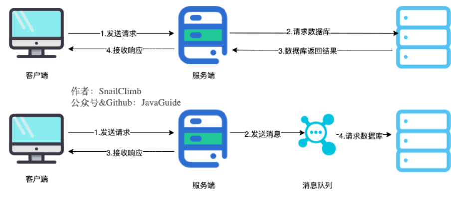
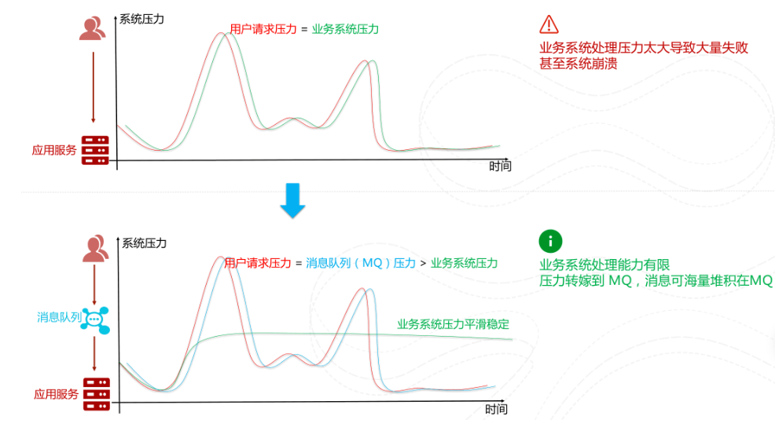
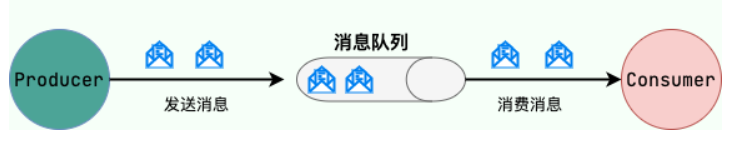
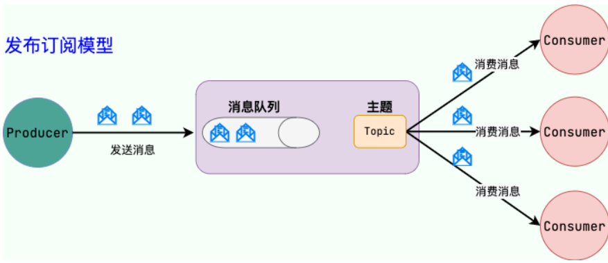
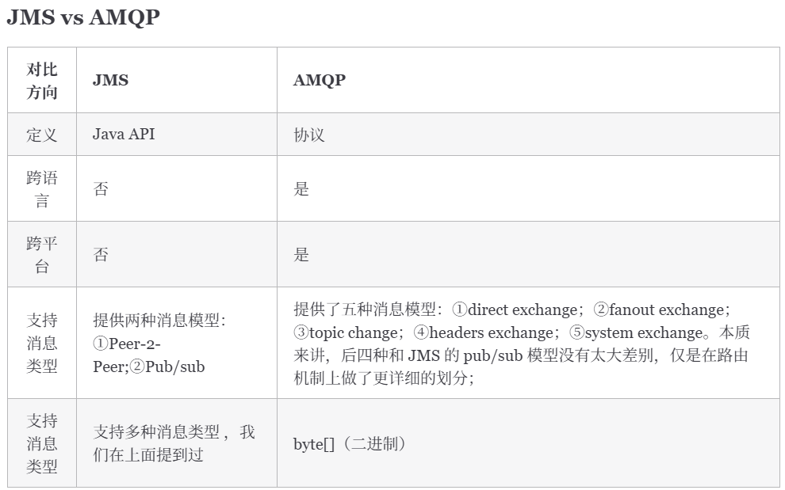

# 消息队列基础知识

## 消息队列作用

### 异步处理

### 削峰/限流

* **先将短时间高并发产生的事务消息存储在消息队列中，然后后端服务再根据自己的能力去消费这些消息，这样就避免直接把后端服务打垮掉。**

### 降低系统耦合性

* 模块之间不存在直接调用，那么新增模块或者修改模块就对其他模块影响较小

### 实现分布式事务

### 顺序保证

* 保证数据按照特定顺序被处理

### 定时/延时处理

* 消息发送后不会立即被消费，而是指定一个时间，到时间后再消费

### 即时通讯

### 数据流处理

## 消息队列可能存在的问题

* **系统可用性降低：** 系统可用性在某种程度上降低。在加入 MQ 之前，不用考虑消息丢失或者说 MQ 挂掉等等的情况，但是引入 MQ 之后需要考虑
* **系统复杂性提高：** 加入 MQ 之后，需要保证消息没有被重复消费、处理消息丢失的情况、保证消息传递的顺序性等等问题
* **一致性问题：** 消息队列可以实现异步，消息队列带来的异步确实可以提高系统响应速度。但是，万一消息的真正消费者并没有正确消费消息，这样就会导致数据不一致的情况

## JMS 

* JMS：Java Message Service，Java消息服务
* **JMS API 是一个消息服务的标准或者说是规范** ，允许应用程序组件基于 JavaEE 平台创建、发送、接收和读取消息。
* JMS 消息类型
  * `StreamMessage：Java` 原始值的数据流
  * `MapMessage`：一套名称-值对
  * `TextMessage`：一个字符串对象
  * `ObjectMessage`：一个序列化的 Java 对象
  * `BytesMessage`：一个字节的数据流

### 点到点（P2P模型）

* 一条消息只能被一个消费者使用，未被消费的消息在队列中保留直到被消费或超时

### 发布/订阅（Pub/Sub）模型

* 使用 **主题（Topic）**作为消息通信载体，类似于**广播模式** ；发布者发布一条消息，该消息通过主题传递给所有的订阅者

## AMQP

* AMQP：Advanced Message Queuing Protocol，一个提供统一消息服务的应用层标准 **高级消息队列协议，是应用层协议的一个开放标准，兼容 JMS**

