分布式一致性级别：

* **强一致性** ：系统写入了什么，读出来的就是什么
* **弱一致性** ：不一定可以读取到最新写入的值，也不保证多少时间之后读取到的数据是最新的，只是会尽量保证某个时刻达到数据一致的状态。
* **最终一致性** ：弱一致性的升级版，系统会保证在一定时间内达到数据一致的状态。

实现最终一致性的方式：

* **读时修复（Read Repair）**：在读取数据时，检测数据的不一致，进行修复。适合读多写少场景。
* **写时修复（Hinted Handoff）**：在写入数据时，如果目标节点不可用，将数据缓存下来，待节点恢复后重传。**写时修复** 优化了写入延迟，但增加了读取时的不一致风险（数据可能还在缓存队列中未落盘到目标节点）。
* **异步修复（Anti-Entropy/反熵）**：通过后台比对副本数据差异并修复。

 **选择建议** ：

* **写时修复** ：适合写多读少，优化写入性能，但牺牲一致性窗口。
* **读时修复** ：适合读多写少，保证读取数据的准确性。
* **Anti-Entropy** ：后台兜底保障，适合数据规模大但对最终一致性要求高的场景。

# CAP 理论

在一个分布式系统中，Consistency（一致性）、Availability（可用性）和 Partition Tolerance（分区容错）三者不可得兼：

* **一致性 (C)** ：在分布式系统中的所有数据备份，在同一时刻是否同样的值（等同于所有节点访问同一份最新的数据副本）
* **可用性 (A)** ：在集群中一部分节点故障后，集群整体是否还能响应客户端的读写请求（对数据更新具备高可用性）
* **分区容忍性 (P)** ：以实际效果而言，分区相当于对通信的时限要求。系统如果不能在时限内达成数据一致性，就意味着发生了分区的情况，必须就当前操作在 C 和 A 之间做出选择

**当发生网络分区的时候，如果我们要继续服务，那么强一致性和可用性只能 2 选 1**

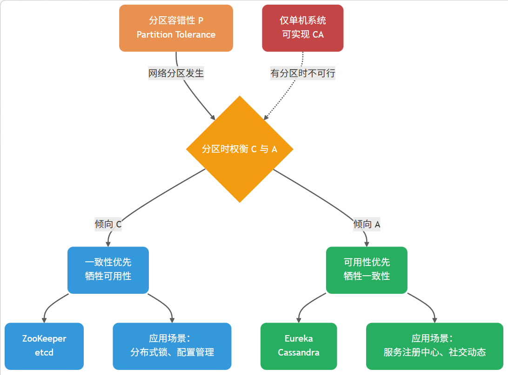

PACELC 理论指出：**如果存在分区（P），必须在可用性（A）和一致性（C）之间选择；否则（E，Else），必须在延迟（L）和一致性（C）之间选择**

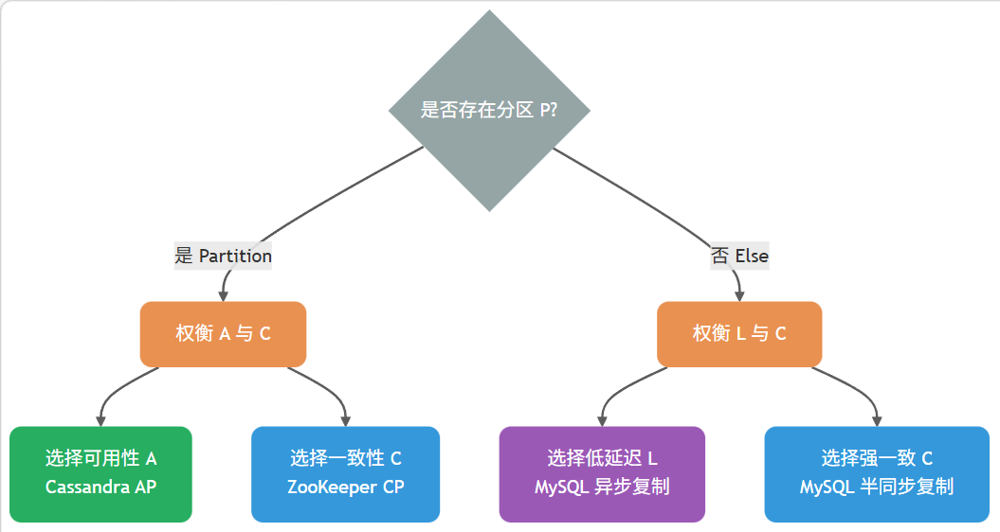

## CAP 应用

业务开发中更多是**选择**合适的架构，而非实践 CAP 理论本身：

| 场景           | 偏向 CP 的选择               | 偏向 AP 的选择           | 业务权衡                 |
| -------------- | ---------------------------- | ------------------------ | ------------------------ |
| 数据库主从复制 | 同步复制（强一致）           | 异步复制（高性能）       | 数据一致性 vs 响应速度   |
| 分布式锁实现   | ZooKeeper（强一致）          | Redis（高性能）          | 锁的可靠性 vs 获取速度   |
| 服务注册中心   | ZooKeeper、Consul（CP 模式） | Eureka、Nacos（AP 模式） | 注册准确性 vs 发现可用性 |
| 限流计数器     | Redis（强一致命令）          | Redis（允许过期）        | 限流精度 vs 性能         |

 **选型原则** ：

* **关注性能** ：倾向选择允许异步复制的组件，写入主节点即可返回成功，响应快；但存在数据丢失/读取到旧数据的风险，需配合重试机制
* **关注数据安全** ：倾向选择要求多数派确认的组件，写入需等待 quorum 节点确认，响应慢；但能降低数据丢失风险

# BASE 理论

**BASE** 是  **Basically Available（基本可用）** 、**Soft-state（软状态）** 和 **Eventually Consistent（最终一致性）** 三个短语的缩写。来源于对大规模互联网系统分布式实践的总结。

**允许数据在短时间内不一致，只要保证最后的结果是对的就好了，以此来换取系统极高的可用性：**

* **Basically Available（基本可用）**：基本可用是指分布式系统在出现不可预知故障的时候，允许损失部分可用性。

  * **响应时间上的损失** ：正常情况下，处理用户请求需要 0.5s 返回结果，但是由于系统出现故障，处理用户请求的时间变为 3s。
  * **系统功能上的损失** ：正常情况下，用户可以使用系统的全部功能，但是由于系统访问量突然剧增，系统的部分非核心功能无法使用。
* **Soft-state（软状态）**：允许系统存在中间态，且该中间态不影响系统整体可用性

  * ACID 理论要求事务执行后立即进入终态（成功或失败），不允许中间态
  * BASE 理论承认中间态是分布式系统的客观存在，只要中间态最终会演变成终态即可
* **Eventually consistent（最终一致性）**：中间态最终会演变成终态（要么成功，要么回滚）

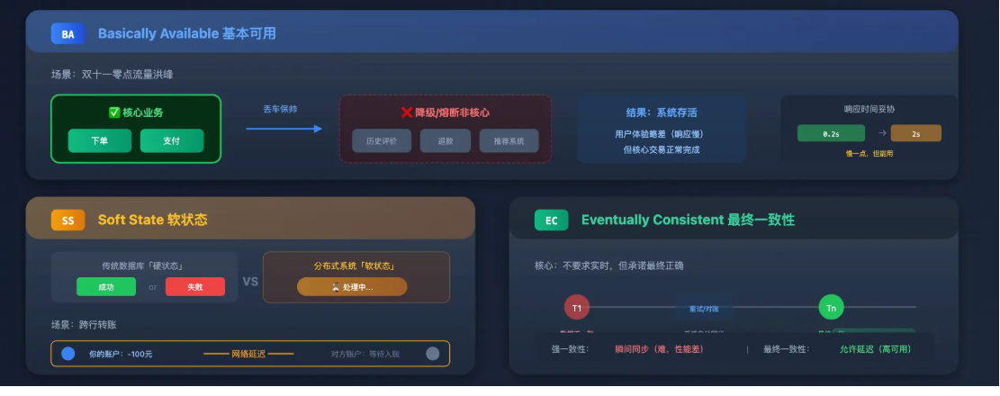

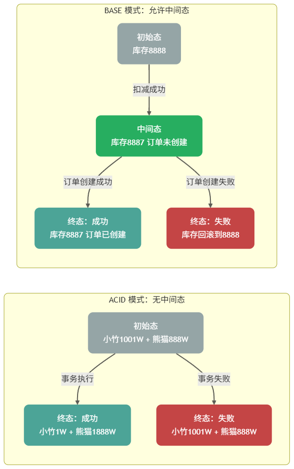

# Paxos 算法

* **Basic Paxos 算法** ：描述多节点之间如何就单个值（value）达成共识。
* **Multi-Paxos 思想** ：通过执行多个 Basic Paxos 实例，就一系列值达成共识。

## Basic Paxos 算法

### 角色定义

* **提议者（Proposer）** ：负责接受客户端请求并发起提案。提案信息通常包括提案编号（proposal ID）和提议的值（value）。
* **接受者（Acceptor）** ：负责对提案进行投票，同时需要记住自己的投票历史。
* **学习者（Learner）** ：负责学习（learn）已被选定的值。在复制状态机（RSM）实现中，该值通常对应一条待执行的命令，由状态机按序 apply 后再由对外服务层返回结果。

一个节点可以身兼多个角色。并且，一个提案被选定需要被半数以上的 Acceptor 接受。在少于一半的节点出现故障时，集群仍能正常工作。

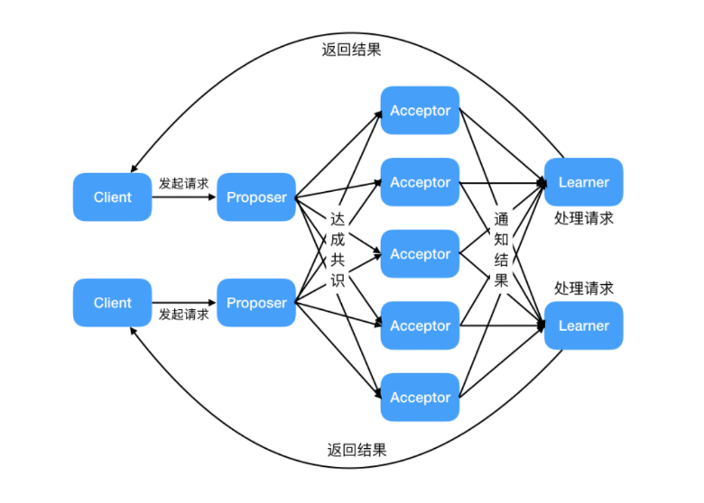

角色交互关系：

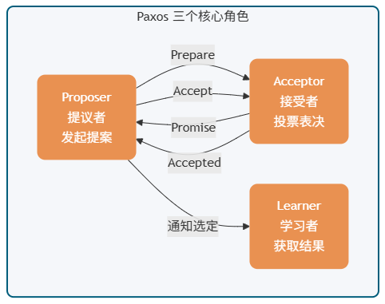

### 执行流程

Basic Paxos 通过两个阶段达成共识：**Prepare/Promise（准备/承诺）阶段**和 **Accept/Accepted（接受/已接受）阶段**

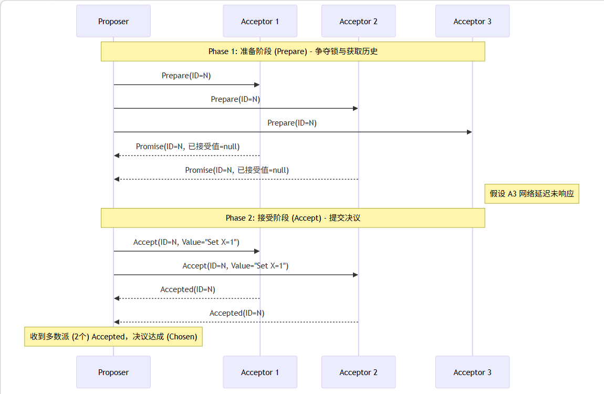

**准备/承诺阶段：**

* Proposer 选择一个提案编号 n（必须全局唯一且递增），向超过半数的 Acceptor 发送 `Prepare(n)` 请求
* 接受者处理流程：
  * 若 n > 该 Acceptor 见过的最大提案编号 max_n
    * 返回 `Promise(n, max_v)`，其中 max_v 是之前接受过的最大编号提案的值（若有）
    * 承诺不再接受编号 < n 的提案
  * 若 n ≤ max_n
    * 拒绝或忽略该请求

**接受/已接受阶段：**

* Proposer 收到超过半数 Acceptor 的 Promise 响应后，选择响应中 max_v 最大的值（若无则任意选择一个值），向超过半数的 Acceptor 发送 `Accept(n, v)` 请求
* 接收者处理流程：
  * 若 n ≥ 该 Acceptor 在 Phase 1 承诺的 max_n
    * 接受该提案，记录 (n, v)，并返回 `Accepted(n, v)`
  * 否则
    * 拒绝该请求

当 Proposer 收到超过半数 Acceptor 对 `Accept(n, v)` 的响应时，提案 v 被 **选定（chosen）**。Proposer 通知所有 Learner 提案已被选定

### 活性问题

Basic Paxos 存在**活锁风险**

假设有两个 Proposer P1 和 P2 同时发起提案：

1. P1 发送 `Prepare(1)`，P2 发送 `Prepare(2)`
2. Acceptor 们承诺给编号较大的 P2
3. P1 发现编号被超越，发送 `Prepare(3)`
4. P2 发现编号被超越，发送 `Prepare(4)`
5. ... 循环往复，永远无法进入 Phase 2

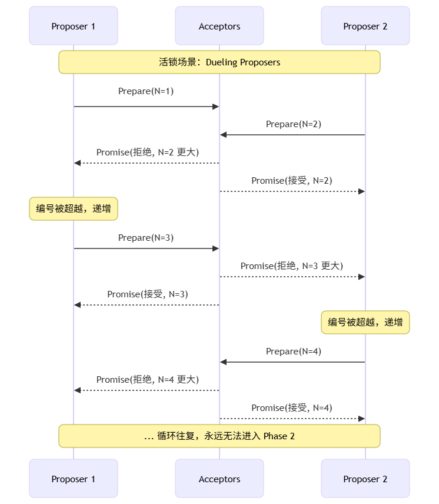

解决方案：

* 随机退避算法：当 Proposer 的请求被拒绝时：
  * 等待随机时间：`base_delay * random(1, 2^attempt)`
  * 选择更大的提案编号（如：`n = n + k`，`k > 0`）
  * 重试 Prepare 阶段
* 分区处理：若发生网络分区，多数派一侧可继续选举 Leader 并提交新提案；少数派无法形成法定人数，只能等待分区恢复

## Mutil Paxos 算法

Basic Paxos 算法仅能就单个值达成共识，**为了能够对一系列的值达成共识，我们需要用到 Multi-Paxos 思想。**

Multi-Paxos 的核心优化思想是 **复用 Leader** ：通过 Basic Paxos 选出一个稳定的 Proposer 作为 Leader，后续提案直接由该 Leader 发起，跳过 Phase 1 的 Prepare/Promise 阶段。

# Raft 算法

# 分布式事务

## 使用场景

**能绕开不用，就尽量不用** 。 强一致性分布式事务非常消耗性能，除非是核心银行转账这样对钱要求「 **强一致性** 」（必须立刻、马上分毫不差）的场景才会使用。否则可以用消息队列+本地消息表代替，退化为**最终一致性**

### 微服务架构跨境协同

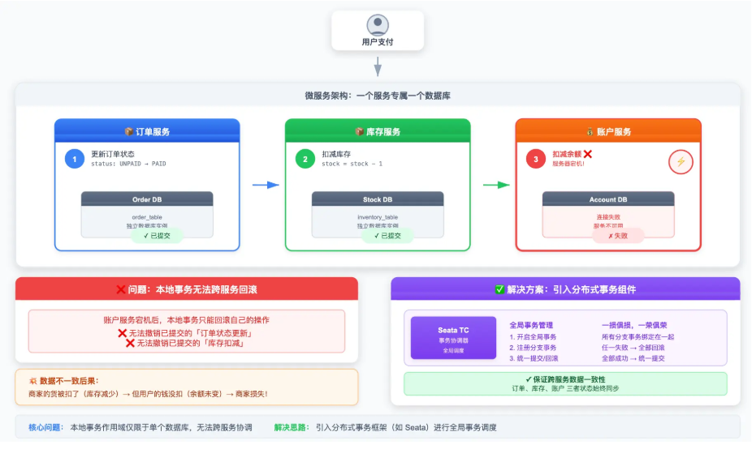

用户点击下单，后台需要：订单服务去 **更新订单状态** ，库存服务去 **扣减库存** ，账户服务去**扣减余额**。三个动作发生在三个独立的系统和数据库里面，但如果一个服务宕机（比如订单、库存更新成功，但是余额扣除失败），传统的本地事务无法解决。需要让这分散在各个地方的三个操作绑在一起

### 分库分表

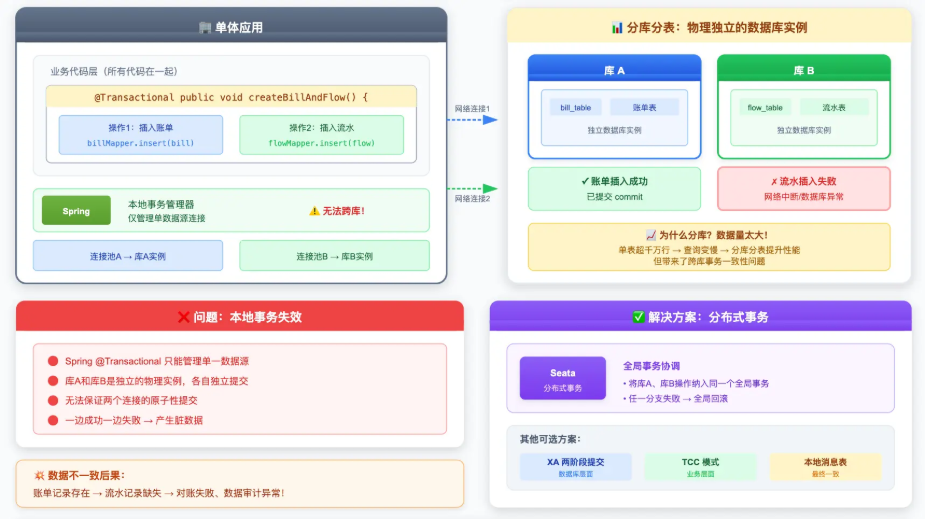

数据量太大，大库被拆成 A 和 B。如果我们在一个方法里，同时往库A里插入账单，又往库B里插入流水。这走的是两条网络链接，本地事务也无法保证同时成功

## 解决方案

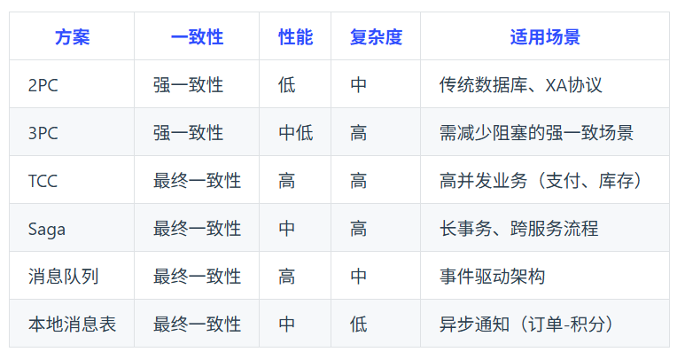

* 两阶段提交协议（2PC）：**为准备阶段和提交阶段**。准备阶段，协调者向参与者发送准备请求，参与者执行事务操作并反馈结果。若所有参与者准备就绪，协调者在提交阶段发送提交请求，参与者执行提交；否则发送回滚请求
  * 优点：实现简单，能保证事务强一致性。
  * 缺点：存在单点故障，协调者故障会影响事务流程；性能低，多次消息交互增加延迟；资源锁导致资源长时间占用，降低并发性能。
  * 适用场景：对数据一致性要求高、并发度低的场景，如金融系统转账业务。
* 三阶段提交协议（3PC）：在 2PC 基础上，**将准备阶段拆分为询问阶段和准备阶段**，形成询问、准备和提交三个阶段。询问阶段协调者询问参与者能否执行事务，后续阶段与 2PC 类似。
  * 优点：降低参与者阻塞时间，提高并发性能，引入超时机制一定程度解决单点故障问题。
  * 缺点：无法完全避免数据不一致，极端网络情况下可能出现部分提交部分回滚。
  * 适用场景：对并发性能有要求、对数据一致性要求相对较低的场景。
* TCC：将业务操作拆分为 Try、Confirm、Cancel 三个阶段。**Try 阶段预留业务资源，Confirm 阶段确认资源完成业务操作，Cancel 阶段在失败时释放资源回滚操作**。
  * 优点：可根据业务场景定制开发，性能较高，减少资源占用时间。
  * 缺点：开发成本高，需实现三个方法，要处理异常和补偿逻辑，实现复杂度大。
  * 适用场景：对性能要求高、业务逻辑复杂的场景，如电商系统订单处理、库存管理。
* Saga：**将长事务拆分为多个短事务**，每个短事务有对应的补偿事务。某个短事务失败，按相反顺序执行补偿事务回滚系统状态。
  * 优点：性能较高，短事务可并行执行减少时间，对业务侵入性小，只需实现补偿事务。
  * 缺点：只能保证最终一致性，部分补偿事务失败可能导致系统状态不一致。
  * 适用场景：业务流程长、对数据一致性要求为最终一致性的场景，如旅游系统订单、航班、酒店预订。
* 可靠消息最终一致性方案：基于消息队列，业务系统执行本地事务时将业务操作封装成消息发至消息队列，下游系统消费消息并执行操作，失败则消息队列重试。
  * 优点：实现简单，对业务代码修改小，系统耦合度低，能保证数据最终一致性。
  * 缺点：消息队列可靠性和性能影响大，可能出现消息丢失或延迟，需处理消息幂等性。
  * 适用场景：对数据一致性要求为最终一致性、系统耦合度低的场景，如电商订单支付、库存扣减。
* 本地消息表：**业务与消息存储在同一个数据库**，利用本地事务保证一致性，后台任务轮询消息表，通过 MQ 通知下游服务，下游服务消费成功后确认消息，失败则重试。
  * 优点：简单可靠，无外部依赖。
  * 缺点：消息可能重复消费，需幂等设计。
  * 适用场景：异步最终一致性（如订单创建后通知积分服务）。
