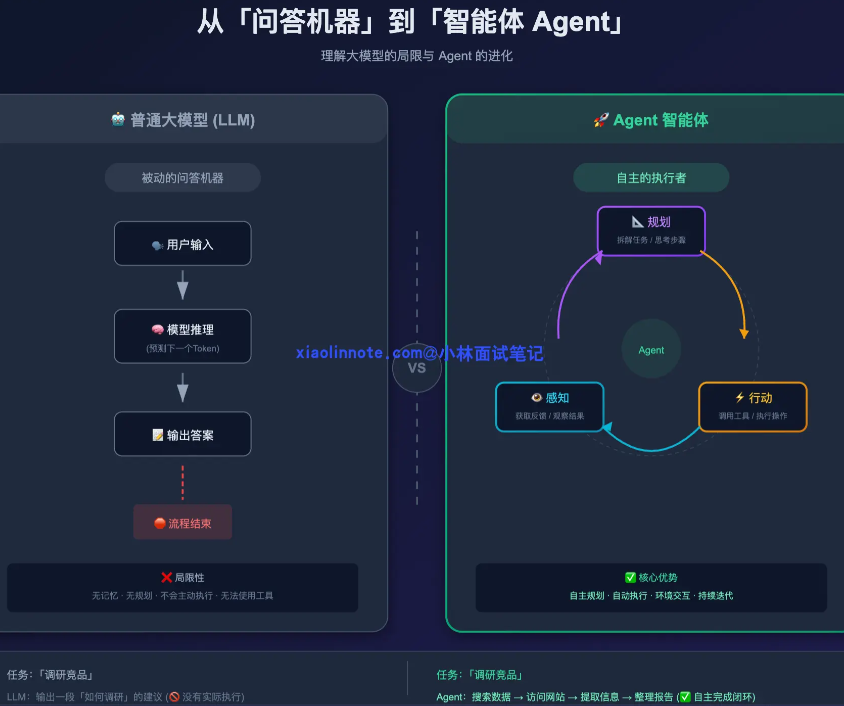
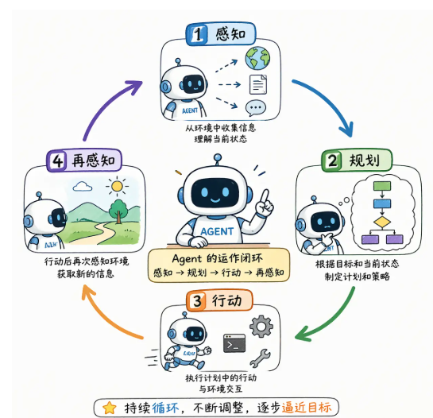
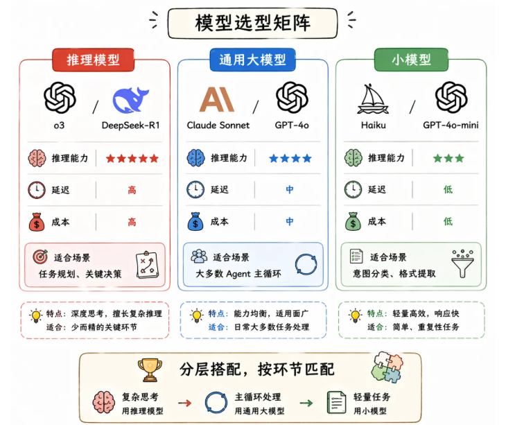
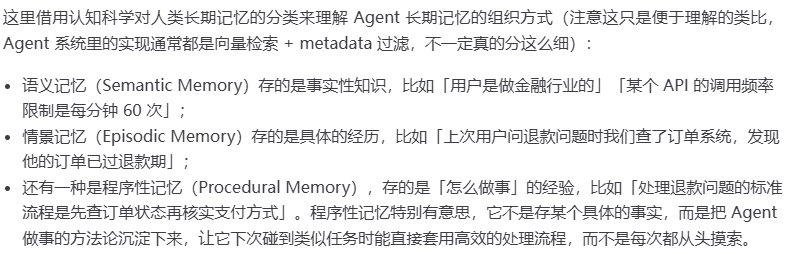
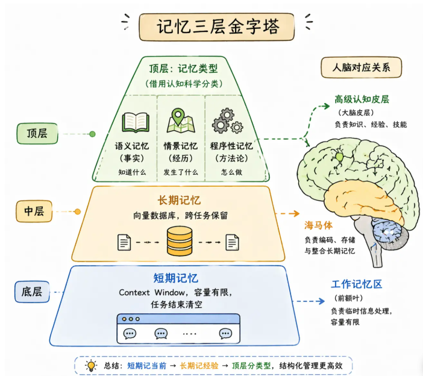
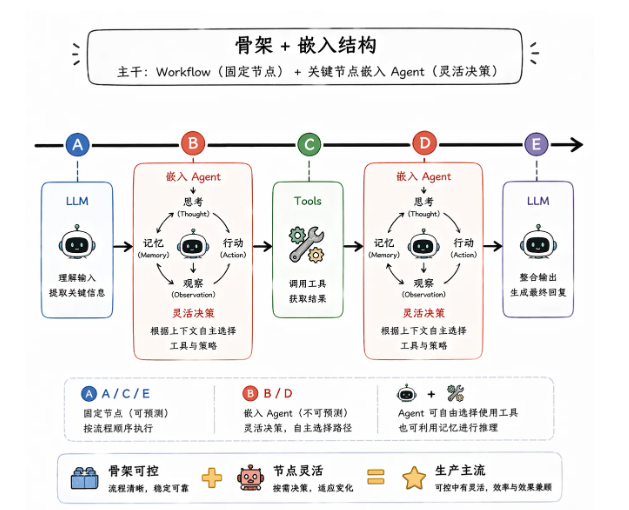
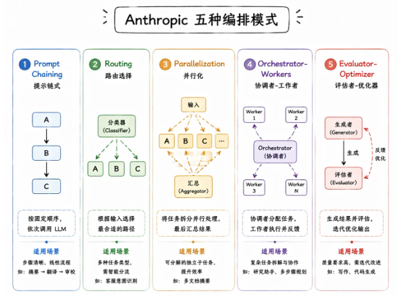

# 基础概念

## Agent 概念

* Agent 本质上是一个**能自主完成目标的 AI 系统**，跟传统 AI 最核心的区别在于「自主性」和「能行动」。
* 传统 AI 是你问一个问题它回答一个问题，每次都是独立的，被动响应；而 Agent 有自己的规划能力，你给它一个复杂目标，它会自己把任务拆成多步，通过调工具、访问记忆、感知环境来一步步执行，直到完成

### LLM 的局限

* 知识冻结：训练数据有截止日期，超过截止日期的信息，LLM 不知道
* 无法行动：LLM 本质是文本生成器，无法执行具体操作（如发邮件，查数据库等）
* 没有持续状态：LLM 的信息是独立的



### Agent 如何运作



* 核心运作闭环：**感知 -> 规划 -> 行动 -> 再感知**
* 能力支撑
  * **工具调用（Tool Use）：** Agent 能调用外部工具，比如搜索引擎、代码执行器、数据库、API 等等（注意：不是模型执行，而是模型选择工具，工具对应的代码执行具体操作）
  * **记忆机制：** Agent 系统通常会设计短期记忆和长期记忆两层。短期记忆就是当前任务执行过程中的中间状态；长期记忆则是跨任务的，比如用户的偏好、历史操作记录。有了这两层记忆，Agent 在执行复杂任务时才能保持连贯性，不会走着走着忘了目标是什么。
  * **多步推理和自我纠错：** Agent 在执行过程中如果某一步失败了，它不会直接崩掉，而是能感知到失败、分析原因、换一种方式重试。这种「边做边反思」的能力，让 Agent 在面对复杂、不确定的任务时，表现远比死板的自动化流程好得多

## Agent 架构

Agent 的基本架构有四个核心组件：LLM、工具、记忆、规划模块

* LLM 是整个系统的大脑，负责理解任务和做决策
* 工具让 Agent 能跟外部世界交互，搜索、执行代码
* 记忆让 Agent 在任务执行过程中保持状态，不会「失忆」
* 规划模块负责把复杂目标拆解成可执行的步骤

### LLM 核心

Agent 的大脑，负责理解用户指令和做出下一步决策

* System Prompt：定义 Agent 的角色、行为边界、输出格式要求
* 模型选择：推理模型/通用模型/小模型，根据任务难度选择



### 工具系统

Agent 和外部交互的入口

定义工具结构

```Python
# 定义工具的结构（以 OpenAI function calling 格式为例）
# 你只需要告诉模型三件事：工具叫什么名、能做什么事、需要哪些参数
tools = [
    {
        "type": "function",
        "function": {
            "name": "search_web",
            "description": "搜索互联网上的信息",
            "parameters": {
                "type": "object",
                "properties": {
                    "query": {
                        "type": "string",
                        "description": "搜索关键词"
                    }
                },
                "required": ["query"]
            }
        }
    }
]

# LLM 决定调用工具时，会返回类似这样的结构：
# {"tool_call": {"name": "search_web", "arguments": {"query": "2024年大模型最新进展"}}}
# 然后你的代码负责真正执行这个搜索，把结果再塞回给 LLM
```

**工具描述的质量非常重要，直接影响Agent表现**

* 正例：查询公司内部销售数据库，支持按日期、产品类别筛选
* 反例：查询数据

**工具设计原则：**

* 单一职责：一个工具只做一件事，如果一个工具干的事太杂，模型就很难精确判断什么时候该用它
* 精确描述：模型完全靠工具描述来理解这个工具能做什么
* 错误信息要清晰：工具执行失败的时候，返回给 LLM 的错误信息必须是它能看懂的
* 参数设计简洁：能少传的参数就不传，能有默认值的就给默认值

### 记忆系统

* 短期记忆
  * 本轮对话的上下文
  * Agent 靠它记住中间状态，比如第一步搜索到了什么、第二步执行结果是什么
  * 任务结束后清空
* 长期记忆
  * 通常用向量数据库来实现，把重要信息 embedding 之后存起来，下次用的时候做语义检索拿回来





* 记忆系统挑战
  * 短期记忆
    * 上下文窗口有限
    * 摘要压缩、滑动窗口，都会导致信息丢失
    * 在「记住够多」和「不撑爆上下文」之间取舍
  * 长期记忆
    * 什么该存，什么不该存：存的太多，检索出来的噪声多；存的太少，失去长期记忆意义
    * 重要性评估：存入之前判断，只把真正有价值的信息持久化
    * 记忆衰减：越早的信息越不重要
    * 指数衰减公式：记忆的相关性分数 = 语义相似度 x 时间衰减因子

### 规划模块

决定了 Agent 能不能应对复杂任务，底层依赖 LLM 的推理能力

* 推理模式：
  * **CoT** （Chain of Thought，思维链）：让模型**把思考过程写出来**，而不是直接输出最终答案。可以在 prompt 里加一句「Let's think step by step」（LLM 的 token 生成是逐步进行的，每一步推理的输出会成为下一步推理的输入，把中间步骤写出来，等于给了模型更多的思考空间
  * **ToT** （Tree of Thoughts，思维树）：它不是走一条线性的推理链，而是在每个推理节点上展开多个可能的分支，然后评估每个分支的质量，选出最优的路径继续往下走
* 规划模式：
  * **Plan-and-Execute 模式**：先规划后执行。先让 LLM 输出一个完整的步骤列表，然后按顺序逐步执行
    * 优点：结构清晰
    * 缺点：容错性较差
  * **ReAct 模式**：边执行边规划。每走一步就根据当前结果重新思考下一步该做什么
    * 优点：灵活性高
    * 缺点：容易走偏，忽略整体目标
* 如何防止死循环
  * 设置最大循环次数
  * 设置消耗 token 上限
  * 设置运行时间上限

## Workflow

把整个执行流程的「骨架」写在代码里，LLM、Agent、Tools 都只是这个流程里的「节点」，**每个节点负责完成自己那一步，但整体走哪条路、下一步去哪里，全由开发者的代码决定**

优点是**可预测、可控、好调试**

生产环境通常采用：用 Workflow 固定主流程的骨架，在需要灵活判断的节点嵌入 Agent，其余固定节点直接用 LLM 或 Tools



常见的 Workflow 编排方式：

* Prompt Chaining（提示链）：把一个大任务拆成多个小步骤，像流水线一样串起来
* Routing（路由）：先用一个 LLM 做分类判断，然后根据分类结果把请求分发到不同的处理分支
* Parallelization（并行化）：把可以同时进行的子任务并行执行，最后汇总结果，这在需要多维度分析的场景下特别有用
* Orchestrator-Workers（编排者-工人）：一个中央编排者负责分配任务，多个 Worker 各自完成子任务，适合任务可以分解但子任务之间相互独立的场景
* Evaluator-Optimizer（评估者-优化者）：一个 LLM 负责生成输出，另一个 LLM（或者同一个模型换一个角色）负责评估这个输出的质量，如果评估不通过就把反馈给回生成者，让它改进后重新输出


