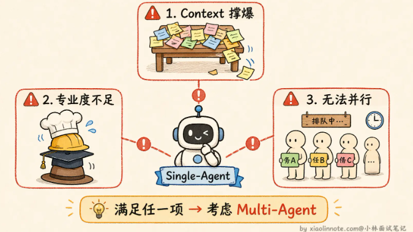
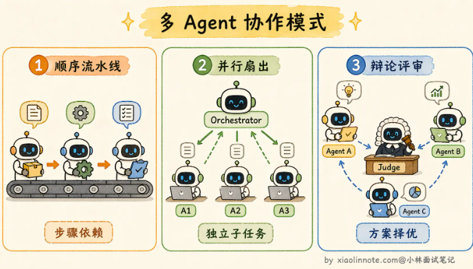

# 多 Agent

**渐进式演进**：先用单 Agent ，如果发现存在局限性，再将瓶颈部分拆分为一个新的 Agent

## Single-Agent

本质是一个 LLM 加上一套工具，跑一个决策循环：LLM 判断下一步该做什么，调用工具执行，拿到结果，再判断，直到任务完成

优势：

* 架构简单
* 链路清晰，方便感知

缺点：

* 上下文窗口有限，复杂任务信息容易撑爆
* 能力有限，如果什么事情都一个 Agent 做，容易泛而不精
* 无法并行，效率有限

## Multi Agent

核心思路：把任务按照职能拆开，每个 Agent 只负责一件事情

协作模式：

* **顺序流水线：**一个 Agent 做完，将结果传给下一个 Agent
* **并行运行：**一个调度者把多个任务分给不同 Agent，各自并行执行，最后由调度者汇总
* **辩论/评审模式：**多个 Agent 各自给出方案，由一个裁判 Agent 或者各自评审选择最优解

### 中心化

核心角色：Orchestrator Agent。不负责具体工作，而是理解用户需求，将其拆分为子任务，并分发给不同的 Worker Agent

* **静态路由：**预先定义好任务拆分和分配规则
* **动态规划：**让 Orchestrator 根据用户输入动态生成任务计划
* **自适应编排：**Orchestrator 不仅动态规划，还会根据 Worker 的执行结果实时调整后续计划

优点：链路清晰，能够根据 Orchestrator 调度记录排查

### 去中心化

多个 Agent 通过共享的消息队列或状态空间自行协商、直接通信，非常灵活

目前存在的问题，导致生产环境基本不用去中心化：

* **任务分配不协调：**不同 Agent 的工作可能会重合
* **执行顺序不确定：**有些 Agent 需要等待其他 Agent 的结果，但是并不知道什么时候出结果
* **没有失败感知：**其中一个 Agent 失败，其他 Agent 并不知道，导致最后任务执行失败 

## 协作与切换

### 协作：信息传递

* 消息传递：Agent 完成自己工作后，发送到一个消息队列， 下游 Agent 订阅需要的信息，获取到后开始处理下游任务
  * 优点：解耦
  * 缺点：需要额外的消息队列部署
* 共享状态：Agent 共同维护一个 State，每个 Agent 执行完就往 State 里写入自己的结果，下一个 Agent 直接从 State 里读取前面的产出

### 状态管理：避免冲突

背景：共享状态下，一个 Agent 写入的内容可能被另一个 Agent 覆盖

* 状态分层：分为全局状态和共享状态。全局状态存放所有 Agent 都需要读取的信息（如用户原始请求、任务进展、最终输出）。局部状态存放 Agent 中间结果
* 明确写入规则：只追加不覆盖
* 错误状态处理：错误也需要写入状态，而不是屏蔽，这样其他 Agent 才能做出正确决策

### 切换：任务传递

* 静态路由：提前设置好规则
* 动态路由：由协调器 Agent 、或者上一个工作的 Agent 决定下一步传递给谁
