# 工具调用

## 背景

在没有工具调用前，依靠 LLM 调用工具，需要解析自然语言，用 if-else 等判断，这种方法麻烦且脆弱

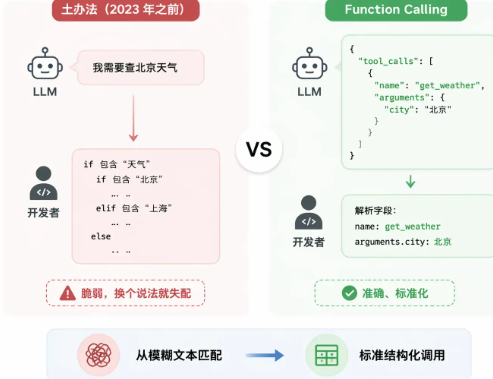

## 格式定义

description 越详细越好

```Python
tools = [
    {
        "type": "function",
        "function": {
            "name": "get_weather",          # 工具的唯一标识，模型输出 tool_calls 时会用这个名字
            "description": "查询指定城市的实时天气，包含气温、天气状况、风向风速，仅支持中国大陆城市",
            "parameters": {
                "type": "object",
                "properties": {
                    "city": {
                        "type": "string",
                        "description": "城市名称，如「北京」「上海」，不要带省份前缀"
                    },
                    "unit": {
                        "type": "string",
                        "enum": ["celsius", "fahrenheit"],
                        "description": "温度单位，默认用摄氏度"
                    }
                },
                "required": ["city"]
            }
        }
    }
]
```

## 模型如何学会调用工具

### 为何原始 LLM 不会调用工具

LLM 在训练阶段，只经历过文本的训练，并没有经历过“工具调用”的相关信息，因此只会说“我需要调用xxxAPI”这样的描述，而不是真的去输出一段可以被程序解析的 JSON 调用请求

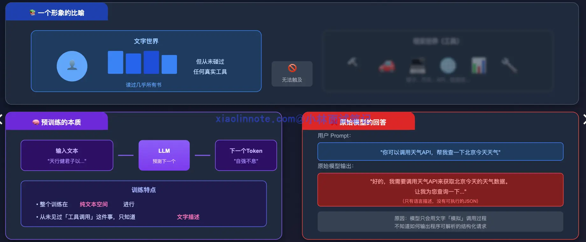

### SFT：监督微调

核心思路：给模型看大量正确的示例，让它学会模仿

训练样本示例：

* System 消息：工具说明书，列出模型现在可用的工具及其描述
* User 消息：用户提问
* Assistant 调用请求：**结构化的 JSON**，由代码解析需要调用什么工具，使用什么参数
* Tool 消息：模拟工具返回的数据
* Assistant 最终回答：模型最终返回的自然语言答案

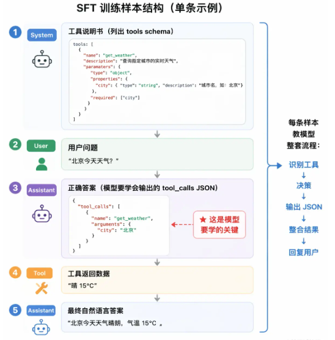

存在的问题：

* 不知道什么时候该调用，什么是否不该调用：绝大部分训练数据都是调用
* 工具调用失败不知道怎么处理：绝大部分训练数据都是工具调用成功，返回正确答案

训练数据类型：

* 单工具调用
* 多工具并行调用
* 工具调用失败
* 不调用工具，直接回答
* 多轮对话中的工具调用

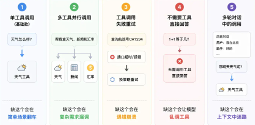

### RLHF：人类反馈强化学习

给模型行为进行打分，帮模型建立判断力，具体步骤如下：

* 生成多种回答：针对同一个问题，让模型生成不同处理方式，比如有的调用工具，有的直接返回
* 人类打分：标注员评判哪种回答更合理，记录人类的判断偏好。比如 1+1 直接返回，查询天气需要调用工具
* 训练奖励模型：利用打分数据，单独训练一个模型，专门负责打分（这一步蒸馏了人类的打分偏好，因此需要高水平稳定的人工标注）
* 强化学习优化主模型：用奖励模型的打分，调整主模型参数，优化主模型的效果

RLAIF：RLHF 变体，用另一个 LLM 代替人类标注打分

# MCP

## 背景

在 MCP 出现之前，每接一个新工具都要单独写集成代码。MCP 的思路是把这件事标准化：工具提供方按协议实现一个 Server，任何支持 MCP 的 AI 客户端就能直接接进来，一次实现到处复用。

它相当于提供了一个中间层，工具定义和工具代码还是需要编写，但是不再需要调用方额外编写代码去适配格式，而是注册到mcp服务上

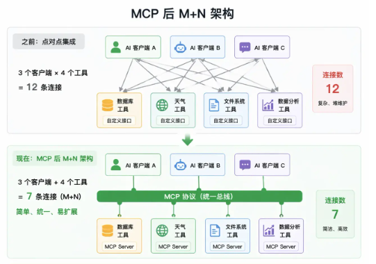

## 结构

### 角色架构（Host/Client/Server）

* Host：系统宿主，AI应用本身，比如cc、cursor。负责启动和管理所有 MCP Client，控制连哪些 Server、什么时候断开连接
* Client：Host 内部连接模块，负责初始化和 Server 的连接、向 Server 查询工具列表、将模型调用请求转发给 Server
* Server：工具提供方，对外暴露自己的工具列表

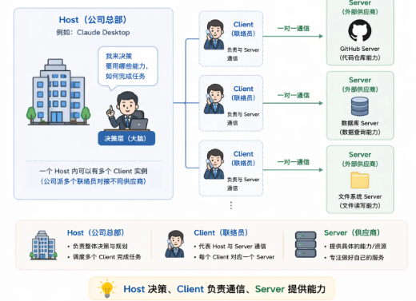

### 能力类型（Tools/Resources/Prompts）

MCP 定义了三类能力，每类解决不同的需求，设计上有明确的职责分工

* Tools（工具）：对应工具调用中的函数，由 LLM 执行。会改变外部状态，可能存在副作用
* Resources（资源）：只读数据，不会产生副作用。可以宽松授权
* Prompts（提示词模板）：预定义的提示词模板，适合复用和团队协作

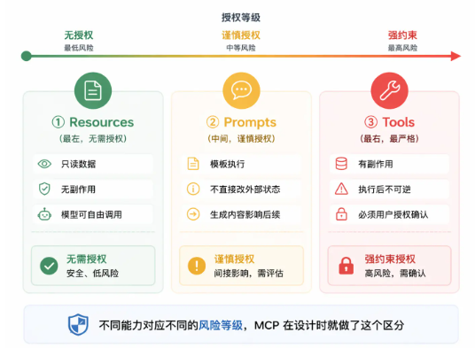

### 传输协议（JSON-RPC 2.0）

Client 和 Server 之间的通信由两部分组成：消息格式和传输方式

* **消息格式：** 统一用 JSON-RPC 2.0。每条消息是一个 JSON 对象，格式固定

```JSON
// Client 向 Server 查询工具列表
{"jsonrpc": "2.0", "id": 1, "method": "tools/list", "params": {}}

// Server 返回工具列表
{"jsonrpc": "2.0", "id": 1, "result": {"tools": [{"name": "read_file", ...}]}}

// Client 请求调用某个工具
{"jsonrpc": "2.0", "id": 2, "method": "tools/call", "params": {"name": "read_file", "arguments": {"path": "/tmp/log.txt"}}}
```

* **传输方式：**
  * stdio（标准输入输出）：Server 作为本地子进程运行，Host 通过操作系统的管道和它通信，Server 从 stdin 读请求、把结果写到 stdout。延迟极低，适合本地工具，不需要网络
  * Streamable HTTP：Server 作为 HTTP 服务独立部署，Client 通过 HTTP 连接和它通信。适合远程部署场景
    * 早期采用 HTTP+SSE，有 GET 和 POST 两个端点；Streamable HTTP 合并为一个端点，Server 根据请求长短回复

# Skill

## 背景

* 重复粘贴大段 prompt
* 团队维护，不同成员的版本可能不一样

## 结构

```
code-review/                  # Skill 文件夹，名字就是这个 Skill 的标识
├── SKILL.md                  # 核心指令文件（必须有）
├── scripts/                  # 可选：可执行的脚本
│   └── check_security.py     # 比如一个安全检查脚本
├── references/               # 可选：参考文档
│   └── review_standards.md   # 比如团队的审查标准文档
└── assets/                   # 可选：模板、资源文件
    └── report_template.md    # 比如审查报告的输出模板
```

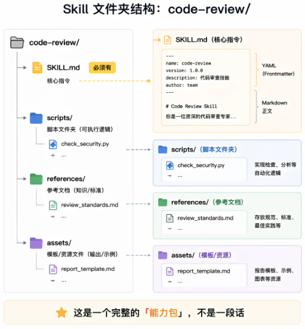

顶部是一段 YAML 格式的元数据，叫 frontmatter，声明这个 Skill 的名字和一句话描述

```Markdown
---
name: code-review
description: "对代码进行全面审查，检查 bug、安全漏洞和性能问题，输出结构化审查报告"
---

# 代码审查 Skill

## 指令

### 第一步：理解代码上下文
阅读提交的代码，理解它的功能和所属模块，确认修改范围。

### 第二步：逐项检查
按以下维度逐一检查：
1. 功能正确性：逻辑是否有 bug，边界条件是否处理了
2. 安全性：是否有注入、XSS、权限绕过等漏洞
3. 性能：是否有 N+1 查询、不必要的循环、内存泄漏风险
4. 可读性：命名是否清晰，关键逻辑是否有注释

### 第三步：输出报告
使用 assets/report_template.md 的模板格式，输出结构化的审查报告
```

## 渐进式加载

* Agent 启动的适合，只加载 skill 的 name 和 description
* Agent 判断需要使用 skill 的时候，才会加载 skill.md
* Agent 执行 skill 的时候，在需要时，加载相关文档

# A2A

多个 AI Agent 之间的互相通信协作，本质是 Agent 的微服务版本

* 单个 Agent 是一个 HTTP 服务
* Agent Card 是 API 文档
* Task 状态机是消息队列

## 背景

类似于 multi-agent 的情况，单 agent 的工具、上下文窗口、专业能力都有限

## Agent Card：Agent 的身份证

让 agent 主动发名片，声明自己能做什么，避免硬编码写死

每个 A2A Agent 都在一个约定位置发布一张 JSON 格式的名片，里面写清楚自己叫什么、能做哪类任务（Skill 列表）、支不支持流式返回、支不支持异步回调等。任何想和它协作的 Agent，都需要先拿这张名片，再判断是否需要将任务委托给他

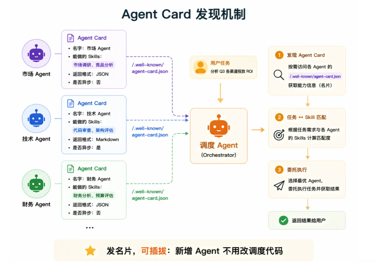

## Task：A2A任务协作的基本单位

Task 的生命周期状态：

* submitted：Task 刚被创建，表示已经提交、等待处理
* working：Task 被 Agent 接受，开始执行
* completed：Task 执行成功
* failed：Task 执行失败

A2A 是为长时间任务设计的，所以调度 Agent 提交任务后可以去处理其他事情。Task 的状态管理机制，正是为了支持这种异步长任务协作的。

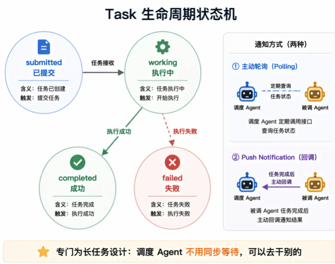

# LLM 网关

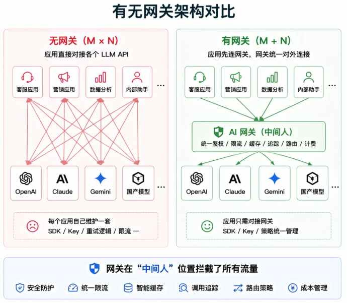

## 背景

AI 产品可能会使用多个模型

没有网关的问题：

* 安全问题：api key散落在各个配置文件里面
* 重复造轮子：每个服务都需要写重试、限流逻辑
* 成本黑箱：不知道具体哪个模型、哪个团队花钱花的多

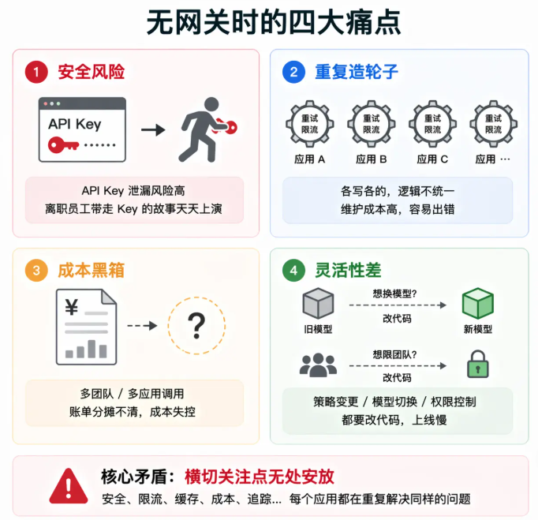

## 功能

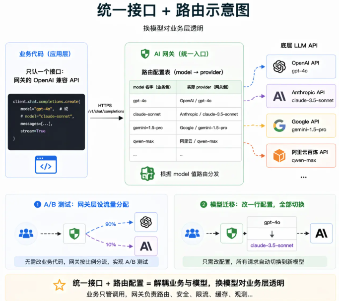

* 统一路由：把直连模型的 url 改为网关地址
* 虚拟 api key：把 api key 换成网关分配的虚拟 api key
* 负载均衡：网关处理调用模型 API 时出现的故障；多活策略
* 限流和配额：给团队虚拟 key 设置独立的预算，防止其他团队的额度被误伤
* 成本追踪和可观测性：网关集中记录每次调用的 token 用量、响应时间、错误率等数据，为成本优化提供基础
* Prompt 安全和内容过滤：统一输入输出安全校验，如检测 prompt 注入攻击、过滤个人隐私信息、内容安全审核等
* 语义缓存：把用户问题先转换成一个向量，在向量数据库里做相似度搜索，如果找到一个指纹很接近的历史问题，就直接把那次的答案返回，**完全跳过 LLM 调用。**
  * 缓存需要配置好触发阈值和缓存时间，需要结合具体业务
