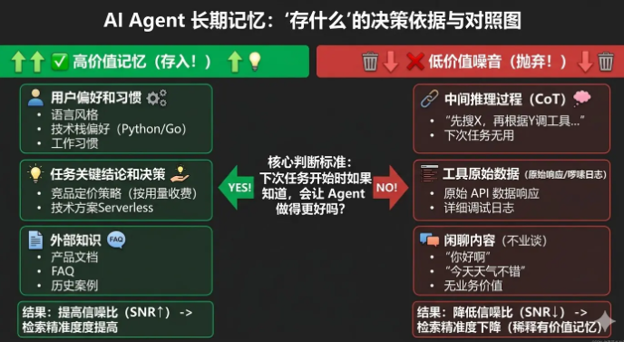
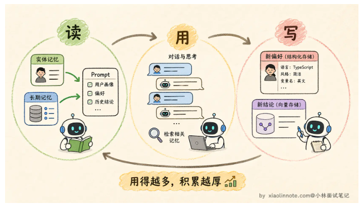

# 记忆机制

记忆，是 Agent 从单次问答工具变成真正助手的关键分水岭。有了记忆，它才能积累对你的了解，才能在多步任务中保持连贯，才能跨任务沉淀知识。

## 记忆类型

| 类型     | 载体       | 容量     | 生命周期     | 访问方式 |
| -------- | ---------- | -------- | ------------ | -------- |
| 感知记忆 | 当前输入   | 极小     | 单次调用     | 即时访问 |
| 短期记忆 | 上下文窗口 | 窗口大小 | 一次任务会话 | 直接读取 |
| 长期记忆 | 向量数据库 | 无限     | 持久         | 语义检索 |
| 实体记忆 | 结构化存储 | 无限     | 持久         | 精确查询 |

### 感知记忆

最短暂的一层，就是当前这次调用的原始输入，处理完就消失，不会主动保留。存在的意义是提供一个接受外部信息的入口

### 短期记忆

上下文窗口的 messages 列表，维持着当前任务执行过程中的完整状态，包括用户输入、模型输出、工具调用结果等，只要任务还在进行，这些信息就都在。任务结束，记忆清空

### 长期记忆

跨任务保留的信息，存放在外部数据库中，通常是**向量数据库**。任务结束后信息不会消失，会在下次需要时检索拿回来用。长期记忆的关键技术是**向量数据库的语义检索**

* **情节记忆：** 存放具体的事件经历。当 Agent 遇到类似的新任务时，可以检索出历史上的相似经历，避免重复踩坑
* **语义记忆：** 存放多次经历中提炼出来的通用知识和规律。语义记忆的信息密度更高，检索时也更容易命中，因为它直接存储的就是结论而不是过程。
* **程序记忆：** 存放做某件事情的操作流程。在处理重复性任务时特别有用，Agent 不需要每次都从头推理，直接调出对应的 SOP 执行就行

检索时可以根据当前需求精准地去对应类型的库里查，语义记忆查”是什么“，情节记忆查”之前如何处理类似情况“，程序记忆查“处理流程是什么”

### 实体记忆

比长期记忆更精炼，它不是存原文，而是把**对话中出现的关键实体和事实主动提取出来**，存成结构化字段。信息密度高，查询快（精确查询），而且不受原始表述方式影响。

## 工程问题

### 存储哪些记忆

核心判断标准：这条信息，下次任务开始时如果知道，会让 Agent 做得更好吗？

值得存储的：用户偏好和习惯（语言风格、技术栈偏好、工作习惯）、任务执行中产生的关键结论和决策、外部知识等

不值得存储的：中间推理过程、工具返回的原始日志数据

### 如何存储

| 信息                                               | 检索方式   | 存储介质            |
| -------------------------------------------------- | ---------- | ------------------- |
| 文档知识、对话摘要等非结构化的文本                 | 语义检索   | 向量数据库          |
| 结构化的用户偏好和状态字段（语言偏好、项目配置等） | 精确查询   | 关系数据库/KV数据库 |
| 整段文档或知识库                                   | RAG 做召回 | 向量数据库          |

### 何时读取记忆

* 主动检索：在任务开始前，用当前任务的描述去检索相关记忆，把结果注入 system prompt 作为背景知识
* 被动触发：Agent 在推理过程中，判断当前步骤需要某类特定知识时，主动发起检索（把查询记忆封装成一个Tool，由Agent决定什么时候调用）
* 两种结合：session 开始时做一次主动检索，把关于用户偏好和背景的记忆加载进 system prompt；任务执行过程中，遇到需要专业知识或历史数据的步骤，再让 Agent 按需检索

## 上下文窗口管理（记忆压缩）

背景：短期记忆存储在上下文窗口，但是它是有上限的，面对复杂多步任务，可能会超过范围，导致新的内容无法写入

* **滑动窗口：** 只保留最近 N 轮对话，更早的直接丢弃

  * 优点：实现简单，没有额外开销
  * 缺点：早期重要信息可能被丢失，比如一开始定下的约束规范
* **摘要压缩：** 当历史长度接近上限时，用 LLM 把早期的对话历史压缩成一段摘要，替换掉原始的冗长历史（层级式摘要：最近n条信息保持原文，前面的n+m条信息压缩为中期摘要，再后面的压缩为更精炼的摘要）

  * 优点：关键信息得到保留
  * 缺点：压缩过程本身会丢失细节，而且需要额外的 LLM 调用来做摘要
* **重要性过滤：** 给每条对话记录打一个重要性分数，低于阈值的淘汰，高分的保留（关键词打分/LLM打分）

  * 优点：重要性息得到保留
  * 缺点：关键词打分比较粗糙，LLM 打分需要额外的消耗
* **下沉到长期记忆：** 执行过程中产生的中间结果，如果当前步骤不需要但后面可能用到，就先存到向量数据库里，从上下文窗口中移除，等后面某步需要时再检索回来

  * 优点：细节不容易被丢失
  * 缺点：需要额外的 LLM 调用；存储和加载长期记忆需要额外的时间
* **结构化抽取：**将不规则规划文本，转化为结构化的信息

  * 优点：信息损失小，理论上只要字段设计合适，所有重要信息都能被保留，不会丢失精度
  * 缺点：开发成本高，需要设计字段，对业务理解要求高，通用性较低
* **Mem0：** 把记忆管理做成一个独立的服务层，调用 `memory.add()` 存记忆、`memory.search()` 查记忆，无需关注底层

  * 优点：适合个性化记忆场景，不同用户记忆互不干扰
* **Letta：** 将 Agent 记忆，像 OS 一样分为三级

  * Core Memory 是始终留在窗口里的核心信息（比如用户画像、当前任务目标），类似于主存
  * Recall Memory 是最近的对话历史，类似于缓存，按时间顺序存储
  * Archival Memory 是长期归档的知识，类似于磁盘，容量无限但检索需要主动发起
  * 让 Agent 自己通过工具调用来管理这三层记忆，由 Agent 决定什么时候将信息下沉，什么时候检索旧的对话记录
* **Zep：** 引入时间感知，给记忆标注有效时间窗口，通过时序知识图谱管理记忆周期，自动识别过时记忆

## 知识图谱

背景：向量数据库的信息是独立存储的，信息之间没有关联；但有时候需要关联信息才能得到答案，纯向量检索不一定能得到

知识图谱通过**实体 -> 关系 -> 实体（主语 - 谓语 - 宾语）** 的三元组结构来存储信息，比如：

* 用户 A -> 担任 CTO -> 公司 B
* 公司 B -> 主营业务 -> 云计算
* 公司 B -> 成立于 -> 2015 年

向量数据库负责处理模糊的语义检索，知识图谱负责处理精确的关系推理，两者互补

实例：对话过程中用 LLM 自动提取出实体和关系，存入知识图谱。检索时先用向量检索拿到一批候选记忆，再用知识图谱补充关联信息，最后把两部分结果合并后注入 context

## 记忆整合

背景：Agent 用久了之后，长期记忆里会积累大量的碎片化信息。有些内容重复，有些已经过时，有些甚至互相矛盾。如果不做整理，检索时噪音越来越大，有用的记忆被淹没在无用的碎片里。

* **去重：** 把语义相近的多条记忆合并成一条更完整的版本
* **冲突消解：** 当两条记忆互相矛盾时，保留时间更新的那条，标记旧的为过期
* **抽象提炼：** 把情节记忆转化为语义记忆，从具体经历中蒸馏出规律

