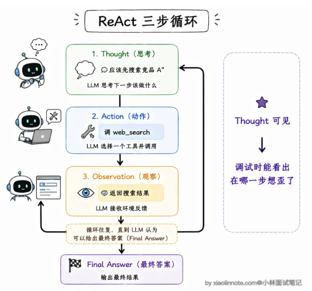
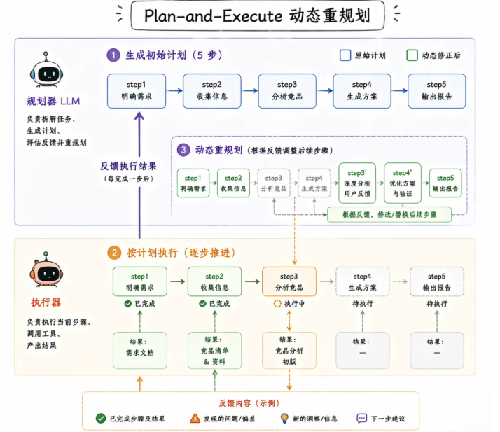
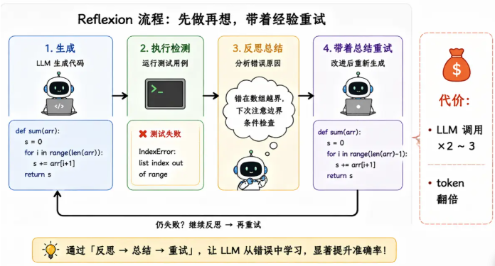
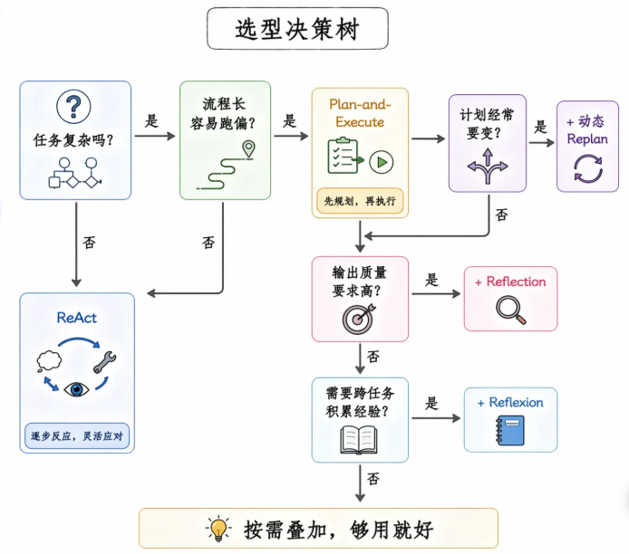
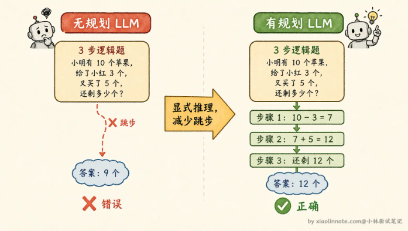
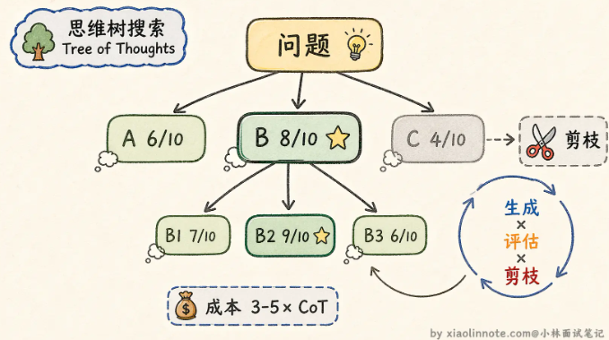
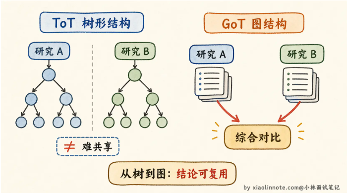

# 设计范式和推理模式区别

| 概念                 | 推理模式                                                            | 设计范式                                                                         |
| -------------------- | ------------------------------------------------------------------- | -------------------------------------------------------------------------------- |
| **驱动核心**   | 大模型的**Token 预测与注意力机制** 。                         | 外部的`while`循环、状态机（如 LangGraph）和代码解析                            |
| **状态维持**   | 依赖大模型的**Context Window（上下文窗口）** 。               | 依赖外部的**Database / State 管理** （即使清除模型记忆，外部状态依然在）。 |
| **错误容忍度** | 较低。模型一旦开始胡言乱语（Hallucination），单次生成很难自我纠正。 | 较高。外部代码可以捕获异常，清空错误上下文，让模型“重启”这一步。               |
| **典型代表**   | 让 ChatGPT “一步步思考并调用工具”。                               | 用 LangGraph 搭建一个包含 Planner、Solver、Reflector 的复杂工作流。              |

# 设计范式

## ReAct

Reasoning + Acting。交替进行推理和执行，每一轮循环包括以下三步：

* Thought 思考：LLM 先把当前的情况分析一遍，把推理过程写出来**（在这里判断是否结束行动）**
* Action 阶段：LLM 根据思考的结论决定调用哪个工具、传什么参数
* Observation 阶段：工具返回的结果被反馈给 LLM，它读取这个结果，然后进入下一轮 Thought

优点：流程固定，Thought 内容可见，方便调试

缺点：走一步看一步，可能迷失方向

* ReAct 容易遇到的坑：本质都是因为没有回头检查的机制
  * 循环漂移：容易走偏
  * 错误传播前一步错误，后面的推理都会被带偏

## Plan-and-Execute

**把规划和执行彻底分开，先让一个 LLM 专门做规划**，输出一个完整的步骤列表，然后由另一个 LLM（或同一个模型以不同角色）逐步执行。规划和执行是两个模块，可以使用强模型规划，弱模型执行，减少 token 成本

注意：这个范式的机制是动态重规划，并非在列出任务列表后就开始死板执行，它会把每一步的结果反馈给规划器，规划器会判断执行结果和预期是否一致，后续计划是否还适用，是否需要调整等

优点：既保持了全局视野，又不会因为死板而失效

缺点：多了规划和重规划的 LLM 调用，延迟和成本增加；如果一开始就规划错误，后续再怎么调整也没用

## Reflection/Reflexion

在前两种范式的基础上加了一层质量保障：在 Agent 完成一步或者完成整个任务之后，再让一个 LLM 判断做得好不好、结果是否符合预期。如果评估不通过，就重试或者换一种策略。

变体 Reflexion：不止生成评判结果，还会生成反思总结，记录这次失败的原因和改进建议

优点：显著提升输出质量，尤其是代码生成、文案写作这类

缺点：需要额外产生反思环节，成本和耗时增加

## 动态 Replan

在 Plan-and-Execute 的基础上，在每个步骤执行完之后，把当前结果和剩余计划一起交给规划模块，让它判断「原来的计划还合理吗，需不需要调整」

优点：保留了先规划再执行的结构优势

缺点：多了重新评估的 LLM 调用

## 选型

混合用法：规划阶段用 Plan-and-Execute 定好全局计划、每一步执行用 ReAct、最后对整体做 Reflection 检查质量

# 推理模式

LLM 的工作原理，是根据你给它的输入，一个 token 一个 token 地往后预测，中间的推导步骤都是隐式的

推理模式存在的原因：让 LLM 把隐式的思考过程显式化出来，从而减少多步推理中的累积误差

## CoT

Chain of Thought（思维链）让模型**把思考过程写出来**，而不是直接输出最终答案。

两种触发方式：

* Zero-shot：直接在 prompt 后面加上一句“让我们一步步思考”，LLM 会自己展开推理
  * 优点：简单，0成本，即插即用
  * 缺点：推理格式和深度完全依靠 LLM 自己发挥，不稳定
* Few-shot：在 prompt 中带几个有完整推理过程的例子，让 LLM 照这个格式推理
  * 优点：效果稳定，适合格式固定的场景
  * 缺点：需要提前准备高质量示例，且示例占用 token、

## ToT

Tree of Thought（思维树），针对的是 CoT 一旦走错就全错的问题。

让 LLM **同时探索多条推理路径，边探索边剪枝，最终选出最优路径**

* 生成多个候选思路
* 评估思路可行性
* 选择最优的进行深入、剪枝差的思路，进入下一层
* 反复推理直到得出最终答案

* 优点：拥有了纠正和回头的能力
* 缺点：需要多次 LLM 调用，成本大幅增加

## GoT

Graph of Thought（思维图）

ToT 的不同分支之间是独立的，两条推理路径的结果无法复用，GoT 把推理结构换成了图，允许不同路径的中间结果合并、复用，推理节点可以接收来自多个前置节点的输出作为输入

* 优点：推理模式更为丰富，更接近人类处理任务的思考方式
* 缺点：落地复杂度高，目前主要用于学术研究

## ReAct

见上文

## Plan-and-Execute

见上文
