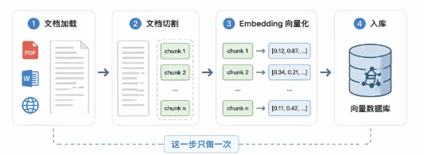
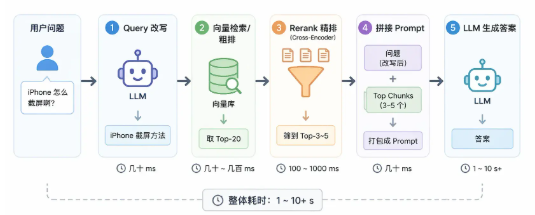

# 基础概念

## 背景

LLM 在训练完后，知识就不会再更新，不会知道训练数据截止日期之后的事情

微调理论可行，但成本太高。RAG 采用外部知识库的形式替代

RAG 的优点：

* 知识热更新：更新知识只需要添加新的文档，成本低
* 答案有溯源：回答能够溯源到文档，可解释性比纯 LLM 生成强

## 工作流程

### 离线

* 文档加载：读取原始数据
* 文档切割：将文档切为小块
  * 模型输入长度有限制，无法一次输入完整文档
  * 将整篇文档压缩为一个向量，细节信息会被平均，影响检索效果
* 向量化：将一段文字转为一个高维向量
* 入库：把每块文本和向量存进向量数据库

### 在线

* 查询改写：将用户口语化的提问改写为适合检索的形式
* 向量检索粗排：将用户问题转为向量，去向量库中做相似度搜索，找出距离最近的 topK 文本块（速度极快）
* Rerank 精排序：把用户问题和候选文本块拼在一起，深度理解其相关性，然后重新排序
* 生成：把用户问题 + 精排后的文本块拼成 prompt，交给 LLM 生成最终回复

## 主要解决的问题

* 原有 LLM 存在的问题
  * 知识过期：超过训练数据截至日期的信息，LLM 不知道
  * 知识私有：企业私有知识库，LLM 不知道，没有被训练过
  * 知识缺失（幻觉）：LLM 核心机制是预测下一个词，训练机制就倾向一直生成内容。知识不够时，就会把不相关的内容拼凑起来，导致幻觉

## RAG VS 微调

| 维度                 | 微调                       | RAG                           |
| -------------------- | -------------------------- | ----------------------------- |
| **知识更新**   | 需要重新训练，成本高       | 更新知识库即可，实时生效      |
| **推理延迟**   | 低，无额外检索步骤         | 较高，多一次检索耗时          |
| **实现成本**   | 高，需要 GPU 和标注数据    | 低，向量库 + Embedding 即可   |
| **答案可溯源** | 不支持，来自模型参数       | 支持，可追溯到具体 chunk      |
| **适合场景**   | 定制输出风格、深度专业能力 | 私有知识问答、动态更新数据    |
| **知识上限**   | 受限于训练数据质量和规模   | 受限于检索质量和 context 长度 |

微调的优点：

* 用新数据训练，模型学习效果好，能深度定制需求
* 推理时无需检索，延迟响应低

微调的缺点：

* 成本高：需要标注数据、GPU、消耗训练时间
* 更新滞后：业务数据频繁变化，不可能频繁微调
* 信息不透明：模型的回答来自参数，不知道原始参考信息是什么，出错难定位

RAG 的优点：

* 成本低
* 更新灵活
* 方便溯源

RAG 的缺点：

* 延迟增加：多了检索步骤，整体响应延迟会增加
* 检索质量上限：LLM 只能回答检索到的知识，能力上限取决于检索上限（因此RAG调优主要都是围绕检索优化）
* 复杂推理能力：RAG 只提供资料，并不能直接增加模型推理能力
