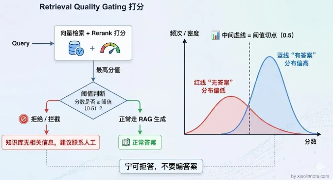
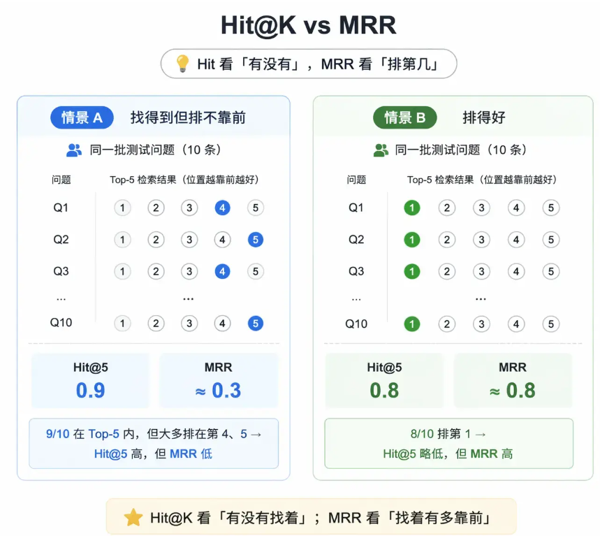
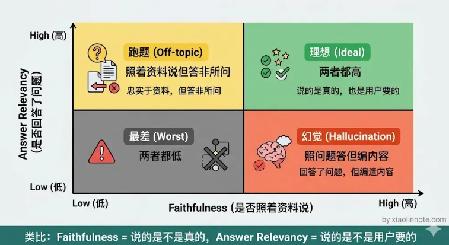
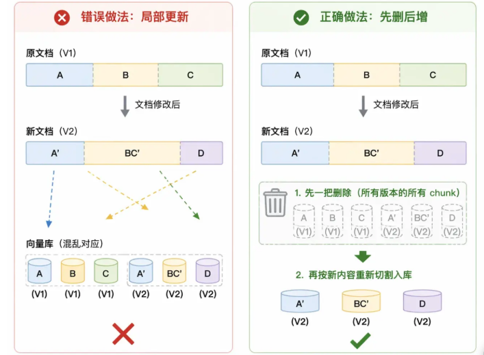

# 工程实践

## 幻觉避免

RAG 主要存在的幻觉：

* 检索层没有找到相关信息，LLM 自己编造答案
* 检索层找到了关键信息，但是 LLM 没有严格遵循

### Prompt 约束

```
回答规则：

1.只能使用【参考资料】中的信息来回答，不得引入资料之外的知识
2.如果参考资料中没有足够信息，必须明确回答：「根据现有资料，无法回答该问题」
3.回答时标注信息来源（来自哪条参考资料）
4.不要推断、不要猜测、不要补充资料中没有明确说明的内容
```

能够避免 LLM 不遵守信息的问题，但是没有解决检索不到的问题

### 检索质量差，拒绝回答

对检索结果用 rerank 打分，如果最高分低于阈值，则拒绝回答



### 检查答案是否凭空捏造

LLM 生成完答案，回头检查答案里的每一条关键信息，在 chunk 里有没有对应的依据。没有依据的内容，标注「无法核实」或者直接删掉。

多一次 LLM 调用，一般只用在对准确性要求极高的场景，比如法律、医疗等

### 强制 LLM 输出时带上来源

让 LLM 输出结构化的 JSON，每个结论都必须填写来自哪条参考资料的编号

```JSON
{
    "answer": "完整回答",
    "statements": [
        {"claim": "具体结论1", "source_ids": [1, 2]},
        {"claim": "具体结论2", "source_ids": [3]}
    ],
    "confidence": "high/medium/low"
}
```

### 关键业务禁用自由生成，仅做结构化抽取

* 高风险、高精准的关键业务，放弃模型自由生成，改成**结构化抽取**，从根源杜绝幻觉
* 电商客服：提前定义模板（商品咨询、售后、订单查询的固定回复框架），模型只从商品库、订单库抽取价格、库存、订单状态等，填进模板，不允许自由发挥或添加额外内容
* 订单查询：只抽取订单号、付款状态、物流进度，按固定格式输出，禁止对订单信息延伸、编造，保证输出 100% 来自库表
* 幻觉压下去的同时，回答更稳、口径更一致，也更好满足合规要求

## RAG 回答质量评估


### 检索层评估

* Hit@K：Top K 检索结果中命中文档的概率。一般 Hit@5 低于 0.7 就说明检索层有问题，大于 0.8 一般说明检索没问题，问题在生成层
* MRR：计算文档在 Top K 中的位次，计算公式为 `1/排名` 然后求平均，越接近1效果越好 。



### 生成层评估

* **Faithfulness（忠实度）** ：答案里说的每件事，在检索到的 chunk 里有没有出处？衡量幻觉程度
  * 指标低说明 LLM 在编造，需要加强 Prompt 约束，添加引用检查
* **Answer Relevancy（答案相关性）** ：答案有没有回答用户问的那个问题？
  * 指标低说明跑题，需要优化 Prompt，明确指令
* **Context Recall（上下文召回率）** ：要回答这个问题，所需要的信息有多少比例在检索结果里覆盖到了？
  * 指标低说明检索层没有找到正确内容，需要调整 chunking 策略、更换 embedding 模型、添加多路召回补充检索
* **Context Precision（上下文精确率）** ：衡量的是检索结果里「有用的内容」排名是否靠前。
  * 指标低说明把相关和不相关内容都检索到了，需要加强 Rerank 模型，提高精排阈值或者降低给 LLM 的 chunk 数量



### 线上指标评估

* 点踩率：用户对回答不满意
* 追问率：用户没有一次获取他需要的内容
* 转人工率：LLM 检索不到相关信息，放弃回答
* 空回答率：同上

## 动态更新

* 新增：分割 —— 向量化 —— 存入
* 删除：删除 chunk
* 修改：关系型数据库每一条记录都是独立的。但是 RAG 知识库中一个文档会被分为多个 chunk，不能只更新这一个chunk。正确做法是**先删掉旧文档对应的所有 chunk，再重新切割入库**



### 如何确定文档是否变化

**内容 hash** 。每次文档入库时，计算文档内容的 MD5 或 SHA256 摘要，把这个 hash 值和文档 ID、对应的 chunk ID 列表一起存下来

感知文档变化：

* 轮询：系统按固定事件扫描全部文档，对比 hash 值。实现简单，但是很多文档不一定频繁更新，全量扫描开销较大
* 事件：文档变更时，主动发出一条消息，知识库收到消息后处理文档变化。延迟低，但需要依赖其他组件
