# 检索优化

## 向量检索和关键词检索

### 关键词检索

**倒排索引，**不是记录每个文章有哪些词，而是记录每个词出现在哪些文章里面。检索时取交集

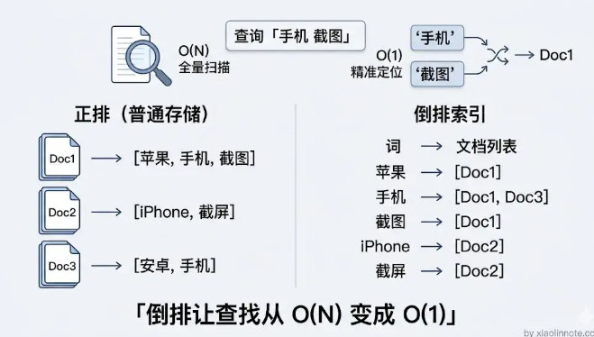

检索打分：TF-IDF 机制，TF 为词频，IDF 为词的稀缺度（防止通用词占据过高分数）

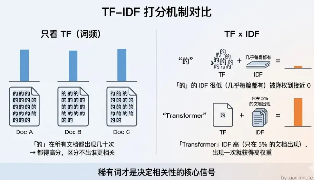

优点：对精确词汇命中率极高

缺点：无法理解同义词，比如苹果手机和iPhone

### 向量检索

向量化——ANN

优点：语义理解能力强，能跨越同义词障碍

缺点：对精确词汇不敏感，比如专有名词

### 混合检索

同时（并行）跑向量检索和 BM25，各自召回一批候选，然后用 RRF 算法合并结果

RRF 算法只看排名不看分数（不同检索方式的分数无法对比）

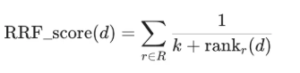

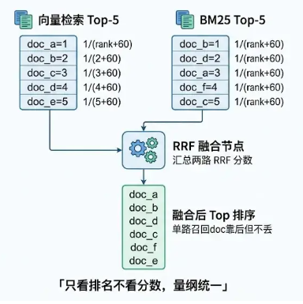

```Python
def reciprocal_rank_fusion(results_list, k=60):
    """
    results_list: 多路检索结果，每路是一个 [doc_id, ...] 的有序列表
    k: 平滑参数，防止排名第 1 的文档权重过大，通常取 60
    """
    scores = {}
    for results in results_list:
        for rank, doc_id in enumerate(results):
            if doc_id not in scores:
                scores[doc_id] = 0
            # 排名越靠前（rank 越小），倒数越大
            scores[doc_id] += 1 / (rank + k)
    # 按总分降序排列，取 Top-K
    return sorted(scores.items(), key=lambda x: x[1], reverse=True)

# 使用示例
vector_results = ["doc_a", "doc_b", "doc_c"]   # 向量检索的排序结果
bm25_results   = ["doc_b", "doc_d", "doc_a"]   # BM25 的排序结果

merged = reciprocal_rank_fusion([vector_results, bm25_results])
# doc_b 两路都高排，doc_a 也两路命中，会排在前面
```

## 优化用户输入提问（Query Write）

### 直接改写

改写模板（示例）

```
请将用户的问题改写成更适合知识库检索的表述。
要求：去掉口语化表达、补全缩写和指代、使用更正式的书面语、保留核心意图。

对话历史：{最近几轮对话}
用户问题：{原始问题}

只输出改写后的问题，不要解释：
```

优点：解决口语化和指代不清的问题

缺点：无法跨越疑问句（用户提问）和陈述句（知识库文档）的距离

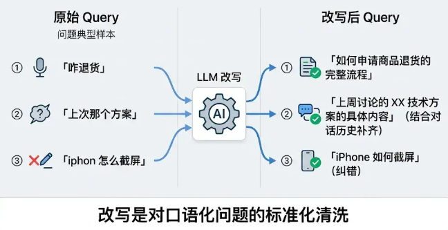

### HyDE9（预测答案）

**先描绘出答案可能长什么样子，再去找长得像它的文档** 。假设答案不需要准确，只需要「风格像文档」就够了，它的作用是充当一个向量上更好的「检索代理」

```
请根据以下问题，生成一段可能的答案。
注意：不需要完全准确，只需要用于辅助检索，风格尽量像知识库文档。

问题：{用户问题}
假设答案：
```

优点：解决了句式差异的问题

缺点：用户问题太具体，知识库没有直接对应的答案，但有相关背景文档可以推出的情况，不太能找到

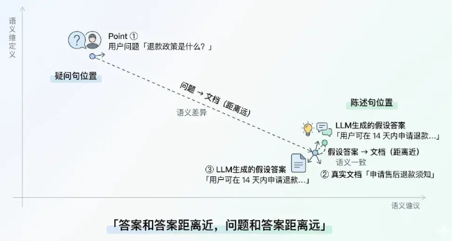

### 后退提问（Step-back Prompting）

将问题后退一步，提升到更抽象的层次，检索背景知识，再根据背景知识回答问题

```
请将以下具体问题转化为一个更通用的背景问题，用于检索相关背景知识。

具体问题：{原始问题}
背景问题：
```

优点：能够命中更多通用背景文档，让 LLM 生成有原理支撑的答案

缺点：如果用户问题本身就比较窄，覆盖的文档不够

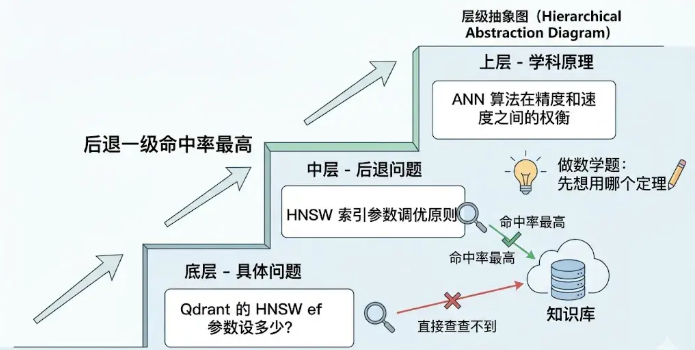

### 多 Query 扩展

将用户原始问题改写成3-5个不同角度的版本，分别去检索

优点：扩大检索范围

缺点：LLM 调用增加

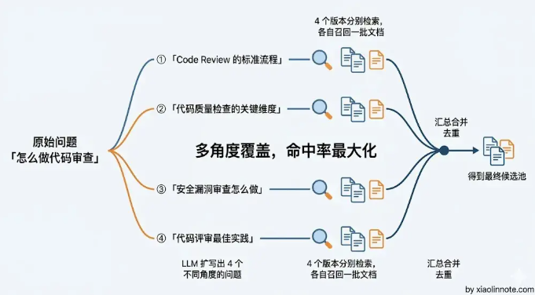

## 多路召回

**同时用多种不同的检索方式去捞候选内容，然后合并排序，而不是只靠单一的向量检索。**

* 向量检索：负责语义层面的覆盖，处理同义词、近义词、不同表达方式
* BM25 关键词检索：负责精确词匹配，专门处理产品型号、专有名词、数字这类向量检索搞不定的场景
* 多 Query 扩展：把用户问题改写成多个不同角度的版本，覆盖更多表述差异

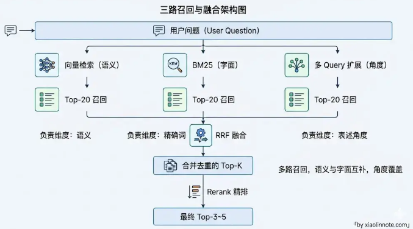

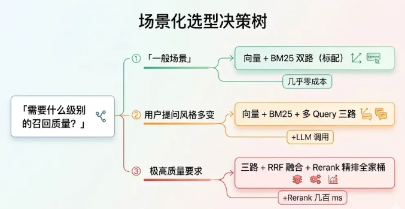

## RAG 检索优化

典型的生产级搭配： **Parent-Child 索引 + 向量 BM25 多路召回 + Rerank 精排** 。

### 索引优化

核心问题：**检索用的粒度和 LLM 读的粒度天然是矛盾的** 。一个 chunk 既要保持检索的精确性，需要聚焦语义；又需要让 LLM 能够理解背景，需要有完整的上下文。这两个任务是矛盾的。小 chunk 检索准但内容太碎，大 chunk 内容完整但检索时语义稀释。

优化方向：Small-to-Big。**小块检索、大块使用**：

* 父子 chunk：把文档切成粗细粒度两个版本了，每个子 chunk 通过 parent_id 关联到对应的父 chunk。入库时只给子 chunk 建向量索引
* 摘要索引：让 LLM 为每一段内容生成一段摘要，用摘要来建向量索引
* 多粒度分层索引：同时建章节级、段落级、句子级三层索引。不同类型的问题适合不同粒度

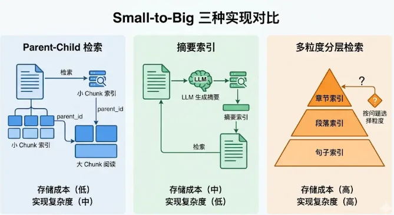

### 查询优化

详见“优化用户输入提问”章节

* Query 改写
* HyDE 假设答案
* Step-back 后退提问
* 多 Query 扩展

### 召回优化

详见“多路召回”章节

### 重排优化

多路召回后可能有20-30个chunk，可能存在不相关内容，不能全部输入给 LLM（token 成本高+上下文太长被稀释）

精排序从 20-30 个 chunk 里面挑出最相关的 3-5 个

* 向量检索（粗排序）：使用 Bi-encoder 结构，query 和 chunk 独立编码为向量，检索速度极快，但是二者是分开编码的，无法判断具体词语的关联
* Rerank（精排序）：Cross-encoder 结构，把 query + chunk 作为一堆输入，让模型判断他们的相关性。缺点是每一个chunk 都需要跑一次模型，不适合大规模排序

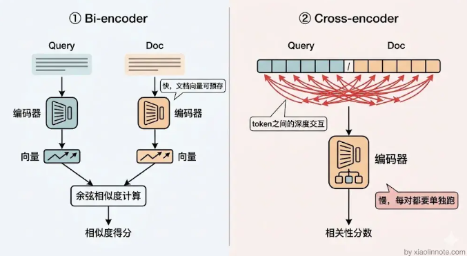

## RAG 范式

### 背景

普通 RAG 存在的问题：

* 检索质量参差不齐：用户提问方式不同，有的能一次检索到正确答案，有的完全检索不到相关内容。但系统都会把检索结果给 LLM。导致 LLM 在低质量上下文胡说八道
* 所有问题都走同一套流程，太死板：简单问题无需检索，复杂问题需要多轮检索
* 知识盲区：知识库里面可能没有相关答案，此时 LLM 可能会编答案或者乱说

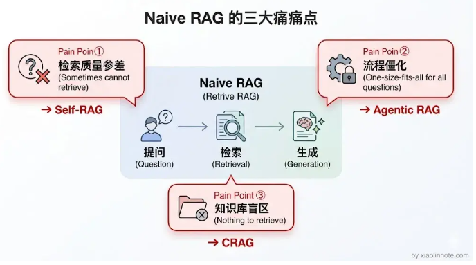

### 三代 RAG 演进

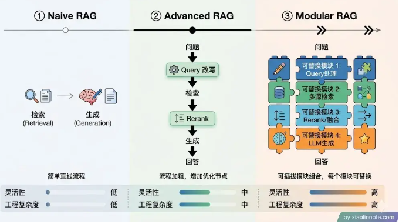

* **Native RAG：** 用户提问 -> 向量检索 -> 拼 prompt -> LLM 生成
* **Advanced RAG：** 检索前添加 Query 改写，检索后添加精排序和内容压缩。小的工程改动就可以有明显的效果提升
* **Modular RAG：** 把 RAG 的各个环节拆成可以独立替换的模块，像乐高一样按需组合，不同业务场景挑不同模块组合，灵活性大幅提升。

### 高级范式

#### Self-RAG

自主决定是否需要启动相关步骤：

* 判断是否需要检索
* 对召回 chunk 判断相关性
* 对生成答案进行打分，判断有无幻觉，对用户是否有用

不能使用通用 LLM 运行，需要专门训练微调

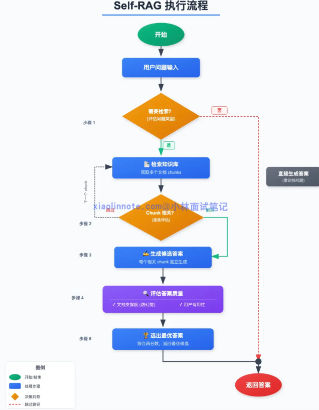

#### CARG

检索质量差时自动纠错：**如果检索到的内容质量高，正常走 RAG 流程；如果质量低，自动切换到网络搜索，用搜索结果代替知识库内容来回答问题；如果质量居中，把知识库结果和网络搜索结果都用上。**

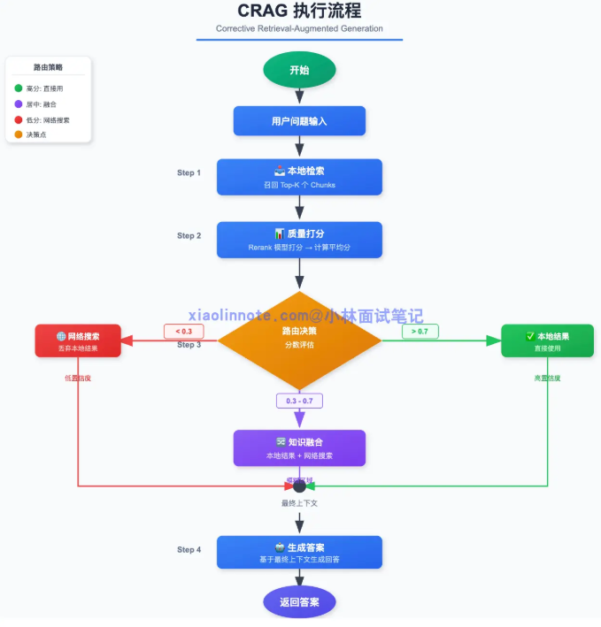

#### GraphRAG

单纯的向量检索只能找到局部信息，无法把散落在多处的知识串联起来。GraphRAG用于解决这个问题，其主要流程分为两步：

* 预处理：先用 LLM 从文档里抽取实体和关系，建成知识图谱，然后用社区发现算法对图谱中的实体做聚类，把紧密关联的实体分成一个个社区，再对每个社区生成一份 LLM 摘要，描述这个社区里的实体之间是什么关系、整体在讲什么。
* 检索：对于局部问题，可以直接在知识图谱中做查找；对于全局问题，用 Map-Reduce 的方式，先让 LLM 分别阅读各社区的摘要提取相关信息，再汇总生成最终答案

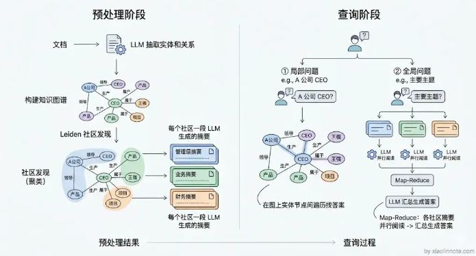

#### Agentic RAG

**把 RAG 嵌入 Agent 循环，LLM 可以自主决定：**要不要再检索一次、用什么关键词检索、检索结果是否足够、什么时候可以生成最终答案。

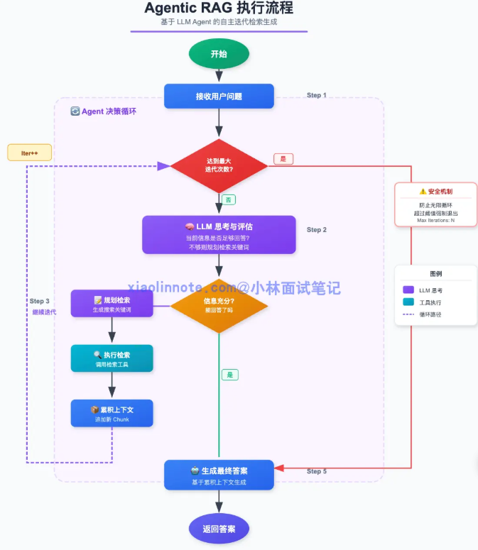

## 图数据库

### 向量检索局限性

向量检索每次只能找和问题直接相关的内容，没办法沿着实体之间的关系链往下追。

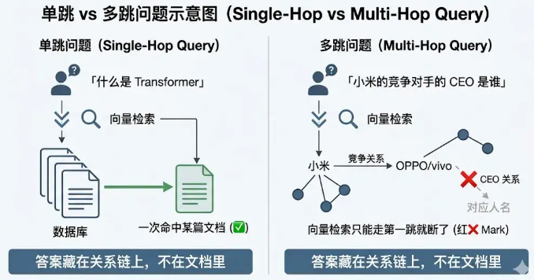

而这是图数据库的强项。图数据库存储实体（点）和关系（边），将信息表示为一个网

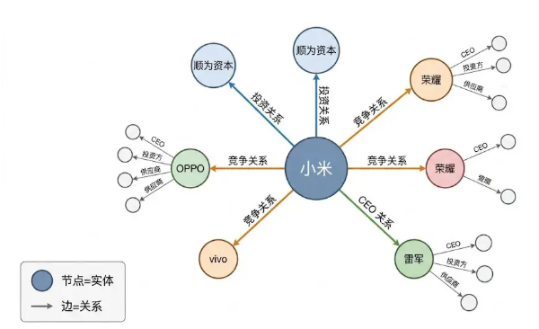

### 组合使用

向量检索为入口，先检索到相关文档的片段，识别出关键实体，定位到具体节点

图数据库做关系遍历，沿着关系将图中节点信息收集

把向量检索结果和图遍历结果合并，一起塞给 LLM 生成回答

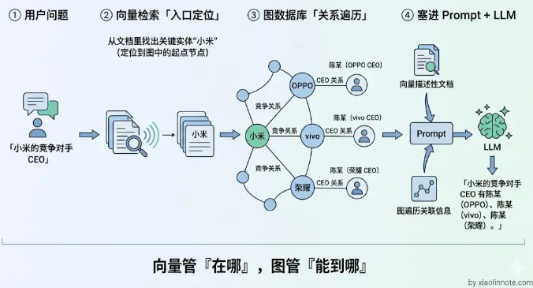

### 适合图数据库的情况

* 企业关系分析
* 医疗知识图片
* 代码知识库

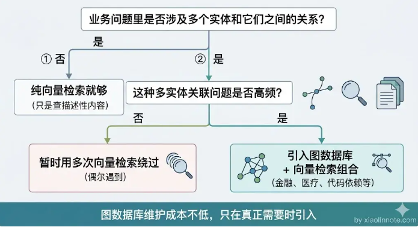
