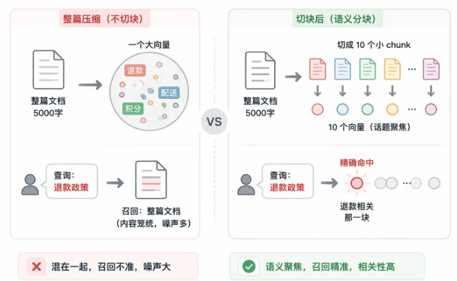
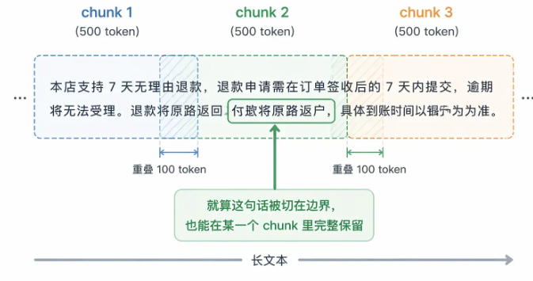
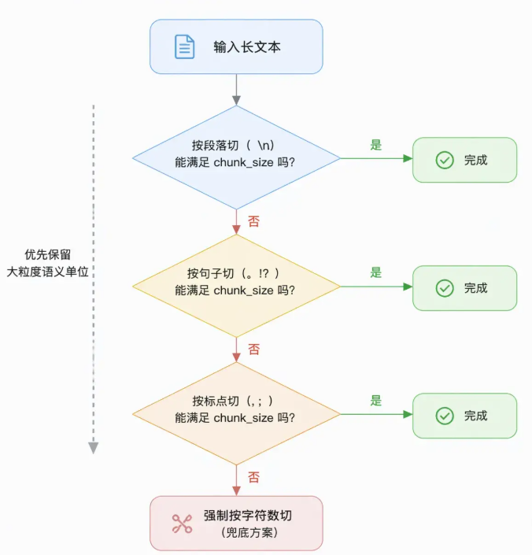
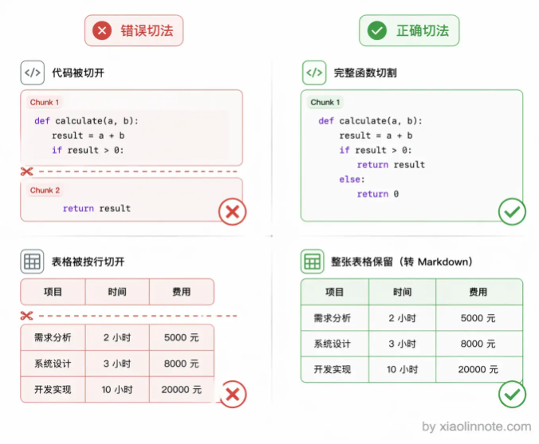
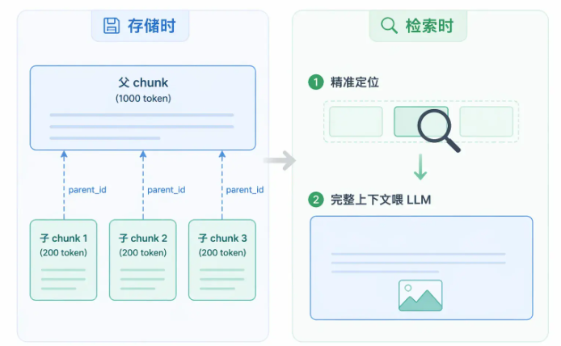
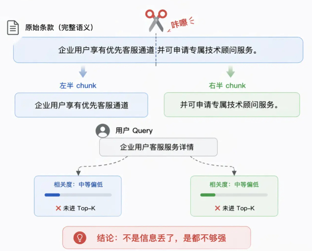
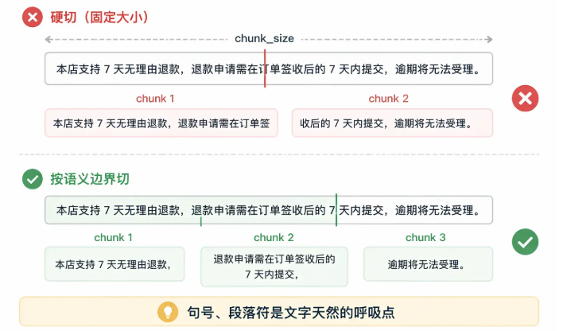

# 索引构建

## 文档存储

**原始文档不能直接存进向量库，必须先切成小块（chunk）再存，原因如下：**

* 向量模型有输入长度限制：一般最多几百到几千 token，一篇几千字的文档根本塞不进去
* 把整篇文章压缩成一个向量，细节信息会被「平均掉」，最终检索到的就是这篇笼统的文档，而不是精确的那段话

**一个 chunk 存储哪些信息：**

* 向量：原始文本向量化后的高维向量
* 原文：原始文本
* metadata：描述文档的基本信息。如：属于哪个文件、chunkId、page索引、chunk内容概括等

## 文档切割策略

| **策略**            | **适用文档类型** | **优点**                | **缺点**             |
| ------------------------- | ---------------------- | ----------------------------- | -------------------------- |
| **固定大小 + 重叠** | 纯文本、无明显结构     | 实现简单、chunk 大小可控      | 可能在语义中间截断         |
| **语义边界切割**    | 段落分明的文章         | 语义完整，召回质量好          | 实现稍复杂，chunk 大小不均 |
| **标题层级切割**    | Markdown、HTML 文档    | 天然语义独立，带结构 metadata | 依赖文档有清晰的标题结构   |
| **代码按函数切割**  | 代码文件               | 保留代码逻辑完整性            | 需要 AST 解析，限定语言    |
| **父子切割**        | 各类文档（追求高质量） | 检索精准 + 上下文完整两全     | 存储量翻倍，索引构建复杂   |
| **Late Chunking**   | 各类文档               | chunk 向量保留全文上下文      | 需要模型支持长输入         |

### 固定大小切割

按固定字符数或 token 数切割，不管语义边界在哪。**适合纯文本、没有明显结构的文档，最简单的保底选择。**

* 优点：实现简单，chunk 大小可控
* 缺点：可能会在句子中间被截断，破坏语义完整性

纯固定大小几乎不单独使用，通常会加上**重叠（overlap）** 来缓解边界截断问题。

### 语义边界切割

按文档的自然语义边界来切，比如段落、句子、标题层级。不要在语义中间截断，找到文字天然的「断点」再切。**适合有明确标题结构的 Markdown 或 HTML 文档**

实际操作时，常见的做法是维护一个分隔符优先级列表，先尝试按段落切，切出来太大再按句子切，还是太大再按标点切，以此类推，直到满足 chunk_size 限制。

### 特殊内容专项处理

对于特殊内容，比如表格、代码，需要专门处理。

代码应该以函数或者类为单位切割，表格应该整块保留

### 父子切割

存储时，同一段内容存两份。一份是细粒度的小 chunk，专门用于向量检索，小 chunk 语义聚焦，围绕一个小话题，检索精度高。另一份是包含这个小 chunk 前后上下文的大 chunk。**检索时用放大镜（小块，精准定位），返回时用全景图（大块，上下文完整）**

缺点：存储量翻倍，索引构建也更复杂，适合对召回质量要求非常高的情况

### Late Chunking

传统做法先分块再编码，这样的话跨chunk之间的上下文联系就丢失了。Late Chunking 是先编码再分块。先用支持长下上文的向量模型编码，然后再切块。

优点：能够保留块之间的联系

缺点：对向量化模型要求高，且计算式要保留中间结果，开销较大

## 语义切割问题

一段整体文本，在分块时被切分为两块，两块的信息密度都不够强，导致无法被检索，这段文本无效

### 重叠切割

兜底方案。相邻 chunk 之间存在一定内容重叠，如10%

只能保证跨边界的文字不丢失，解决不了一个完整语义被拆散」的根本问题。

### 按照语义边界切割

使用 NLP 工具识别句子结束位置，然后以句子为单位填充 chunk

### 句子窗口检索
