# 索引构建

## 文档存储

**原始文档不能直接存进向量库，必须先切成小块（chunk）再存，原因如下：**

* 向量模型有输入长度限制：一般最多几百到几千 token，一篇几千字的文档根本塞不进去
* 把整篇文章压缩成一个向量，细节信息会被「平均掉」，最终检索到的就是这篇笼统的文档，而不是精确的那段话

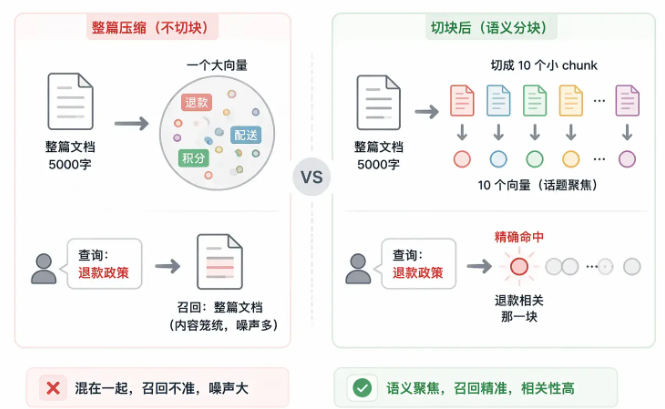

**一个 chunk 存储哪些信息：**

* 向量：原始文本向量化后的高维向量
* 原文：原始文本
* metadata：描述文档的基本信息。如：属于哪个文件、chunkId、page索引、chunk内容概括等

## 文档切割策略

| **策略**            | **适用文档类型** | **优点**                | **缺点**             |
| ------------------------- | ---------------------- | ----------------------------- | -------------------------- |
| **固定大小 + 重叠** | 纯文本、无明显结构     | 实现简单、chunk 大小可控      | 可能在语义中间截断         |
| **语义边界切割**    | 段落分明的文章         | 语义完整，召回质量好          | 实现稍复杂，chunk 大小不均 |
| **标题层级切割**    | Markdown、HTML 文档    | 天然语义独立，带结构 metadata | 依赖文档有清晰的标题结构   |
| **代码按函数切割**  | 代码文件               | 保留代码逻辑完整性            | 需要 AST 解析，限定语言    |
| **父子切割**        | 各类文档（追求高质量） | 检索精准 + 上下文完整两全     | 存储量翻倍，索引构建复杂   |
| **Late Chunking**   | 各类文档               | chunk 向量保留全文上下文      | 需要模型支持长输入         |

### 固定大小切割

按固定字符数或 token 数切割，不管语义边界在哪。**适合纯文本、没有明显结构的文档，最简单的保底选择。**

* 优点：实现简单，chunk 大小可控
* 缺点：可能会在句子中间被截断，破坏语义完整性

纯固定大小几乎不单独使用，通常会加上**重叠（overlap）** 来缓解边界截断问题。

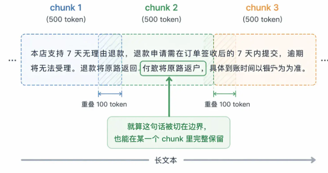

### 语义边界切割

按文档的自然语义边界来切，比如段落、句子、标题层级。不要在语义中间截断，找到文字天然的「断点」再切。**适合有明确标题结构的 Markdown 或 HTML 文档**

实际操作时，常见的做法是维护一个分隔符优先级列表，先尝试按段落切，切出来太大再按句子切，还是太大再按标点切，以此类推，直到满足 chunk_size 限制。

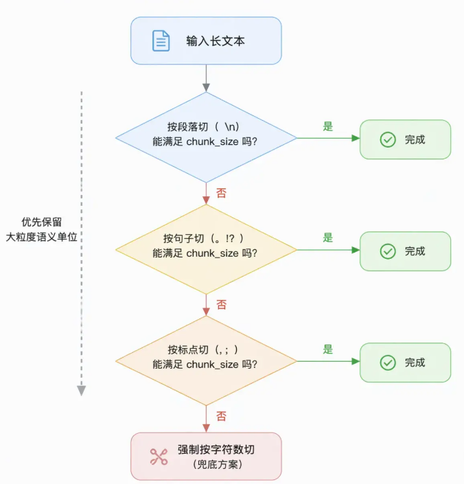

### 特殊内容专项处理

对于特殊内容，比如表格、代码，需要专门处理。

代码应该以函数或者类为单位切割，表格应该整块保留

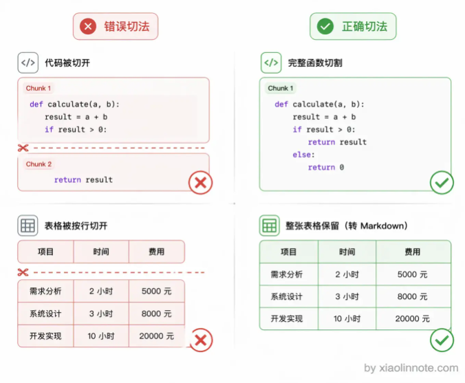

### 父子切割

存储时，同一段内容存两份。一份是细粒度的小 chunk，专门用于向量检索，小 chunk 语义聚焦，围绕一个小话题，检索精度高。另一份是包含这个小 chunk 前后上下文的大 chunk。**检索时用放大镜（小块，精准定位），返回时用全景图（大块，上下文完整）**

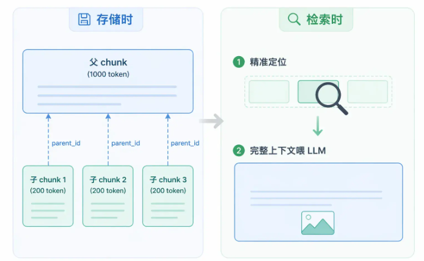

缺点：存储量翻倍，索引构建也更复杂，适合对召回质量要求非常高的情况

### Late Chunking

传统做法先分块再编码，这样的话跨chunk之间的上下文联系就丢失了。Late Chunking 是先编码再分块。先用支持长下上文的向量模型编码，然后再切块。

优点：能够保留块之间的联系

缺点：对向量化模型要求高，且计算式要保留中间结果，开销较大

## 语义切割问题

一段整体文本，在分块时被切分为两块，两块的信息密度都不够强，导致无法被检索，这段文本无效

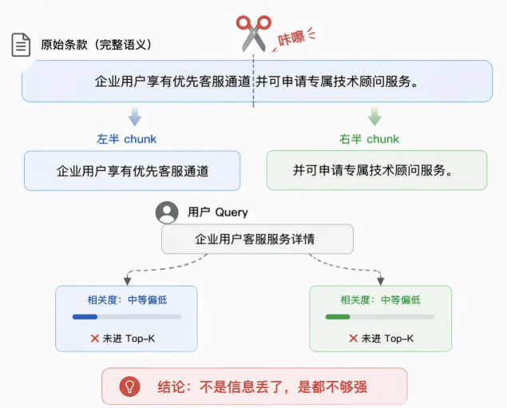

### 重叠切割

兜底方案。相邻 chunk 之间存在一定内容重叠，如10%

只能保证跨边界的文字不丢失，解决不了一个完整语义被拆散」的根本问题。

### 按照语义边界切割

使用 NLP 工具识别句子结束位置，然后以句子为单位填充 chunk

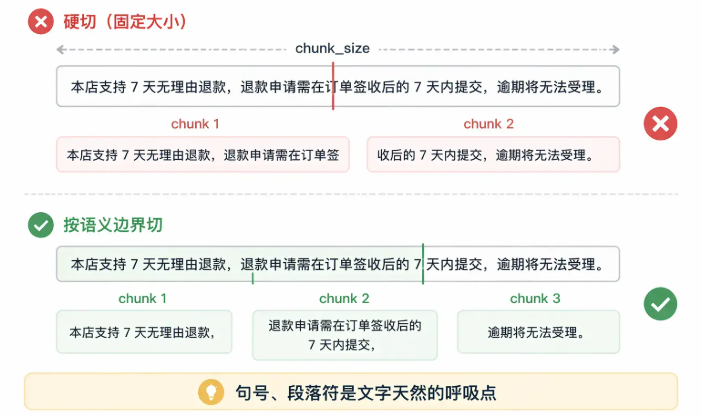

### 句子窗口检索

存储时句子单独做向量，但是在检索命中后，将整个句子前后N句话一起返回，形成上下文窗口。优点是检索粒度细，但LLM仍然能拿到完整背景

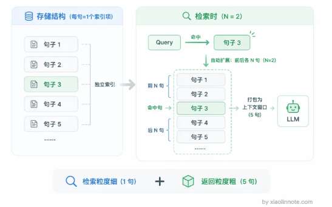

### 父子切割

类似于句子窗口，不过父子切割的父子文档是提前确定好的。相比来说，父子切割更灵活，句子窗口实现更简单（不用维护父子ID）

### 命题化切割

用 LLM 把文档分解成一条条独立的命题。每个命题本身就是完整的上下文，不依赖其他文本。质量最高成本也最高（需要LLM分割）

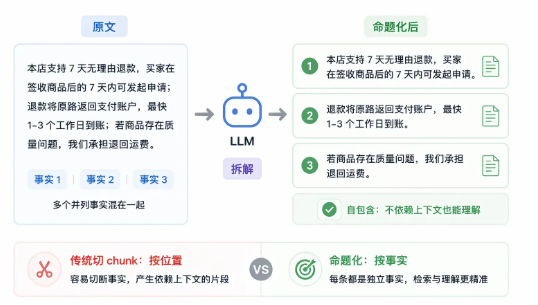

### Contextual Retrieval

在切分时，将完整文档和chunk内容输入给LLM，让LLM生成1-2句话，表示对这个chunk的描述。然后将生成的句子和原始chunk拼接在一起，作为需要向量化的chunk

## Embedding 模型

模型的工作是把一段自然语言文本映射成一个固定长度的浮点数向量，本质是语义压缩。**语义相近的文本，向量的余弦相似度高**。主要有以下几类模型：

* OpenAI text-embedding 系列：性价比高效果好、调用方便。缺点是非免费，有数据出境合规问题
* BEG 系列：开源、中文效果好、数据不出镜，支持多种检索模式
* 新一代模型：Qwen-Embedding（中文），Voyage-3-large（英文）等

选型技巧：

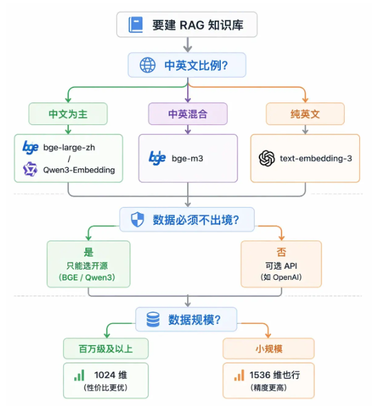

### 评估模型效果

根据自己的业务数据，准备数十到上百条问题+对应chunk的测试用例，分别用候选模型检索，检查 **Hit@K 指标** （Hit@5 = 0.8 含义是 80% 的问题，它对应的答案都出现在了检索结果的前 5 条里）Hit@5 小于 0.7 就要考虑换模型/改进chunking策略

### Embedding 算法

#### 静态词向量（Word2Vec / GloVe / FastText）

核心思路：用一个词周围的词来预测这个词，或者反过来用这个词来预测周围的词。通过大量文本训练，语义相近的词自然就会在向量空间里被推到一起。

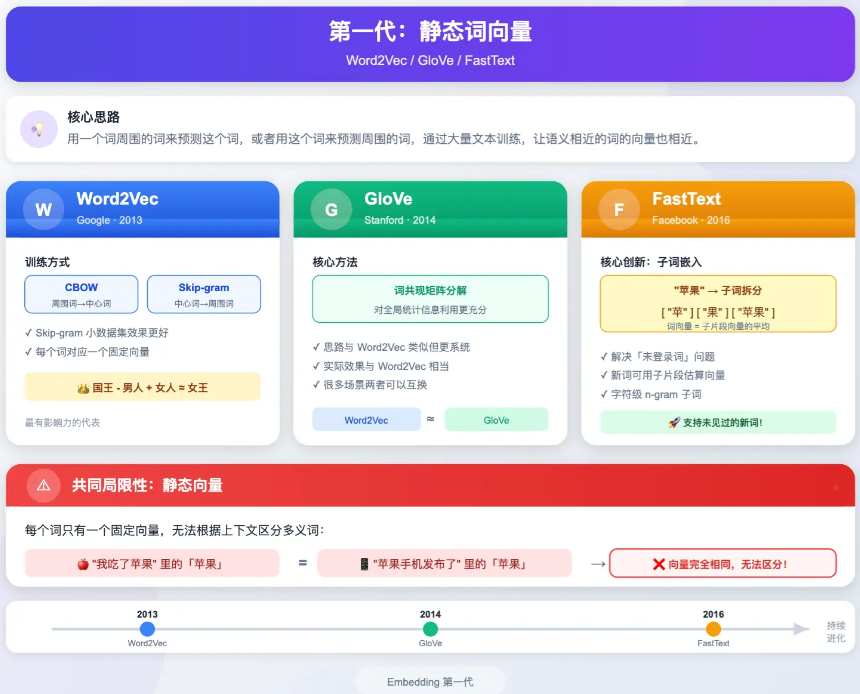

存在的问题：**每个词只有一个固定向量，无法处理多义词。** 比如吃苹果和苹果手机。这一代算法本质上只是记住哪些词容易一起出现，而没有真正理解语义

#### 上下文相关向量（ElMo / BERT）

改进方向：**让词的向量随上下文动态变化，同一个词在不同句子里有不同的向量表示**

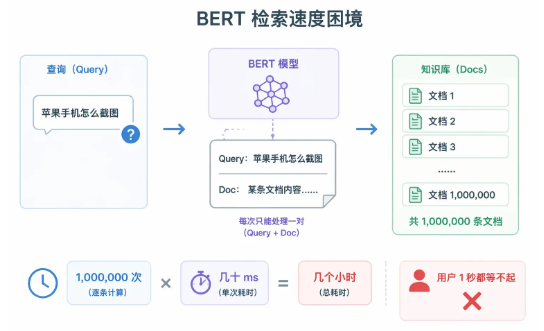

问题：速度慢。比较两个句子相似度，需要把两个句子给 BERT，百万级知识库，就是百万次比较，完全无法使用

#### 句子级对比学习 Embedding （SBERT / SimCSE / BGE）

改进方向：**让每个句子独立生成一个向量，然后直接用余弦相似度来比较。** 相比于二代算法精度略有下降，但是速度提升了好几个数量级

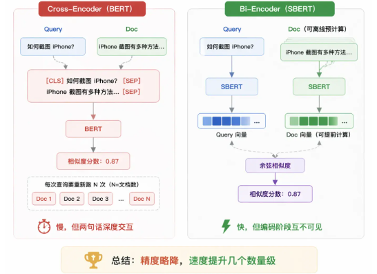

## 向量数据库

专用于存储和检索向量的数据库。其核心操作是 **近似最近邻搜索（ANN）** ：给一个查询向量，在库中找出和它最相似的 K 个向量，返回对应原始内容

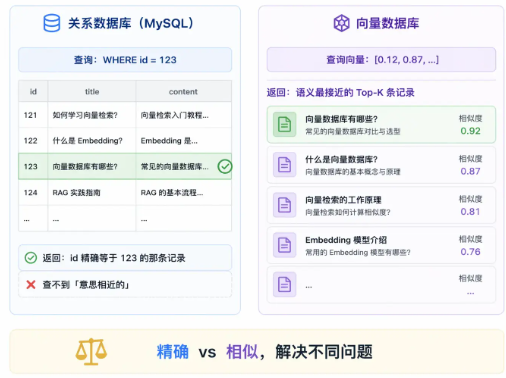

### 索引算法

#### HNSW

目前召回率最高的 ANN 算法之一。**构建一个多层图结构，查询时从最上层的稀疏图开始导航，逐层收窄范围，最终在底层找到最近邻。**类似于地图找餐厅，先找省、市、区，再找确定方向

优点：召回率高，查询速度快

缺点：构建索引时，内存消耗大

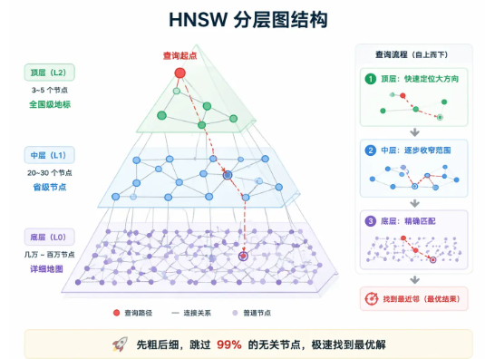

#### IVF

**先对向量做聚类，把相似的向量分进同一个桶里，查询时只查询最相关的几个桶，而非全量遍历**

优点：占用内存小，适合超大规模

缺点：精度比 HNSW 略低

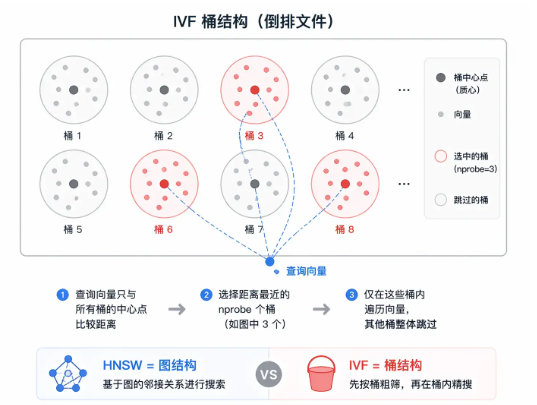

### 核心能力

* Metadata 过滤/混合检索：给向量添加metadata字段，检索时可以添加过滤条件
* 实时更新：RAG 的知识库经常需要新增、修改、删除文档，向量数据库需要支持增量更新
* 融合关键词检索：纯向量检索对一些精确词语（如专有名词）检索效果不好，有些向量数据库同时支持向量检索 + BM25 关键词检索，做混合召回效果更好
