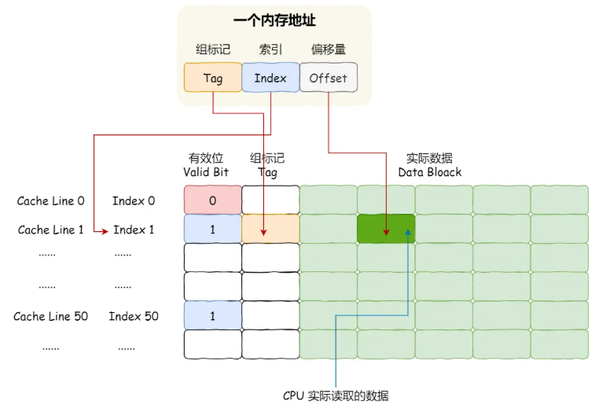
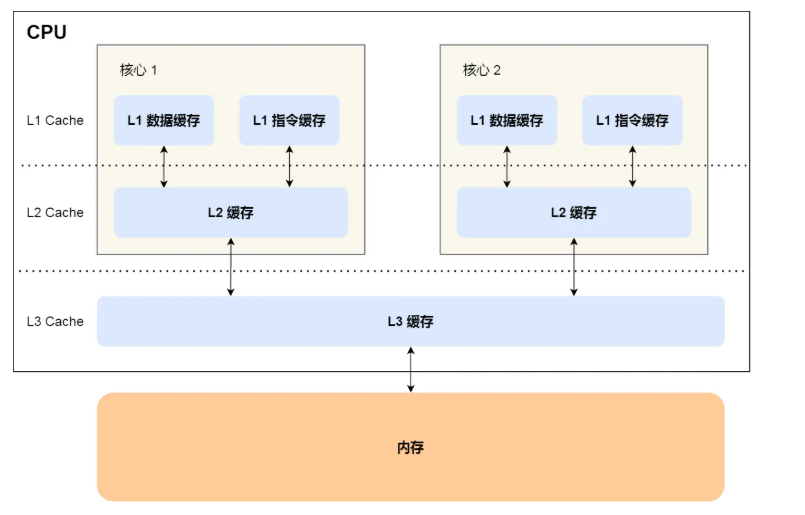
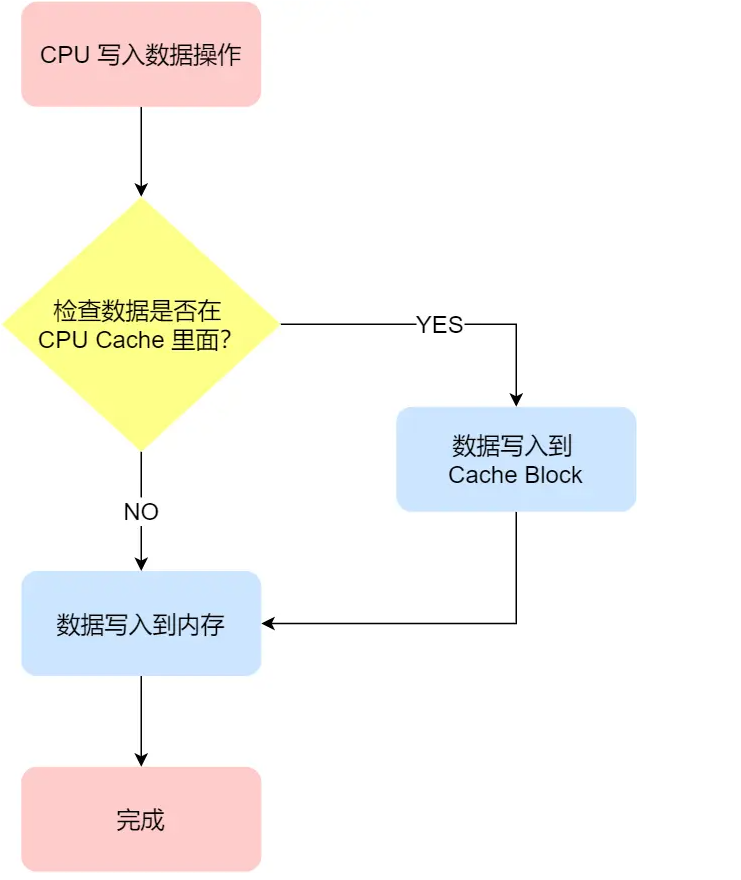
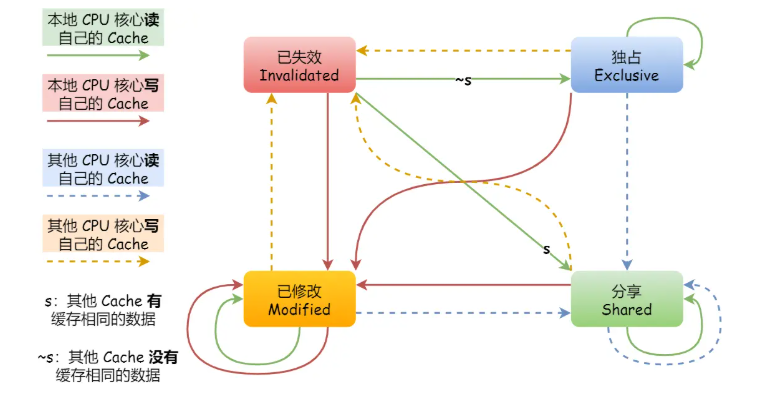
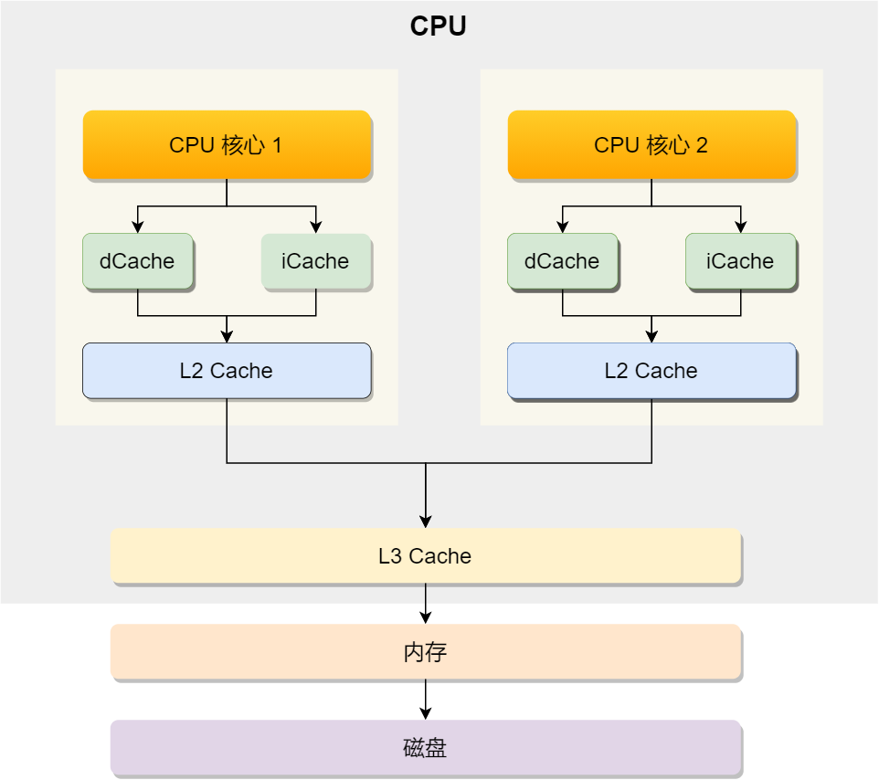
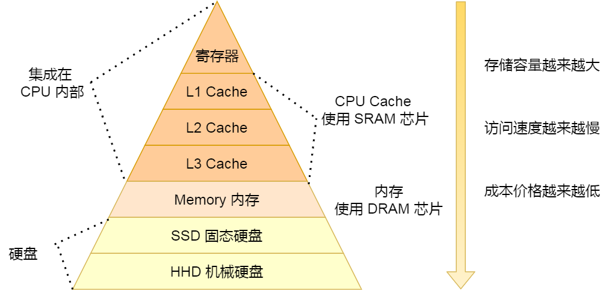
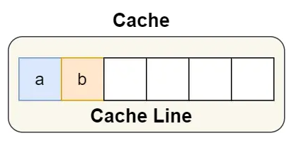
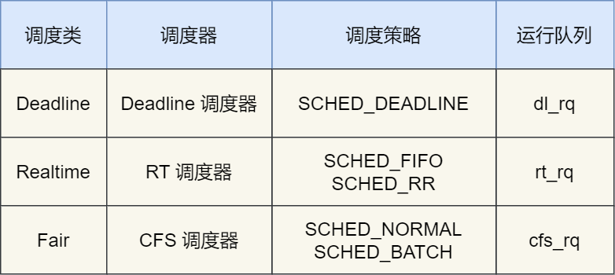
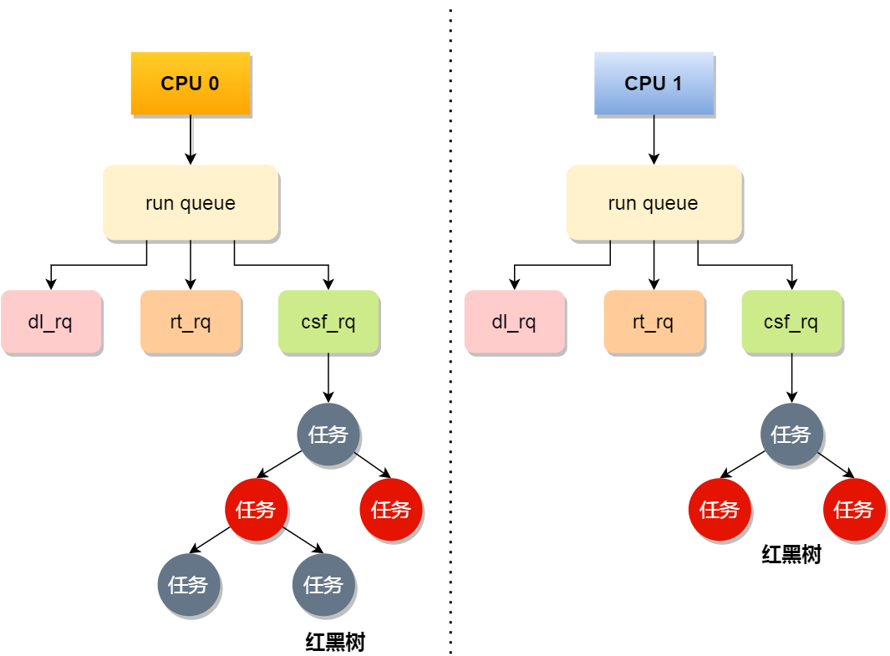
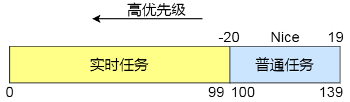

# CPU 缓存一致性

## CPU Cache 数据结构

CPU Cache 是由很多个 Cache Line 组成的




## CPU Cache 数据写入

多核 CPU 里，每个 CPU 都有各自的 L1/L2 Cache，L3 Cache 是所有核心共享使用的



CPU Cache 是由很多个 Cache Line 组成的，CPU Line 是由各种标志（Tag）+ 数据块（Data Block）组成，是 CPU 从内存读取数据的基本单位


CPU 写入数据方法：

### 写直达

*Write Through* ，**把数据同时写入内存和 Cache 中**

优点：简单易懂

缺点：每次写操作都会写回内存，耗费时间



### 写回

Write Back。**当发生写操作时，新的数据仅仅被写入 Cache Block 里，**只有当修改过的 Cache Block「被替换」时才需要写到内存中****

* 写操作时，如果数据已经在 CPU Cache 里面，将数据更新，并标记 Cache Block 为脏（表示 Cache Block 的数据和内存是不一致的）
* 写操作时，如果数据对应的 Cache Block 里存放的是「别的内存地址的数据」的话，检查这个 Block 是不是脏的：
  * 如果是脏的，将这个 Cache Block 的数据写回内存，再把当前需要写入的数据，从内存中读取到 Cache Block 中，再把数据写入 Cache Block，并标记为脏
  * 如果不是脏的，把当前需要写入的数据，从内存中读取到 Cache Block 中，再把数据写入 Cache Block，并标记为脏（省去了写回内存步骤）

优点：如果我们大量的操作都能够命中缓存，那么大部分时间里 CPU 都不需要读写内存


## 缓存一致性问题

背景：现在 CPU 都是多核的，L1/L2 Cache 是多个核心各自独有的，如果不能保证缓存一致性的问题，就可能造成结果错误

例如：有两个核心的 CPU ，A 核心和 B 核心同时运行两个线程，都操作共同的变量 i。A 核心执行 i++，但是新的 i 值没有被同步到内存中，B 核心读取到的 i 是错误的


实现缓存一致性：

* **写传播**：某个 CPU 核心里的 Cache 数据更新时，必须要传播到其他核心的 Cache
* **事务串行化**：某个 CPU 核心里对数据的操作顺序，必须在其他核心看起来顺序是一样的
  * CPU 核心对于 Cache 中数据的操作，需要同步给其他 CPU 核心
  * 引入「锁」的概念，如果两个 CPU 核心里有相同数据的 Cache，对于这个 Cache 数据的更新，只有拿到了「锁」，才能进行对应的数据更新

### 总线嗅探

一个 CPU 修改了独有缓存中变量的值，会通过总线把这个事件广播通知给其他所有的核心，其他 CPU 核心都会监听总线上的广播事件，并检查是否有相同的数据在自己缓存内，如果有，则会更新数据。

优点：简单，能解决写传播问题

缺点：加重总线负担，不能解决串行化

### MESI 协议

* 四个表示 Cache Line 的状态：
  * *Modified* ，已修改
  * *Exclusive* ，独占
  * *Shared* ，共享
  * *Invalidated* ，已失效
* 已修改：脏标记，表示数据被更新过但是没写到内存里面
* 已失效：缓存块中数据已失效，不能读取
* 独占：内存块数据是干净的，数据只存储在一个 CPU 核心的 Cache 里，其他 Cache 里面没有该数据。此时可以自由写入
* 共享：内存块数据是干净的，相同的数据在多个 CPU 核心的 Cache 里都有



# CPU 如何执行任务

补自 [小林coding](https://www.xiaolincoding.com/os/1_hardware/how_cpu_deal_task.html#cpu-%E5%A6%82%E4%BD%95%E8%AF%BB%E5%86%99%E6%95%B0%E6%8D%AE%E7%9A%84)

## CPU 如何读写数据

每个核心有自己的 L1（再分为 dCache 数据缓存、iCache 指令缓存）和 L2，L3 多核共享。再往外是内存、磁盘，构成金字塔存储层次：越往下容量越大、访问越慢。CPU 访问 L1 大约比内存快 100 倍，所以用 L1~L3 挡住大部分内存访问。





CPU 从内存中读取数据到 Cache 的时候，并不是一个字节一个字节读取，而是一块一块的方式来读取数据的，这一块一块的数据被称为 CPU Cache Line（缓存块）。所以  **CPU Cache Line 是 CPU 从内存读取数据到 Cache 的单位** 。Linux 上可查 L1 Cache Line 大小，常见是 **64 字节**，也就是一次载入 64 字节。

```bash
# 查看 L1 Cache 一次载入的大小
cat /sys/devices/system/cpu/cpu0/cache/index0/coherency_line_size
```


应该按照物理内存地址分布的顺序去访问元素，这样访问数组元素的时候，Cache 命中率就会很高。能减少从内存读取数据的频率， 从而可提高程序的性能。（**二维数组读取先遍历行再遍历列**）

单独变量、且被多个核心交替改写时，容易踩 **伪共享**。

### 伪共享问题

多个线程同时读写同一个 Cache Line 的不同变量时，而导致 CPU Cache 失效的现象。

比如：数据 A 和 B 在一个 cache line 里面，CPU 1 需要修改 A，CPU 2 需要修改 B，1 修改后 2 的数据就会变为无效，反之亦然。A、B 逻辑上无关，却因为同属一行而互相拖累，缓存几乎失效，表现为核心之间来回写回内存、再加载，**不是死锁**。

用 MESI 走一遍（核心 1 绑线程 A 只改 A，核心 2 绑线程 B 只改 B）：

1. 一开始 A、B 都不在 Cache
2. 核心 1 读 A：按 Cache Line 载入，A、B 一起进 Cache，该行标成 **独占**
3. 核心 2 读 B：同一行也进核心 2 的 Cache，两边变成 **共享**
4. 核心 1 要改 A：发现是共享，先通知核心 2 把对应行标成 **已失效**，自己变成 **已修改**，再改 A
5. 核心 2 要改 B：自己这边已失效，且核心 1 上同行是已修改，必须先把核心 1 那行 **写回内存**，核心 2 再从内存加载整行，改 B，标成已修改

两边交替改 A、B 就会反复走 4、5，Cache 起不到缓存作用。

因此，**对于多个线程共享的热点数据，即经常会修改的数据，应该避免这些数据刚好在同一个 Cache Line 中**

**解决方法**：地址对齐、空间换时间




* Linux 内核：`__cacheline_aligned_in_smp`，多核下按 Cache Line 大小对齐，把容易争抢的成员拆到不同行；单核时这个宏是空的
* 应用层（如 Disruptor 的 RingBuffer）：前后各填充若干个不会被读写的 `long`（64 字节一行大约 8 个 long），把真正会用的字段「垫」在独立 Cache Line 里。字段若是 `final`、加载后不再改，整行没有写操作，就不会被伪共享换出去

## CPU 如何选择线程

Linux 里进程和线程都用 `task_struct` 表示。线程是轻量级进程：部分资源（地址空间、代码段、文件描述符等）共享自所属进程。没再创建线程的进程只有主线程这一条执行流。调度器调度的对象就是 `task_struct`，下面统称**任务**。

按优先级和响应要求分两类（**数值越小优先级越高**）：

* **实时任务**：尽量尽快执行，优先级 `0~99`
* **普通任务**：响应没那么苛刻，优先级 `100~139`

### 调度类

选下一个任务的顺序：**Deadline > Realtime > Fair**，实时任务总是先于普通任务。



实时任务：

* `SCHED_DEADLINE`：按 deadline 调度，离当前最近的先跑
* `SCHED_FIFO`：同优先级先来先服务；更高优先级可以抢占（插队）
* `SCHED_RR`：同优先级轮转，用完时间片排到队尾；高优先级仍可抢占低优先级

普通任务走 Fair，由 **CFS（完全公平调度）** 管：

* `SCHED_NORMAL`：普通任务
* `SCHED_BATCH`：后台任务，不跟终端交互，可适当降低优先级，少抢交互任务

### 完全公平调度 CFS

目标是让各任务分到的 CPU 时间尽量接近。给每个任务记 **虚拟运行时间 vruntime**：在跑就累加，没跑就不变。**调度时优先选 vruntime 更小的任务**。

普通任务之间还有权重。nice 越低，权重越大。同样真实运行时间里：

$$\text{vruntime} \propto \text{实际运行时间} \times \frac{\text{NICE\_0\_LOAD}}{\text{权重}}$$

高权重任务 vruntime 涨得慢，更容易被 CFS 选中，实际跑得更久。

### CPU 运行队列

任务数通常远大于核心数，所以要排队。每个 CPU 有自己的 **运行队列 rq**，里面再拆三条：

* `dl_rq`：Deadline
* `rt_rq`：实时
* `cfs_rq`：CFS，用红黑树按 vruntime 排序，**最左侧叶子就是下次要跑的普通任务**

挑任务时按调度类优先级：先 `dl_rq`，再 `rt_rq`，最后 `cfs_rq`。



### 调整优先级

默认启动的任务一般是普通任务，归 CFS。想让某个普通任务多跑一会儿，调 **nice**。

* nice 范围 `-20~19`，**值越低优先级越高**，默认 0
* nice 不是优先级本身，而是修正值：`priority(new) = priority(old) + nice`
* 内核 priority 是 `0~139`：`0~99` 给实时任务，nice 映射到 `100~139` 给普通任务



```bash
# 启动时指定 nice
nice -n -3 mysqld

# 改正在跑的任务
renice -n -5 -p <pid>
```

nice 再低也还是普通任务。对延迟极敏感时，要用 `chrt` 改调度策略和优先级，把它变成实时任务。

# 软中断

补自 [小林coding](https://www.xiaolincoding.com/os/1_hardware/soft_interrupt.html#%E4%B8%AD%E6%96%AD%E6%98%AF%E4%BB%80%E4%B9%88)

## 中断是什么

中断是系统响应硬件设备请求的机制：收到硬件中断请求后，会打断正在执行的进程，调用内核里的中断处理程序。它是异步事件处理，不用轮询设备，能提高并发能力。

中断会打断正常进程，所以**中断处理程序要尽可能短且快**，减少对调度的影响。响应时还可能**临时关闭中断**——处理完之前其他中断都进不来，拖太久就可能丢中断。

## 什么是软中断

为了避免中断处理过长、丢中断，Linux 把中断分成两段：

* **上半部**：快速处理，一般会暂时关闭中断请求，只做和硬件紧相关或时间敏感的事
* **下半部**：把上半部没做完的工作延后做，通常以**内核线程**方式跑

对应关系：

* **上半部 ≈ 硬中断**：硬件触发，打断当前任务立刻跑，工作要短、要快
* **下半部 ≈ 软中断**：内核触发，负责耗时更长的后续工作，特点是延迟执行

以网卡收包为例：网卡用 DMA 把数据写进内存，再发**硬件中断**通知内核。上半部先禁止网卡中断（避免硬中断太密拖垮内核），再触发**软中断**；下半部从内存取出数据，按协议栈逐层解析，最后交给应用。

软中断不只是设备中断的下半部，内核自定义事件也算，比如调度、RCU 锁等。

每个 CPU 对应一个软中断内核线程，名字一般是 `ksoftirqd/<CPU 编号>`，如 0 号核是 `ksoftirqd/0`。硬中断立刻打断 CPU；软中断以内核线程跑，可被调度。

## 系统里有哪些软中断

```bash
# 软中断累计次数（按类型、按 CPU）
cat /proc/softirqs

# 硬中断情况
cat /proc/interrupts

# 看变化速率（数值绝对值意义不大，涨得快不快才重要）
watch -d cat /proc/softirqs
```

`/proc/softirqs` 里每列是各 CPU 上该类型的累计次数。常见类型：

* `NET_RX` / `NET_TX`：网络收 / 发
* `TIMER`：定时
* `SCHED`：内核调度
* `RCU`：RCU 锁

同一种软中断在各 CPU 上的次数，正常应大致同量级。若某个核特别高，可能负载不均。

查看软中断内核线程：

```bash
ps -ef | grep ksoftirqd
```

名字带中括号的一般是内核线程（`ps` 拿不到命令行参数）。几个核就有几个 `ksoftirqd`。

## 定位软中断 CPU 使用率过高

1. `top` 看 `%si`（softirq）是否偏高；若最吃 CPU 的也是 `ksoftirqd`，多半是软中断拖垮了系统
2. `watch -d cat /proc/softirqs` 看哪种类型涨得最快。Web 服务器上常见是 `NET_RX`
3. 若是 `NET_RX`：用 `sar -n DEV` 看哪块网卡收包猛
4. 再 `tcpdump` 抓包看来源：非法地址可加防火墙；正常流量则考虑升配、优化等
