# 虚拟内存

**操作系统会提供一种机制，将不同进程的虚拟地址和不同内存的物理地址映射起来**

进程持有的虚拟地址会通过 CPU 芯片中的内存管理单元（MMU）的映射关系，来转换变成物理地址，然后再通过物理地址访问内存。

虚拟内存作用：

* 使进程对运行内存超过物理内存大小
* 每个进程的虚拟内存空间相互独立，进程无法访问其他进程页表。解决了多进程地址冲突问题
* 页表除了物理地址，还有标记属性（比如读写权限），提供了更好的安全性

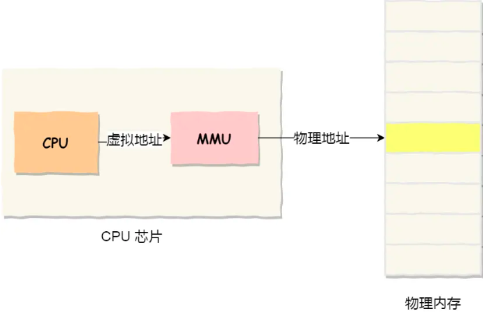

## 内存分段

程序是由若干个逻辑分段组成的，如可由代码分段、数据分段、栈段、堆段组成

**不同的段是有不同的属性的，所以就用分段（ *Segmentation* ）的形式把这些段分离出来**

分段机制下的虚拟地址由**段选择因子**和**段内偏移量**组成

* 段选择因子：保存在寄存器里面，最重要的内容是**段号**，用作段表索引。段表中保存的是**段的基地址、段的界限和特权等级**
* 段内偏移量：位于 0 和段界限之间。如果段内偏移量是合法的，就将段基地址加上段内偏移量得到物理内存地址

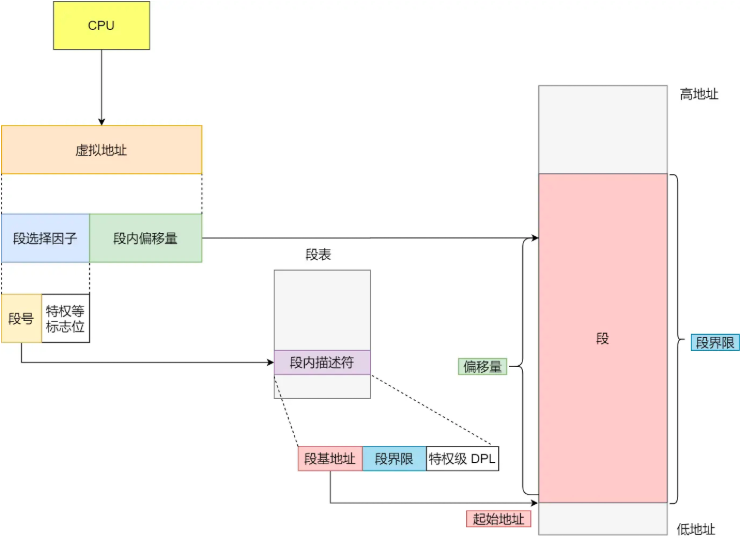

分段的缺点：存在内存碎片；内存交换效率低

### 内存碎片问题

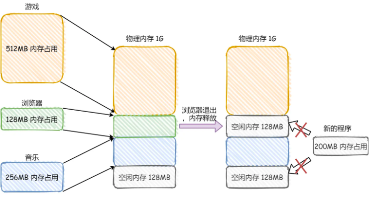

内部内存碎片：内存分段管理可以做到段根据实际需求分配内存，需要多少就分配多少，**不存在内部内存碎片问题**

外部内存碎片：每个段的长度不固定，所以多个段未必能恰好使用所有的内存空间，会产生了多个不连续的小物理内存，导致新的程序无法被装载，**存在外部碎片问题**

内存交换：解决外部碎片问题的方法。

* 将占用的内存写到硬盘上，然后再读回内存
* 读回的时候不装载回原来位置，而是紧跟着之前被占用的内存后面
* **因为访问硬盘的速度很慢，所以内存交换很耗时**

## 内存分页

**分页是把整个虚拟和物理内存空间切成一段段固定尺寸的大小。**

虚拟地址与物理地址之间通过**页表**来映射

而当进程访问的虚拟地址在页表中查不到时，系统会产生一个 **缺页异常** ，进入系统内核空间分配物理内存、更新进程页表，最后再返回用户空间

内部碎片问题：内存分页机制分配内存的最小单位是一页，即使程序不足一页大小，我们最少只能分配一个页，导致内存浪费，**存在内部碎片问题**

外部碎片问题：**页与页之间是紧密排列的，所以不会有外部碎片问题**

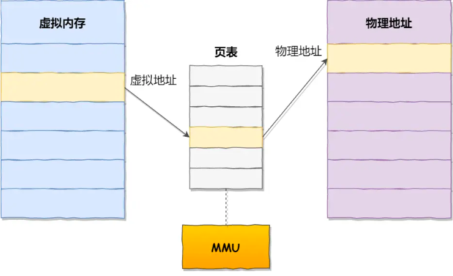

分页不再需要一次性都把程序加载到物理内存中，可以在进行虚拟内存和物理内存的页之间的映射之后，**只有在程序运行中，需要用到对应虚拟内存页里面的指令和数据时，再加载到物理内存里面去**

分页机制下的虚拟地址分为**页号和页内偏移**

* 页号：作为页表索引。**页表**包含物理页每页所在**物理内存的基地址**
* 页内偏移：和基地址组合形成物理内存地址

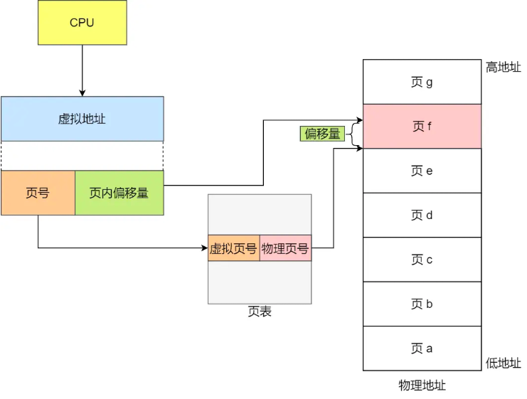

### 简单分页的问题

在 32 位的环境下，虚拟地址空间共有 4GB，假设一个页的大小是 4KB（2^12），那么就需要大约 100 万（2^20）个页，每个「页表项」需要 4 个字节大小来存储，那么整个 4GB 空间的映射就需要有 **4MB** 的内存来存储页表。

每个进程都有自己的虚拟地址空间，也就说都有自己的页表。那么 **100** 个进程就需要 **400MB** 的内存来存储页表，这是非常大的内存了

### 多级页表

将页表（一级页表）分为 `1024` 个页表（二级页表），每个表（二级页表）中包含 `1024` 个「页表项」，形成**二级分页**

一级页表和二级页表大小都是 4KB，二级页表只会在需要的时候被创建

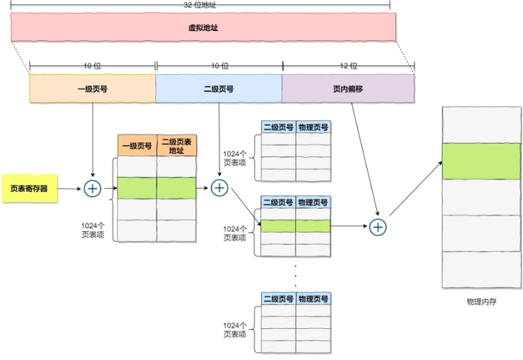

### TLB

多级页表解决了空间问题，但是从虚拟地址到物理地址多了转换步骤，影响性能

根据程序局部性原理，把最常访问的几个页表项存储到访问速度更快的硬件：TLB（页表缓存、旁路缓存、快表）

## 段页式内存管理

* 先将程序划分为多个有逻辑意义的段，也就是前面提到的分段机制
* 接着再把每个段划分为多个页，也就是对分段划分出来的连续空间，再划分固定大小的页

地址结构由**段表，段内页号和页内位移**三部分组成

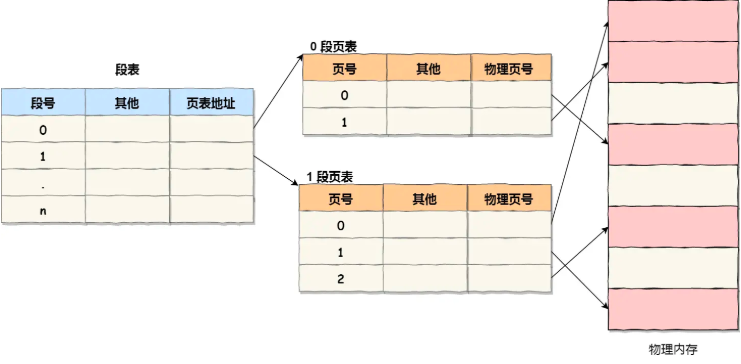

# Linux 进程内存分布

* 32 位系统的内核空间占用 1G，位于最高处，剩下的 3G 是用户空间；
* 64 位系统的内核空间和用户空间都是 128T，分别占据整个内存空间的最高和最低处，剩下的中间部分是未定义的

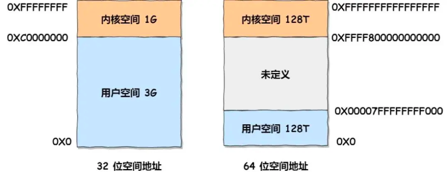

32 位系统下用户空间内存段：

* 代码段，包括二进制可执行代码；
* 数据段，包括已初始化的静态常量和全局变量；
* BSS 段，包括未初始化的静态变量和全局变量；
* 堆段，包括动态分配的内存，从低地址开始向上增长；
* 文件映射段，包括动态库、共享内存等，从低地址开始向上增长（跟硬件和内核版本有关）；
* 栈段，包括局部变量和函数调用的上下文等。栈的大小是固定的，一般是 8 MB。当然系统也提供了参数，以便我们自定义大小；

在这 6 个内存段中，**堆和文件映射段**的内存是动态分配的

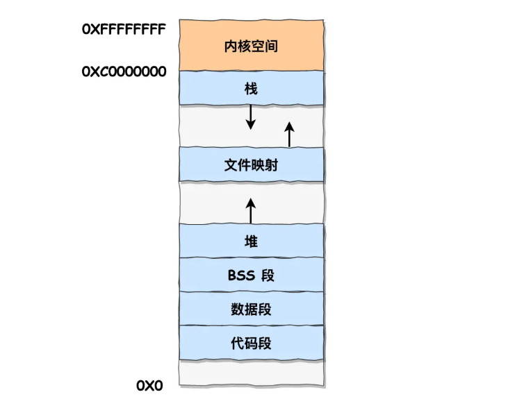

# malloc 分配内存

两种申请内存方式：

* 方式一：通过 brk() 系统调用从堆分配内存（分配内存小于 128 KB）
* 方式二：通过 mmap() 系统调用在文件映射区域分配内存（分配内存大于 128 KB）

malloc 返回给用户态的内存起始地址比进程的堆空间起始地址多了 16 字节，这些字节保存了该内存块的描述信息，比如有该内存块的大小。执行 free 函数时，free 会对传入进来的内存地址向左偏移 16 字节，读取出内存块大小

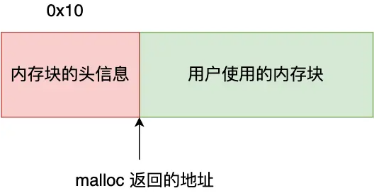

方式一通过 brk 函数将堆顶指针向高地址移动，获得新的内存空间

通过此方式申请的内存，free 释放的时候，**不会将内存归还给操作系统，而是缓存在 malloc 池中**

存在内存碎片问题

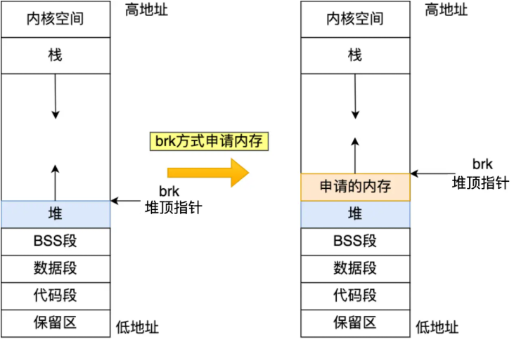

方式二通过 mmap，在文件映射区分配一块内存

通过此方式申请的内存，free 释放的时候，**会把内存归还给操作系统，内存得到真正释放**

流程长，性能低

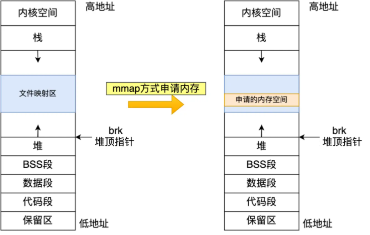

# 内存分配与回收

malloc 函数申请内存的时候，申请的是虚拟内存，此时并不会分配物理内存。

当应用程序读写了这块虚拟内存，CPU 就会去访问这个虚拟内存，这时会发现这个虚拟内存没有映射到物理内存，CPU 就会产生 **缺页中断** ，进程会从用户态切换到内核态，并将缺页中断交给内核的 Page Fault Handler （缺页中断函数）处理。

缺页中断处理函数会看是否有空闲的物理内存，如果有，就直接分配物理内存，并建立虚拟内存与物理内存之间的映射关系。如果没有空闲的物理内存，那么内核就会开始进行**回收内存**的工作，回收的方式主要是两种：直接内存回收和后台内存回收。

* **后台内存回收（kswapd）** ：在物理内存紧张的时候，会唤醒 kswapd 内核线程来回收内存，这个回收内存的过程是异步的，不会阻塞进程的执行。
* **直接内存回收（direct reclaim）** ：如果后台异步回收跟不上进程内存申请的速度，就会开始直接回收，这个回收内存的过程是同步的，会阻塞进程的执行。

如果直接内存回收后，空闲的物理内存仍然无法满足此次物理内存的申请，触发  **OOM （Out of Memory）机制** 。

OOM Killer 机制会根据算法选择一个占用物理内存较高的进程，然后将其杀死，以便释放内存资源，如果物理内存依然不足，OOM Killer 会继续杀死占用物理内存较高的进程，直到释放足够的内存位置。

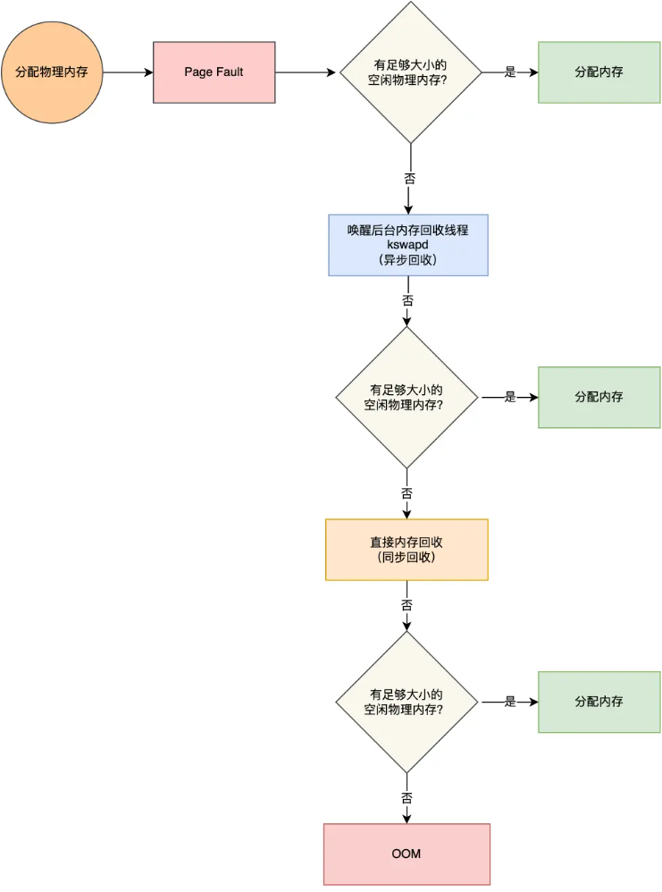

## 能被回收的内存

* **文件页（File-backed Page）**：内核缓存的磁盘数据（Buffer）和文件数据（Cache）都叫作文件页。大部分文件页，都可以直接释放内存，有需要时，再从磁盘重新读取。而被应用程序修改过且暂时还没写入磁盘的数据（也就是脏页），就得先写入磁盘才能进行内存释放。**回收干净页的方式是直接释放内存，回收脏页的方式是先写回磁盘后再释放内存** 。
* **匿名页（Anonymous Page）**：这部分内存没有实际载体，不像文件缓存有硬盘文件这样一个载体，比如堆、栈数据等。这部分内存很可能还要再次被访问，不能直接释放内存，**回收的方式是通过 Linux 的 Swap 机制** ，Swap 会把不常访问的内存先写到磁盘中，然后释放这些内存给其他更需要的进程使用。再次访问这些内存时，重新从磁盘读入内存。

文件页和匿名页的回收都是基于 LRU 算法，也就是优先回收不常访问的内存。LRU 回收算法，实际上维护着 active 和 inactive 两个双向链表，其中：

* **active_list 活跃内存页链表** ，这里存放的是最近被访问过（活跃）的内存页；
* **inactive_list 不活跃内存页链表** ，这里存放的是很少被访问（非活跃）的内存页；

## 回收内存的性能影响

* 后台内存回收：唤醒 kswapd 内核线程，异步回收，不会阻塞进程。
* 直接内存回收，同步回收会阻塞进程，这样就会造成很长时间的延迟，以及系统的 CPU 利用率会升高，最终引起系统负荷飙高。

可被回收的内存类型有文件页和匿名页：

* 文件页的回收：对于干净页是直接释放内存，不会影响性能，而对于脏页会先写回到磁盘再释放内存，这个操作会发生磁盘 I/O 的，会影响系统性能。
* 匿名页的回收：如果开启了 Swap 机制，那么 Swap 机制会将不常访问的匿名页换出到磁盘中，下次访问时，再从磁盘换入到内存中，会影响系统性能。

可以看到，回收内存的操作基本都会发生磁盘 I/O 的，如果回收内存的操作很频繁，意味着磁盘 I/O 次数会很多，这个过程会影响系统的性能。

### 调整文件页和匿名页的回收倾向

* Linux 提供了一个 `/proc/sys/vm/swappiness` 选项，用来调整文件页和匿名页的回收倾向。数值越大，越积极使用 Swap，也就是更倾向于回收匿名页

### 尽早触发 kswapd 异步回收内存

内核定义了三个内存阈值（watermark，也称为水位），用来衡量当前剩余内存（pages_free）是否充裕或者紧张：

* 页最小阈值（pages_min）；
* 页低阈值（pages_low）；
* 页高阈值（pages_high）；

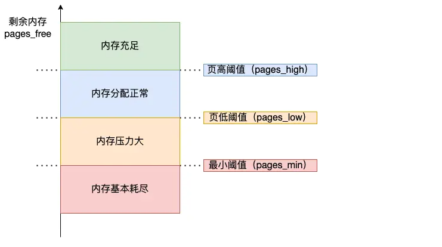

kswapd 会定期扫描内存的使用情况，根据剩余内存（pages_free）的情况来进行内存回收的工作

* 绿色部分：如果剩余内存（pages_free）大于 页高阈值（pages_high），说明剩余内存是充足的；
* 蓝色部分：如果剩余内存（pages_free）在页高阈值（pages_high）和页低阈值（pages_low）之间，说明内存有一定压力，但还可以满足应用程序申请内存的请求；
* 橙色部分：如果剩余内存（pages_free）在页低阈值（pages_low）和页最小阈值（pages_min）之间，说明内存压力比较大，剩余内存不多了。**这时 kswapd0 会执行内存回收，直到剩余内存大于高阈值（pages_high）为止**。虽然会触发内存回收，但是不会阻塞应用程序，因为两者关系是异步的。
* 红色部分：如果剩余内存（pages_free）小于页最小阈值（pages_min），说明用户可用内存都耗尽了，此时就会触发直接内存回收，这时应用程序就会被阻塞，因为两者关系是同步的。

提高 pages_min 值，可以降低延迟，但是也会降低程序可用内存量

# 避免预读失效和缓存污染

## 预读失效

预读机制：操作系统由于程序空间局部性原理，提前读取额外数据

优点：**减少了 磁盘 I/O 次数，提高系统磁盘 I/O 吞吐量**

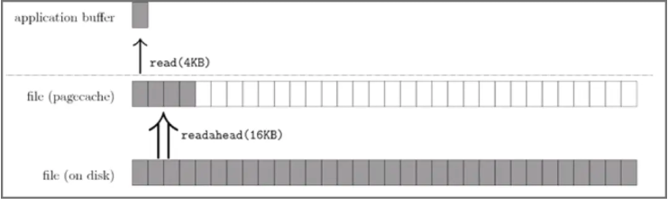

预读失效：**这些被提前加载进来的页，并没有被访问** ，相当于预读工作白做了

传统的 LRU 算法会把「预读页」放到 LRU 链表头部，而当内存空间不够的时候，还需要把末尾的页淘汰掉。如果这些「预读页」一直不会被访问到，**不会被访问的预读页却占用了 LRU 链表前排的位置，而末尾淘汰的，可能是热点数据，这样就大大降低了缓存命中率**。

### 避免预读失效

方法：**让预读页停留在内存里的时间要尽可能的短，让真正被访问的页才移动到 LRU 链表的头部**

* Linux 操作系统实现了两个 LRU 链表：**活跃 LRU 链表（active_list）和非活跃 LRU 链表（inactive_list）**
* MySQL 的 InnoDB 存储引擎是在一个 LRU 链表上划分来 2 个区域：**young 区域和 old 区域**。

**将数据分为了冷数据和热数据，然后分别进行 LRU 算法**。不再像传统的 LRU 算法那样，所有数据都只用一个 LRU 算法管理

### Linux

**预读页就只需要加入到 inactive list 区域的头部，当页被真正访问的时候****，才将页插入 active list 的头部**

* 假设两个链表的长度均为 5 ，数据如下
* 编号为 20 的页被预读了，将其插入到 inactive list 头部，淘汰其末尾页
* 如果 20 页后续被访问了，就将其插入到 active list 头部，active list 末尾的页，会被**降级**到 inactive list

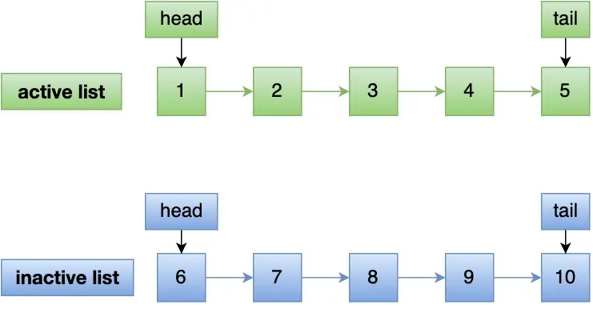

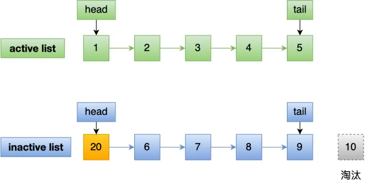

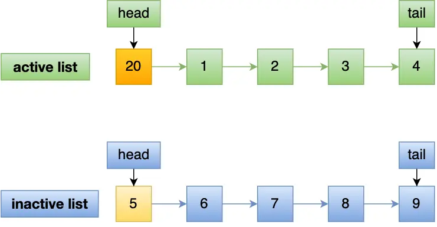

### MySQL

young 区域在 LRU 链表的前半部分，old 区域则是在后半部分，两个区域有各自的头和尾节点。长度比例默认 63：37

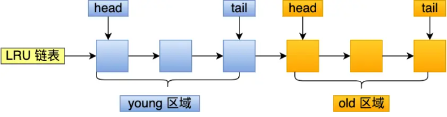

* 假设链表长度为 10，新旧比 7：3
* 编号为 20 的页被预读，插入到 old 区域头部，淘汰 old 末尾页
* 编号为 20 的页被访问，插入到 young 区域头部，原本 young 区域头部页降级到 old 头部

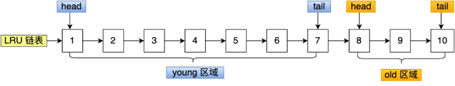

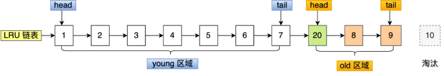

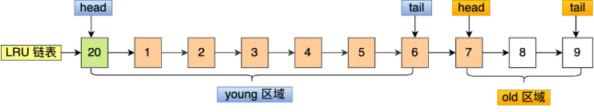

## 缓存污染

缓存污染：批量读取数据时，可能会把热点数据挤出去

* 假设需要批量扫描：21，22，23，24，25 这五个页，这些页都会被逐一访问
* 在批量访问这些页的时候，会被逐一插入到 young 区域头部
* 如果 6 和 7 号页是热点数据，那么在被淘汰后，后续有 SQL 再次读取 6 和 7 号页时，由于缓存未命中，就要从磁盘中读取了，降低了 MySQL 的性能

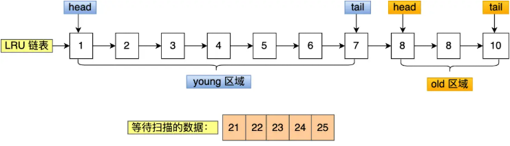

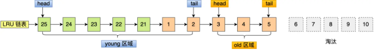

### 避免缓存污染

**提高进入到活跃 LRU 链表（或者 young 区域）的门槛**

* Linux 操作系统：在内存页被访问第二次的时候，才将页从 inactive list 升级到 active list 里。
* MySQL InnoDB：在内存页被访问第二次的时候，并不会马上将该页从 old 区域升级到 young 区域，因为还要进行停留在 old 区域的时间判断：

  * 如果第二次的访问时间与第一次访问的时间 **在 1 秒内** （默认值），那么该页就**不会**被从 old 区域升级到 young 区域；
  * 如果第二次的访问时间与第一次访问的时间 **超过 1 秒** ，那么该页就**会**从 old 区域升级到 young 区域；
