# 文件系统

## 基本组成

Linux 文件系统会为每个文件分配两个数据结构：**索引节点（index node）** 和 **目录项（directory entry）** ，它们主要用来记录文件的元信息和目录层次结构。

* 索引节点：用来记录文件的元信息，比如 inode 编号、文件大小、访问权限、创建时间、修改时间、数据在磁盘的位置等等。索引节点是文件的唯一标识，它们之间一一对应，也同样都会被存储在硬盘中，所以 **索引节点同样占用磁盘空间** 。
* 目录项：用来记录文件的名字、索引节点指针以及与其他目录项的层级关联关系。多个目录项关联起来，就会形成目录结构，但它与索引节点不同的是， **目录项是由内核维护的一个数据结构，不存放于磁盘，而是缓存在内存** 。

由于索引节点唯一标识一个文件，而目录项记录着文件的名字，所以目录项和索引节点的关系是多对一，也就是说，一个文件可以有多个别名。比如，硬链接的实现就是多个目录项中的索引节点指向同一个文件。

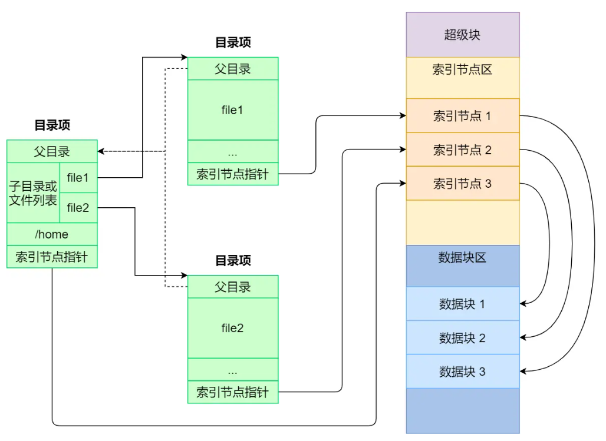

磁盘读写的最小单位是扇区，512 B，为了提高读写效率，文件系统将多个扇区组成一个**逻辑块，4KB，一次性读取八个扇区**

磁盘格式化的时候，会被分为三个区域：

* 超级块：存储文件系统的详细信息，比如块个数、大小、空闲块等
* 索引节点区：存储索引节点
* 数据块区：存储文件或目录数据

只有当需要使用的时候，才将其加载进内存

* 超级块：当文件系统挂载时进入内存
* 索引节点区：当文件被访问时进入内存

## 虚拟文件

操作系统为了**对用户提供一个统一的接口**，在用户层与文件系统层引入了中间层，这个中间层就称为**虚拟文件系统（VFS），** 其定义了一组所有文件系统都支持的数据结构和标准接口，这样程序员不需要了解文件系统的工作原理，只需要了解 VFS 提供的统一接口即可

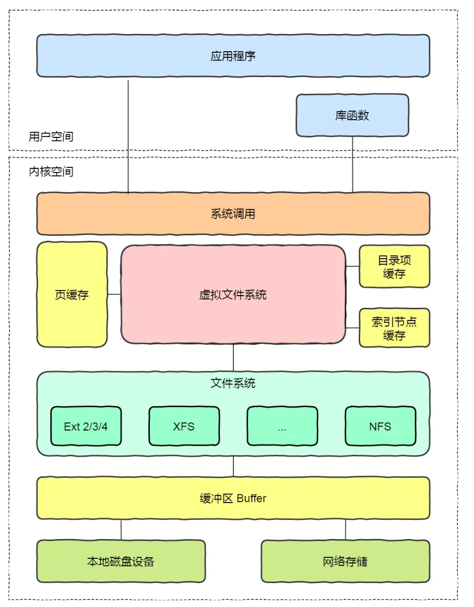

Linux支持的文件系统：

* 磁盘文件系统：直接把数据存储在磁盘中的文件系统
* 内存文件系统：这类文件系统的数据不是存储在硬盘的，而是占用内存空间，读写这类文件，实际上是读写内核中相关的数据
* 网络文件系统：用来访问其他计算机主机数据的文件系统

## 文件存储

### 连续空间存放方式

**文件存放在磁盘「连续的」物理空间中** 。

使用这种方式，必须先知道文件的大小，因此**文件头里需要指定「起始块的位置」和「长度」**

优点：文件的数据都是紧密相连，**读写效率很高**

缺点：**有「磁盘空间碎片」和「文件长度不易扩展」的缺陷**

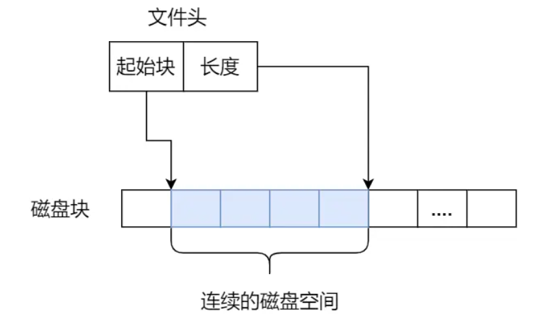

磁盘空间碎片：

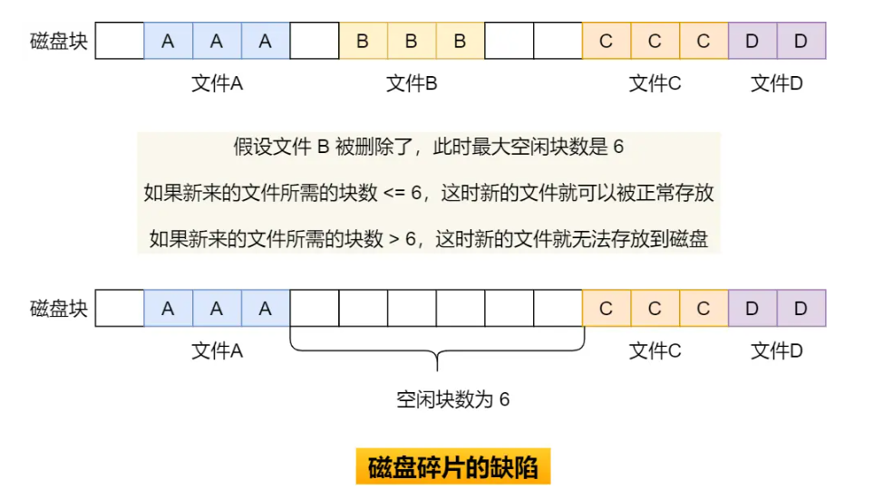

### 非连续空间存放方式

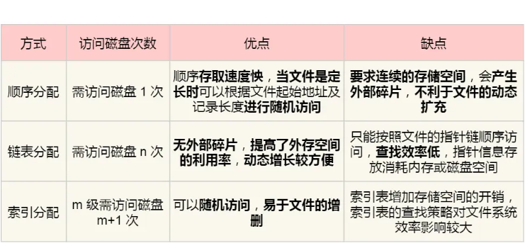

#### 链表方式

可以 **消除磁盘碎片** ，可大大提高磁盘空间的利用率

* 隐式链表
  * **文件头要包含「第一块」和「最后一块」的位置，并且每个数据块里面留出一个指针空间，** **用来存放下一个数据块的位置**
  * 从链头开始就可以顺着指针找到所有的数据块
  * 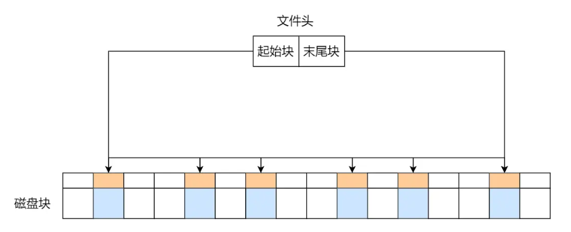
  * 缺点：无法直接访问数据块，只能通过指针顺序访问；数据块指针消耗空间；链表指针损坏会导致文件数据丢失
* 显式链接
  * **取出每个磁盘块的指针，把它放在内存的一个表中，该表在整个磁盘仅设置一张，每个表项中存放链接指针，指向下一个数据块号**
  * 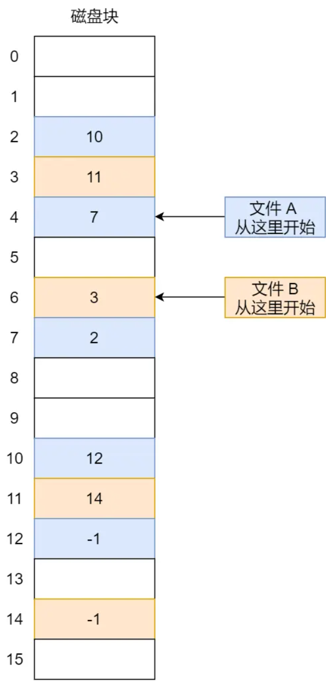
  * 优点：查找过程在内存进行，显著提高检索速度，减少磁盘访问次数
  * 缺点：整个表都放在内存，不适合大磁盘

#### 索引方式

链表的方式解决了连续分配的磁盘碎片和文件动态扩展的问题，但是不能有效支持直接访问

索引实现方式：为每个文件创建一个「 **索引数据块** 」，里面存放的是**指向文件数据块的指针列表**

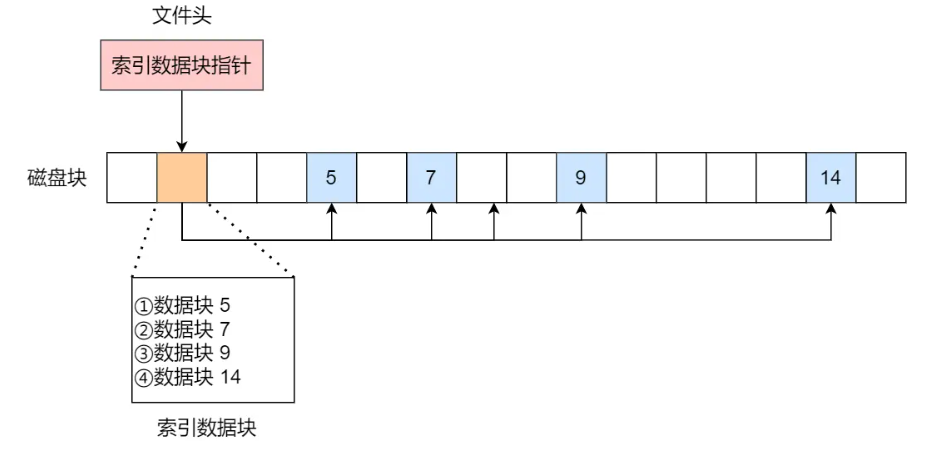

优点：

* 文件创建、增大、缩小很方便
* 没有内存碎片
* 支持顺序读写和随机读写

缺点：

* 索引块带来额外开销
* 不适合大文件(一个索引块放不下)

#### 组合方式

链式索引块：**在索引数据块留出一个存放下一个索引数据块的指针**

存在指针损坏导致数据丢失问题

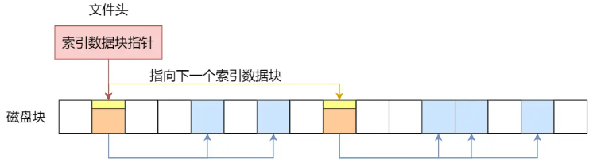

多级索引块：**通过一个索引块来存放多个索引数据块** ，一层套一层索引

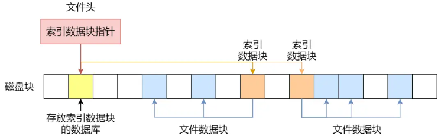

### Unix 文件实现方式

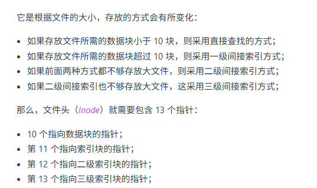

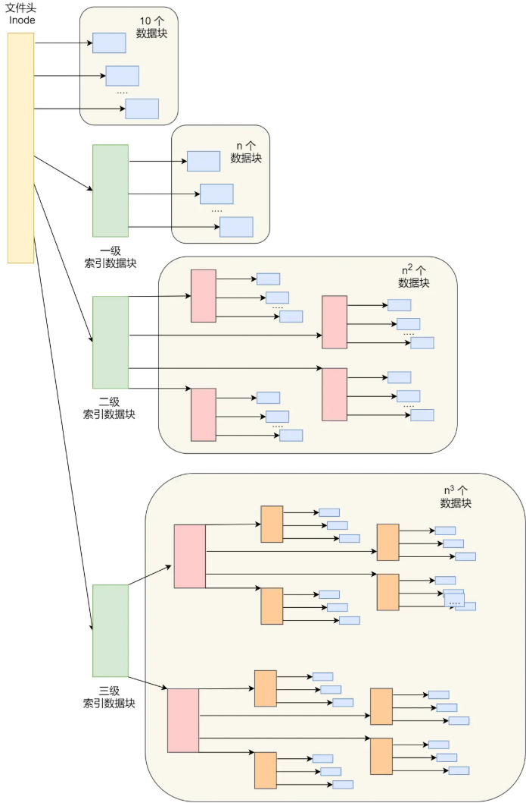

## 空闲空间管理

### 空闲表法

为所有空闲空间建立一张表，表内容包括空闲区的第一个块号和该空闲区的块个数

当请求分配磁盘空间时，系统依次扫描空闲表里的内容，直到找到一个合适的空闲区域为止；当用户撤销一个文件时，系统回收文件空间，顺序扫描空闲表，寻找一个空闲表条目并将释放空间的第一个物理块号及它占用的块数填到这个条目中

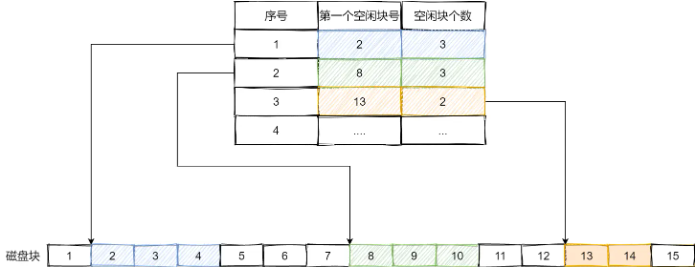

### 空闲链表法

每一个空闲块里有一个指针指向下一个空闲块。

当创建文件需要一块或几块时，就从链头上依次取下一块或几块；当回收空间时，把这些空闲块依次接到链头上

增加 I/O 操作、指针占用空间

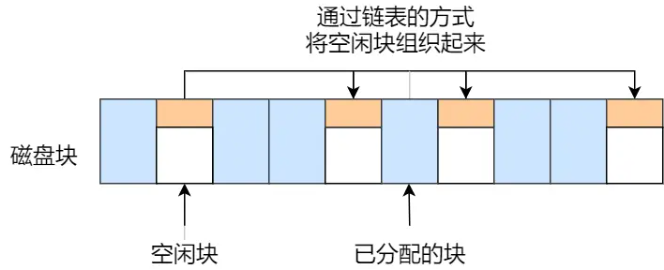

### 位图法

利用二进制的一位来表示磁盘中一个盘块的使用情况，磁盘上所有的盘块都有一个二进制位与之对应

当值为 0 时，表示对应的盘块空闲，值为 1 时，表示对应的盘块已分配

## 文件系统结构

最前面的第一个块是引导块，在系统启动时用于启用引导，接着后面就是一个一个连续的块组了，块组的内容如下：

* **超级块** ，包含文件系统的重要信息，比如 inode 总个数、块总个数、每个块组的 inode 个数、每个块组的块个数
* **块组描述符** ，包含文件系统中各个块组的状态，比如块组中空闲块和 inode 的数目等，每个块组都包含了文件系统中「所有块组的组描述符信息」。
* **数据位图和 inode 位图** ，用于表示对应的数据块或 inode 是空闲的，还是被被使用中。
* **inode 列表** ，包含了块组中所有的 inode，inode 用于保存文件系统中与各个文件和目录相关的所有元数据。
* **数据块** ，包含文件的有用数据。

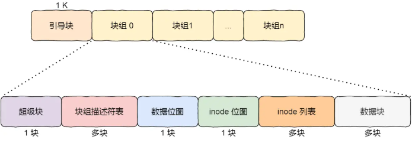

## 目录存储

在 Linux 中，目录也是文件。**普通文件的块里面保存的是文件数据，而目录文件的块里面保存的是目录里面一项一项的文件信息**

如果一个目录有超级多的文件，我们要想在这个目录下找文件，按照列表一项一项的找效率不高。于是，保存目录的格式改成 **哈希表** ，对文件名进行哈希计算，把哈希值保存起来

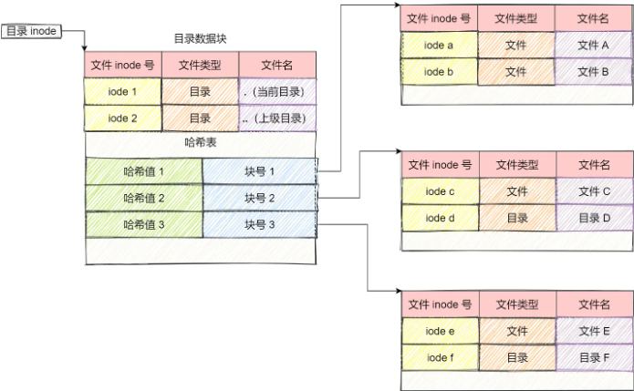

## 软链接和硬链接

### 硬链接

硬链接是 **多个目录项中的「索引节点」指向一个文件** ，也就是指向同一个 inode

inode 不能跨越文件系统，所以**硬链接是不可用于跨文件系统的**

**只有删除文件的所有硬链接以及源文件时，系统才会彻底删除该文件**

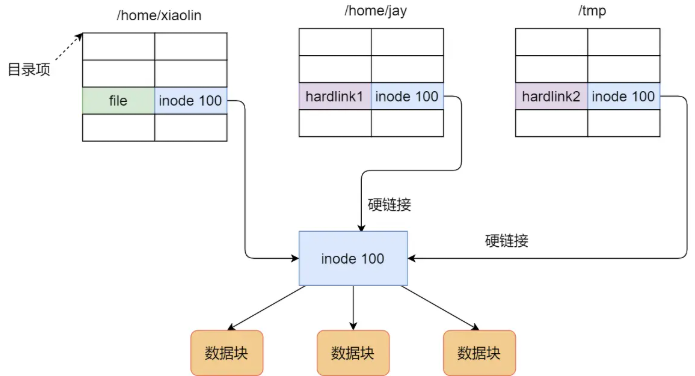

### 软链接

软链接相当于重新创建一个文件，这个文件有**独立的 inode**

但是这个 **文件的内容是另外一个文件的路径** ，所以访问软链接的时候，实际上相当于访问到了另外一个文件

**软链接是可以跨文件系统的** ，甚至**目标文件被删除了，链接文件还是在的，只不过指向的文件找不到了而已**

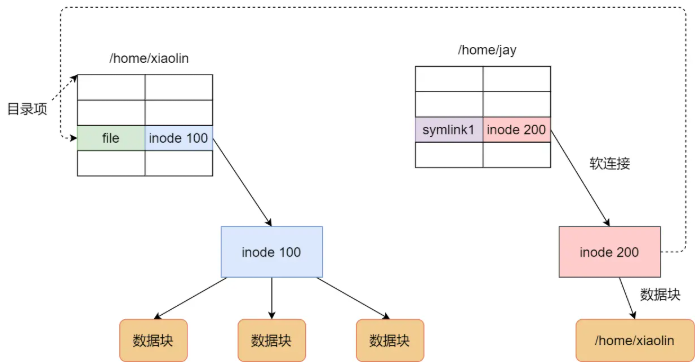

## 文件 IO
