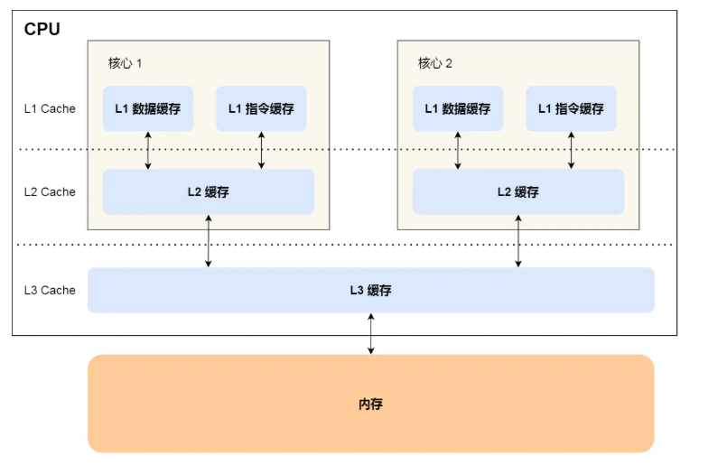
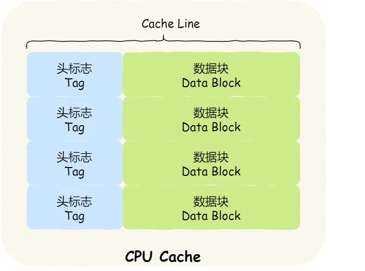
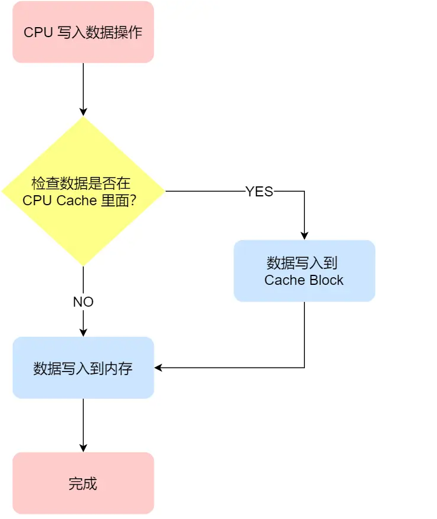
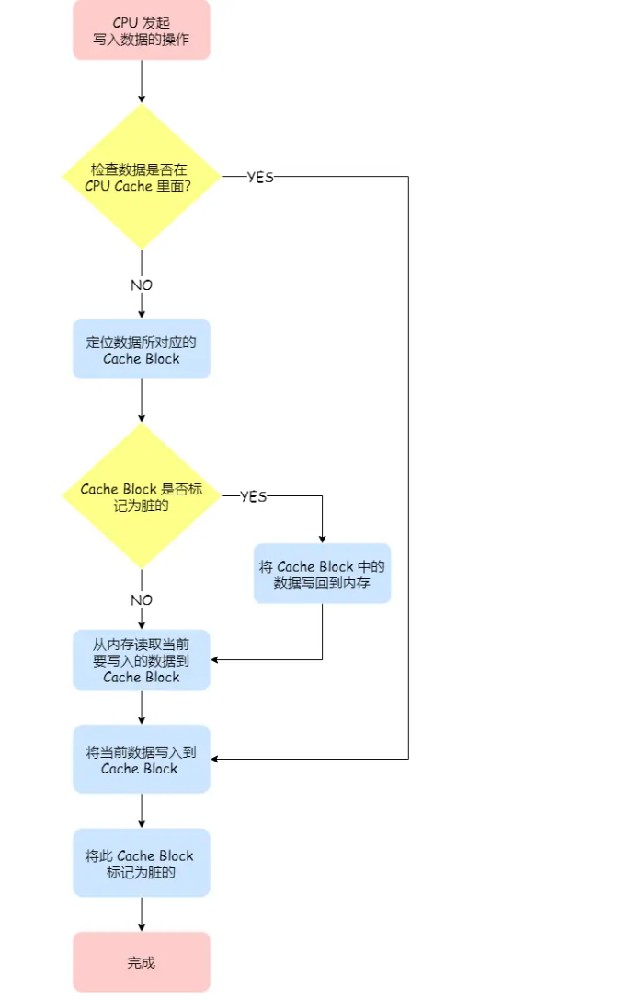
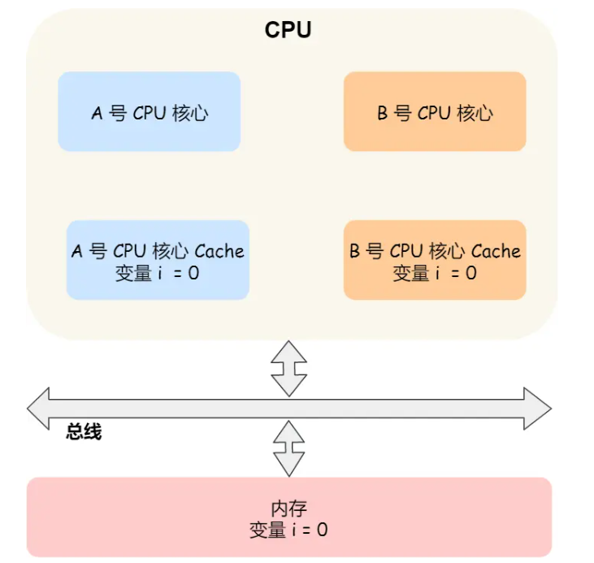
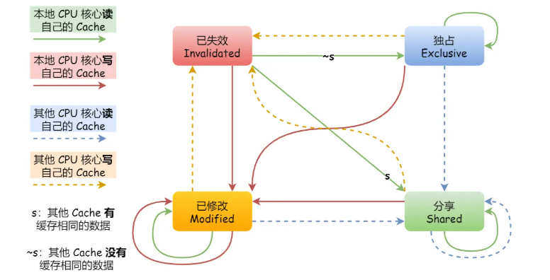

# CPU 缓存一致性

## CPU Cache 数据写入

多核 CPU 里，每个 CPU 都有各自的 L1/L2 Cache，L3 Cache 是所有核心共享使用的

CPU Cache 是由很多个 Cache Line 组成的，CPU Line 是由各种标志（Tag）+ 数据块（Data Block）组成，是 CPU 从内存读取数据的基本单位

CPU 写入数据方法：

### 写直达

*Write Through* ，**把数据同时写入内存和 Cache 中**

优点：简单易懂

缺点：每次写操作都会写回内存，耗费时间

### 写回

Write Back。**当发生写操作时，新的数据仅仅被写入 Cache Block 里，**只有当修改过的 Cache Block「被替换」时才需要写到内存中****

* 写操作时，如果数据已经在 CPU Cache 里面，将数据更新，并标记 Cache Block 为脏（表示 Cache Block 的数据和内存是不一致的）
* 写操作时，如果数据对应的 Cache Block 里存放的是「别的内存地址的数据」的话，检查这个 Block 是不是脏的：
  * 如果是脏的，将这个 Cache Block 的数据写回内存，再把当前需要写入的数据，从内存中读取到 Cache Block 中，再把数据写入 Cache Block，并标记为脏
  * 如果不是脏的，把当前需要写入的数据，从内存中读取到 Cache Block 中，再把数据写入 Cache Block，并标记为脏（省去了写回内存步骤）

优点：如果我们大量的操作都能够命中缓存，那么大部分时间里 CPU 都不需要读写内存

## 缓存一致性问题

背景：现在 CPU 都是多核的，L1/L2 Cache 是多个核心各自独有的，如果不能保证缓存一致性的问题，就可能造成结果错误

例如：有两个核心的 CPU ，A 核心和 B 核心同时运行两个线程，都操作共同的变量 i。A 核心执行 i++，但是新的 i 值没有被同步到内存中，B 核心读取到的 i 是错误的

实现缓存一致性：

* **写传播**：某个 CPU 核心里的 Cache 数据更新时，必须要传播到其他核心的 Cache
* **事务串行化**：某个 CPU 核心里对数据的操作顺序，必须在其他核心看起来顺序是一样的
  * CPU 核心对于 Cache 中数据的操作，需要同步给其他 CPU 核心
  * 引入「锁」的概念，如果两个 CPU 核心里有相同数据的 Cache，对于这个 Cache 数据的更新，只有拿到了「锁」，才能进行对应的数据更新

### 总线嗅探

一个 CPU 修改了独有缓存中变量的值，会通过总线把这个事件广播通知给其他所有的核心，其他 CPU 核心都会监听总线上的广播事件，并检查是否有相同的数据在自己缓存内，如果有，则会更新数据。

优点：简单，能解决写传播问题

缺点：加重总线负担，不能解决串行化

### MESI 协议

* 四个表示 Cache Line 的状态：
  * *Modified* ，已修改
  * *Exclusive* ，独占
  * *Shared* ，共享
  * *Invalidated* ，已失效
* 已修改：脏标记，表示数据被更新过但是没写到内存里面
* 已失效：缓存块中数据已失效，不能读取
* 独占：内存块数据是干净的，数据只存储在一个 CPU 核心的 Cache 里，其他 Cache 里面没有该数据。此时可以自由写入
* 共享：内存块数据是干净的，相同的数据在多个 CPU 核心的 Cache 里都有

