# 零拷贝

## DMA

没有 DMA 时的 I/O 过程：

* 用户进程调用 read 方法，向操作系统发出 I/O 请求
* CPU 发送指令给磁盘控制器
* 磁盘控制器收到指令，将数据放入内部缓冲区，然后产生中断
* CPU 收到中断，停下原有工作，将缓冲区内数据逐字节读入寄存器，再把寄存器数据写入内存

整个数据的传输过程，都要需要 CPU 亲自参与搬运数据的过程，**且 CPU 不能处理其他事情**，对于大数据传输不友好

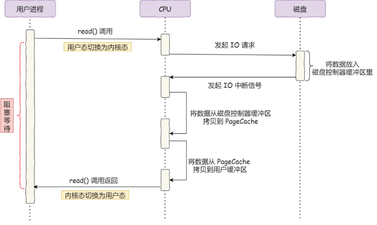

DMA ：直接内存访问（Direct Memory Access）**在进行 I/O 设备和内存的数据传输的时候，数据搬运的工作全部交给 DMA 控制器，而 CPU 不再参与任何与数据搬运相关的事情，这样 CPU 就可以去处理别的事务**

- 用户进程调用 read 方法，向操作系统发出 I/O 请求
- 操作系统收到请求后，进一步将 I/O 请求发送 DMA，然后让 CPU 执行其他任务，DMA 进一步将 I/O 请求发送给磁盘
- 磁盘控制器收到指令，将数据放入内部缓冲区，缓冲区被读满后，向 DMA 发送中断信号
- **DMA 收到磁盘的信号，将磁盘控制器缓冲区中的数据拷贝到内核缓冲区中，此时不占用 CPU，CPU 可以执行其他任务**
- DMA 读取足够数据，发送中断信号给 CPU
- CPU 收到信号，将数据拷贝给用户空间，系统调用返回

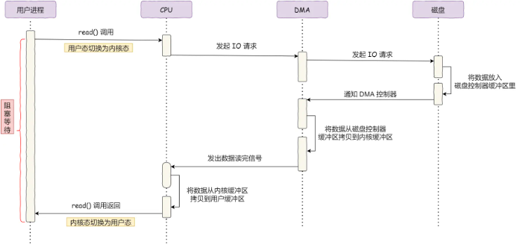

## 文件传输

### 传统文件传输

最简单方式：将磁盘上的文件读取出来，然后通过网络协议发送给客户端。

传统 I/O 工作方式：数据读取和写入是从用户空间到内核空间来回复制，而内核空间的数据是通过操作系统层面的 I/O 接口从磁盘读取或写入。**发生了 4 次用户态与内核态的上下文切换，4 次数据拷贝**

- 第一次：磁盘 → 操作系统内核缓冲区
- 第二次：操作系统内核缓冲区 → 用户缓冲区
- 第三次：用户缓冲区 → 内核 socket 缓冲区
- 第四次：内核 socket 缓冲区 → 网卡缓冲区

存在冗余的上文切换和数据拷贝，在高并发系统里是非常糟糕的，**需要减少「用户态与内核态的上下文切换」和「内存拷贝」的次数**

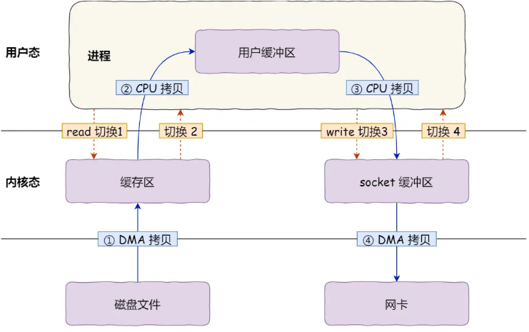

### 优化

- 减少上下文切换：减少系统调用次数
- 减少数据拷贝：文件传输的应用场景中，数据不会在用户空间被加工，**因此数据不需要搬运到用户空间**

## 实现零拷贝

### mmap + write

用 `mmap()` 替换 `read()` 系统调用函数：`mmap()` 系统调用函数会直接把内核缓冲区里的数据「**映射**」到用户空间，操作系统内核与用户空间就不需要再进行任何的数据拷贝操作。

- 应用进程调用了 `mmap()` 后，**DMA** 会把磁盘的数据拷贝到内核的缓冲区里，应用进程和操作系统共享缓冲区
- 应用进程再调用 `write()`，操作系统直接将内核缓冲区的数据拷贝到 socket 缓冲区中，这一切都发生在内核态，**由 CPU 来搬运数据**
- 把内核的 socket 缓冲区里的数据，拷贝到网卡的缓冲区里，这个过程是**由 DMA 搬运的**

RocketMQ 使用此方式

减少了一次数据拷贝过程，但是仍需要四次上下文切换

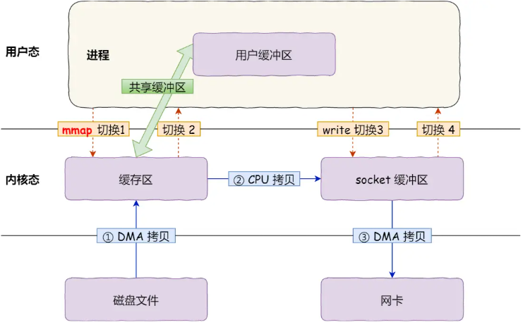

### sendfile

可以直接把内核缓冲区里的数据拷贝到 socket 缓冲区里，不再拷贝到用户态，减少了两次上下文切换

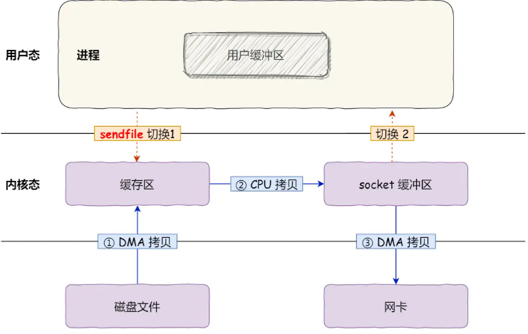

对于支持网卡支持 SG-DMA 技术的情况下，`sendfile()` 系统调用的过程发生了点变化，具体过程如下：

- 通过 DMA 将磁盘上的数据拷贝到内核缓冲区里
- 缓冲区描述符和数据长度传到 socket 缓冲区，网卡的 SG-DMA 控制器就直接将内核缓存中的数据拷贝到网卡的缓冲区里，不需要将数据从操作系统内核缓冲区拷贝到 socket 缓冲区中，这样就减少了一次数据拷贝。

Kafka 使用此方式

零拷贝**只需要 2 次上下文切换和数据拷贝次数，就可以完成文件的传输，并且数据传输不需要 CPU，都是由 DMA 搬运。理论上至少可以把文件传输的性能提高一倍**

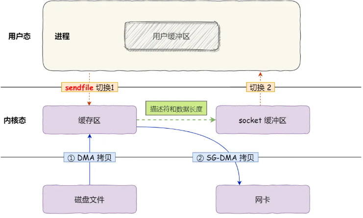

## 大文件传输

异步 I/O + 直接 I/O（绕过 PageCache，因为大文件使用 PageCache 没啥用）

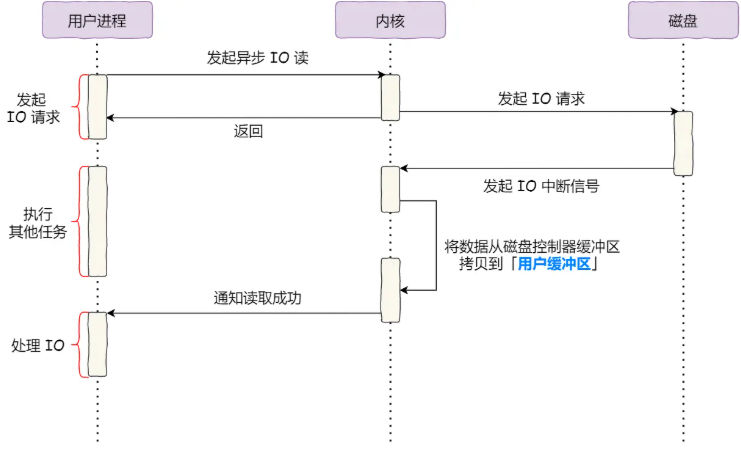

# I/O 多路复用

## socket 模型

在内核中 Socket 也是以「文件」的形式存在的，也是有对应的文件描述符

- **服务器**调用 `socket()` 函数，**创建网络协议为 IPv4**，以及传输协议为 TCP 的 Socket，接着调用 `bind()` 函数，给这个 Socket **绑定一个 IP 地址和端口**
  - 绑定端口：当内核收到 TCP 报文，可以通过 TCP 头里面的端口号，来找到我们的应用程序
  - 绑定 IP 地址：一台机器是可以有多个网卡的，每个网卡都有对应的 IP 地址，绑定网卡才能收到网卡上面的包
- 绑定完 IP 和端口后，调用 `listen()` 函数进行监听，此时对应 TCP 状态图中的 `listen`
- 监听状态下，通过调用 `accept()` 函数，来从内核获取客户端的连接，如果没有客户端连接，则会阻塞等待客户端连接的到来
- **客户端**调用 `connect()` 函数发起连接，该函数的参数要指明服务端的 IP 地址和端口号，之后开始 TCP 三次握手
- 双方都可以通过 `read()` 和 `write()` 函数来读写数据。

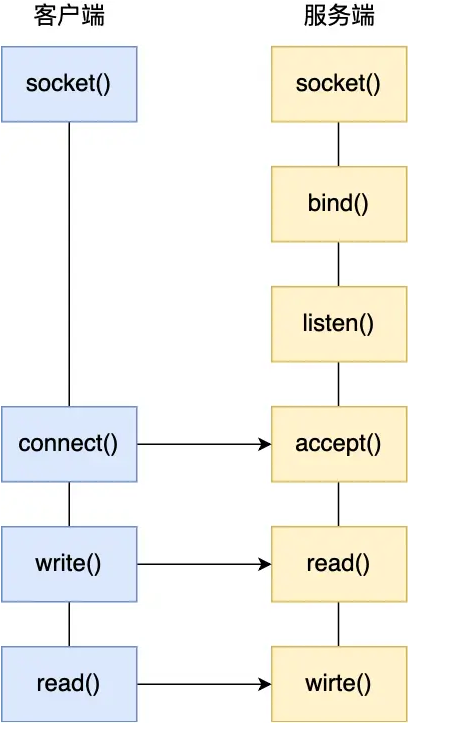

## 多进程模型

使用**多进程模型**，为每个客户端分配一个进程来处理请求。服务器的主进程负责监听客户的连接，一旦与客户端连接完成，就通过 `fork()` 函数创建一个子进程，实际上就把父进程所有相关的东西都**复制**一份。

支持少量并发（百级），但是扛不住高并发（万级），因为进程占用大量资源

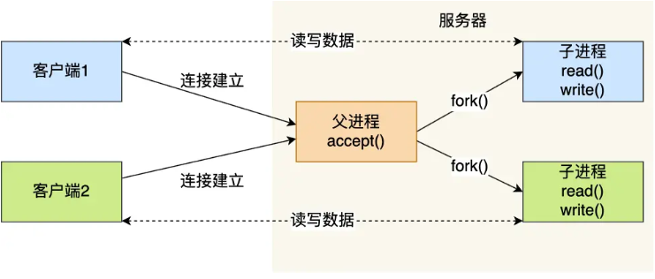

## 多线程模型

服务器与客户端 TCP 完成连接后，通过 `pthread_create()` 函数创建线程，然后将「已连接 Socket」的文件描述符传递给线程函数，接着在线程里和客户端进行通信。

使用**线程池**的方式来避免线程的频繁创建和销毁

socket 队列是全局的，每个线程都会操作，为了避免多线程竞争，线程在操作这个队列前要加锁

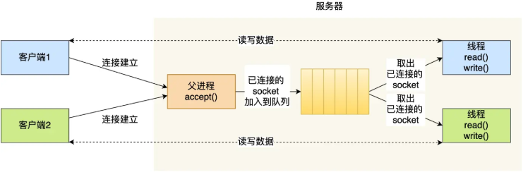

## I/O 多路复用

使用一个进程来维护多个 Socket，**通过一个系统调用函数从内核中获取多个事件**，在获取事件时，先把所有连接（文件描述符）传给内核，再由内核返回产生了事件的连接，然后在用户态中再处理这些连接对应的请求

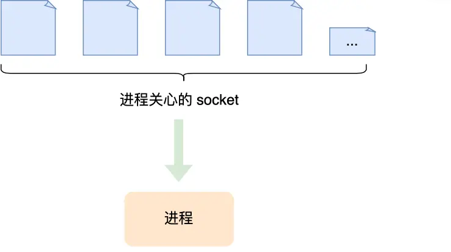

### select/poll

select

- 使用固定长度的 BitsMap 表示文件描述符集合，默认值 1024
- 将已连接的 Socket 都放到一个**文件描述符集合**，然后调用 select 函数将文件描述符集合**拷贝**到内核里，让内核来检查是否有网络事件产生
- 通过**遍历**文件描述符集合的方式，当检查到有事件产生后，将此 Socket 标记为可读或可写，接着再把整个文件描述符集合**拷贝**回用户态里
- 用户态还需要再通过**遍历**的方法找到可读或可写的 Socket，然后再对其处理。
- 需要进行 **2 次「遍历」文件描述符集合 和 2 次「拷贝」文件描述符集合**

poll

- 用动态数组，以链表形式来组织，突破了 select 的文件描述符个数限制，但还是会受到系统文件描述符限制

两种方式**时间复杂度为 O(n)，而且也需要在用户态与内核态之间拷贝文件描述符集合**，这种方式随着并发数上来，性能的损耗会呈指数级增长

### epoll

通过两个方面解决之前的问题：

- 在内核里使用**红黑树来跟踪进程所有待检测的文件描述字**，select/poll 每次操作时都传入整个 socket 集合给内核，epoll 只需要传入一个待检测的 socket，减少了内核和用户空间大量的数据拷贝和内存分配
- 使用**事件驱动**的机制，内核里**维护了一个链表来记录就绪事件**，当某个 socket 有事件发生时，通过**回调函数**内核会将其加入到这个就绪事件列表中

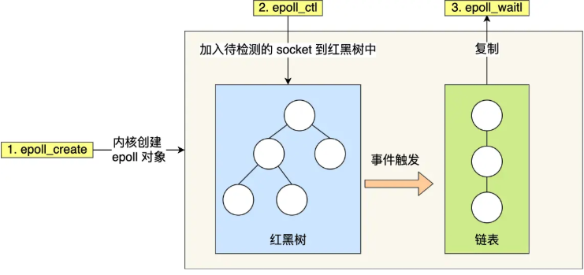

- 边缘触发：事件发生时，只提醒一次，即使进程没有读取数据也不会再提醒
- 水平触发：事件发生时，不断提醒直到数据被读取完

# 网络模式

当下开源软件能做到网络高性能的原因基本都是 I/O 多路复用

I/O 多路复用时面向过程编写代码的，因此有大佬对其进行一层封装——Reactor模式

Reactor 模式主要由 Reactor 和处理资源池这两个核心部分组成：

- Reactor 负责监听和分发事件，事件类型包含连接事件、读写事件
  - Reactor 的数量可以只有一个，也可以有多个
- 处理资源池负责处理事件，如 read -> 业务逻辑 -> send
  - 处理资源池可以是单个进程 / 线程，也可以是多个进程 /线程

Reactor 和处理资源池 两两组合有四种方案：

- 单 Reactor 单进程 / 线程
- 单 Reactor 多进程 / 线程
- 多 Reactor 单进程 / 线程（不如双单，实际不用）
- 多 Reactor 多进程 / 线程

## Reactor 

### 单 Reactor 单进程 / 线程

C 语言：单进程

进程里有 **Reactor、Acceptor、Handler** 这三个对象

- Reactor 对象的作用是监听和分发事件
- Acceptor 对象的作用是获取连接
- Handler 对象的作用是处理业务

select、accept、read、send 是系统调用函数，dispatch 和 「业务处理」是需要完成的操作，其中 dispatch 是分发事件操作

- 优点：全部工作都在同一个进程内完成，所以实现起来比较简单，不需要考虑进程间通信，也不用担心多进程竞争
- 缺点：单进程**无法充分利用 多核 CPU 的性能**；Handler 对象在业务处理时进程无法处理其他连接事件，**如果业务处理耗时比较长，那么就造成响应的延迟**

**适用于业务处理非常快速的场景，不适用于计算密集型场景**

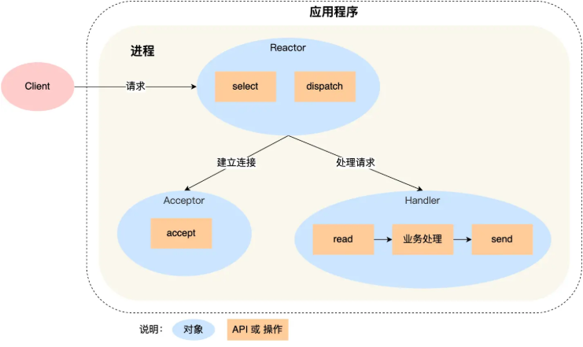

### 单 Reactor 多进程 / 线程

**     **

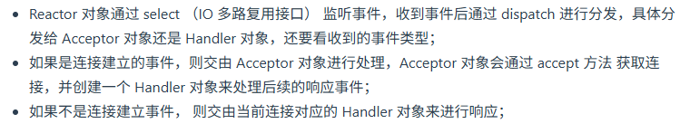

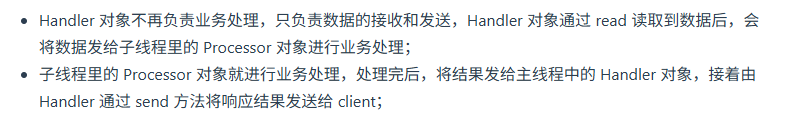

- 优点：**能够充分利用多核 CPU 的能**
- 缺点：实现复杂，需要考虑父子进程的通信，父进程还需要直到子进程要将数据发送到哪个客户端；**一个 Reactor 对象承担所有事件的监听和响应，容易成为性能瓶颈**

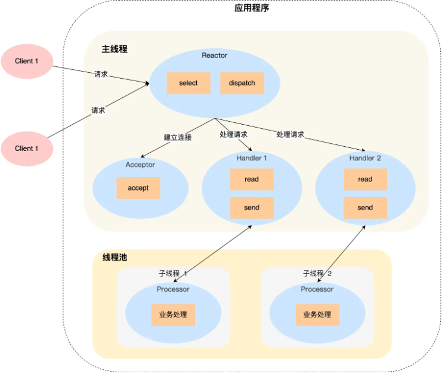

### 多 Reactor 多进程 / 线程

- 主线程中的 MainReactor 对象通过 select 监控连接建立事件，收到事件后通过 Acceptor 对象中的 accept 获取连接，将新的连接分配给某个子线程；
- 子线程中的 SubReactor 对象将 MainReactor 对象分配的连接加入 select 继续进行监听，并创建一个 Handler 用于处理连接的响应事件。
- 如果有新的事件发生时，SubReactor 对象会调用当前连接对应的 Handler 对象来进行响应。
- Handler 对象通过 read -> 业务处理 -> send 的流程来完成完整的业务流程。

多 Reactor 多线程的方案虽然看起来复杂，但是实际实现时比单 Reactor 多线程的方案要简单的多，原因如下：

- 主线程和子线程分工明确，**主线程只负责接收新连接，子线程负责完成后续的业务处理**。
- 主线程和子线程的交互很简单，主线程只需要把新连接传给子线程，**子线程无须返回数据，直接就可以在子线程将处理结果发送给客户端**。

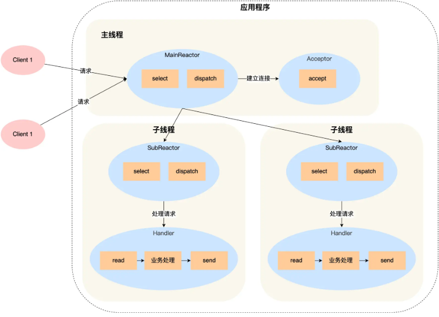

## Proactor

Reactor 是非阻塞同步网络模式，**Proactor 是异步网络模式**

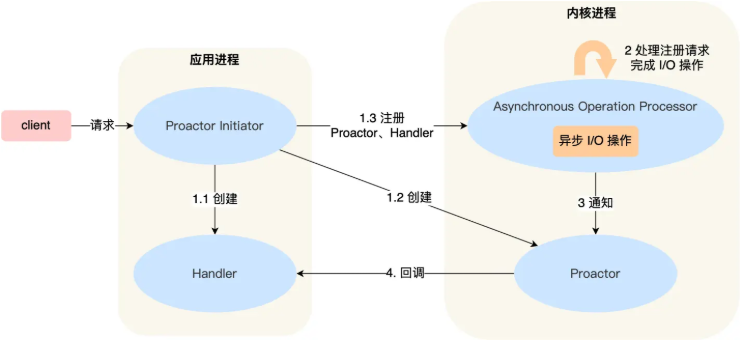
