# 进程调度算法

也称 CPU 调度算法

发生 CPU 调度的情况：

* 进程从**运行**状态转到**等待**状态（非抢占
* 进程从**运行**状态转到**就绪**状态（抢占
* 进程从**等待**状态转到**就绪**状态（抢占
* 进程从**运行**状态转到**终止**状态（非抢占

## 先来先服务调度算法

***First Come First Severd, FCFS***：**每次从就绪队列选择最先进入队列的进程，然后一直运行，直到进程退出或被阻****塞，才会继续从队列中选择第一个进程接着运行**

优点：公平

缺点：当一个长作业先运行了，那么后面的短作业等待的时间就会很长。不利于短作业

FCFS 对长作业有利，适用于 CPU 繁忙型作业的系统，而不适用于 I/O 繁忙型作业的系统

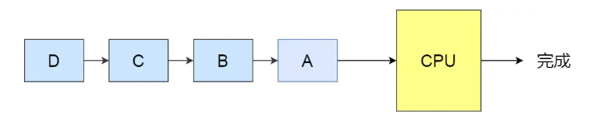

## 最短作业优先调度算法

*Shortest Job First, SJF：* **优先选择运行时间最短的进程来运行** 

优点：有助于提高系统的吞吐量

缺点：对长作业不利

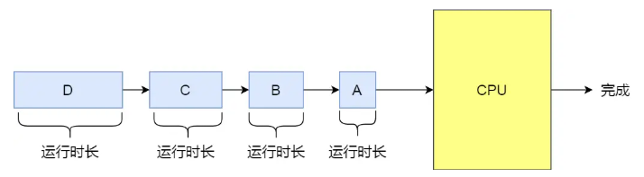

## 高响应比优先调度算法

*Highest Response Ratio Next, HRRN* **：**每次进行进程调度时，先计算「响应比优先级」，然后把「响应比优先级」最高的进程投入运行****

优先权 = （等待时间 + 要求服务时间）/ 要求服务时间

只是理论上的最佳算法，实际上做不到，因为不知道要求服务时间

## 时间片轮转调度算法

**Round Robin, RR：****每个进程被分配一个时间段，称为时间片（ *Quantum* ），即允许该进程在该时间段中运行**

* 如果时间片用完，进程还在运行，那么将会把此进程从 CPU 释放出来，并把 CPU 分配另外一个进程
* 如果该进程在时间片结束前阻塞或结束，则 CPU 立即进行切换

时间片长度对系统影响：

* 太短会导致过多的进程上下文切换，降低了 CPU 效率
* 太长又可能引起对短作业进程的响应时间变长

时间片设为 `20ms~50ms` 通常是一个比较合理的折中值

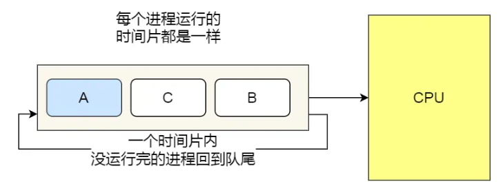

## 最高优先级调度算法

***Highest Priority First，HPF*** ：调度程序能**从就绪队列中选择最高优先级的进程进行运行**

进程优先级：

* 静态优先级：创建进程时候，就已经确定了优先级了，然后整个运行时间优先级都不会变化
* 动态优先级：根据进程的动态变化调整优先级，比如如果进程运行时间增加，则降低其优先级；如果进程等待时间增加，则升高其优先级

抢占式和非抢占式处理：

* 非抢占式：当就绪队列中出现优先级高的进程，运行完当前进程，再选择优先级高的进程
* 抢占式：当就绪队列中出现优先级高的进程，当前进程挂起，调度优先级高的进程运行

可能导致低优先级线程永远得不到执行

## 多级反馈队列调度算法

***Multilevel Feedback Queue***

* 多级：表示有多个队列，每个队列优先级从高到低，同时优先级越高时间片越短
* 反馈：表示如果有新的进程加入优先级高的队列时，立刻停止当前正在运行的进程，转而去运行优先级高的队列

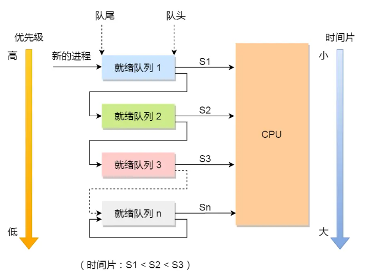

工作流程：

* 设置了多个队列，赋予每个队列不同的优先级，每个队列优先级从高到低，同时优先级越高时间片越短；
* 新的进程会被放入到第一级队列的末尾，按先来先服务的原则排队等待被调度，如果在第一级队列规定的时间片没运行完成，则将其转入到第二级队列的末尾，以此类推，直至完成；
* 当较高优先级的队列为空，才调度较低优先级的队列中的进程运行。如果进程运行时，有新进程进入较高优先级的队列，则停止当前运行的进程并将其移入到原队列末尾，接着让较高优先级的进程运行；

对于短作业可能可以在第一级队列很快被处理完。对于长作业，如果在第一级队列处理不完，可以移入下次队列等待被执行，虽然等待的时间变长了，但是运行时间也会更长了。该算法很好的兼顾了长短作业，同时有较好的响应时间。

# 内存页面置换算法

## 缺页中断

当 CPU 访问的页面不在物理内存时，便会产生一个缺页中断，请求操作系统将所缺页调入到物理内存

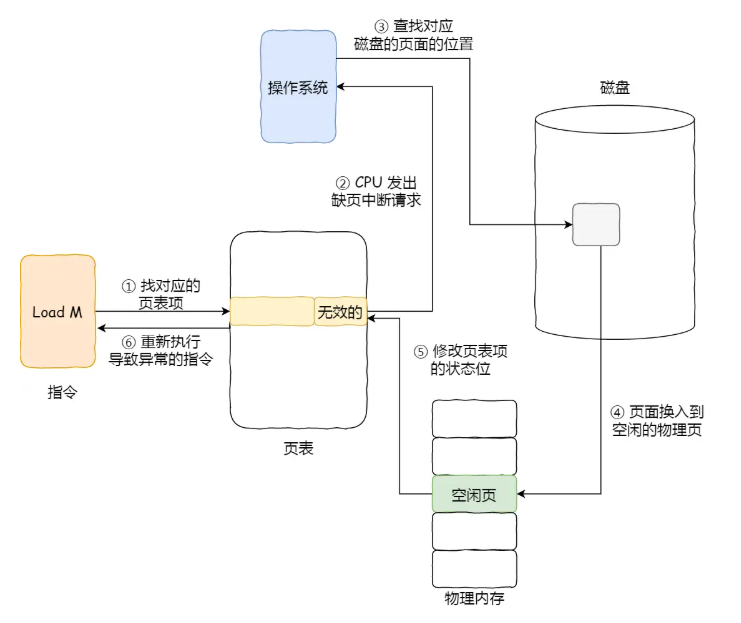

对于第四步，如果找不到空闲页，说明内存满了，需要「页面置换算法」选择一个物理页，如果该物理页有被修改过（脏页），则把它换出到磁盘，然后把该被置换出去的页表项的状态改成「无效的」，最后把正在访问的页面装入到这个物理页中

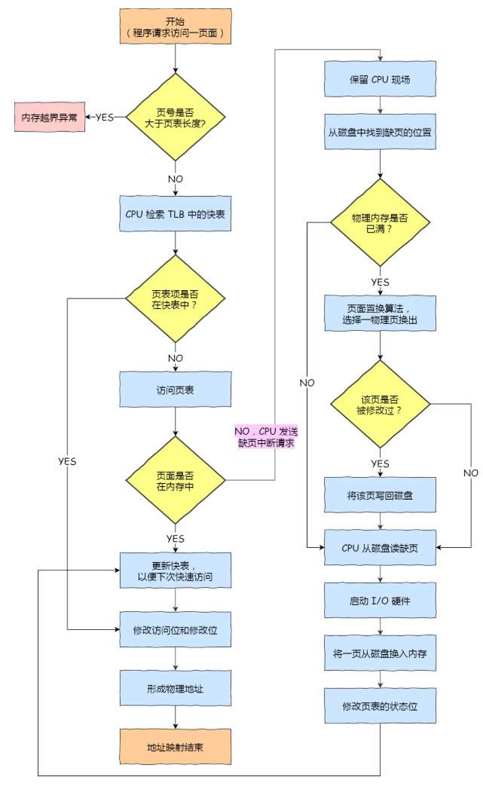

## 最佳页面置换算法

**置换在「未来」最长时间不访问的页面，算法实现需要计算内存中每个逻辑页面的「下一次」访问时间，然后比较，选择未来最长时间不访问的页面**

实际上是不可能实现的

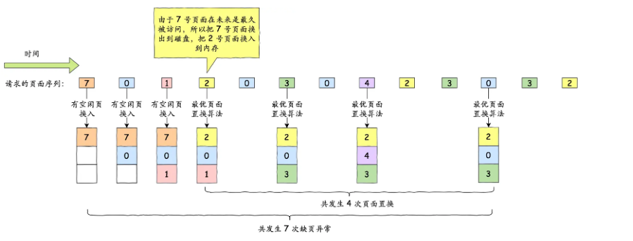

## 先进先出置换算法

**选择在内存驻留时间很长的页面进行中置换**

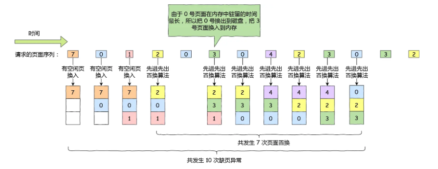

## 最近最久未使用的置换算法

发生缺页时，**选择最长时间没有被访问的页面进行置换**

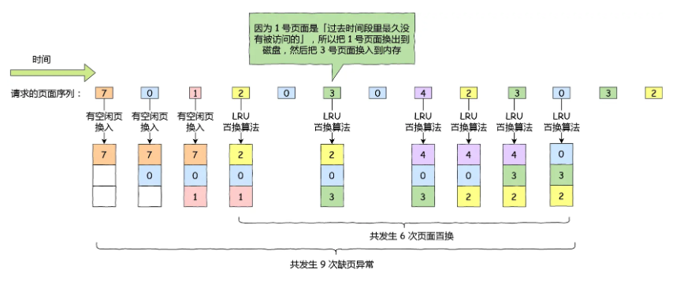

## 时钟页面置换算法

所有的页面都保存在一个类似钟面的「环形链表」中，一个表针指向最老的页面。当发生缺页中断时，算法首先检查表针指向的页面：

* 如果它的访问位位是 0 就淘汰该页面，并把新的页面插入这个位置，然后把表针前移一个位置
* 如果访问位是 1 就清除访问位，并把表针前移一个位置，重复这个过程直到找到了一个访问位为 0 的页面为止

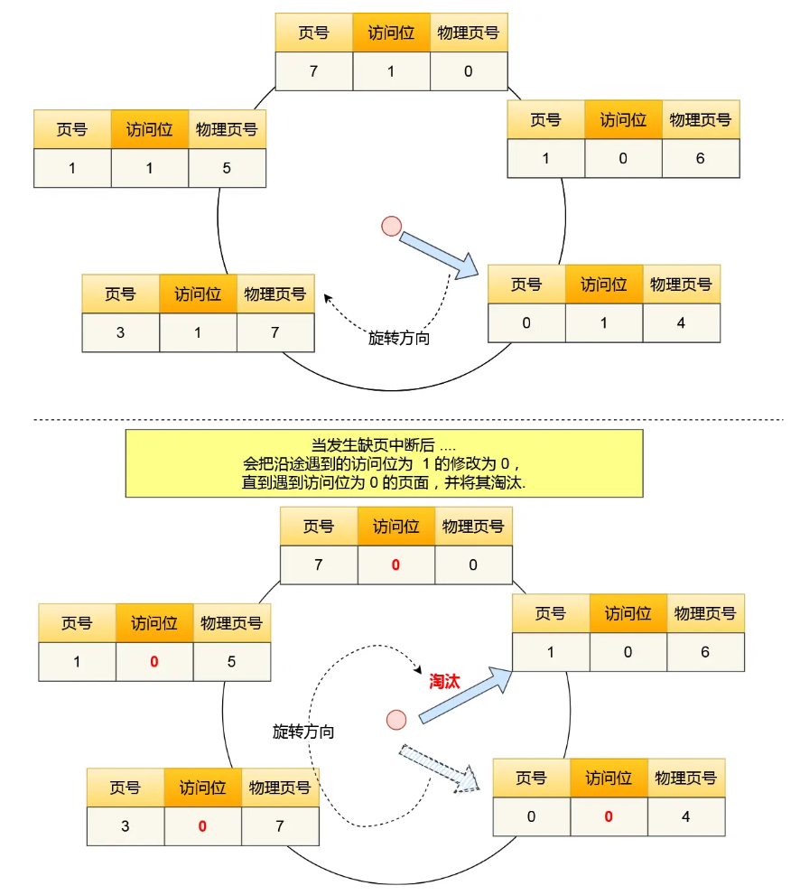

## 最不常用算法

**当发生缺页中断时，选择「访问次数」最少的那个页面，并将其淘汰**

对每个页面设置一个「访问计数器」，每当一个页面被访问时，该页面的访问计数器就累加 1。在发生缺页中断时，淘汰计数器值最小的那个页面。

# 磁盘调度算法

以下面的请求顺序为例：98，183，37，122，14，124，65，67

## 先来先服务

先到来的请求，先被服务

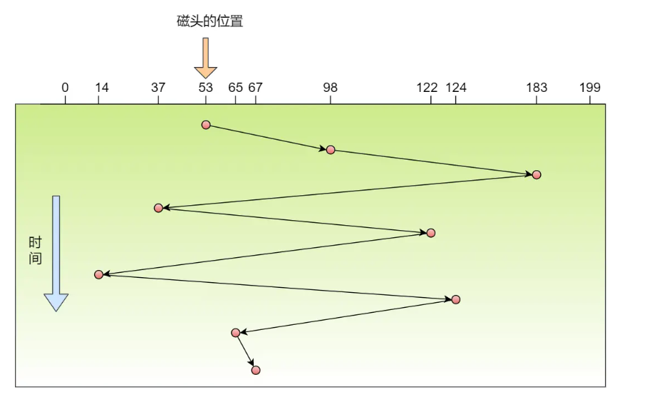

## 最短寻道时间优先

优先选择从当前磁头位置所需寻道时间最短的请求

可能导致饥饿

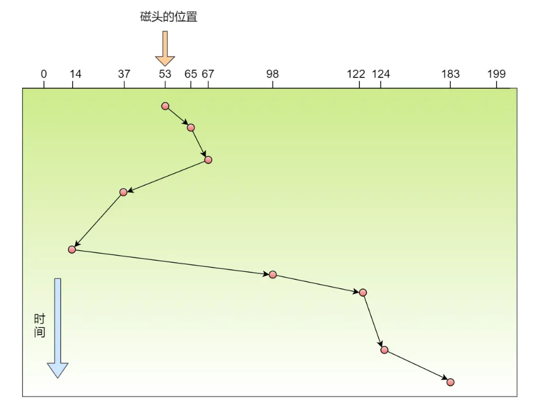

## 扫描算法

**磁头在一个方向上移动，访问所有未完成的请求，直到磁头到达该方向上的最后的磁道，才调换方向**

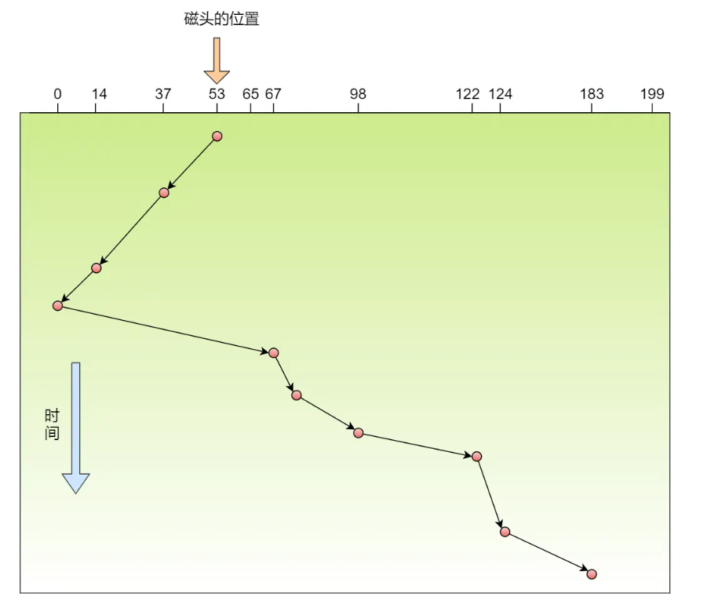

## 循环扫描算法

只有磁头朝某个特定方向移动时，才处理磁道访问请求，而返回时直接快速移动至最靠边缘的磁道

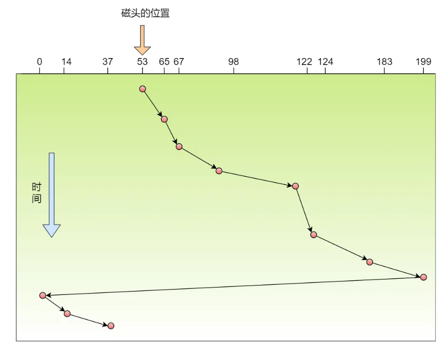

## LOOK 与 C-LOOK 算法

**磁头在移动到「最远的请求」位置，然后立即反向移动**

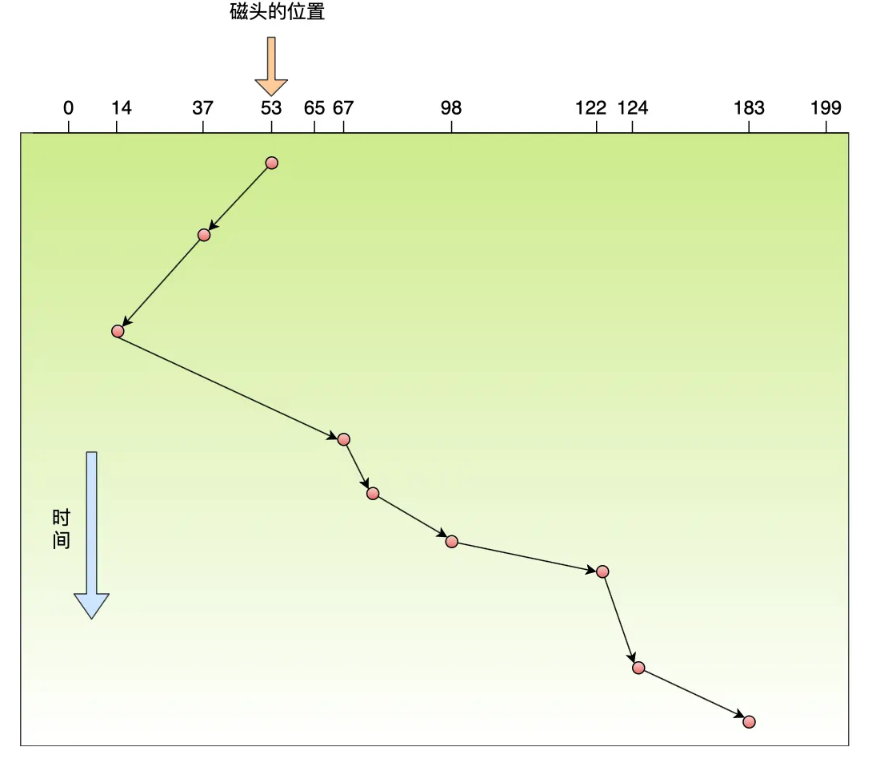

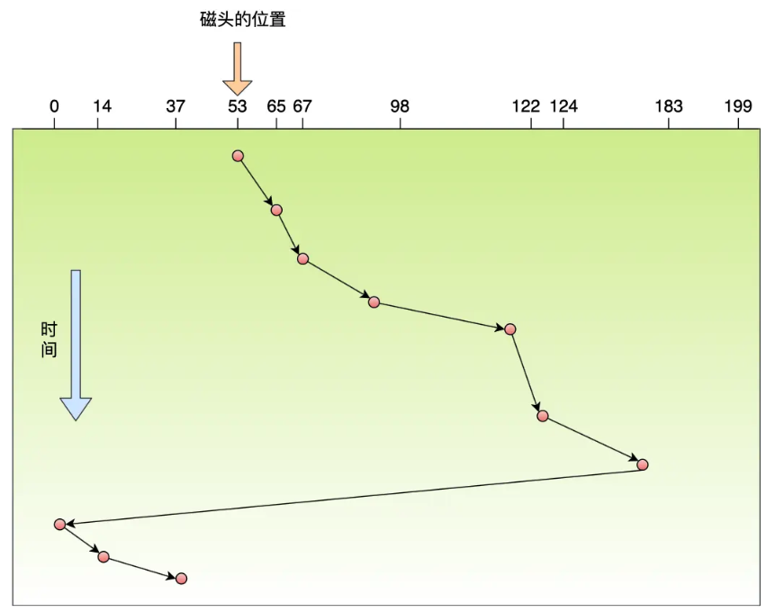
