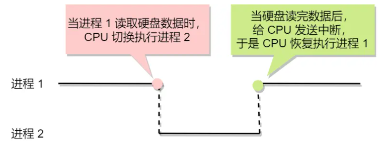
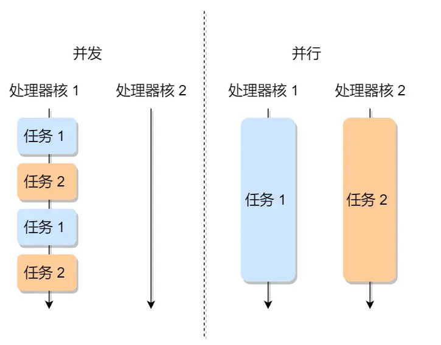
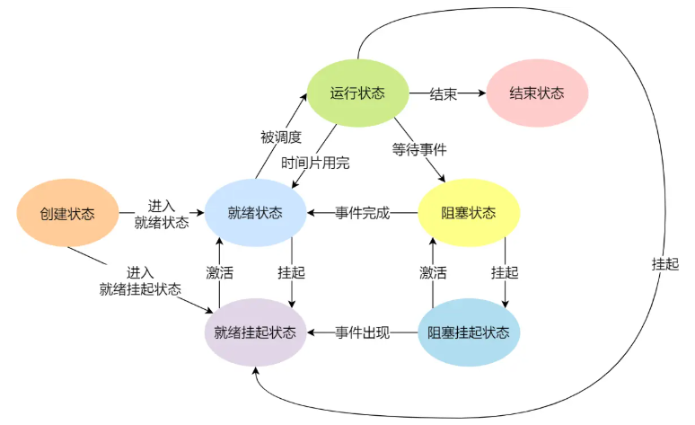
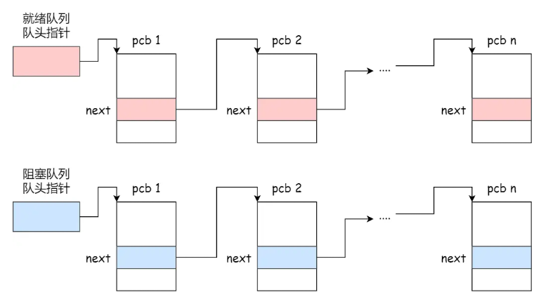
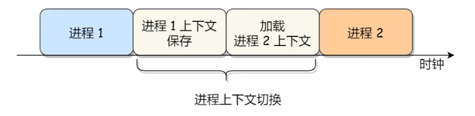
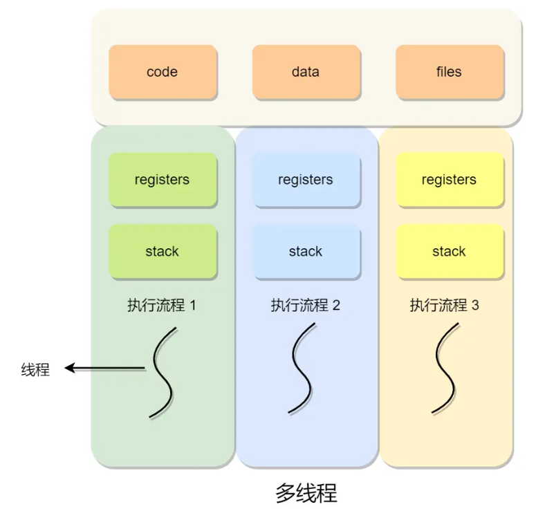
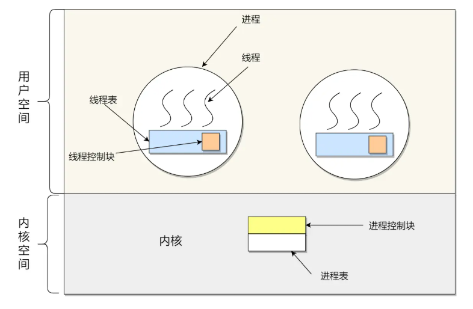
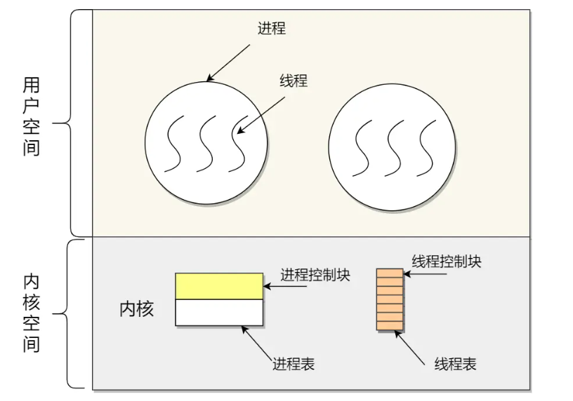
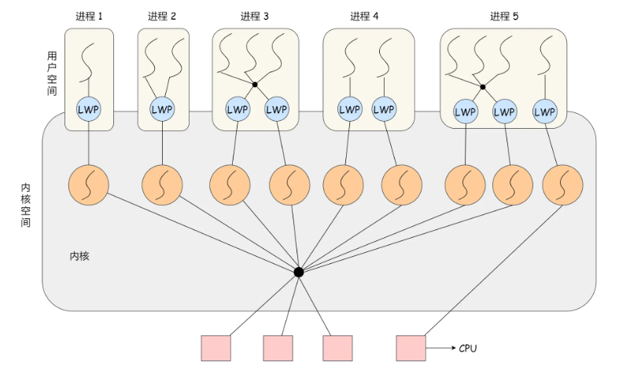

# 进程、线程基础知识

## 进程

进程：CPU正在执行的程序实例

并发和并行区别：

进程的状态：

* **运行状态（Running）** ：该时刻进程占用 CPU
* **就绪状态（Ready）** ：可运行，由于其他进程处于运行状态而暂时停止运行
* **阻塞状态（Blocked）** ：该进程正在等待某一事件发生（如等待输入 / 输出操作的完成）而暂时停止运行，这时，即使给它 CPU 控制权，它也无法运行
* **创建状态（new）** ：进程正在被创建时的状态
* **结束状态（Exit）** ：进程正在从系统中消失时的状态
* **阻塞挂起状态** ：进程在外存（硬盘）并等待某个事件的出现
* **就绪挂起状态** ：进程在外存（硬盘），但只要进入内存，即刻立刻运行

挂起状态用于描述进程没有占用实际的物理内存空间情况

进程状态变迁：

* **NULL -> 创建状态** ：一个新进程被创建时的第一个状态；
* **创建状态 -> 就绪状态** ：当进程被创建完成并初始化后，一切就绪准备运行时，变为就绪状态，这个过程是很快的；
* **就绪态 -> 运行状态** ：处于就绪状态的进程被操作系统的进程调度器选中后，就分配给 CPU 正式运行该进程；
* **运行状态 -> 结束状态** ：当进程已经运行完成或出错时，会被操作系统作结束状态处理；
* **运行状态 -> 就绪状态** ：处于运行状态的进程在运行过程中，由于分配给它的运行时间片用完，操作系统会把该进程变为就绪态，接着从就绪态选中另外一个进程运行；
* **运行状态 -> 阻塞状态** ：当进程请求某个事件且必须等待时，例如请求 I/O 事件；
* **阻塞状态 -> 就绪状态** ：当进程要等待的事件完成时，它从阻塞状态变到就绪状态；

### 进程控制结构

描述进程的数据结构是**进程控制块**（PCB）

PCB 主要包含的信息：

* 进程描述信息
  * 进程标识符：标识各个进程，每个进程都有一个并且唯一的标识符
  * 用户标识符：进程归属的用户，用户标识符主要为共享和保护服务
* 进程控制和管理信息
  * 进程当前状态，如 new、ready、running、waiting 或 blocked 等
  * 进程优先级：进程抢占 CPU 时的优先级
* 资源分配清单
  * 有关内存地址空间或虚拟地址空间的信息，所打开文件的列表和所使用的 I/O 设备信息
* CPU 相关信息
  * CPU 中各个寄存器的值，当进程被切换时，CPU 的状态信息都会被保存在相应的 PCB 中，以便进程重新执行时，能从断点处继续执行

PCB 组织结构：

* 通过**链表**的方式进行组织，把具有**相同状态的进程链在一起，组成各种队列**
  * 将所有处于就绪状态的进程链在一起，称为**就绪队列**
  * 把所有因等待某事件而处于等待状态的进程链在一起组成各种**阻塞队列**

### 进程控制

创建进程：

* 申请一个空白 PCB，并填写控制和管理进程的信息
* 为该进程分配资源
* 将 PCB 插入就绪队列，等待被调度运行

终止进程：正常结束、异常结束、外界干预（kill）

当子进程被终止时，其在父进程处继承的资源应当还给父进程；父进程被终止时，该父进程的子进程就变为孤儿进程，会被 1 号进程收养

* 查找需要终止的 PCB
* 如果处于执行状态，则立即终止该进程的执行，然后将 CPU 资源分配给其他进程
* 如果其还有子进程，则应将该进程的子进程交给 1 号进程接管
* 将该进程所拥有的全部资源都归还给操作系统
* 将其从 PCB 队列删除

阻塞进程：

* 找到将要被阻塞进程标识号对应的 PCB
* 如果该进程为运行状态，则保护其现场，将其状态转为阻塞状态，停止运行
* 将该 PCB 插入到阻塞队列中去

唤醒进程：

* 在该事件的阻塞队列中找到相应进程的 PCB
* 将其从阻塞队列中移出，并置其状态为就绪状态
* 把该 PCB 插入到就绪队列中，等待调度程序调度

### 进程上下文切换

**一个进程切换到另一个进程运行，称为进程的上下文切换**

CPU 上下文切换：

* CPU 上下文：CPU 运行任务前必须依赖的环境，比如 CPU 寄存器和程序计数器
* 把前一个任务的 CPU 上下文保存起来，然后加载新任务的上下文到这些寄存器和程序计数器，最后再跳转到程序计数器所指的新位置

进程上下文切换

包含了**虚拟内存、栈、全局变量等用户空间的资源，****内核堆栈、寄存器等内核空间的资源**

发生进程上下文切换场景：

* CPU 时间片耗尽
* 系统资源不足
* 进程通过sleep主动挂起
* 优先级更高的进程抢占
* 硬件中断

## 线程

比进程更小的能独立运行的基本单位，**进程当中的一条执行流程**

**线程是调度的基本单位，而进程则是资源拥有的基本单位**

同一个进程内多个线程之间可以共享代码段、数据段、打开的文件等资源。但每个线程各自都有一套独立的寄存器和栈，确保线程的控制流是相对独立的

线程优点：

* 一个进程中可以同时存在多个线程
* 各个线程之间可以并发执行
* 各个线程之间可以共享地址空间和文件等资源

缺点：

* 当进程中的一个线程崩溃时，可能会导致其所属进程的所有线程崩溃（C/C++会，Java不会）

### 线程上下文切换

当两个线程不是属于同一个进程，则切换的过程就跟进程上下文切换一样

**当两个线程是属于同一个进程，因为虚拟内存是共享的，切换时****只需要切换线程的私有数据、寄存器等不共享的数据**

### 线程实现

三种实现方式：

* **用户线程（User Thread）** ：在用户空间实现的线程，不是由内核管理的线程，是由用户态的线程库来完成线程的管理；
* **内核线程（Kernel Thread）** ：在内核中实现的线程，是由内核管理的线程；
* **轻量级进程（LightWeight Process）** ：在内核中来支持用户线程；

用户线程和内核线程关系：

* 多对一
* 一对一
* 多对多

### 用户线程

基于用户态的线程管理库实现，**用户线程的整个线程管理和调度，操作系统是不直接参与的**

类似多对一关系，多个用户线程对应一个内核线程

用户线程优点：

* 每个进程都需要有它私有的线程控制块（TCB）列表，用来跟踪记录它各个线程状态信息（PC、栈指针、寄存器），TCB 由用户级线程库函数来维护，可用于不支持线程技术的操作系统；
* 用户线程的切换也是由线程库函数来完成的，无需用户态与内核态的切换，速度快；

用户线程缺点：

* 操作系统不参与线程的调度，如果一个线程发起了系统调用而阻塞，那进程所包含的用户线程都不能执行了；
* 当一个线程开始运行后，除非它主动地交出 CPU 的使用权，否则它所在的进程当中的其他线程无法运行，因为用户态的线程没法打断当前运行中的线程，它没有这个特权，只有操作系统才有，但是用户线程不是由操作系统管理的；
* 由于时间片分配给进程，故与其他进程比，在多线程执行时，每个线程得到的时间片较少，执行会比较慢；

### 内核线程

类似一对一关系，一个用户线程对应一个内核线程

内核线程优点：

* 在一个进程当中，如果某个内核线程发起系统调用而被阻塞，并不会影响其他内核线程的运行；
* 分配给线程，多线程的进程获得更多的 CPU 运行时间；

内核线程缺点：

* 在支持内核线程的操作系统中，由内核来维护进程和线程的上下文信息，如 PCB 和 TCB；
* 线程的创建、终止和切换都是通过系统调用的方式来进行，因此对于系统来说，系统开销比较大；

### 轻量级进程

轻量级进程（LWP）**是内核支持的用户线程，一个进程可有一个或多个 LWP，每个 LWP 是跟内核线程一对一映射的，LWP 都是由一个内核线程支持，而且 LWP 是由内核管理并像普通进程一样被调度**

**LWP与普通进程的区别也在于它只有一个最小的执行上下文和调度程序所需的统计信息**

LWP 和用户线程关系：

* 一对一，一个 LWP 对应一个用户线程
* 多对一，一个 LWP 对应多个用户线程
* 多对多，多个 LWP 对应多个用户线程

一对一（进程 4 ）：

* 优点：实现并行，当一个 LWP 阻塞，不会影响其他 LWP；
* 缺点：每一个用户线程，就产生一个内核线程，创建线程的开销较大。

多对一（进程 2）：

* 优点：用户线程要开几个都没问题，且上下文切换发生用户空间，切换的效率较高；
* 缺点：一个用户线程如果阻塞了，则整个进程都将会阻塞，另外在多核 CPU 中，是没办法充分利用 CPU 的。

多对多（金程3）：

* 综合了前两种优点，大部分的线程上下文发生在用户空间，且多个线程又可以充分利用多核 CPU 的资源。

组合（进程 5）：开发人员可以针对不同的应用特点调节内核线程的数目来达到物理并行性和逻辑并行性的最佳方案

## 调度

### 调度时机

当进程从一个运行状态到另外一状态变化的时候，会触发调度

* 就绪态 → 运行态：进程被创建时，会进入到就绪队列，操作系统会从就绪队列选择一个进程运行
* 运行态 → 阻塞态：进程发生 I/O 事件而阻塞时，操作系统必须选择另外一个进程运行
* 运行态 → 结束态：进程退出结束后，操作系统得从就绪队列选择另外一个进程运行

### 调度原则

* **CPU 利用率** ：调度程序应确保 CPU 是始终繁忙的状态，这可提高 CPU 的利用率；
* **系统吞吐量** ：吞吐量表示的是单位时间内 CPU 完成进程的数量，长作业的进程会占用较长的 CPU 资源，因此会降低吞吐量，相反，短作业的进程会提升系统吞吐量；
* **周转时间** ：周转时间是进程运行 + 阻塞时间 + 等待时间的总和，一个进程的周转时间越小越好；
* **等待时间** ：这个等待时间不是阻塞状态的时间，而是进程处于就绪队列的时间，等待的时间越长，用户越不满意；
* **响应时间** ：用户提交请求到系统第一次产生响应所花费的时间，在交互式系统中，响应时间是衡量调度算法好坏的主要标准。

### 调度算法

# 进程通信
