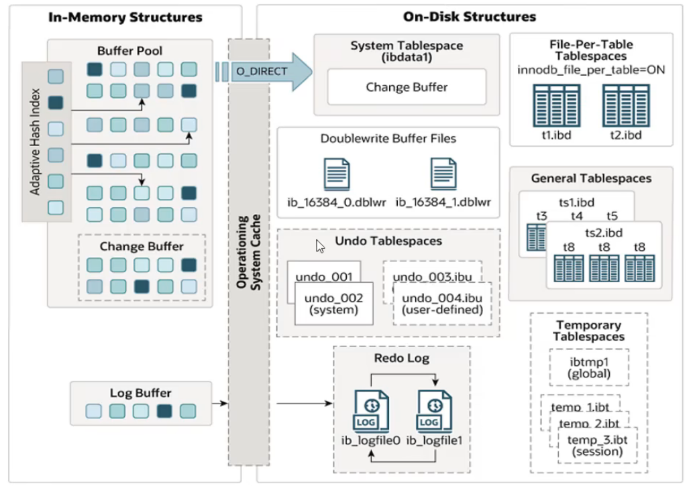

> 拆自 [黑马MySQL.md](./黑马MySQL.md)，原文未改。

# InnoDB引擎

## 逻辑存储结构

* 表空间（ibd文件）：一个mysql可以对应多个表空间，用于存储记录、索引等数据
* 段：分为数据段、索引段、回滚段，InnoDB是索引组织表，数据段是B+树的子节点、索引段是B+树的非子节点
* 区：表空间的单元结构，每个区大小为1M。默认情况页大小为16K，一个区有64个连续的页
* 页：InnoDB引擎磁盘管理的最小单元。为保证页的连续性，每次从磁盘申请4-5个区
* 行：数据按照行进行存放

## 内存架构

### 左侧为内存结构

* Buffer Pool（缓冲池）：缓存磁盘上经常操作的真实数据，curd时，先操作缓冲池的数据，然后再以一定频率刷新到磁盘，减少磁盘IO
  * 缓冲池以Page页为单位
  * free page：空闲页，未被使用
  * change page：被使用页，数据没有被修改过
  * dirty page：脏页，数据被修改过但是与磁盘中的不一致
* Change Buffer（更改缓冲区）：针对于非唯一二级索引页，执行DML语句时，如果数据也不在缓冲池中，不会直接操作磁盘，而是将数据变更存在更改缓冲区中，未来数据被读取时，再将数据合并恢复到缓冲池中，刷新到磁盘中。
  * 二级索引通常是非唯一的，并且插入顺序相对随机，删除和更新都可能影响索引树中不相邻的二级索引，每次都操作磁盘会造成大量IO
* Log Buffer（日志缓冲区）：保存要写入磁盘中log日志的数据，默认大小16MB，日志会定期刷新到磁盘中
  * `innodb_log_buffer_size`：日志缓冲区大小（`show variables like '%log_bnuffer_size%'`）
  * `innodb_flush_log_at_trx_commit`：日志刷新磁盘时机
    * 0:每秒将日志写入并刷新到磁盘一次
    * 1:日志在每次事务提交时写入磁盘
    * 2:日志在每次事务提交后写入，每秒刷新到磁盘
* Adaptive Hash Index（自适应哈希索引）：优化对缓冲池的查询，引擎会监控对表上个各索引页的查询，如果发现哈希索引可以提升速度，则建立哈希索引（系统自动完成）

### 右侧为磁盘结构

* System TableSpace（系统表空间）：更改缓冲区的存储区域，如果表是在系统表空间而不是表文件/通用表空间创建的，也可能包含存储数据
  * 参数：`innodb_data_file_path`
* File-Per-Table Tablespaces（独立表空间）：每个表的文件表空间包含单个InnoDB表的数据和引擎索引，并存储在文件系统上的单个数据文件中
  * 参数：`innodb_file_per_table`
* General Tablespaces（通用表空间）：创建表时，可以指定该表空间
  * 创建： `create tablespace 表空间名 add datafile 文件名 engine = engine_name`
  * 使用：`create table xxx tablepace 关联的表空间 `
* Undo Tablespaces（撤销表空间）：用于存储undo log日志，默认创建两个大小为16MB的
* Temporary Tablespaces（临时表空间）：存储用户创建的临时表等数据
* Doublewrite Buffer Files（双写缓冲区）：引擎将数据页从Buffer Pool刷新到磁盘前，先将数据页写入这里，便于系统异常时回复
  * #ib_16384_0.dblwr
  * #ib_16384_1 .dblwr
* Redo Log（重做日志）：用于实现事务的持久性。
  * ib_logfile0
  * ib_logfile1

## 后台线程

* 将缓冲池数据在合适时机刷新到磁盘中
* 分类
  * Master Thread：核心后台线程，负责调度其他线程，还负责将缓冲池的数据异步刷新到磁盘中，and脏页刷新，合并插入缓存，undo页回收
  * IO Thread：负责IO请求回调（引擎使用了大量AIO处理IO请求）
    
  * Purge Thread：回收事务以及提交的undo log
  * Page Cleaner Thread：协助Master Thread刷新脏页到磁盘

## 事务原理

* 事务的原子性、一致性、持久性由redo log和undo log控制
* 隔离性通过锁和MVCC实现

## MVCC

### 基本概念

* 当前读
  * 读取的是记录的最新版本，读取时要保证其他并发事务不能修改当前记录描绘对读取的记录进行加锁
  * `select ... lock in share mode,select for ... update,update,insert,delete(排他锁)` 都是当前读
* 快照读
  * 快照读，读取的是记录数据的可见版本。可能是历史数据，非阻塞读
  * 简单的select（不加锁）就是快照读
  * Read Commited：每次select都会生成一个快照读
  * Repeatable Read：开启事务后第一个select语句才是快照读的地方
  * Serializable：快照读会退化为当前读
* MVCC
  * Multi-Version Concurrency Control，多版本并发控制。
  * 维护一个数据的多个版本，使得读写操作没有冲突
  * 具体实现依赖数据库中三个隐式字段、undo log日志、readView

### 隐式字段

* 创建表时，会生成隐藏的字段
* 查看隐式字段：`ibd2sdi ibd文件`

### undolog

* insert的时候，日志只在回滚需要，事务提交后可被立即删除
* update、delete的时候，日志在回滚和快照读都需要，不会立即被删除
* undo log版本链：事务对同一条记录进行修改，会导致该记录的undo log生成一条记录版本的链表，头部是最新的旧纪录，尾部是最早的旧纪录

### readView

* 快照读SQL执行时MVCC提取数据的依据，记录并维护系统当前活跃的事务id
* 核心字段

* 版本链数据访问规则：
  * trx_id(当前事务id)==creator_trx_id，可以访问（数据是这个事务更改的）
  * trx_id < min_trx_id，可以访问（数据已经提交）
  * trx_id > max_trx_id，不能访问（事务是在ReadView生成后才开启）
  * min_trx_id<=trx_id<=max_trx_id，trx_id不在m_ids中可以访问（数据已经提交）
* 生成时机：
  * Read Commited：事务中每次执行快照读时生成ReadView
  * Repeatable Read：事务第一次执行快照读时生成ReadView，后续复用

### 可重复读

* 启动事务时生成一个Read View，然后整个事务期间都用这个Read View

### 读提交

* 每次读取数据时，都会生成一个新的 Read View

## 与 MyISAM 区别

### 索引

| 项目         | MyISAM   | InnoDB   |
| ------------ | -------- | -------- |
| 索引结构     | B+Tree   | B+Tree   |
| 主键索引     | 非聚簇   | 聚簇     |
| 叶子节点     | 数据地址 | 整行数据 |
| 二级索引存储 | 数据地址 | 主键值   |
| 是否回表     | ❌       | ✅       |
| 数据与索引   | 分离     | 一体     |
