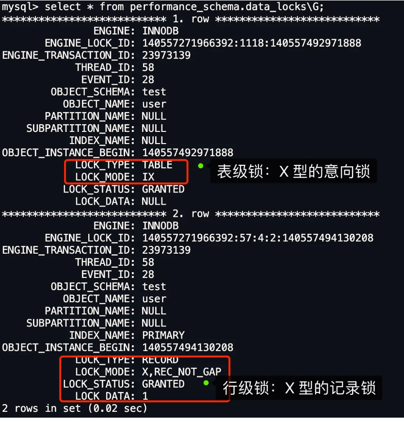

# MySQL 如何加锁

## 哪些 SQL 语句加锁？

* 普通 select 语句不会加锁，加锁可以使用下面语句

```sql
# 对读取的记录加共享锁(S型锁)
select ... lock in share mode;

# 对读取的记录加独占锁(X型锁)
select ... for update;

# 两条语句必须在事务中，事务提交锁被释放
```

* update 和 delete 操作会加独占型行级锁

## MySQL 加行级锁

* **加锁的对象是索引，加锁的基本单位是 next-key lock**（前开后闭区间）
* **能使用记录锁或者间隙锁就能避免幻读现象的场景下**，next-key lock 会退化成记录锁或间隙锁
* 查看事务执行时的加锁命令：`select * from performance_schema.data_locks\G`
  * LOCK_MODE = x，加临建锁
  * LOCK_MODE = x，REC_NOT_GAP，加记录锁
  * LOCK_MODE = x，GAP，加间隙锁



### 唯一索引（主键索引）等值查询

* 查询记录是否存在影响加锁规则
  * 记录存在，退化为记录锁
  * 记录不存在，退化为间隙锁，间隙范围为(比id小的最大值，比id大的最小值)

### 唯一索引（主键索引）范围查询

* **会对每一个扫描到的索引加 next-key 锁**，如果存在下列情况，锁会退化：
  * ≥ 查询，如果等值查询记录存在，等值查询的那条记录退化为记录锁
  * ＜ 或 ≤ 查询，根据条件值是否存在于表中：
    * 不存在，扫描到终止范围查询的记录时，退化为间隙锁
    * 存在，且查询条件是 ＜，扫描到终止范围查询的记录时，退化为间隙锁

### 非唯一索引等值查询

* 对于非主键索引，**会对非主键索引和对应的主键索引都加锁，****但是对主键索引加锁的时候****，只有满足查询条件的记录才会加锁**
* 根据查询记录是否存在：
  * 查询记录存在，扫描到第一条**不符合条件的二级索引记录**，退化为间隙锁，之前加的是临建锁，然会对查询到的唯一索引加记录锁
  * 查询记录不存在，扫描到第一条**不符合条件的二级索引记录**，退化为间隙锁，不会对主键索引加锁

### 非唯一索引范围查询

* 锁不会退化，加的全是临建锁

### 没有加索引的查询

* 每条记录都会加上临建锁，相当于锁全表
