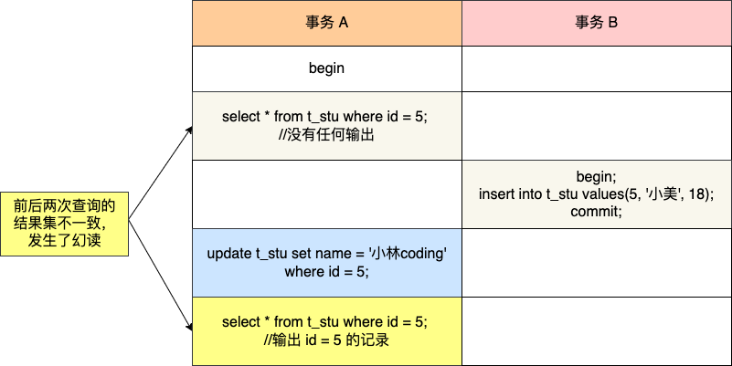
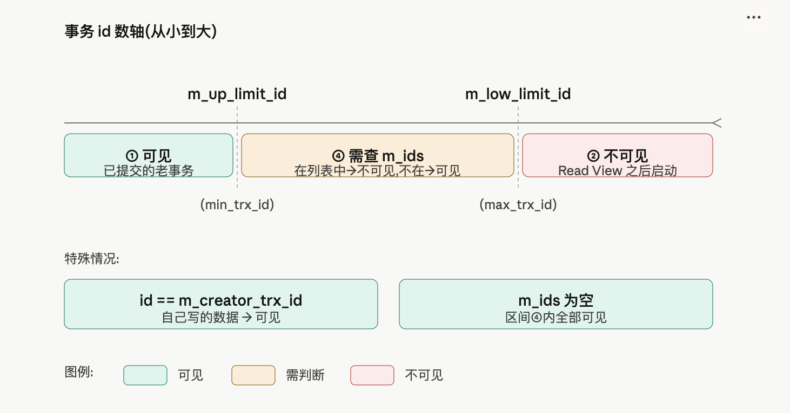
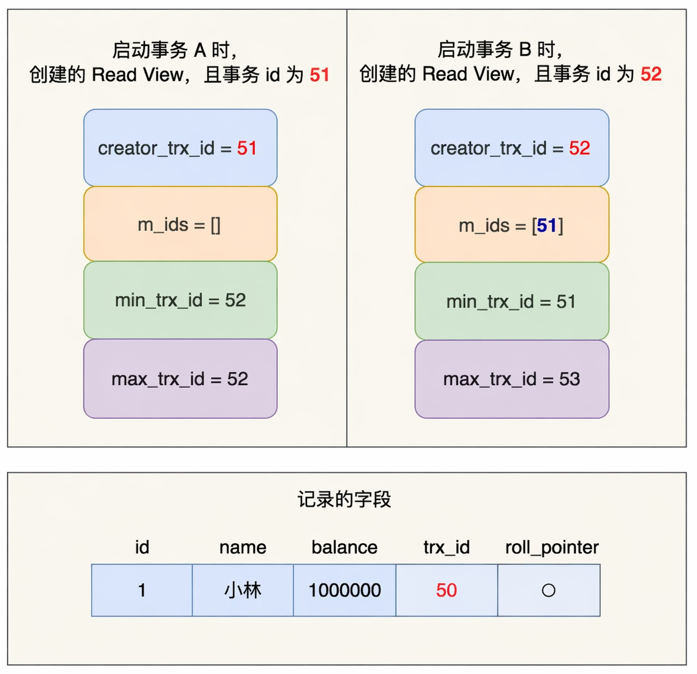
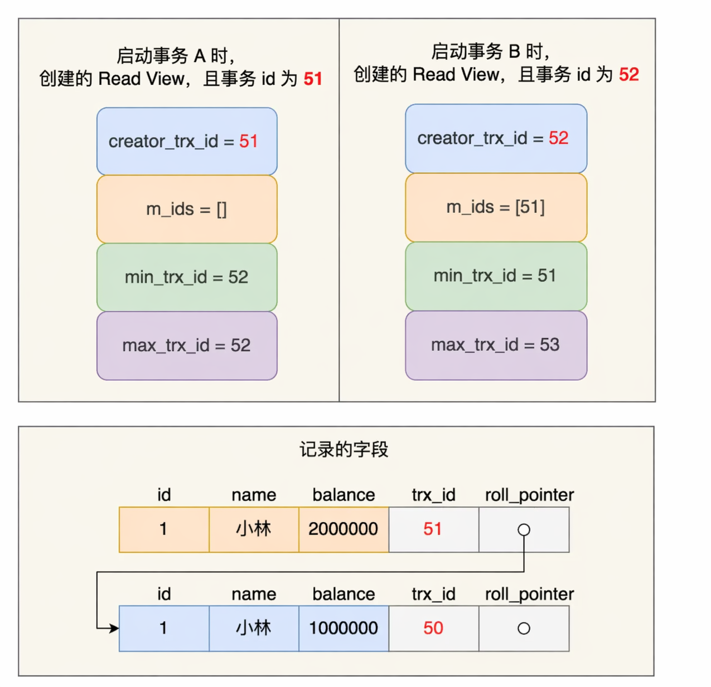
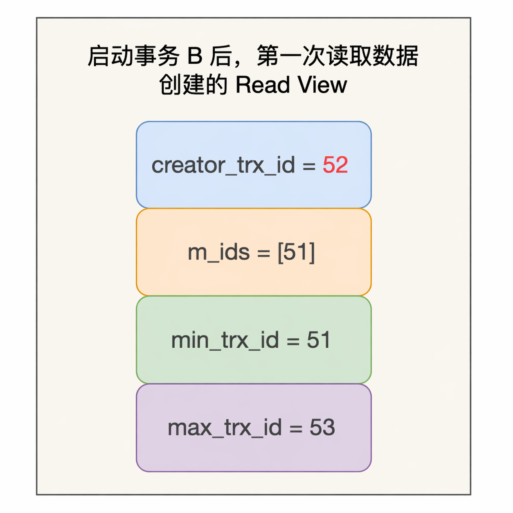
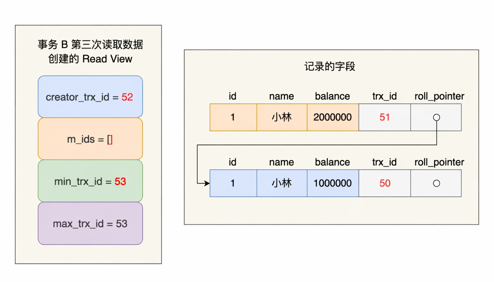

# 事务

## 简介

* **事务**是一组操作的集合，是一个不可分割的工作单位，事务会把所有的操作作为应该整体一起向系统提交或撤销操作请求，这些操作**要么同时成功，要么同时失败**
* MySQL默认自动提交

```sql
# 查看事务提交方式
select @@autocommit;

# 改为手动提交事务
set @@autocommit = 0;

# 开启事务
start transaction;
begin;

# 提交事务
commit;

# 回滚事务
rollback;
```

## 特性

* **原子性（Atomicity）**：事务是一个不可分割的工作单位，事务中的操作要么全部成功，要么全部失败。通过 redo log 实现
* **一致性（Consistency）**：事务完成时，必须使所有数据都保持一致状态。通过 undo log 实现
* **隔离性（Isolation）**：数据库系统提供隔离机制，保证事务在不受外部并发操作影响的独立环境下运行。通过MVCC 实现
* **持久性（Durability）**：事务提交或回滚后，对数据的改变是持久的，即使数据库发生故障也不应该对其有影响。通过实现前三个保证

## 并发问题

严重级别：脏读＞不可重复读＞幻读

* **脏读**：一个事务读到另外一个事务还没有提交的数据


* **不可重复读**：一个事务先后读取同一条记录，但两次读取的数据不同


* **幻读**：一个事务按照条件查询数据时，没有对应的数据行，但是在插入数据时，又发现这行数据已经存在，好像发生了幻觉一样


## 事务隔离级别

| 隔离级别                                                                                                                                                           | 脏读 | 不可重复读 | 幻读                      |
| ------------------------------------------------------------------------------------------------------------------------------------------------------------------ | ---- | ---------- | ------------------------- |
| Read uncommited：读未提交<br />一个事务还没提交时，它做的变更就能被其他事务看到                                                                                    | √   | √         | √                        |
| Read commited：读已提交(Oracle默认)<br />一个事务提交之后，它做的变更才能被其他事务看到                                                                            | ×   | √         | √                        |
| Repeatable Read：可重复读(MySQL默认)<br />一个事务执行过程中看到的数据，一直跟这个事务启动时看到的数据是一致的                                                     | ×   | ×         | √ (标准) / ≈× (InnoDB) |
| Serializable：串行化<br />会对记录加上读写锁<br />在多个事务对这条记录进行读写操作时，如果发生了读写冲突的时候，后访问的事务必须等前一个事务执行完成，才能继续执行 | ×   | ×         | ×                        |

* 从上到下数据安全性越来越高，但是性能越来越低

```sql
# 查看事务隔离级别
select @@transaction_isolation;

# 设置事务隔离级别
set [session|global] transaction isolation level 隔离级别;
```

## MySQL 与幻读

* 快照读、当前读 **不是 RR 独有**，RC 也有。差别在 Read View 怎么建、当前读加不加间隙锁
* 读未提交：普通 select 读最新版本（可脏读），**不算** MVCC 快照读
* 串行化：普通 select 会加锁，退化成当前读

### 快照读

* 普通 `select`（不加锁），走 MVCC，读某个 Read View 下可见的版本，不阻塞写
* **RR**：事务里**第一次**快照读创建 Read View，后面一直复用。别的事务插入并提交了，再 select 仍看不到（所以能挡住「快照读意义上的幻读」）
* **RC**：每次 select **新建**一个 Read View，只能保证读到已提交数据。别的事务插入并提交后，下一次 select 能看到新行，**挡不住幻读，也挡不住不可重复读**

### 当前读

* `select ... for update / lock in share mode`、`update`、`delete`、`insert`：读**最新已提交版本**并加锁
* **RR**：搜索/扫描用 next-key（记录锁 + 间隙锁）。例如间隙 (3, 5) 能挡住插入 id=4；范围当前读可能锁到 (2, +∞]
* **RC**：搜索/扫描一般**只有记录锁，不加间隙锁**（外键、唯一冲突检查除外），所以当前读也**挡不住幻读**——别的事务仍能在间隙里插入


### 无法解决的幻读情况

RR 下快照读靠 MVCC、当前读靠 next-key lock，**大部分幻读能挡住，挡不住下面两种。**

**场景一：快照读之后，更新了别人新插入的行**

* 事务 A 快照读 `id = 5`，当时没有这行
* 事务 B 插入 `id = 5` 并提交
* 事务 A 再 `update ... where id = 5`（当前读），能改到这行；随后快照读也能看到它



* 原因：A 第一次 select 已经建好 Read View，按可见性规则看不到 B 插入的行（`trx_id` 是 B 的）。但 **update 是当前读**，读的是最新已提交版本，把这行改掉后，隐藏列 `trx_id` 变成 A 自己的 id。再快照读时命中「自己改过的版本一定可见」，行就出现了。所以 **MVCC 并不能彻底挡住幻读**。

**场景二：先快照读，再当前读**

* 事务 B 插入了一条原本不存在的数据，事务 A 能查出来
* 
* 原因：第一次是普通 select，**只建 Read View，不加 next-key lock**，B 能在间隙里插入并提交。后面的 `select ... for update` 是当前读，**不走 Read View，读最新已提交数据**，结果集比第一次多一行。间隙锁必须当前读才会加上，所以「先快照、后当前」会漏。

* 避免：在事务开启后尽量马上执行 `select ... for update`，先把范围内的记录锁 + 间隙锁加上，别的事务插不进来


## 事务原理

* 事务的原子性、一致性、持久性由redo log和undo log控制
* 隔离性通过锁和MVCC实现

## MVCC

### 基本概念

* 当前读
  * 读取的是记录的最新版本，读取时要保证其他并发事务不能修改当前记录描绘对读取的记录进行加锁
  * `select ... lock in share mode,select for ... update,update,insert,delete(排他锁)` 都是当前读
* 快照读
  * 快照读，读取的是记录数据的可见版本。可能是历史数据，非阻塞读
  * 简单的select（不加锁）就是快照读
  * Read Commited：每次select都会生成一个快照读
  * Repeatable Read：开启事务后第一个select语句才是快照读的地方
  * Serializable：快照读会退化为当前读
* MVCC
  * Multi-Version Concurrency Control，多版本并发控制。
  * 维护一个数据的多个版本，使得读写操作没有冲突
  * 具体实现依赖数据库中三个隐式字段、undo log日志、readView

### 隐式字段

* 创建表时，会生成隐藏的字段
* 查看隐式字段：`ibd2sdi ibd文件`


### undolog

* insert的时候，日志只在回滚需要，事务提交后可被立即删除
* update、delete的时候，日志在回滚和快照读都需要，不会立即被删除
* undo log版本链：事务对同一条记录进行修改，会导致该记录的undo log生成一条记录版本的链表，头部是最新的旧纪录，尾部是最早的旧纪录


### readView

* 快照读SQL执行时MVCC提取数据的依据，记录并维护系统当前活跃的事务id
* 核心字段


* 四个字段要点
  * **m_ids**：创建 Read View 时，系统里**已启动但未提交**的事务 id 列表，**不含创建该 Read View 的事务自己**
  * **min_trx_id**：m_ids 的最小值；m_ids 为空时，等于 max_trx_id
  * **max_trx_id**：不是 m_ids 的最大值，而是**下一个将要分配给新事务的 id**（全局事务 id 计数器当前值）
  * **creator_trx_id**：创建该 Read View 的事务 id，自己改过的版本一定可见
* 版本链数据访问规则：
  * creator_trx_id < min_trx_id，可以访问（数据已经提交）
  * creator_trx_id > max_trx_id，不能访问（事务是在ReadView生成后才开启）
  * min_trx_id<=creator_trx_id<=max_trx_id，trx_id不在m_ids中可以访问（数据已经提交）
* 更精确的区间（InnoDB 源码 `ReadView::changes_visible()`）
  * **creator_trx_id < min_trx_id**：创建 Read View 前已提交 → 可见
  * **creator_trx_id >= max_trx_id**：创建 Read View 之后才启动 → 不可见
  * **min_trx_id <= creator_trx_id < max_trx_id**：再查 m_ids
    * 在 m_ids 里：当时还活跃、未提交 → 不可见
    * 不在 m_ids 里：id 已分配，但创建 Read View 时已经提交 → 可见
  * 当前版本不可见时，沿 **roll_pointer** 走 undo 版本链，直到找到可见版本



* 生成时机：
  * Read Commited：事务中每次执行快照读时生成ReadView
  * Repeatable Read：事务第一次执行快照读时生成ReadView，后续复用
* 执行 `begin` / `start transaction` **并不等于事务已经启动**
  * 这两种写法：执行完命令后，要等到**第一条快照读**（或第一条真正访问引擎的语句），事务才真正启动，RR 的 Read View 也在这时创建
  * `start transaction with consistent snapshot`：**立刻**启动事务并创建 Read View

### 可重复读

* 启动事务时生成一个Read View，然后整个事务期间都用这个Read View
* 例子：trx 50 已插入余额 100 万并提交；事务 A（id=51）先启动，事务 B（id=52）后启动



  * 事务 A 的 Read View：`creator_trx_id=51`，`m_ids=[]`（当时没有其他活跃事务，且不含自己），`min_trx_id=max_trx_id=52`
  * 事务 B 的 Read View：`creator_trx_id=52`，`m_ids=[51]`，`min_trx_id=51`，`max_trx_id=53`
* 走读过程（B 始终复用启动时那个 Read View）
  * B 第一次读：记录 `trx_id=50`，50 < min_trx_id(51) → 可见，余额 100 万
  * A 把余额改成 200 万（未提交）：当前记录 `trx_id=51`，旧版本通过 roll_pointer 链到 `trx_id=50`



  * B 第二次读：最新版 `trx_id=51` 落在 `[51, 53)` 且在 m_ids 里 → 不可见，沿版本链找到 `trx_id=50` → 仍是 100 万
  * A 提交后 B 再读：RR **不重建** Read View，m_ids 仍是 `[51]`，最新版仍不可见，还是 100 万

### 读提交

* 每次读取数据时，都会生成一个新的 Read View
* 同样是 A(51) 改余额、B(52) 三次快照读，差别只在 B **每次读都新建** Read View
* A 未提交时，B 第一次、第二次读到的 Read View 一样



  * `m_ids=[51]`，最新版 `trx_id=51` 不可见，沿版本链读到 100 万（避免脏读）
* A 提交后，B 第三次读会新建 Read View：A 已不在活跃列表



  * `m_ids=[]`，`min_trx_id=53`，最新版 `trx_id=51` < 53 → 可见，读到 200 万
* 所以 RC 下同一事务多次读同一行，中间若有别的事务提交，前后结果可以不一致（不可重复读）
