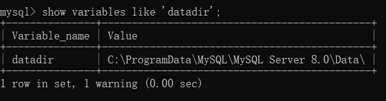
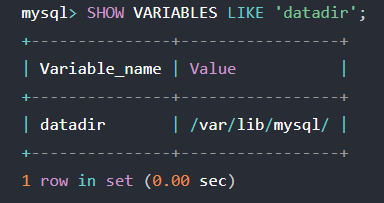
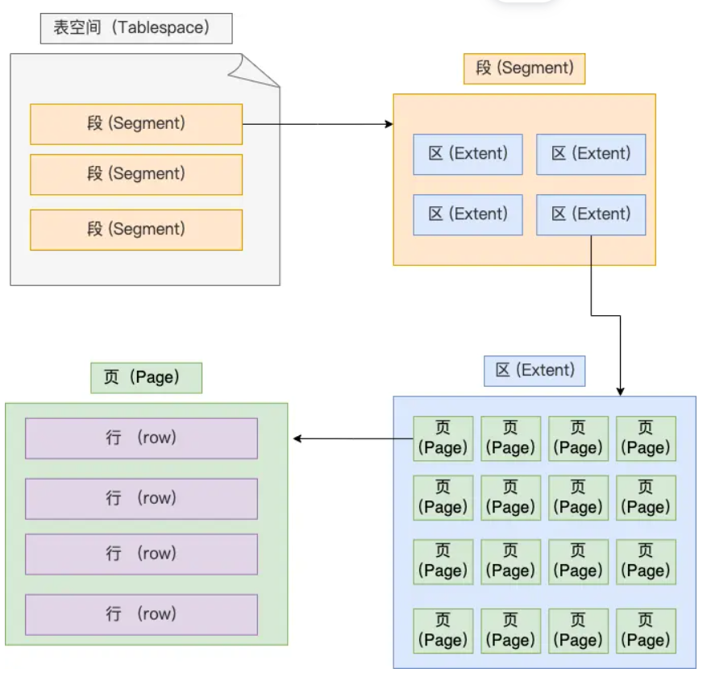
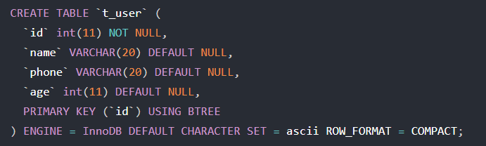
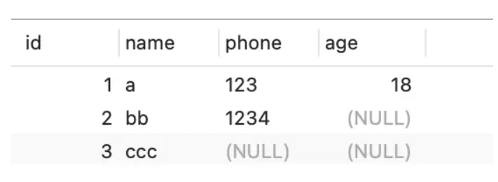
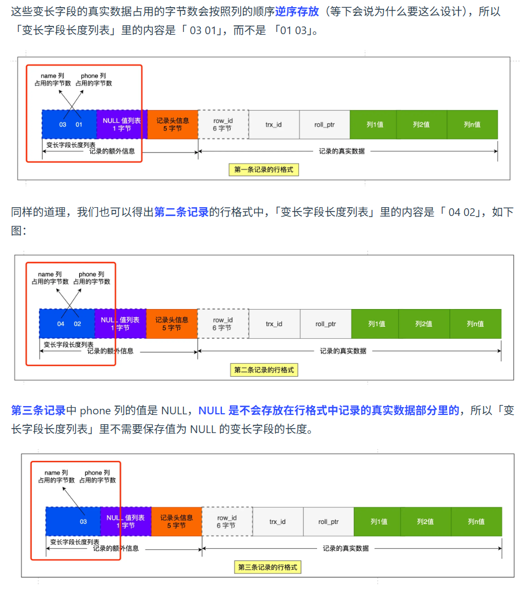
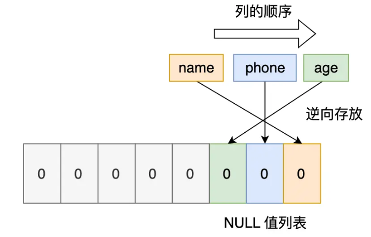
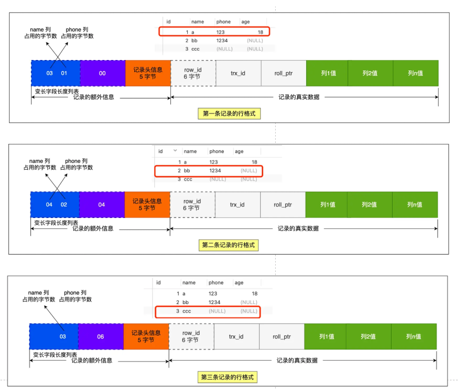
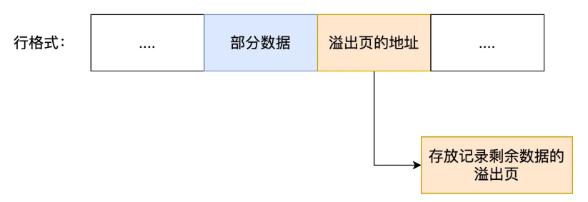
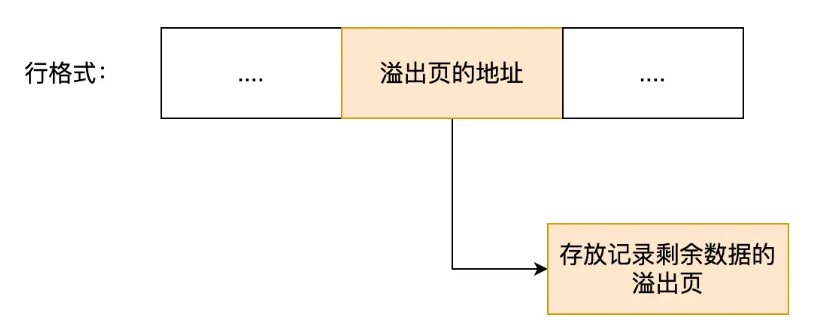

## 查看 MySQL 文件位置

* Windows

* Linux

* 每创建一个数据库都会在 /var/lib/mysql/ 目录里面创建一个以 database 为名的目录，保存表结构和表数据的文件都会存放在这个目录里，假设名为 `database `的数据库里面有一张 `t_order` 数据库表
  * db.opt：存储当前数据库的默认字符集和字符校验规则
  * t_order.frm ，t_order 的**表结构**会保存在这个文件
  * t_order.ibd，t_order 的**表数据**会保存在这个文件

## 表空间文件结构

* **表空间由段（segment）、区（extent）、页（page）、行（row）组成**
* 行：数据库表中的记录
* 页：数据库读写（一次 I/O）的单位。
  * **默认每个页的大小为 16KB** ，也就是最多能保证 16KB 的连续存储空间。
* 区：每个区大小为1M。默认情况一个区有64个连续的页
  * 数据量大时，以区为单位为索引分配空间
* 段：
  * 索引段：存放 B + 树的非叶子节点的区的集合；
  * 数据段：存放 B + 树的叶子节点的区的集合；
  * 回滚段：存放回滚数据的区的集合

## InnoDB 行格式

* 行格式：一条记录的存储结构

### COMPACT 行格式

#### 记录的额外信息

##### 变长字段长度列表

* 第一条记录，name 占用一个字节，phone 占用三个字节

* 变长字段长度列表逆序存放
  * **使得位置靠前的记录的真实数据和数据对应的字段长度信息**可以同时在一个 CPU Cache Line 中，这样就可以提高 CPU Cache 的命中率。（todo：这段没看懂）
* *当数据表没有变长字段的时候，**表里的行格式就不会有「变长字段长度列表***

##### NULL 值列表

* Compact 行格式把这些值为 NULL 的列存储到 NULL值列表中，而不是存储在真实数据中
* 对于允许 NULL 值的列，每列对应一个二进制位，按照列的顺序逆序排列。
  * 1 为 NULL
  * 0 为非 NULL
* NULL 值列表的单位是字节

* 数据库表字段都为 NOT NULL 时，行格式没有 NULL 值列表

##### 记录头信息

* 包含了很多内容，比较重要的有：
  * **delete_mask** ：标识此条数据是否被删除。执行 delete 删除记录的时候，并不会真正的删除记录，而是将这个记录的 `delete_mask` 标记为 1。
  * **next_record** ：下一条记录的位置。记录与记录之间是通过链表组织的，指向的是下一条记录的「记录头信息」和「真实数据」之间的位置，这样的好处是向左读就是记录头信息，向右读就是真实数据，比较方便。
  * **record_type** ：表示当前记录的类型，0 表示普通记录，1 表示 B + 树非叶子节点记录，2 表示最小记录，3 表示最大记录

#### 记录的真实数据

* 出了数据库表定义的字段，还包含三个隐藏字段
  * row_id：主键或唯一字段，如果表中有主键或唯一字段，row_id 就不会有；如果表中没有，则会添加一个隐藏字段
  * trx_id：事务 id，代表由哪个事务生成的
  * roll_pointer：记录上一个版本的指针

### varchar(n) 中 n 最大取值大小

* 单字段

  * n = 65532 。变长字段长度列表占两个字节，NULL 值列表占一个
  * n ＞ 255，变长字段长度列表 2 个字节；反之一个
* 多字段

  * **所有字段的长度 + 变长字段字节数列表所占用的字节数 + NULL值列表**所占用的字节数 <= 65535

### MySQL 处理行溢出

* 大对象如 TEXT、BLOB 可能**发生行溢出，多的数据就会存到另外的「溢出页」中**
* Compact 行格式
  * 在记录的真实数据处只会保存该列的一部分数据
  * 剩余的数据放在「溢出页」中
  * 真实数据处用 20 字节存储指向溢出页的地址

* Compressed 和 Dynamic 格式
  * 记录的真实数据处不会存储该列的一部分数据，只存储 20 个字节的指针来指向溢出页

