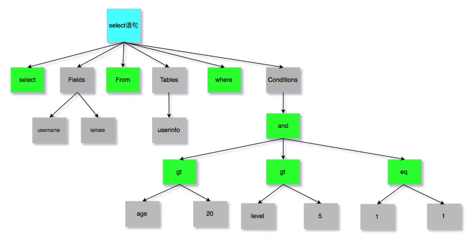

# SQL 语句执行分析

## MySQL基础架构

<pre class="vditor-reset" placeholder="" contenteditable="true" spellcheck="false">

</pre>

* MySQL 可以简单分为 Server 层和存储引擎层这两层。**Server 层处理查询解析、分析、优化、缓存以及与客户端的交互等操作**，而**存储引擎层负责数据的存储和读取**
* 主要构成：
  * **连接器：** 身份认证和权限相关(登录 MySQL 的时候)。
  * **查询缓存：** 执行查询语句的时候，会先查询缓存（MySQL 8.0 版本后移除，因为这个功能不太实用）。
  * **解析器：** 没有命中缓存的话，SQL 语句就会经过解析器，先看你的 SQL 语句做什么，再检查 SQL 语句语法是否正确。
  * **优化器：** 按照 MySQL 认为最优的方案去执行。
  * **执行器：** 执行语句，然后从存储引擎返回数据。 执行语句之前会先判断是否有权限。
  * **插件式存储引擎** ：主要负责数据的存储和读取，采用的是插件式架构，支持 InnoDB、MyISAM、Memory 等多种存储引擎。InnoDB 是 MySQL 的默认存储引擎，绝大部分场景使用 InnoDB 就是最好的选择。

## 1.连接器

* 与客户端进行 TCP 三次握手
* 校验客户端的用户名和密码，如果用户名或密码不对，则会报错
* 用户名和密码正确，读取该用户的权限，后面的权限逻辑判断都基于此时读取到的权限

## 2.查询缓存

* 查缓存，查到直接返回，查不到去查数据库
* 查询缓存的**命中率很低**，因为**表一旦有更新操作，其缓存就会被清空**
* MySQL 8.0 删除了查询缓存部分

## 3.解析器

* 词法分析
  * 提取出关键字和非关键字
  * 如：`select username from userinfo`，select 和 from 为关键字，另外两个是非关键字
* 语法分析
  * 判断 SQL 语句是否满足语法。满足则构建出 SQL 语法树；不满足则报错
  * 表或字段不存在不是在解析器做的，而是在预处理器做的

## 4.预处理器

* **检查语句中的表或字段是否存在**

## 5.优化器

* **将 SQL 查询语句的执行方案确定下来，比如索引的选择**

## 6.执行器

* 正式开始执行语句
* 主键查询索引
  * 第一次查询，调用 read_first_record 函数指针指向的函数，**让存储引擎定位符合条件的第一条记录**
  * 通过索引 B+ 树定位到满足条件的记录，如果记录不存在则报错；存在则将记录返回给执行器
  * 该记录如果满足条件，直接返回客户端；不满足则跳过
  * 执行查询的过程是一个 while 循环，所以还会再查一次，但是这次因为不是第一次查询了，所以会调用 `read_record` 函数指针指向的函数，因为优化器选择的访问类型为 `const`，这个函数指针被指向为一个永远返回 -1 的函数，所以当调用该函数的时候，执行器就退出循环，也就是结束查询了。
* 全表扫描
  * 第一次查询，调用 read_first_record 函数指针指向的函数，**让存储引擎读取表中的第一条记录**
  * 读取的记录如果满足条件，直接返回客户端；不满足则跳过（客户端一次性显示所有记录是因为它会等待查询完成后再显示）
  * 执行器查询的过程是一个 while 循环，继续查询下一条记录
  * 重复上述过程直到查询完毕，并通知
* 索引下推（减少二级索引导致的回表操作）
* `select * from user where age>20 and reward=10000;` 其中 age 和 reward 时联合索引
* 不使用索引下推（联合索引遇到范围查询停止匹配）
  * Server 层首先调用存储引擎的接口定位到满足查询条件的第一条二级索引记录，也就是定位到 age > 20 的第一条记录；
  * 存储引擎根据二级索引的 B+ 树快速定位到这条记录后，获取主键值，然后进行 **回表操作** ，将完整的记录返回给 Server 层；
  * Server 层判断该记录的 reward 是否等于 10000，如果成立则将其发送给客户端；否则跳过该记录；
  * 接着，继续向存储引擎索要下一条记录，存储引擎在二级索引定位到记录后，获取主键值，然后回表操作，将完整的记录返回给 Server 层；如此往复，直到存储引擎把表中的所有记录读完。
* 使用索引下推
  * Server 层首先调用存储引擎的接口定位到满足查询条件的第一条二级索引记录，也就是定位到 age > 20 的第一条记录；
  * 存储引擎定位到二级索引后， **先不执行回表操作** ，而是先判断一下该索引中包含的列（reward 列）的条件（reward 是否等于 100000）是否成立。如果条件不成立，则直接跳过该二级索引。如果成立，则执行 **回表操作** ，将完成记录返回给 Server 层。
  * Server 层在判断其他的查询条件（本次查询没有其他条件）是否成立，如果成立则将其发送给客户端；否则跳过该记录，然后向存储引擎索要下一条记录。如此往复，直到存储引擎把表中的所有记录读完。

## 总结（速通版）

* **连接器** ：建立连接，管理连接、校验用户身份；
* **查询缓存** ：查询语句如果命中查询缓存则直接返回，否则继续往下执行。MySQL 8.0 已删除该模块；
* **解析 SQL** ：通过解析器对 SQL 查询语句进行词法分析、语法分析，然后构建语法树，方便后续模块读取表名、字段、语句类型；
* **执行 SQL** ：执行 SQL 共有三个阶段：
  * 预处理阶段：检查表或字段是否存在；将 `select *` 中的 `*` 符号扩展为表上的所有列。
  * 优化阶段：基于查询成本的考虑，选择查询成本最小的执行计划；
  * 执行阶段：根据执行计划执行 SQL 查询语句，从存储引擎读取记录，返回给客户端；
