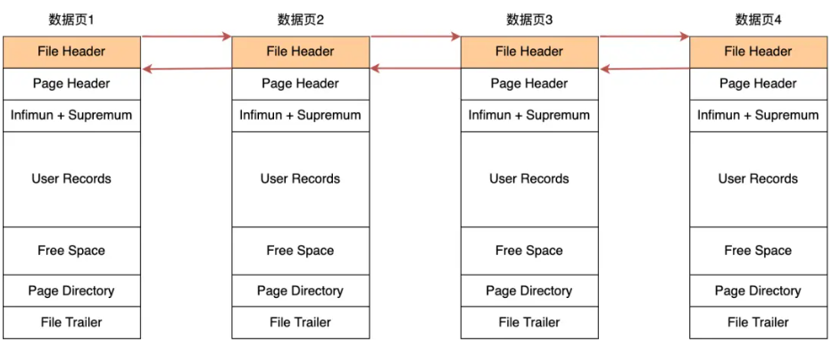
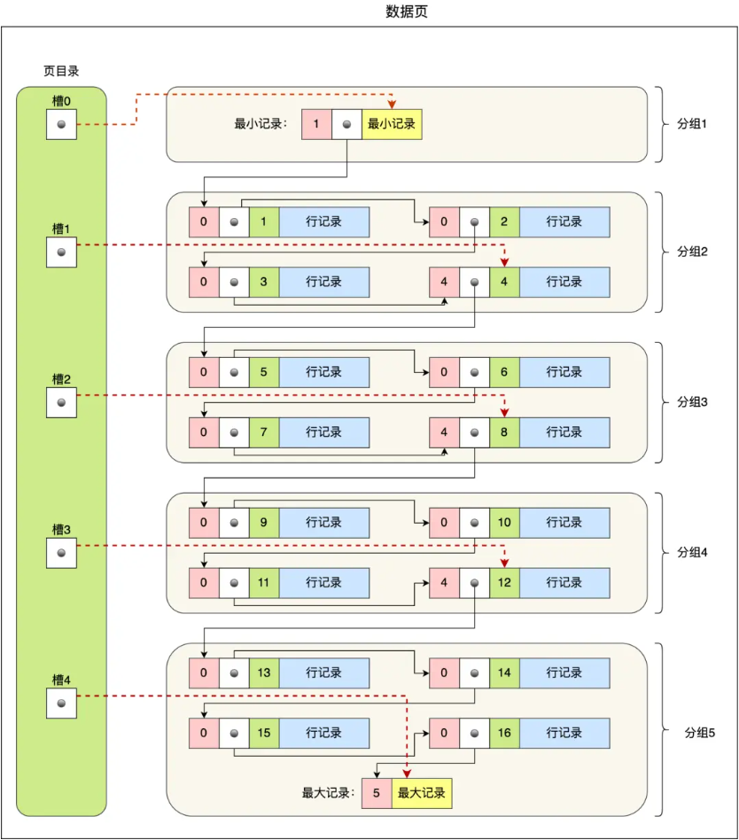
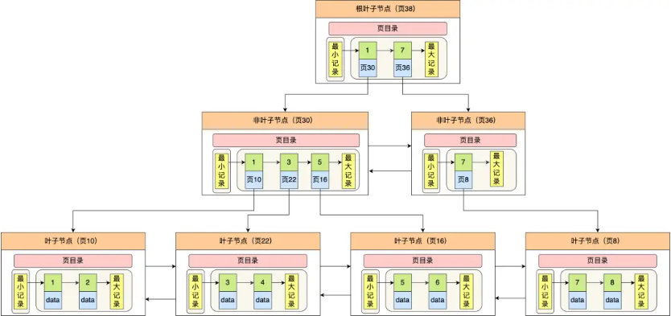

# 数据页和B+树

## InnoDB数据存储

数据页包括七个部分

每个部分作用如下

| 名称           | 作用                                     |
| -------------- | ---------------------------------------- |
| 文件头         | 表示页的信息                             |
| 页头           | 表示页的状态信息                         |
| 最大和最小记录 | 虚拟的尾记录，分别表示页中最小和最大记录 |
| 用户记录       | 存储行记录内容                           |
| 空闲空间       | 页中未被使用的空间                       |
| 页目录         | 存储用户记录的相对位置，起到索引作用     |
| 文件尾         | 校验页是否完整                           |

文件头存在指向逻辑前后页的两个指针

* 数据页中的数据记录按照主键顺序组成单向链表，检索效率不高
* 数据页存在页目录，起到索引作用

* 页目录创建过程：
  * 将所有的记录划分成几个组，这些记录包括最小记录和最大记录，但不包括标记为 “已删除” 的记录；
  * 每个记录组的最后一条记录就是组内最大的那条记录，并且最后一条记录的头信息中会存储该组一共有多少条记录，作为 `n_owned` 字段（上图中粉红色字段）；
  * 页目录用来存储每组最后一条记录的地址偏移量，这些地址偏移量会按照先后顺序存储起来，每组的地址偏移量也被称之为槽（slot），每个槽相当于指针指向了不同组的最后一个记录。
* 通过二分查找定位到槽，再在槽内遍历查找
* InnoDB 中的 B+ 树中，每一个节点都是一个数据页

