> 拆自 [黑马MySQL.md](./归档/黑马MySQL.md)（已归档，不再维护），原文未改。

# 日志

## undo log

* 记录了此次事务「 **修改前** 」的数据状态，记录的是更新**之前**的值，**主要用于事务回滚**，保障事务的原子性
* 回滚日志，用于记录数据被修改前的信息。作用：**提供回滚和MVCC（多版本并发控制）**
* 记录逻辑日志（可以理解为delete一条记录时，undo log就会记录一条对应的insert记录）

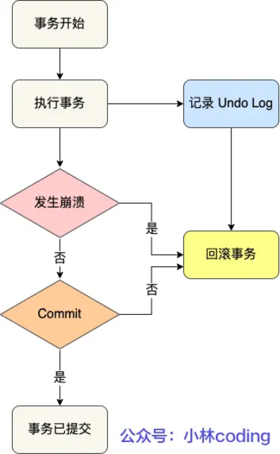

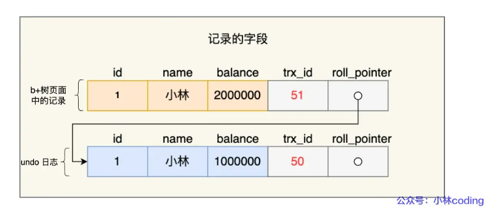

* Undo log销毁：undo log在事务执行时产生，事务提交时，不会立即删除undo log（可能用于MVCC）
* Undo log存储：undo log采用段的方式进行管理和记录

## redo log

* redo log 记录了此次事务「 **修改后** 」的数据状态，记录的是更新**之后**的值，**主要用于事务崩溃恢复，保障事务的持久性**
* 记录物理日志，事务提交时，将 redo log 持久化到磁盘
* 分为重做日志缓冲（redo log buffer）和重做日志文件（redo log），前者在内存中后者在磁盘中。事务提交后会把所有修改信息存放到该日志中，用于刷新脏页到磁盘时，发生错误时进修复
* WAL（Write-Ahead Logging）：先写日志，日志的写是追加形式，比刷新Buffer Pool的随机IO性能高

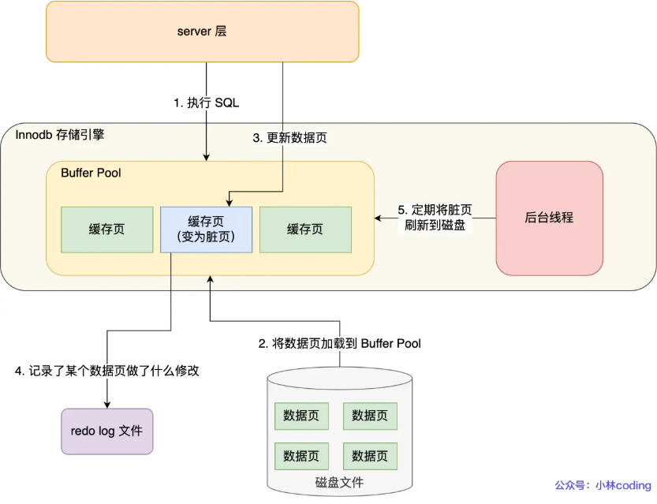

* 事务提交前崩溃，用 undo log 恢复
* 事务提交后崩溃，用 redo log 恢复

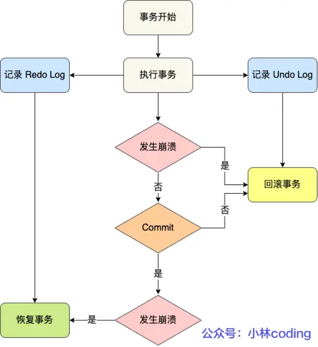

* redo log 通过追加写入的方式，**将随机写改为了顺序写**，提升 MySQL 写入磁盘的性能

### redo log 写回

* redo log 本身是**循环写**的：先写 ib_logfile0 文件，写满了写 ib_logfile1 文件
  * InnoDB 会用两个标记分别表示当前记录写到的位置，以及要擦除的位置
  * redo log 是防止 Buffer Pool 脏页丢失设计的，脏页刷新到磁盘中，这部分数据就可以被擦除
  * 如果写入位置追上了擦除位置（redo log 满了），**此时 MySQL 不能再执行新的更新操作，会被阻塞**，此时会将 Buffer Pool 脏页刷新到磁盘中，再擦除 redo log 记录，腾出空间后再执行 MySQL 操作

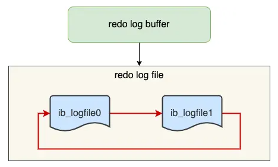

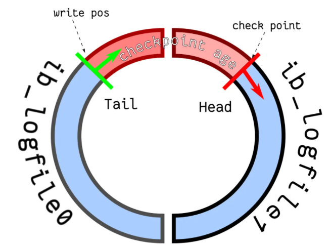

### redo log 刷盘

* MySQL 正常关闭时
* 当 redo log buffer 中记录的写入量大于 redo log buffer 内存空间的一半时
* InnoDB 的后台线程每隔 1 秒，将 redo log buffer 持久化到磁盘。
* 每次事务提交时都将缓存存 redo log buffer 里的 redo log 直接持久化到磁盘（可由 innodb_flush_log_at_trx_commit 参数控制）。

  * 0：每次事务提交时，将 redo log 留在 redo log buffer 中，该模式下在事务提交时不会主动触发写入磁盘的操作。
  * 1：每次事务提交时，都将缓存在 redo log buffer 里的 redo log 直接持久化到磁盘，这样可以保证 MySQL 异常重启之后数据不会丢失。
  * 2：每次事务提交时，都将缓存在 redo log buffer 里的 redo log 写到 redo log 文件，（**并不意味着写入到了磁盘**，操作系统的文件系统中有个 Page Cache是专门用来缓存文件数据的）
* InnoDB 后台线程每隔一秒：

  * 针对参数 0：会把缓存在 redo log buffer 中的 redo log，通过调用 `write()` 写到操作系统的 Page Cache，然后调用 `fsync()` 持久化到磁盘。所以参数为 0 的策略，MySQL 进程的崩溃会导致上一秒钟所有事务数据的丢失
  * 针对参数 2：调用 fsync，将缓存在操作系统中 Page Cache 里的 redo log 持久化到磁盘。所以参数为 2 的策略，较取值为 0 情况下更安全，因为 MySQL 进程的崩溃并不会丢失数据，只有在操作系统崩溃或者系统断电的情况下，上一秒钟所有事务数据才可能丢失。

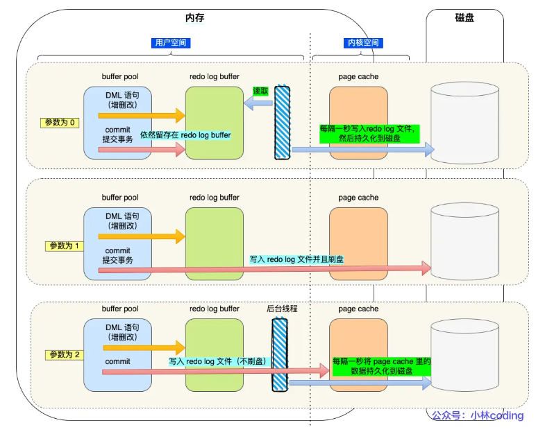

## binlog

* **用于备份恢复，主从复制**
* **Server 层的日志**，MySQL 完成一条更新操作后生成，所有存储引擎都能用
* 记录了所有数据库表结构变更和表数据修改的日志，不会记录查询类的操作
* 文件格式
  * STATEMENT：每一条修改数据的 SQL 都会被记录到 binlog 中，有动态函数的问题（比如 uuid，主数据库执行的结果不等于从数据库的），会导致数据不一致
  * ROW：记录行数据最终被修改成什么样了，无动态函数问题，但是每行数据结果都会被记录，会导致 binlog 文件过大
  * MIXED：根据情况选择前两者
* 写入方式：追加写，写满一个文件再创建一个

### 对比 redo log

- 适用对象：
  - binlog 在 Server 层，所有引擎都能用
  - redo log 是 Innodb 存储引擎实现的日志
- 文件格式不同
  - binlog 有 3 种格式类型，见上文
  - redo log 是物理日志，记录的是在某个数据页做了什么修改
- 写入方式不同
  - binlog 追加写
  - redo log 循环写
- 用途不同
  - binlog 用于备份恢复、主从复制
  - redo log 用于掉电等故障恢复

### 主从复制

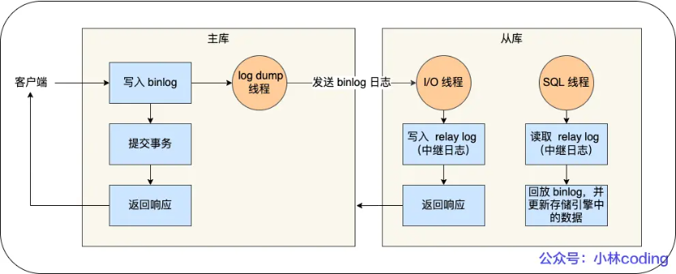

* 过程
  * **写入 Binlog** ：主库写 binlog 日志，提交事务，并更新本地存储数据
  * **同步 Binlog** ：把 binlog 复制到所有从库上，每个从库把 binlog 写到暂存日志中
  * **回放 Binlog** ：回放 binlog，并更新存储引擎中的数据
* 主从复制模型
  * 同步复制：主库事务线程需要所有从库成功复制响应（性能和可用性差，不推荐）
  * 异步复制：默认模型
  * 半同步复制：事务线程不用等待所有的从库复制成功响应，只要一部分复制成功响应回来就行（比如一主二从的集群，有一个从返回即可），**兼顾性能和数据可用性**

### binlog 刷盘

* 事务执行过程中，先把日志写到 binlog cache，事务提交的时候，再把 binlog cache 写到 binlog 文件中

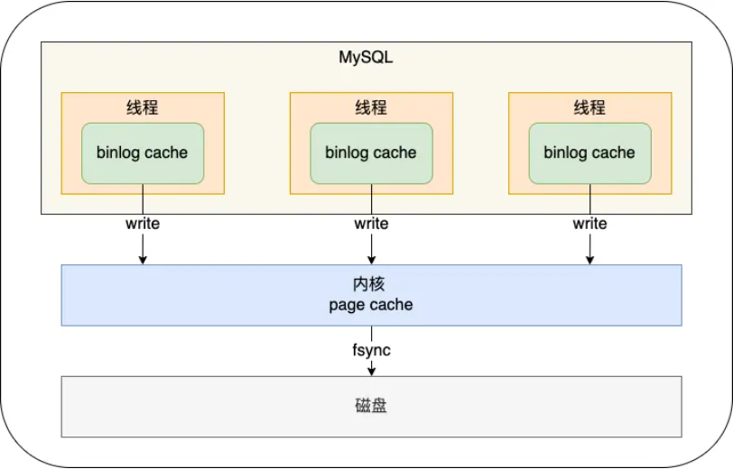

* sync_binlog ：控制刷盘频率：
  * sync_binlog = 0，只写到 binlog ，何时刷盘由 OS 决定（MySQL 默认）
  * sync_binlog = 1，每次事务提交都会刷盘
  * sync_binlog = N，提交 N 次事务都会刷盘

## 两阶段提交

* 事务提交后，redo log 和 binlog 都要持久化到磁盘，但这是两个独立的逻辑，可能出现一个成功一个失败的情况，导致数据不一致
  * **redo log 刷入到磁盘之后， MySQL 突然宕机了，而 binlog 还没有来得及写入**。MySQL 重启后通过 redo log 恢复主库，但是从库因为 binlog 没更新，导致数据不一致
  * **binlog 刷入到磁盘之后， MySQL 突然宕机了，而 redo log 还没有来得及写入。**MySQL 重启后通过 binlog 刷新从库数据，但是 redo log 没更新，主库数据不一致
* 两阶段提交：准备+提交
  * 准备：给 redo log 一个 XID，将 redo log 状态设置为 prepare，并持久化到磁盘
  * 提交：把 XID 给 bin log，将 redo log 状态设置为 commit，binlog 持久化到磁盘

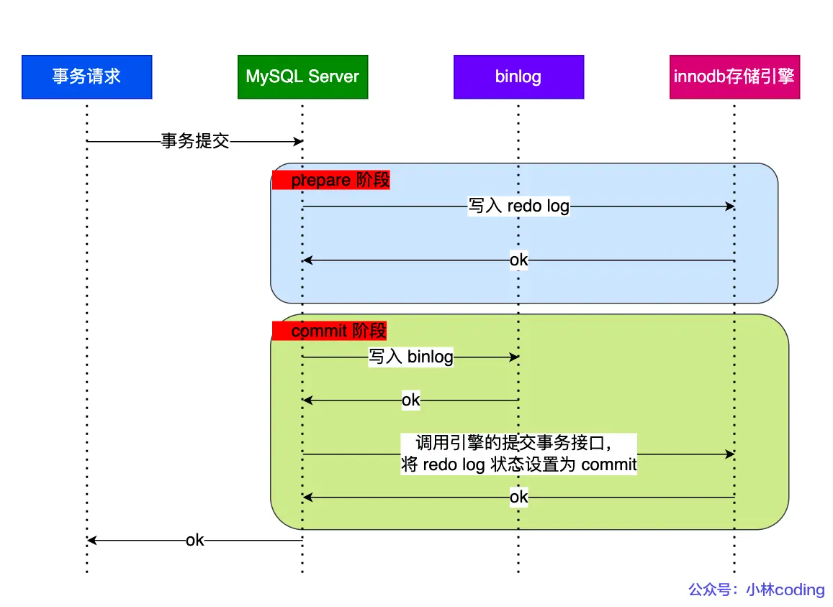

* 异常重启时，根据binlog 能否找到和 redolog 相同的 XID，决定回滚或提交

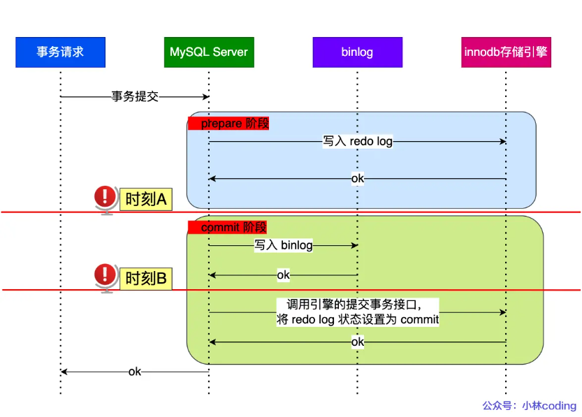

* 缺点
  * 磁盘 IO 次数高：每次至少都要两次刷盘
  * 锁竞争激烈：多事务情况下，不能保证两者提交顺序一致。在两阶段提交的流程基础上，还需要加一个锁来保证提交的原子性
* 解决：组提交
  * **当有多个事务提交的时候，会将多个 binlog 刷盘操作合并成一个**
  * prepare 阶段不变，commit 阶段变化
    * **flush 阶段** ：多个事务按进入的顺序将 binlog 从 cache 写入文件（不刷盘）
    * **sync 阶段** ：对 binlog 文件做 fsync 操作（多个事务的 binlog 合并一次刷盘）
    * **commit 阶段** ：各个事务按顺序做 InnoDB commit 操作

## MySQL I/O 优化

* 增大组提交参数，减少 binlog 和 redo log 刷盘次数
* 不要每次事务提交都刷盘
* 每次事务提交时，都先缓存到 redo log buffer 里面
