# 锁

* 计算机协调多个进程或线程并发访问某一资源的机制
* 分类
  * 全局锁：锁数据库所有表
  * 表级锁：锁整张表
  * 行级锁：锁对应行数据

## 全局锁

* 加锁后**整个实例都是只读状态**，DML写、DDL语句，更新操作数据都成阻塞状态
* 使用场景：数据库备份，保证数据的完整性
* 弊端
  * 主库备份，不能执行更新，业务基本停摆
  * 从库备份，备份时不能执行主库同步的二进制日志binlog，导致主从延迟
  * InnoDB引擎，备份时加上操作  `--single-transaction` 完成不加锁的备份（备份数据库前开启事务）

```sql
# 加锁
flush tables with read lock

# 备份（在电脑系统执行，不是mysql语句）
mysqldump -用户名 -密码 数据库 > 数据库sql文件

# 解锁
unlock tables
```

* 执行 update 语句的时候，确保 where 条件中带上了索引列，并且在测试机确认该语句是否走的是索引扫描，防止因为扫描全表，而对表中的所有记录加上锁

## 表级锁

* 锁的粒度大，发生锁冲突概率最高，并发度最低
* 分类
  * 表锁
  * 元数据锁
  * 意向锁

### 表锁

* 表共享读锁（read lock）：所有表都可读，但是都不可写
* 表独占写锁（write lock）：加锁的客户端可读可写，其他均不能读写
* 表锁除了会限制别的线程的读写外，也会限制本线程接下来的读写操作。
  * 线程 A 执行 `lock tables t1 read, t2 write` ，其他线程写 t1，读 t2 会被阻塞，**线程 A 也只能读 t1，读写 t2，不能访问其他表**

```sql
# 加锁
lock tables 表名 read/write；

# 解锁
unlock tables;
```

### 元数据锁（meta data lock，MDL）

* 系统自动控制，无需显式使用
* **访问表的时候会自动加上**，主要作用是维护表元数据的数据一致性，表上有活动事务的时候，不能对元数据（表结构）进行写入操作
* **避免DML与DDL冲突，保证读写正确性**
* 对表进行增删改查的时候，加MDL读锁（共享）；对表结构进行变更操作的时候，加MDL写锁（排他）
* 查看元数据锁：`select object_type,object_schema,object_name,lock_duration from performance_schema.metadata_locks;`
* 申请MDL锁的操作会形成一个队列，队列中**写锁获取优先级高于读锁**，一旦出现 MDL 写锁等待，会阻塞后续该表的所有 CRUD 操作
* 在对表结构变更前，先要看看数据库中的长事务，是否有事务已经对表加上了 MDL 读锁，如果可以考虑 kill 掉这个长事务


### 意向锁

* InnoDB 引擎中
  * 加共享锁之前，需要先在表级别上加意向共享锁
  * 加独占锁之前，需要现在表级别锁加意向独占锁
* 避免DML在执行时，加的行锁和表锁的冲突，这样**表锁就不用检查每行数据是否加锁，减少检查次数**
* 意向共享锁（IS）：`select ... lock in share mode`添加，与表锁共享锁兼容，与表锁排他锁互斥
* 意向排他锁（IX）：`insert、update、delete、select ... for update`添加，与表锁共享锁和表锁排他锁都互斥。意向锁之间不互斥（命中索引为行锁、否则为表锁）
* 查看意向锁：`select object_schema,object_name,index_name,lock_type,lock_mode,lock_data from performance_schema.data_locks;`

### AUTO-INC 锁

* 作用：自增主键的表、在插入数据时不需要指定主键值
* 特殊的表锁：锁 **不是再一个事务提交后才释放，而是执行完插入语句后就会立即释放**
* **在插入数据时，会加一个表级别的 AUTO-INC 锁** ，为自增字段赋值，插入完成后，释放锁
* 大量插入时会影响性能，轻量实现方式：
  * 插入数据时，为自增字段加上轻量级锁，**给该字段赋值后，就释放轻量级锁，不需要等待整个插入语句执行完后才释放锁**
* 这个「轻量级锁」是 InnoDB **mutex（互斥量）**，源码里是表对象上的 `autoinc_mutex`
  * **不是表锁，也不是行锁**，锁管理器里看不到，`performance_schema.data_locks` 也不会出现 AUTO-INC
  * 只保护内存里的**自增计数器**：算出本次要分配的值（或一批值），立刻释放
  * 之后真正写数据页、加行锁，都不拿这把 mutex，所以别的会话可以马上再去申请自增值
  * 对比：AUTO-INC 表锁要等**整条 INSERT 语句结束**才放，期间同表的其他插入都得排队
* **InnoDB 引擎控制变量：innodb_autoinc_lock_mode**
  * innodb_autoinc_lock_mode = 0（traditional），就采用 AUTO-INC 锁。MySQL 5.7 以前的老行为
  * innodb_autoinc_lock_mode = 2（interleaved），全程用 mutex，**MySQL 8.0 默认**。并发最高，同一条语句里的自增值不一定连续（别的插入可能插进来）
  * innodb_autoinc_lock_mode = 1（consecutive），看情况，**MySQL 5.7 默认**：
    * 普通 insert（提前知道要插几行，如 `INSERT VALUES`），用 mutex，申请完马上释放
    * 类似 `INSERT … SELECT`、`LOAD DATA` 这种行数事先不知道的批量插入，仍用 AUTO-INC 表锁，等语句结束才释放，保证本语句内自增值连续
* innodb_autoinc_lock_mode = 2 、binlog_format = statement 时存在数据不一致问题，需要将日志格式 binlog_format 设置为 row 避免。这样在 binlog 里面记录的是主库分配的自增值，到备库执行的时候，主库的自增值是什么，从库的自增值就是什么。[详见](https://xiaolincoding.com/mysql/lock/mysql_lock.html#auto-inc-%E9%94%81)

## 行级锁

* **InnoDB 支持，MyISAM 不支持**
* 每次加锁锁住对应的行数据。锁粒度最小，并发量最高，发生冲突概率最低
* 基于索引家在，只有命中索引才是行锁，否则退化为表锁

### 记录锁 Record Lock

* 锁定单个记录，防止其他事务进行update和delete，读提交 RC（Read commited）、可重复读 RR（Repeatable Read）支持
* 共享锁（S）：允许事务读一行，阻止其他事务获取排他锁
* 排他锁（X）：允许获取排他锁的事务更新数据，阻止其他事务获取相同的共享锁和排他锁
* InnoDB引擎的行锁是针对索引加的锁，不通过索引检索数据，**行锁会升级为表锁**


* 自动加锁


### 间隙锁 Gap Lock

* 锁住索引记录间隙（不含该记录，开区间），防止其他事务在间隙中insert，产生幻读，RR支持
* 会将查询条件中的范围数据加锁，即使范围中不存在的数据也会被锁定
* InnoDB引擎使用next-key锁进行搜索和索引扫描
* 索引上等值查询（唯一索引），给不存在的记录加锁时，优化为间隙锁
* 索引上等值查询（普通索引），向右遍历最后一个值不满足查询需求时，临建锁退化为间隙锁
* 索引的范围查询，会访问到第一个不满足条件的值
* 间隙锁是兼容的，**两个事务可以同时持有包含共同间隙范围的间隙锁**

### 临建锁 Next-Key Lock

* 行锁和间隙锁组合：锁住记录 R，再锁住索引顺序上 **R 前面那一段间隙**，RR 支持
* 升序索引、按数值画区间时，就是 **左开右闭 (prev, R]**。官方例子：索引值 10、11、13、20，可能的 next-key 区间是 `(-∞, 10]`、`(10, 11]`、`(11, 13]`、`(13, 20]`，最后一段是 `(20, +∞)`
* **不是「数值上」永远左开右闭**，而是「索引顺序上的下一条」：
  * 降序索引里，index order 的「前面」在数值上可能是更大的那一侧
  * 最后一条 **supremum** 不是真实记录，官方把这段写成 `(max, +∞)` 开区间；笔记里画成 `(20, +∞]` 是把 supremum 当成右端点的讲法，效果都是堵住比最大值还大的插入
* 退化之后就不再是 next-key：记录锁只锁一个点；间隙锁是 **(a, b) 左右都开**

### 插入意向锁

* 事务在插入一条记录的时候，需要判断插入位置是否已被其他事务加了间隙锁
* 如果有的话，插入操作就会发生 **阻塞** ，直到拥有间隙锁的那个事务提交为止
* 在此期间会生成一个 **插入意向锁** ，表明有事务想在某个区间插入新记录，但是现在处于等待状态
* **不是表级意向锁（IS/IX）**。官方把它归成一种特殊的**间隙锁**，只在 `INSERT` 真正往页里塞行之前申请，用来表达「我要在这个间隙的某个位置插入」
* 间隙锁锁的是一段区间；插入意向锁更像锁住间隙里的一个**点**（即将插入的位置）
* 生成时机：每插一行，先看**插入位置的下一条索引记录**上有没有间隙锁（next-key 也含间隙）。有则先建锁结构，再把状态设成等待。`LOCK_STATUS = WAITING` 表示还没拿到锁，语句表现为阻塞；状态变成正常才算持有
* `data_locks` 里常见：`LOCK_MODE = X,INSERT_INTENTION`，`LOCK_TYPE = RECORD`（这里的 RECORD 仍是行级锁，不是记录锁）
* 和谁冲突、和谁兼容
  * **和间隙锁冲突**（含 next-key 里的 gap）：别人已经锁住这段间隙防幻读，就不能往里插。必须等对方事务提交、间隙锁释放
  * **插入意向锁之间不冲突**：同一间隙里，插的位置不同可以一起过。官方例子：索引上已有 4 和 7，事务分别插 5 和 6，各自拿插入意向锁，互不等待，再给自己的新行加 X 记录锁
  * 插入位置如果不在对方间隙范围内，不受影响
* 所以：两个 `select ... for update` 可以同时持有同一段间隙锁；一旦双方再 `insert`，都要在这段间隙上拿插入意向锁，就会互相等对方放 gap，容易死锁。例子见文末「死锁」

## 哪些 SQL 语句加锁？

* 普通 select 语句不会加锁，加锁可以使用下面语句

```sql
# 对读取的记录加共享锁(S型锁)
select ... lock in share mode;

# 对读取的记录加独占锁(X型锁)
select ... for update;

# 两条语句必须在事务中，事务提交锁被释放
```

* update 和 delete 操作会加独占型行级锁

## MySQL 加行级锁

* **加锁的对象是索引，加锁的基本单位是 next-key lock**：升序索引上画成 **前开后闭 (prev, R]**；本质是「记录 + 索引顺序上前面的间隙」，见上面临键锁说明
* **能使用记录锁或者间隙锁就能避免幻读现象的场景下**，next-key lock 会退化成记录锁或间隙锁
* 查看事务执行时的加锁命令：`select * from performance_schema.data_locks\G`
  * LOCK_MODE = x，加临建锁
  * LOCK_MODE = x，REC_NOT_GAP，加记录锁
  * LOCK_MODE = x，GAP，加间隙锁


* 下面例子基于 **MySQL 8.0.26、可重复读（RR）**。不同版本加锁细节可能略有差异，大体规则相同
* 二级索引做锁定读时，**二级索引和主键都会加锁**：二级索引按等值/范围规则加 next-key / 间隙锁 / 记录锁；命中的行再在**主键上加记录锁**。下面「唯一索引」案例用的是主键，锁只加在主键上
* 样例表：`id` 主键，`age` 普通二级索引，`name` 无索引

```sql
CREATE TABLE `user` (
  `id` bigint NOT NULL AUTO_INCREMENT,
  `name` varchar(30) NOT NULL,
  `age` int NOT NULL,
  PRIMARY KEY (`id`),
  KEY `index_age` (`age`)
) ENGINE=InnoDB;

# 现有数据：id 不连续，方便看间隙
# id=1  路飞   age=19
# id=5  索隆   age=21
# id=10 山治   age=22
# id=15 乌索普 age=20
# id=20 香克斯 age=39
```


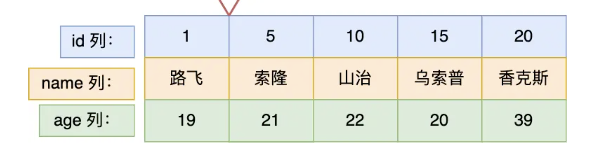

* 二级索引按 `age` 排序，age 相同时再按主键 `id` 排序。插入是否被间隙锁堵住，看**插入位置的下一条二级索引记录**上有没有间隙锁（next-key 含间隙）

### 唯一索引（主键索引）等值查询

* 查询记录是否存在影响加锁规则

  * 记录存在，退化为记录锁
  * 记录不存在，退化为间隙锁，间隙范围为(比id小的最大值，比id大的最小值)
* 记录存在：`select * from user where id = 1 for update;`

  * 主键 `id=1` 上加 **X 记录锁**（`LOCK_MODE = X, REC_NOT_GAP`）
  * 其他事务 update/delete `id=1` 阻塞；插入 `id=1` 直接主键冲突，不必靠间隙锁
  * 唯一索引等值且记录存在时，**只靠记录锁就能防幻读**：插不进去（唯一约束），也删改不了（记录锁）

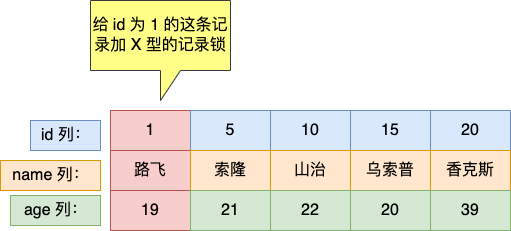

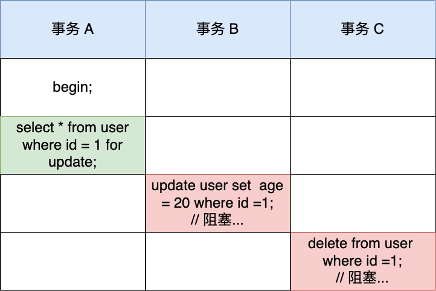

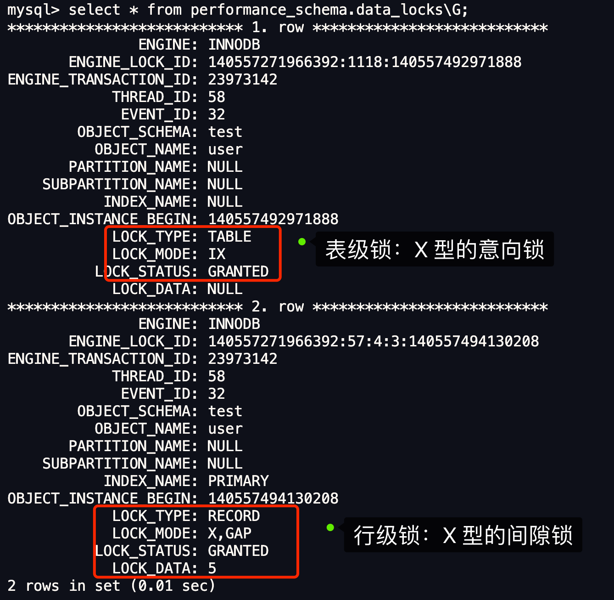

* 记录不存在：`select * from user where id = 2 for update;`
  * 树上第一条大于 2 的记录是 `id=5`，其上 next-key 退化为 **间隙锁 (1, 5)**（`LOCK_MODE = X, GAP`，`LOCK_DATA` 是右边界 5）
  * 其他事务插入 id=2、3、4 阻塞；插 id=1 或 5 是主键冲突，不是等间隙锁
  * 不必锁住 `id=5` 这条记录本身：本次查的是 id=2，删掉 id=5 不影响结果集。不存在的记录也没法加记录锁

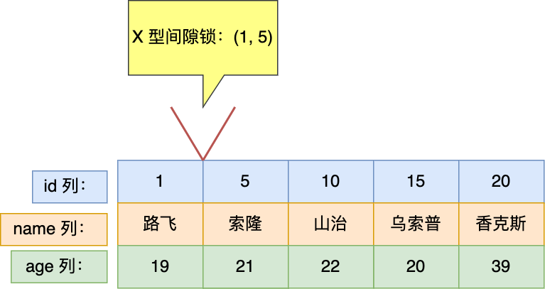

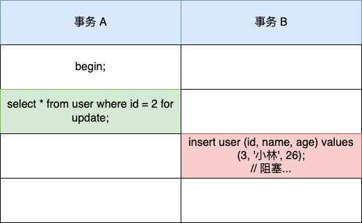

### 唯一索引（主键索引）范围查询

* **会对每一个扫描到的索引加 next-key 锁**，如果存在下列情况，锁会退化：

  * ≥ 查询，如果等值查询记录存在，等值查询的那条记录退化为记录锁
  * ＜ 或 ≤ 查询，根据条件值是否存在于表中：
    * 不存在，扫描到终止范围查询的记录时，退化为间隙锁
    * 存在，且查询条件是 ＜，扫描到终止范围查询的记录时，退化为间隙锁
* InnoDB 索引末尾有一条特殊记录 **supremum**，表示 +∞，范围扫到表尾时会给它加 next-key
* `id > 15`：`select * from user where id > 15 for update;`

  * 第一行 `id=20` 不是等值查询，加 next-key **(15, 20]**
  * 再扫到 supremum，加 next-key **(20, +∞]**
  * 结果：不能改删 id=20，不能插入 16~19，也不能插入 id>20

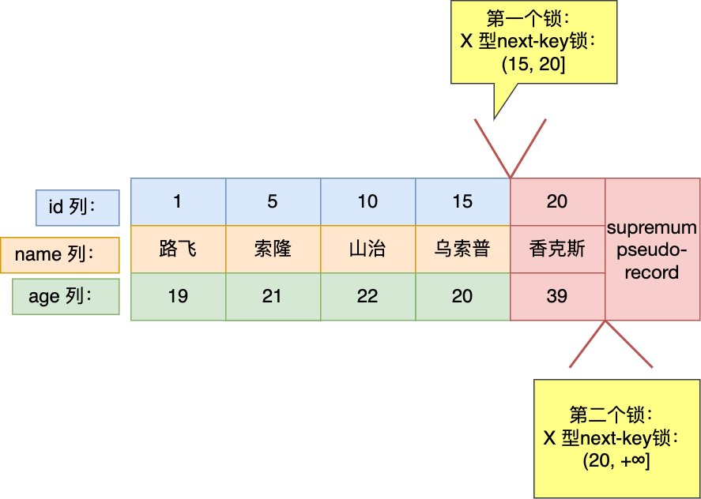

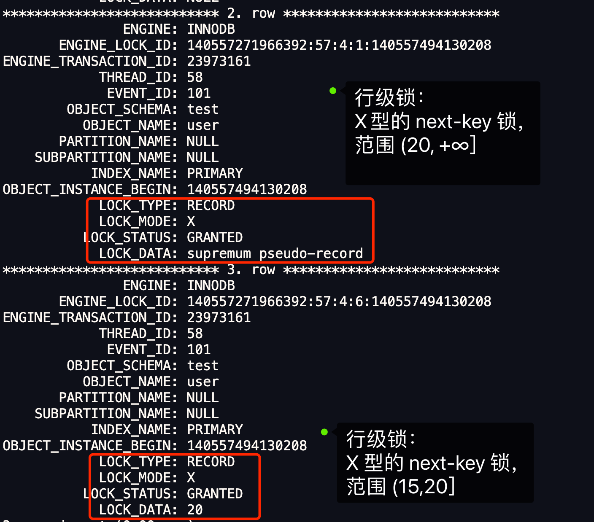

* `id >= 15`：`select * from user where id >= 15 for update;`
  * 第一行就是等值命中 `id=15`，退化为 **记录锁 id=15**
  * 再扫 `id=20`：next-key **(15, 20]**；再扫 supremum：**(20, +∞]**

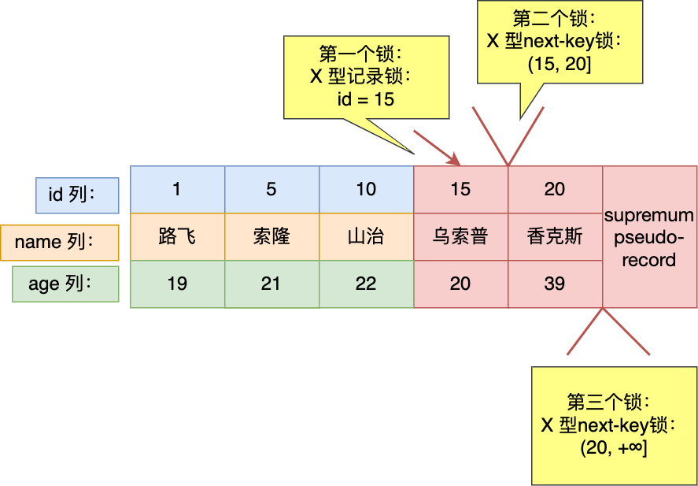

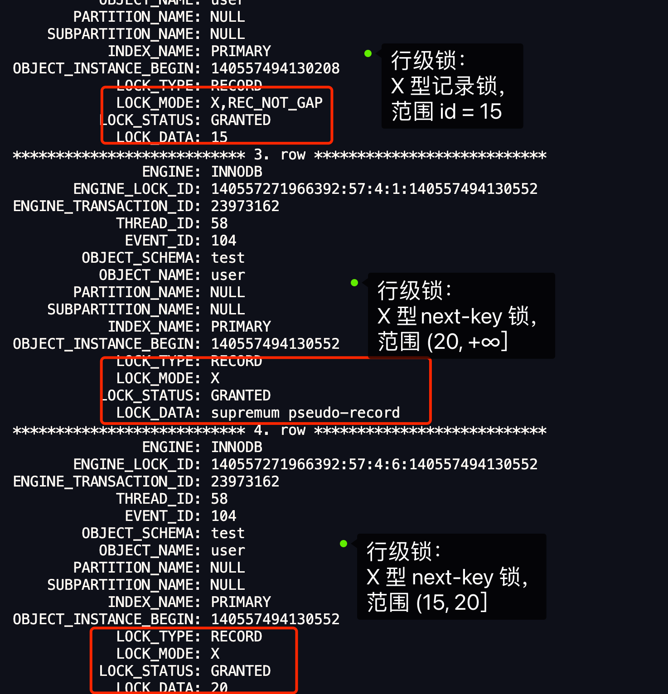

* `id < 6`（条件值 6 不在表中）：`select * from user where id < 6 for update;`
  * `id=1`：next-key **(-∞, 1]**
  * `id=5`：next-key **(1, 5]**（仍满足条件，继续扫）
  * 扫到 `id=10` 不满足 `< 6`，停止，退化为间隙锁 **(5, 10)**
  * 必须锁到 (5, 10)：否则中途插入 id=6 再查 `< 6` 会多出行（幻读）。条件改成 `id <= 6` 时，6 仍不存在，加锁与 `< 6` 相同

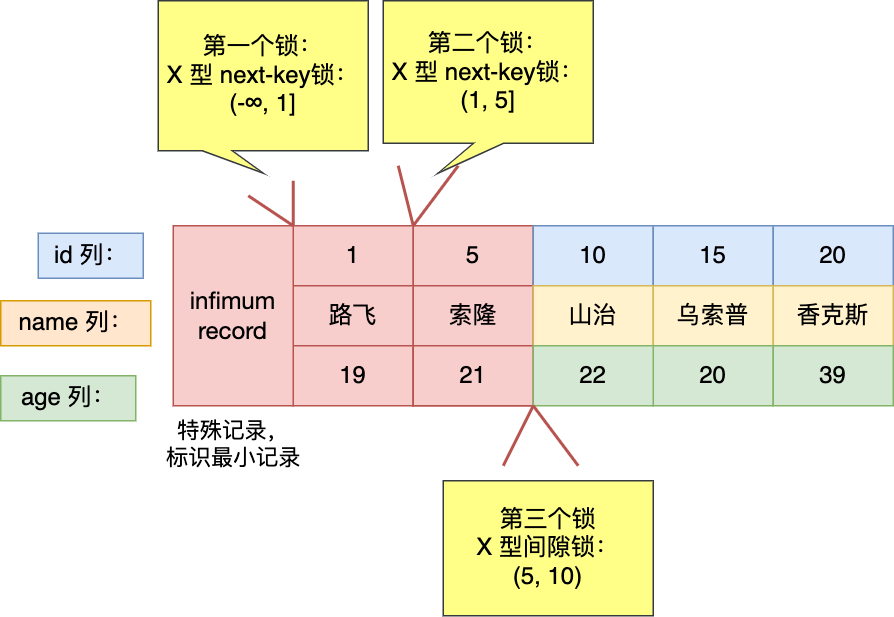

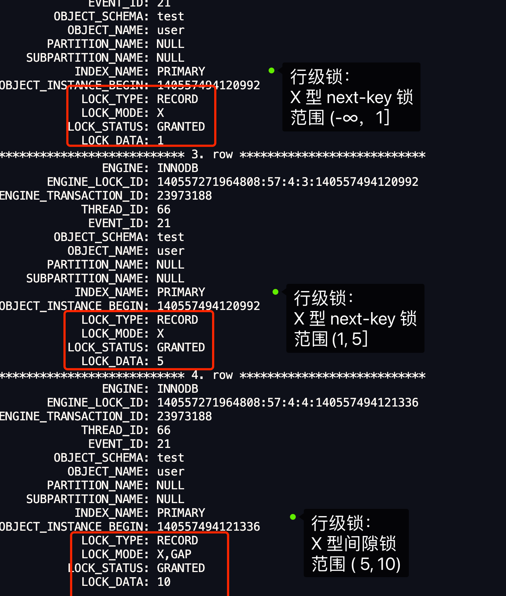

* `id <= 5`（条件值 5 在表中）：`select * from user where id <= 5 for update;`
  * `id=1`：next-key **(-∞, 1]**；`id=5`：next-key **(1, 5]**
  * 主键唯一，不会再有第二条 id=5，**不再往后扫**，`id=10` 不加锁

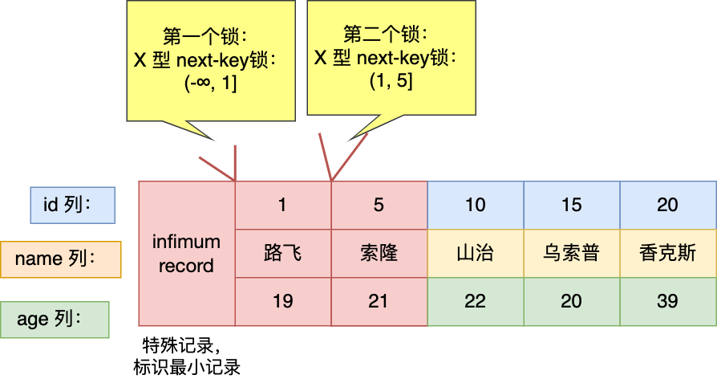

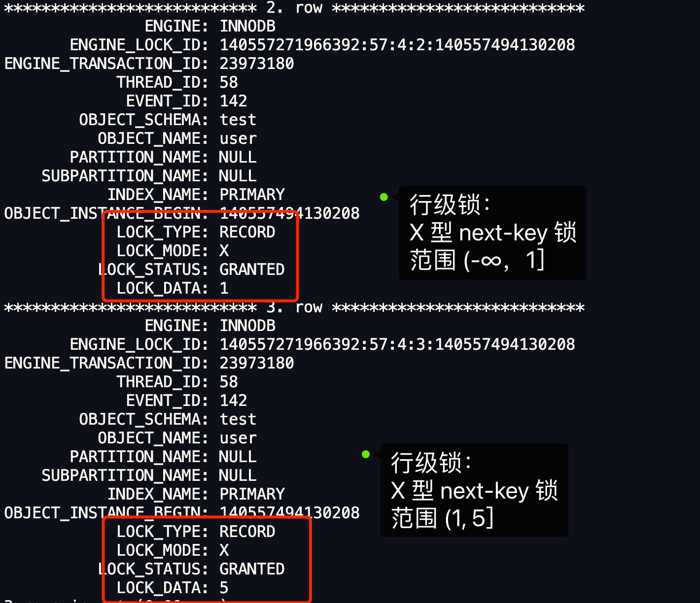

* `id < 5`（条件值 5 在表中）：`select * from user where id < 5 for update;`
  * `id=1`：next-key **(-∞, 1]**
  * 第一条不满足的是 `id=5`，退化为间隙锁 **(1, 5)**，停止扫描

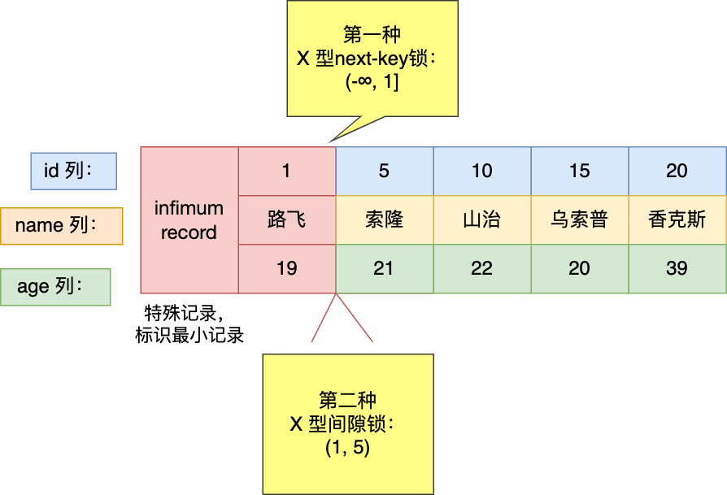

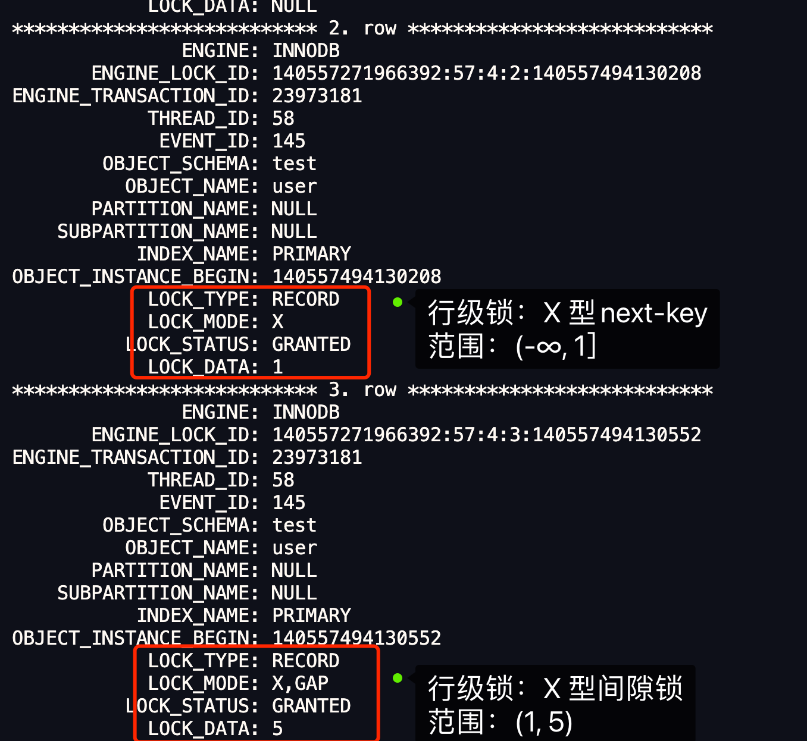

### 非唯一索引等值查询

* 对于非主键索引，**会对非主键索引和对应的主键索引都加锁，****但是对主键索引加锁的时候****，只有满足查询条件的记录才会加锁**
* 根据查询记录是否存在：

  * 查询记录存在，扫描到第一条**不符合条件的二级索引记录**，退化为间隙锁，之前加的是临建锁，然会对查询到的唯一索引加记录锁
  * 查询记录不存在，扫描到第一条**不符合条件的二级索引记录**，退化为间隙锁，不会对主键索引加锁
* age 二级索引顺序（样例）：`(19,1) → (20,15) → (21,5) → (22,10) → (39,20)`
* 记录不存在：`select * from user where age = 25 for update;`

  * 扫到第一条不符的二级索引 `age=39`，退化为间隙锁 **(22, 39)**，**主键不加锁**
  * 插入 age=23~38 会阻塞。边界 age=22 / 39 能不能插，还要看插入后的**下一条**有没有间隙锁：
    * 插 `(age=22, id=3)`：下一条是 `(22,10)`，该记录上没有间隙锁 → 成功
    * 插 `(age=22, id=12)`：下一条是 `(39,20)`，正好有间隙锁 → 阻塞
    * 插 `(age=39, id=3)`：下一条是 `(39,20)`，有间隙锁 → 阻塞
    * 插 `(age=39, id=21)`：后面没有记录 → 成功
  * `data_locks` 里二级索引的 `LOCK_DATA` 常是 `39, 20`：第一个数是右边界 age，第二个是该索引项的主键。含义是：插 age=39 时 **id < 20** 会被堵住

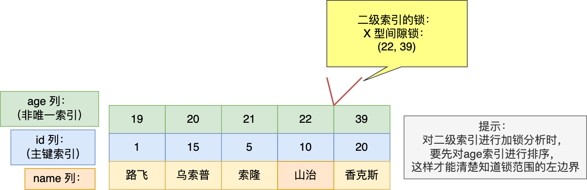

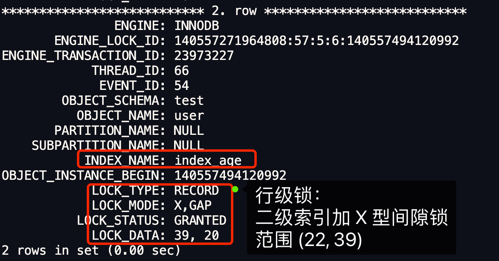

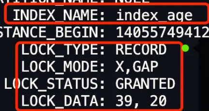

* 记录存在：`select * from user where age = 22 for update;`
  * 二级索引 `age=22`：next-key **(21, 22]**；主键 `id=10`：**记录锁**
  * 继续扫到第一条不符 `age=39`，退化为间隙锁 **(22, 39)**，停止
  * 只加 (21, 22] 挡不住 `age=22, id>10` 的插入（例如 id=12），再查 age=22 会多一行。所以还要 (22, 39) 把这条路堵住

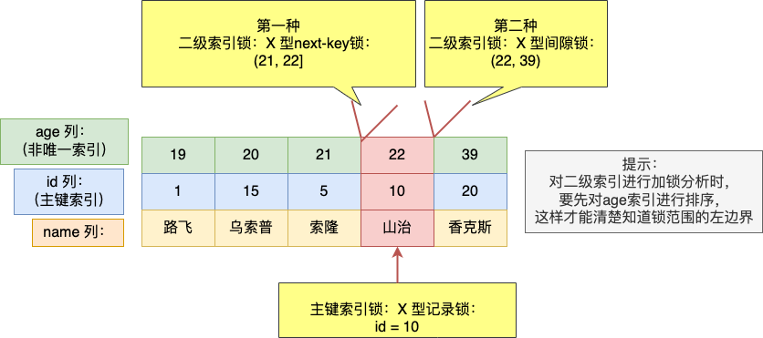

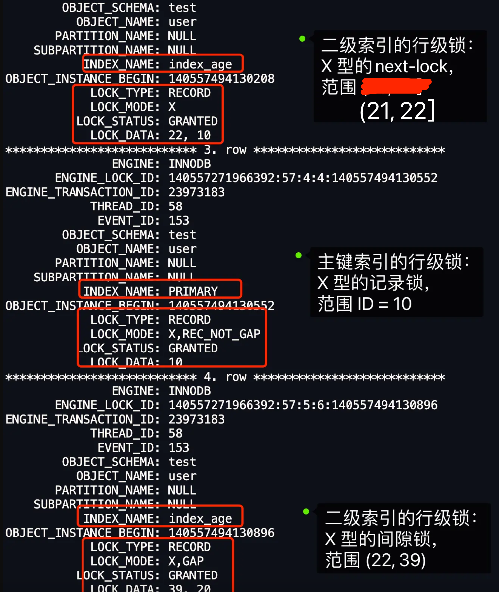

### 非唯一索引范围查询

* 锁不会退化，加的全是临建锁
* `select * from user where age >= 22 for update;`

  * 即使 `age=22` 存在且带等值，**也不会退化成记录锁**（非唯一，只锁记录挡不住再插一条 age=22）
  * 二级索引：next-key **(21, 22]**、**(22, 39]**、**(39, +∞]**（supremum）
  * 命中行的主键：`id=10`、`id=20` 各加**记录锁**
  * `age <= 22` 时，官方实现里扫到的二级索引也全是 next-key（含把 age=39 锁上）；理论上 (22, 39) 间隙锁就够防幻读，这里**没有再优化**

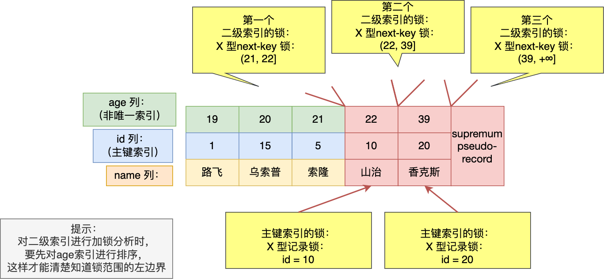

### 没有加索引的查询

* 每条记录都会加上临建锁，相当于锁全表
* `select ... for update`、`update`、`delete` 的 where **没走索引**（无索引列或优化器没选索引）时，全表扫描，每条聚簇索引记录都加 next-key，别的事务增删改都会堵住。线上这类语句先确认执行计划是否走索引
* 详见下面「UPDATE 未走索引」：不是加了表锁，而是所有索引项都加了行级 next-key
* 加锁流程（主键 / 非唯一二级索引）。二级唯一索引除了按下图给二级索引加锁，还会给命中行的主键加记录锁

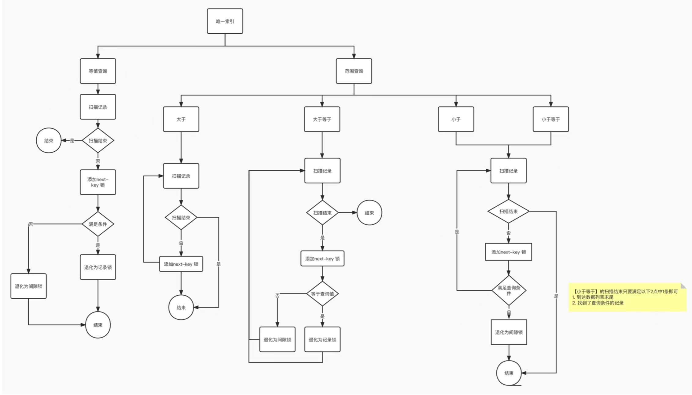

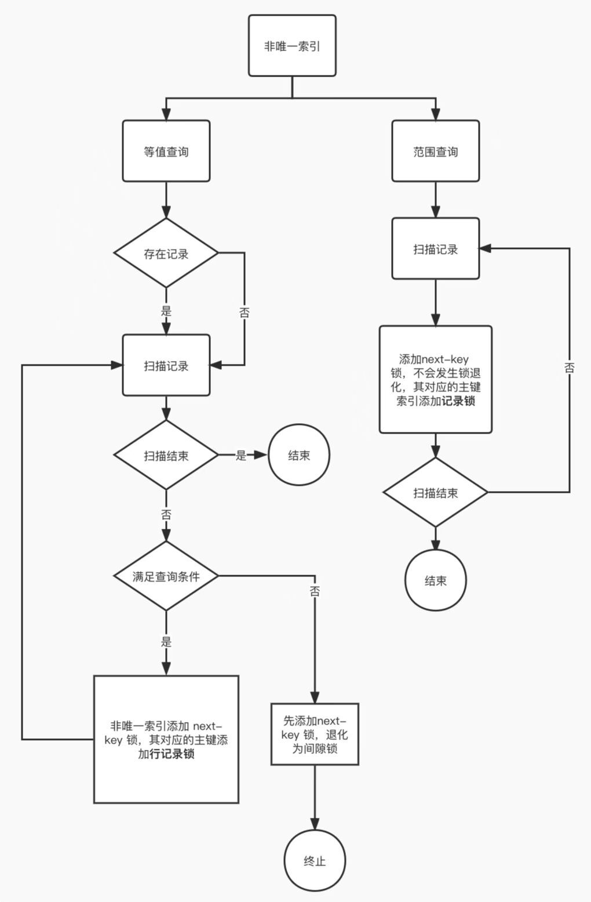

### UPDATE 未走索引为什么近似锁全表

* 前提：InnoDB、**可重复读**。`UPDATE` 对扫描到的记录加 **X 锁**，锁在**事务结束**时释放，不是语句执行完就放
* 网上说「没索引就加表锁」不准确：InnoDB 扫描时按**索引项**加锁。没走索引就是聚簇索引全表扫一遍，每个索引项都加锁，效果像锁全表，**本质仍是行级 next-key**
* `WHERE` 写了索引列，**不等于一定走索引**：优化器可能因选择性差改走全表扫描，一样会把所有记录锁上
* 样例表 `t_stu`，`id` 主键，`name` 无索引

```sql
# id=1  小林  score=50
# id=5  小明  score=68
# id=10 小红  score=86
# id=15 小飞  score=87
```

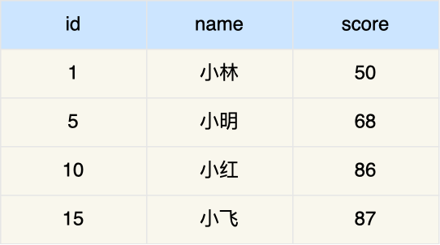

* **where 走唯一索引**：`update t_stu set score = 100 where id = 1;`
  * 等值 + 主键，next-key 退化成 **id=1 的记录锁**
  * 事务 B 改 `id=5` **不会阻塞**

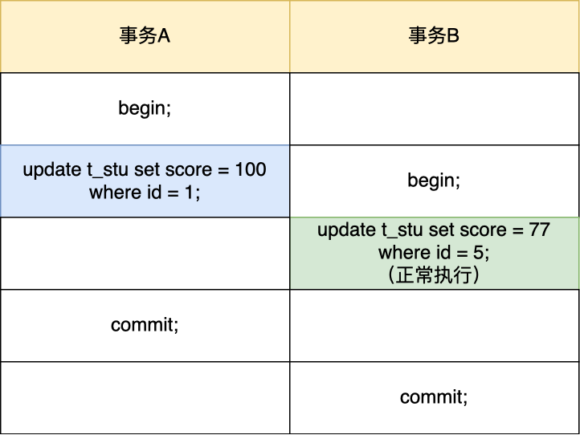

* **where 没索引 / 没走索引**：`update t_stu set score = 100 where name = '小林';`
  * 全表扫描，扫到的每条聚簇索引都加 next-key（记录锁 + 间隙锁）
  * 4 条记录 + 两端和中间的间隙，相当于 **4 个记录锁 + 5 个间隙锁**，整表堵住
  * 事务 B 即使 `update ... where id = 5` 也会**阻塞**，直到 A 提交
  * 期间普通 `select` 是快照读，一般不被行锁挡住；`update` / `delete` / 插入 / `select ... for update` 都会卡住。大表上锁会持有很久，业务容易停摆

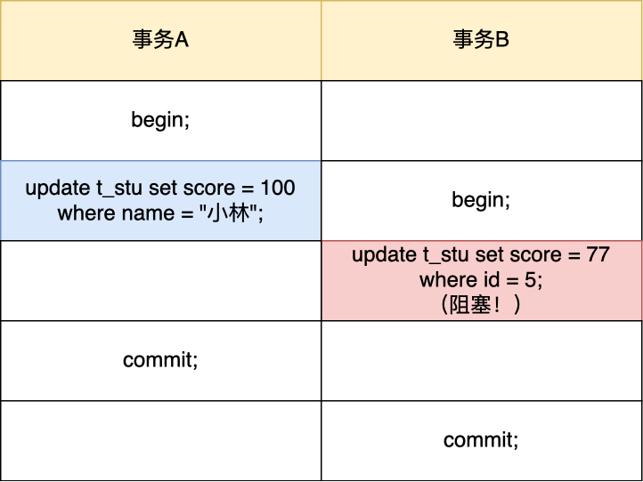

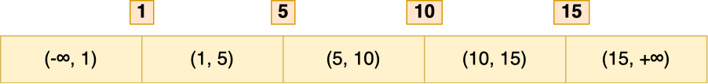

* 怎么避免
  * 线上 `UPDATE` / `DELETE` 先在测试机 `EXPLAIN`，看 `key`、`type`、`rows` 是否走索引
  * where 带了索引列但优化器仍全表扫，可用 `FORCE INDEX (index_name)` 指定索引（数据分布变了要再核对计划）
  * `sql_safe_updates = 1` 开安全更新，拦住高风险语句（默认 0）。只是防误操作，不能代替执行计划检查

```sql
SET sql_safe_updates = 1;

# UPDATE 至少满足一条：WHERE 用了索引列；带 LIMIT；或两者都有
# DELETE 必须同时有 WHERE 和 LIMIT（此时 WHERE 可以没有索引列）
```

* 参考：[update 没加索引会锁全表？](https://www.xiaolincoding.com/mysql/lock/update_index.html)

## 死锁

* 前提：InnoDB、**可重复读**。业务里先 `select ... for update` 做幂等，不存在再 `insert`，并发大时容易死锁
* 样例：`id` 主键，`order_no` **普通二级索引（非唯一）**，已有 order_no = 1001~1006

```sql
CREATE TABLE `t_order` (
  `id` int NOT NULL AUTO_INCREMENT,
  `order_no` int DEFAULT NULL,
  `create_date` datetime DEFAULT NULL,
  PRIMARY KEY (`id`),
  KEY `index_order` (`order_no`)
) ENGINE=InnoDB;
```

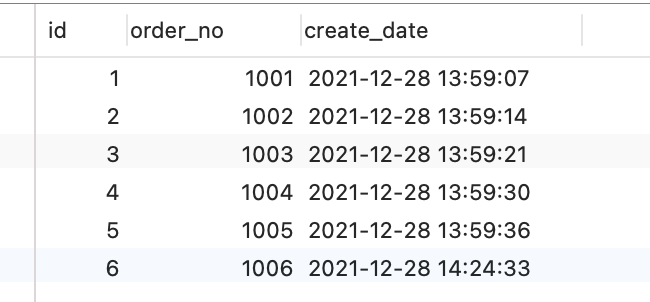

* 两个事务分别要插 1007、1008（都不存在），都先锁定读再插入：

```sql
# 事务 A
begin;
select id from t_order where order_no = 1007 for update;
insert into t_order (order_no, create_date) values (1007, now());

# 事务 B
begin;
select id from t_order where order_no = 1008 for update;
insert into t_order (order_no, create_date) values (1008, now());
```

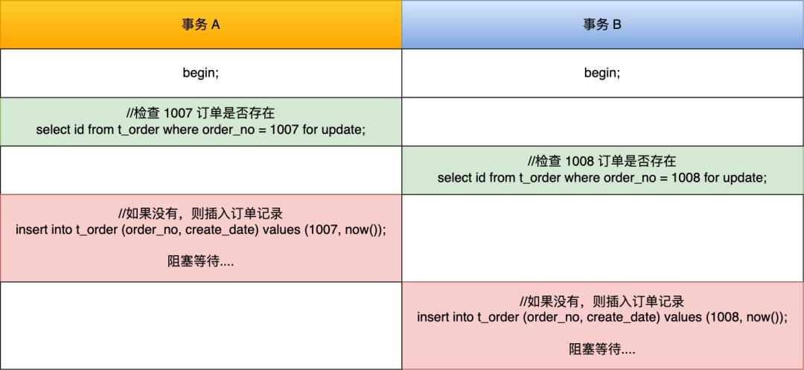

* 两边 `select ... for update` 都能执行完，随后两个 `insert` **互相等待**（没开死锁检测时会一直卡住）
* 不用 `for update`、用普通 select：两边都看不到 1007，都能 insert，会插出两条相同订单（幻读）。`for update` 是为了堵住这个间隙，但并发插入会变成死锁

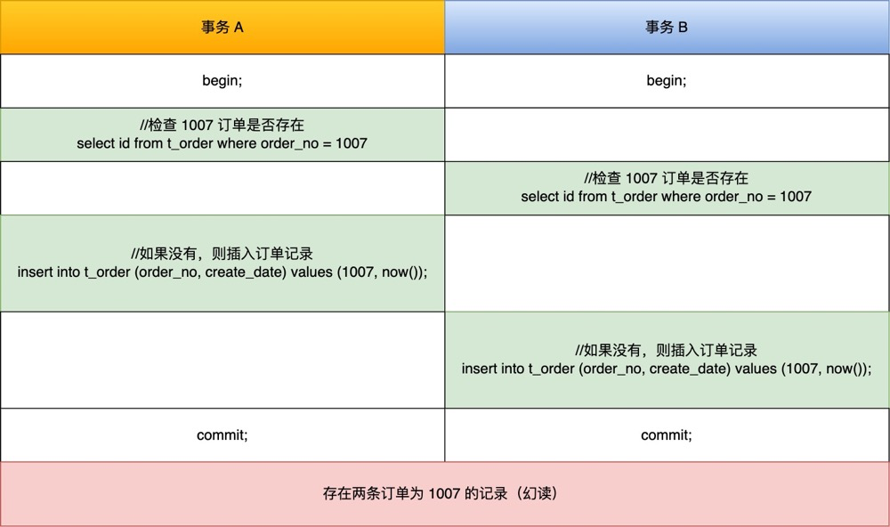

### 产生死锁的原因

* 死锁四条件：**互斥、占有且等待、不可抢占、循环等待**。破任意一条就不会死锁
* 这个例子的循环等待：
  * 非唯一索引等值、记录不存在，且查询值落在**索引最大值右侧**（表里最大 order_no=1006，查 1007/1008）：next-key **不会退化成间隙锁**，加在 supremum 上，范围 **(1006, +∞]**
  * `LOCK_DATA = supremum pseudo-record` 表示右边界是 +∞；左边界是当前最大二级索引值 1006
  * 间隙锁之间**兼容**，两个事务可以同时持有 (1006, +∞]；+∞ 不是真实记录，这段 next-key 的「记录锁」也不会像普通 X 记录锁那样互斥
  * `insert` 要在这个间隙里拿 **插入意向锁**。插入意向锁和**间隙锁冲突**。A 等 B 放间隙锁，B 等 A 放间隙锁 → 循环等待

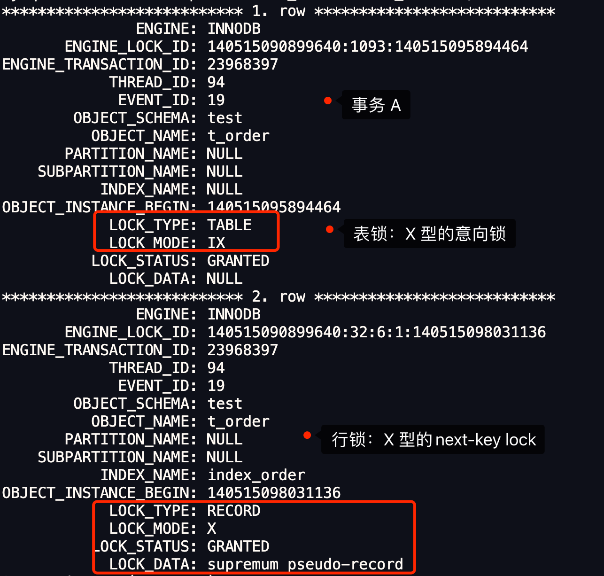

* 对照：若最大 order_no 已经是 1010，再等值查不存在的 1006，右边界是真实记录，**退化成间隙锁**（与前面「非唯一索引等值、记录不存在」一致）

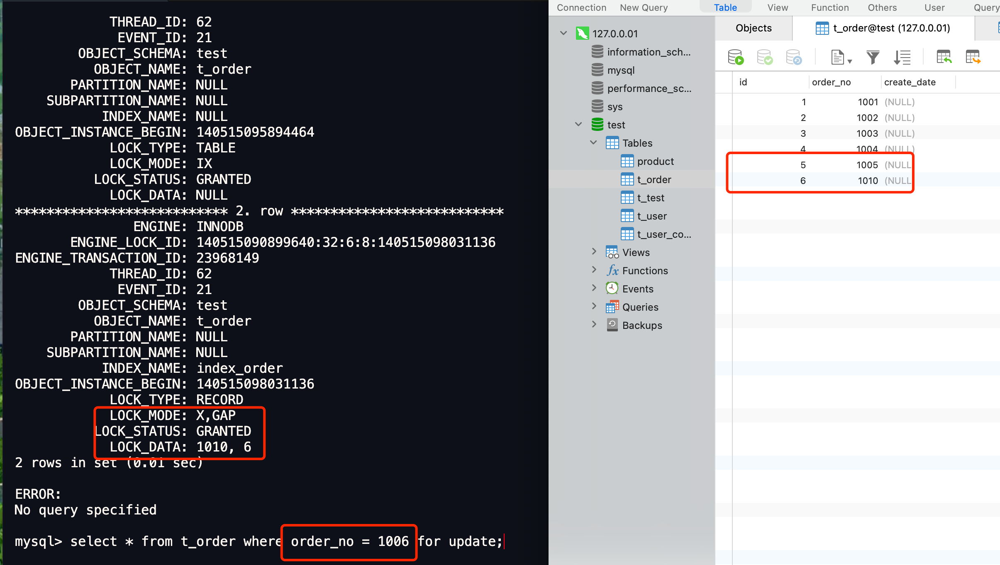

* 插入意向锁：特殊间隙锁，表示「想在某个点插入」。加锁时先生成锁结构再设状态，`WAITING` 表示还没拿到。下一条记录上已有间隙锁/next-key 的间隙，insert 就会阻塞

### INSERT 怎么加行级锁

* 正常 insert **不生成锁结构**，靠聚簇索引隐藏列 `trx_id` 当**隐式锁**（冲突不大可能时延迟加锁）。两种情况会转成显式锁

**1. 插入位置的下一条有间隙锁**

* 要看下一条二级索引记录上有没有间隙锁；有则生成插入意向锁并等待

```sql
# 事务 A：order_no=1006 不存在且在最大值右侧 → next-key (1005, +∞]
select * from t_order where order_no = 1006 for update;

# 事务 B：往这个间隙插 1010，阻塞，LOCK_MODE = X,INSERT_INTENTION，LOCK_STATUS = WAITING
insert into t_order(order_no, create_date) values(1010, now());
```

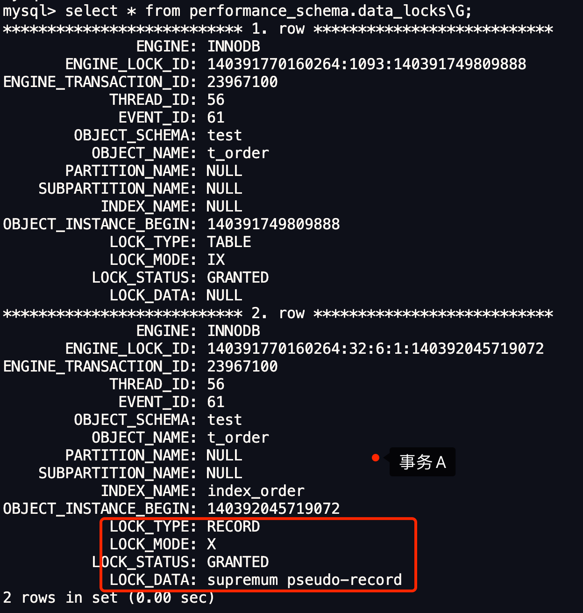

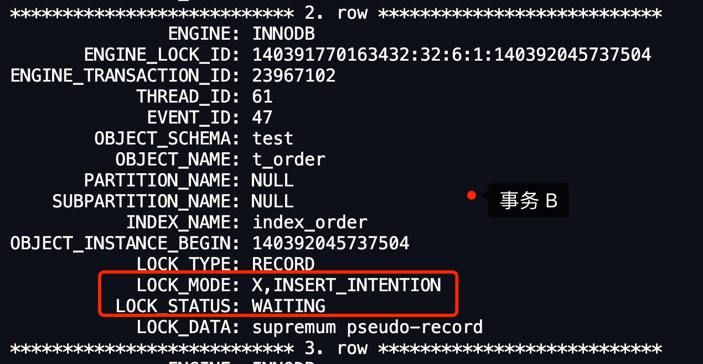

**2. 唯一键冲突（RR）**

* 主键冲突：给已存在的那条聚簇索引加 **S 记录锁**（`S, REC_NOT_GAP`）
* 唯一二级索引冲突：给已存在的二级索引加 **S next-key**（如 `(-∞, 1001]`）
* 别的事务再 `select ... for update` 要加 X，和 S 冲突，会阻塞

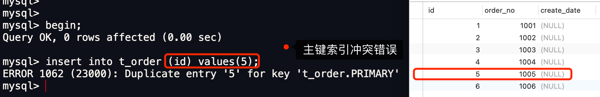

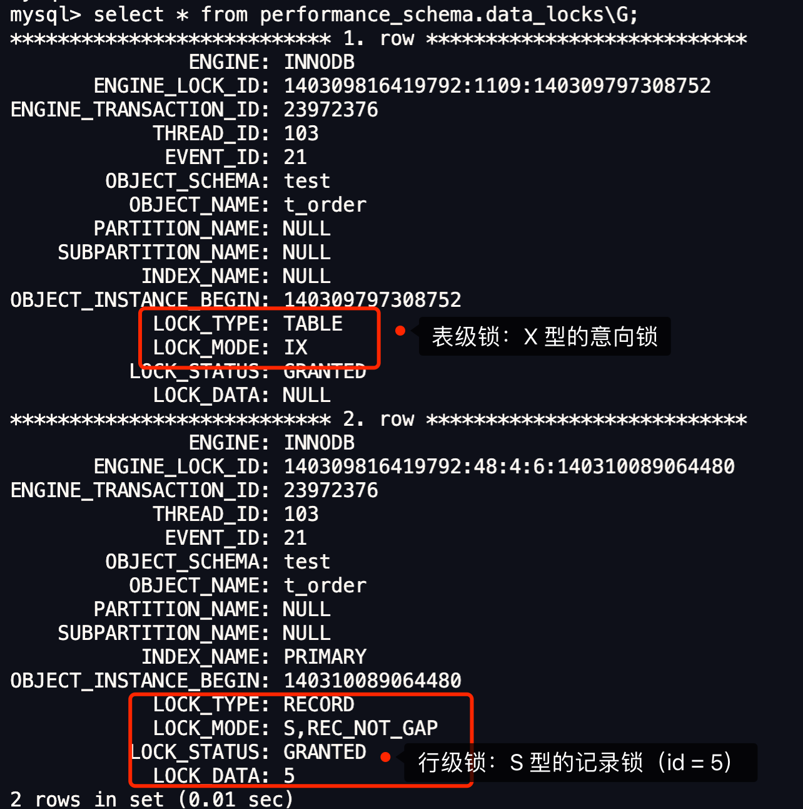

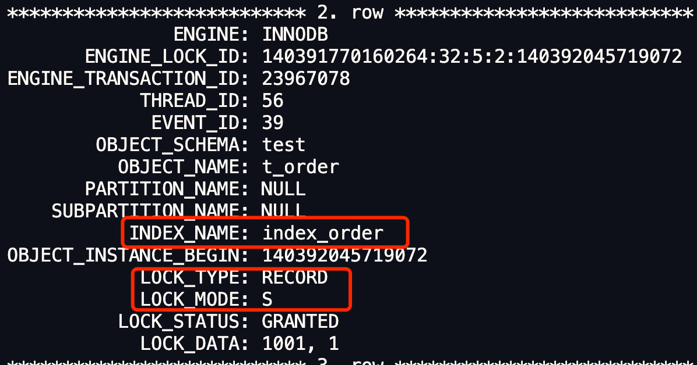

* 两个事务插**同一条**唯一二级索引值：
  * A 先插成功，记录由**隐式锁**保护，`data_locks` 里还看不到锁
  * B 再插遇到重复，要加 **S next-key**；A 的隐式锁转成 **X 记录锁**，S 与 X 冲突，B 阻塞，直到 A 提交
  * `order_no` 若只是普通索引（非唯一），两个事务插相同值**不会**因唯一冲突互相卡住（死锁例子就是这种情况）

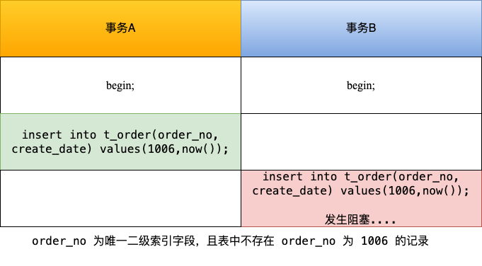

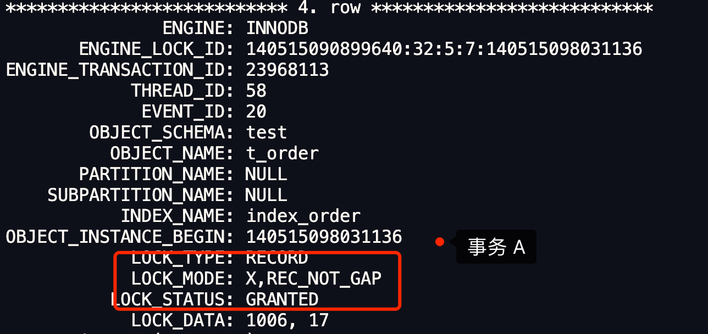

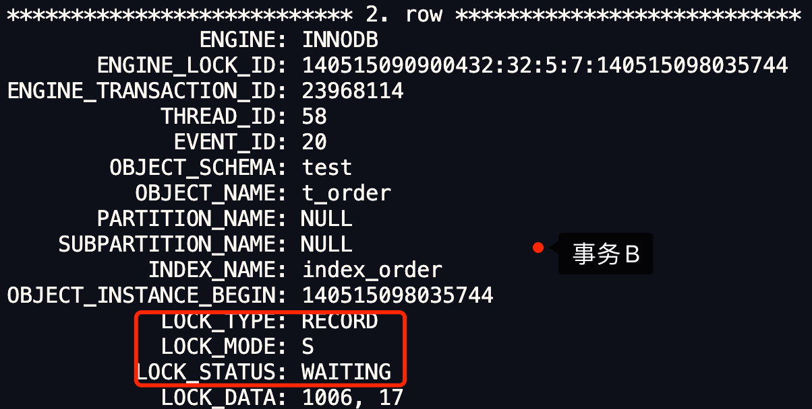

### 如何避免死锁

* 发生之后（打破循环等待）：
  * `innodb_lock_wait_timeout`：等锁超时回滚该事务，默认 **50 秒**。报错 `ERROR 1205 Lock wait timeout exceeded`
  * `innodb_deadlock_detect = ON`（默认开）：检测到死锁后主动回滚链条里某个事务。报错 `ERROR 1213 Deadlock found`


* 业务上预防：幂等不要靠「先 for update 再 insert」。把 `order_no` 做成**唯一索引**，插入重复直接报错；并发插不同新单号也不会两人同时锁住 (max, +∞] 再互插
