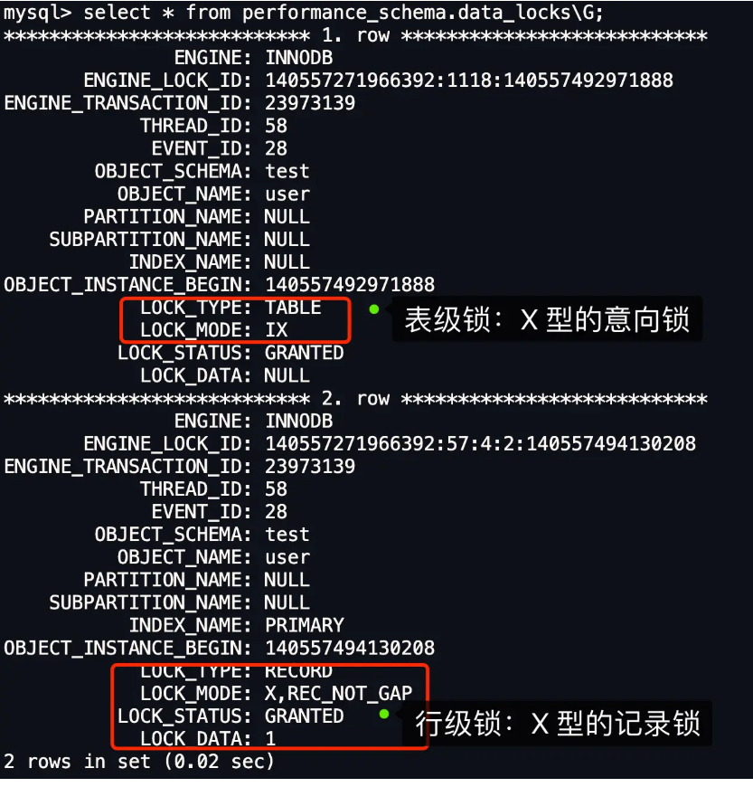

> 拆自 [黑马MySQL.md](./归档/黑马MySQL.md)（已归档，不再维护），并入原「MySQL 如何加锁」笔记，原文未改。事务相关见 [事务.md](./事务.md)。

# 锁

* 计算机协调多个进程或线程并发访问某一资源的机制
* 分类
  * 全局锁：锁数据库所有表
  * 表级锁：锁整张表
  * 行级锁：锁对应行数据

## 全局锁

* 加锁后**整个实例都是只读状态**，DML写、DDL语句，更新操作数据都成阻塞状态
* 使用场景：数据库备份，保证数据的完整性
* 弊端
  * 主库备份，不能执行更新，业务基本停摆
  * 从库备份，备份时不能执行主库同步的二进制日志binlog，导致主从延迟
  * InnoDB引擎，备份时加上操作  `--single-transaction` 完成不加锁的备份（备份数据库前开启事务）

```sql
# 加锁
flush tables with read lock

# 备份（在电脑系统执行，不是mysql语句）
mysqldump -用户名 -密码 数据库 > 数据库sql文件

# 解锁
unlock tables
```

* 执行 update 语句的时候，确保 where 条件中带上了索引列，并且在测试机确认该语句是否走的是索引扫描，防止因为扫描全表，而对表中的所有记录加上锁

## 表级锁

* 锁的粒度大，发生锁冲突概率最高，并发度最低
* 分类
  * 表锁
  * 元数据锁
  * 意向锁

### 表锁

* 表共享读锁（read lock）：所有表都可读，但是都不可写
* 表独占写锁（write lock）：加锁的客户端可读可写，其他均不能读写
* 表锁除了会限制别的线程的读写外，也会限制本线程接下来的读写操作。
  * 线程 A 执行 `lock tables t1 read, t2 write` ，其他线程写 t1，读 t2 会被阻塞，**线程 A 也只能读 t1，读写 t2，不能访问其他表**

```sql
# 加锁
lock tables 表名 read/write；

# 解锁
unlock tables;
```

### 元数据锁（meta data lock，MDL）

* 系统自动控制，无需显式使用
* 访问表的时候会自动加上，主要作用是维护表元数据的数据一致性，表上有活动事务的时候，不能对元数据进行写入操作
* **避免DML与DDL冲突，保证读写正确性**
* 对表进行增删改查的时候，加MDL读锁（共享）；对表结构进行变更操作的时候，加MDL写锁（排他）
* 查看元数据锁：`select object_type,object_schema,object_name,lock_duration from performance_schema.metadata_locks;`
* 申请MDL锁的操作会形成一个队列，队列中**写锁获取优先级高于读锁**，一旦出现 MDL 写锁等待，会阻塞后续该表的所有 CRUD 操作
* 在对表结构变更前，先要看看数据库中的长事务，是否有事务已经对表加上了 MDL 读锁，如果可以考虑 kill 掉这个长事务


### 意向锁

* InnoDB 引擎中
  * 加共享锁之前，需要先在表级别上加意向共享锁
  * 加独占锁之前，需要现在表级别锁加意向独占锁
* 避免DML在执行时，加的行锁和表锁的冲突，这样**表锁就不用检查每行数据是否加锁，减少检查次数**
* 意向共享锁（IS）：`select ... lock in share mode`添加，与表锁共享锁兼容，与表锁排他锁互斥
* 意向排他锁（IX）：`insert、update、delete、select ... for update`添加，与表锁共享锁和表锁排他锁都互斥。意向锁之间不互斥
* 查看意向锁：`select object_schema,object_name,index_name,lock_type,lock_mode,lock_data from performance_schema.data_locks;`

### AUTO-INC 锁

* 作用：自增主键的表、在插入数据时不需要指定主键值
* 特殊的表锁：锁 **不是再一个事务提交后才释放，而是执行完插入语句后就会立即释放**
* **在插入数据时，会加一个表级别的 AUTO-INC 锁** ，为自增字段赋值，插入完成后，释放锁
* 大量插入时会影响性能，轻量实现方式：
  * 插入数据时，为自增字段加上轻量级锁，**给该字段赋值后，就释放轻量级锁，不需要等待整个插入语句执行完后才释放锁**
* **InnoDB 引擎控制变量：innodb_autoinc_lock_mode**
  * innodb_autoinc_lock_mode = 0，就采用 AUTO-INC 锁
  * innodb_autoinc_lock_mode = 2，就采用轻量级锁
  * innodb_autoinc_lock_mode = 1，看情况：
    * 普通 insert 语句，自增锁在申请之后就马上释放
    * 类似 insert … select 这样的批量插入数据的语句，自增锁还是要等语句结束后才被释放
* innodb_autoinc_lock_mode = 2 、binlog_format = statement 时存在数据不一致问题，需要将日志格式 binlog_format 设置为 row 避免 。[详见](https://xiaolincoding.com/mysql/lock/mysql_lock.html#auto-inc-%E9%94%81)

## 行级锁

* 每次加锁锁住对应的行数据。锁粒度最小，并发量最高，发生冲突概率最低

### 记录锁 Record Lock

* 锁定单个记录，防止其他事务进行update和delete，RC（Read commited）、RR（Repeatable Read支持）
* 共享锁（S）：允许事务读一行，阻止其他事务获取排他锁
* 排他锁（X）：允许获取排他锁的事务更新数据，阻止其他事务获取相同的共享锁和排他锁
* InnoDB引擎的行锁是针对索引加的锁，不通过索引检索数据，**行锁会升级为表锁**


* 自动加锁


### 间隙锁 Gap Lock

* 锁住索引记录间隙（不含该记录），防止其他事务在间隙中insert，产生幻读，RR支持
* InnoDB引擎使用next-key锁进行搜索和索引扫描
* 索引上等值查询（唯一索引），给不存在的记录加锁时，优化为间隙锁
* 索引上等值查询（普通索引），向右遍历最后一个值不满足查询需求时，临建锁退化为间隙锁
* 索引的范围查询，会访问到第一个不满足条件的值
* 间隙锁是兼容的，**两个事务可以同时持有包含共同间隙范围的间隙锁**

### 临建锁 Next-Key Lock

* 行锁和间隙锁组合，锁住数据，锁住数据前面的间隙，RR支持

### 插入意向锁

* 事务在插入一条记录的时候，需要判断插入位置是否已被其他事务加了间隙锁
* 如果有的话，插入操作就会发生 **阻塞** ，直到拥有间隙锁的那个事务提交为止
* 在此期间会生成一个 **插入意向锁** ，表明有事务想在某个区间插入新记录，但是现在处于等待状态

## 哪些 SQL 语句加锁？

* 普通 select 语句不会加锁，加锁可以使用下面语句

```sql
# 对读取的记录加共享锁(S型锁)
select ... lock in share mode;

# 对读取的记录加独占锁(X型锁)
select ... for update;

# 两条语句必须在事务中，事务提交锁被释放
```

* update 和 delete 操作会加独占型行级锁

## MySQL 加行级锁

* **加锁的对象是索引，加锁的基本单位是 next-key lock**（前开后闭区间）
* **能使用记录锁或者间隙锁就能避免幻读现象的场景下**，next-key lock 会退化成记录锁或间隙锁
* 查看事务执行时的加锁命令：`select * from performance_schema.data_locks\G`
  * LOCK_MODE = x，加临建锁
  * LOCK_MODE = x，REC_NOT_GAP，加记录锁
  * LOCK_MODE = x，GAP，加间隙锁



### 唯一索引（主键索引）等值查询

* 查询记录是否存在影响加锁规则
  * 记录存在，退化为记录锁
  * 记录不存在，退化为间隙锁，间隙范围为(比id小的最大值，比id大的最小值)

### 唯一索引（主键索引）范围查询

* **会对每一个扫描到的索引加 next-key 锁**，如果存在下列情况，锁会退化：
  * ≥ 查询，如果等值查询记录存在，等值查询的那条记录退化为记录锁
  * ＜ 或 ≤ 查询，根据条件值是否存在于表中：
    * 不存在，扫描到终止范围查询的记录时，退化为间隙锁
    * 存在，且查询条件是 ＜，扫描到终止范围查询的记录时，退化为间隙锁

### 非唯一索引等值查询

* 对于非主键索引，**会对非主键索引和对应的主键索引都加锁，****但是对主键索引加锁的时候****，只有满足查询条件的记录才会加锁**
* 根据查询记录是否存在：
  * 查询记录存在，扫描到第一条**不符合条件的二级索引记录**，退化为间隙锁，之前加的是临建锁，然会对查询到的唯一索引加记录锁
  * 查询记录不存在，扫描到第一条**不符合条件的二级索引记录**，退化为间隙锁，不会对主键索引加锁

### 非唯一索引范围查询

* 锁不会退化，加的全是临建锁

### 没有加索引的查询

* 每条记录都会加上临建锁，相当于锁全表
