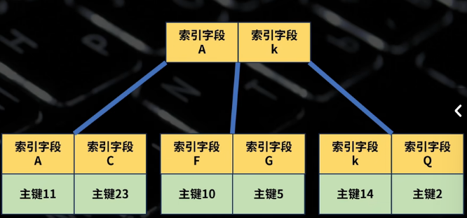
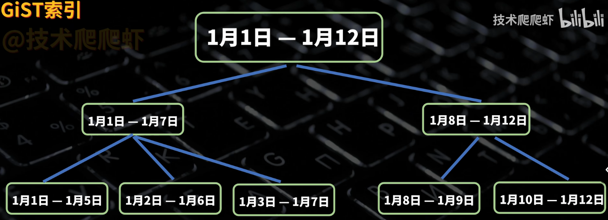
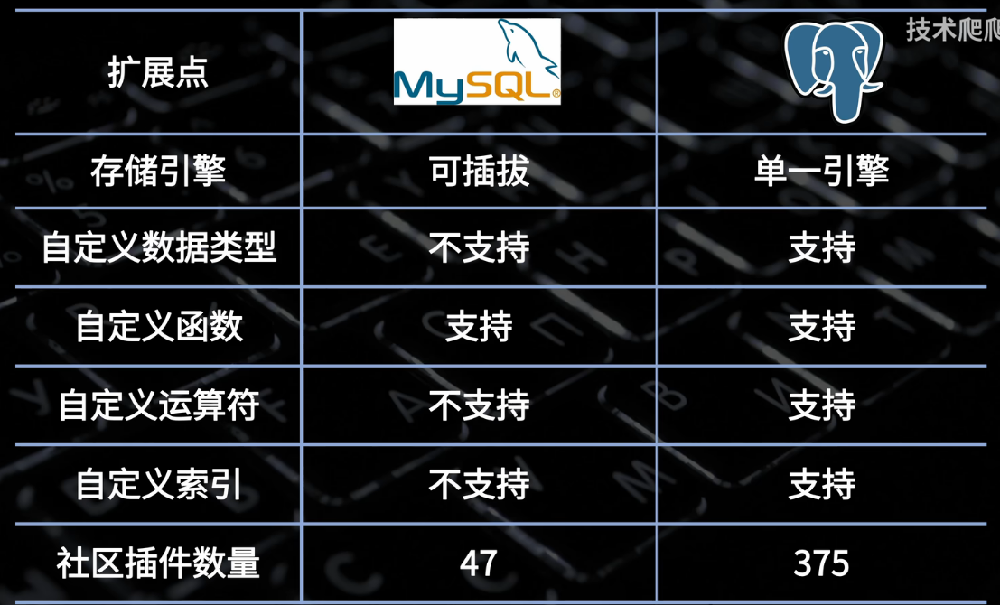

原视频链接：【[为什么PostgreSQL能超越MySQL，有哪些优势？登顶最受欢迎的数据库](https://www.bilibili.com/video/BV1FHHyzYEbA?vd_source=35f002f1e6ad1732a3e7d30a9e399005)】


| 功能维度                 | MySQL                    | PostgreSQL                     |
| ------------------------ | ------------------------ | ------------------------------ |
| **索引结构**             | B+树（InnoDB）           | B+树（默认）                   |
| **聚簇索引**             | ✅ 有（主键索引就是数据） | ❌ 没有（索引和数据分离）       |
| **二级索引**             | 存主键ID（需回表）       | 存堆表指针（TID）              |
| **索引与数据关系**       | 索引=数据（主键）        | 索引和数据完全分离             |
| **GIN索引（倒排索引）**  | ❌ 不支持                 | ✅ 支持（全文/数组/JSON强）     |
| **GiST索引（范围索引）** | ❌ 不支持                 | ✅ 支持（空间/区间/自定义类型） |
| **部分索引**             | ❌ 不支持                 | ✅ 支持（WHERE 条件索引）       |
| **表达式索引**           | ⚠️ 间接支持（虚拟列）     | ✅ 原生支持                     |
| **全文检索**             | 一般（依赖插件）         | 很强（内置 + GIN）             |
| **事务隔离级别默认**     | 可重复读（RR）           | 读已提交（RC）                 |
| **MVCC实现**             | 有（但更新读当前值）     | 更严格一致性                   |
| **一致性表现**           | 存在“幻读/更新异常”争议  | 更符合标准事务语义             |
| **可延迟约束**           | ❌ 不支持                 | ✅ 支持（事务提交才检查）       |
| **扩展能力**             | 弱（插件有限）           | 强（Extension机制）            |
| **自定义类型**           | ❌ 基本不支持             | ✅ 支持（JSON、数组、GIS等）    |
| **自定义函数**           | 有限                     | 强（SQL/PLpgSQL/Python等）     |
| **自定义索引类型**       | ❌ 不支持                 | ✅ 支持（GiST/SP-GiST/BRIN等）  |
| **JSON支持**             | 有（但偏文档）           | 更强（可索引+函数丰富）        |
| **地理空间（GIS）**      | 一般                     | 很强（PostGIS）                |
| **复杂查询能力**         | 一般                     | 强（适合OLAP/复杂SQL）         |
|                          |                          |                                |

# 索引

MySQL 和 pgSQL 的索引结构**都是B+树**

## 一级索引和二级索引

MySQL的一级索引会存储数据，二级索引存储主键ID




pgSQL **所有索引都是二级索引**，数据不存放在树里面，而是存在单独的堆表空间，索引的叶子节点存储的都是指向堆表的指针

**索引和数据是分离的，避免了随机写入导致的数据页分裂**


## GIN 索引

pgSQL 独有

倒排索引，建立从值到行的反向映射。**查询的时候查询行号，然后对行号取交集**

可以对文本进行高效检索


## GiST 索引

pgSQL 独有

通用搜索树（Generalized Search Tree），不是具体索引，而是一种框架。数据只要实现对应接口就可以建立索引

适合非线性数据，如 ip 地址、时间范围、地理位置

**结构也是B+树，但存储的不是具体值，而是范围**



## 部分索引

pgSQL 独有

采用逻辑删除，如果对 phone 字段建立了唯一索引，则无法再插入 456789 的 phone

建立部分索引：`CREATE UNIQUE INDEX unique_phone_idx ON users (phone) WHERE (active_ind = 'Y)`


## 表达式索引

MySQL 和 pgSQL 都有

* pgSQL 是真表达式索引
* MySQL 是给表达式生成一个隐藏的虚拟列，然后建立索引

支持把列的计算结果进行索引，可以直接针对计算结果进行查询

`CREATE INDEX users_email_lower ON users (lower(email))`

# 数据一致性

## 可延迟约束

pgSQL 独有

只有在事务提交的时候，才会对约束进行检查

在复杂场景中，解决了先有鸡还是先有蛋的问题，可以把鸡和蛋都准备好，然后放到一个事务里面一起提交

```sql
CREATE TABLE users (
    id serial PRIMARY KEY,
    username text NOT NULL UNIQUE DEFERRABLE INITIALLY DEFERRED
);

INSERT INTO users (username) VALUES ('alice'), ('bob');

-- 将两个名字对调
UPDATE users SET username = 'bob' WHERE id = 1;
select * from users;

select * from users;
UPDATE users SET username = 'alice' WHERE id = 2;
```

## 隔离级别

MySQL 默认隔离级别是可重复读；pgSQL 默认隔离级别是读已提交

MySQL 对读写操作进行了区别对待

读取的时候，读取的时候是当时的快照；更新的时候则是读取当前内容：

```sql
-- 表里面只有一个名为 A 的用户

-- 事务 2
UPDATE users set name = 'B' WHERE name = 'A';

-- 事务 1
-- 查不到，符合逻辑
SELECT * FROM users WHERE name = 'B';
-- MySQL 可以更改成功，不符合逻辑
UPDATE users set name = 'C' WHERE name = 'B';
```

# 可扩展性



## 例子

```sql
-- 安装扩展
CREATE EXTENSION postgis

-- 自定义数据类型
-- geom 存储的是地理位置
CREATE TABLE city_map (
    id SERIAL PRIMARY KEY,
    name TEXT NOT NULL,
    -- 4326 是GPS坐标系统的代号
    geom GEOMETRY(GEOMETRY, 4326)
);

-- 自定义函数
-- ST_GeomFromText 将字符串转化为地理坐标
INSERT INTO city_map (name, geom) VALUES
('人民公园', ST_GeomFromText('POLYGON((0 0, 10 0, 10 10, 0 10, 0 0))', 4326)),
('护城河', ST_GeomFromText('LINESTRING(-5 5, 15 5)', 4326)),
('电话亭', ST_GeomFromText('POINT(12 8)', 4326));

SELECT name, ST_Area(geom)
FROM city_map
WHERE name = '人民公园';

-- 自定义索引
CREATE INDEX city_map_geom_idx ON city_map USING GIST (geom);

-- 自定义运算符
-- <-> 符号是表示两个地理位置的距离
-- 可以使用 gist 索引
SELECT name
FROM city_map
ORDER BY geom <-> (SELECT geom FROM city_map WHERE name = '电话亭')
LIMIT 3;
```
