# 分布式缓存

* 单点 Redis 问题
  * 数据丢失——数据持久化
  * 并发能力——主从集群
  * 故障恢复——哨兵机制
  * 存储能力——分片集群

## 持久化

### RDB

* RDB（Redis Database Backup file，Redis 数据备份文件）：把内存中的所有数据都记录到磁盘中。Redis 故障重启后，从磁盘读取快照文件，恢复数据
* 生成 RBD 命令：
  * `save`：主线程生成 RDB 文件，由于和执行操作命令在同一个线程，**会阻塞主线程**
  * `bgsave`：会创建一个子进程来生成 RDB 文件，这样可以**避免主线程的阻塞**
* RDB 保存在当前文件夹 dump.rdb
* RDB 为**全量快照，操作比较重**
* 在配置文件 `redis.conf` 中记载了 RDB 自动触发的机制：

```bash
# 900 秒内，至少有一个 key 被修改，则执行 bgsave
# save "" 则表示禁用 RDB
save 900 1
save 300 10
save 60 10000

# 是否压缩，建议不开启
rdbcompression yes

# RDB 文件名称
dbfilename dump.rdb

# 文件保存的路径目录
dir ./
```

#### bgsave 原理

* bgsave 开始时，主进程 fork 创建子进程，并复制页表，子进程和主进程共享内存数据（页表指向相同的物理内存）
* 采用 COW 技术，执行 bgsave 过程中，Redis 依然**可以继续处理操作命令**的，也就是数据可以被修改
* 当主进程执行读操作，访问共享内存
* 当主进程执行写操作时，拷贝一份数据执行写操作，后续主进程读取也是读拷贝的数据
* RDB 复制期间保存的是原本的数据
* **极端情况下，所有共享内存都被修改，内存占用变成原来的 2 倍**

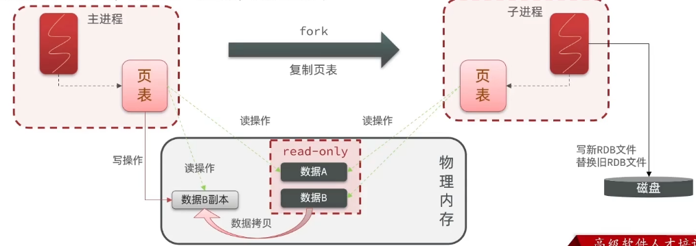

### AOF

* AOF（Append Only File，追加文件）：Redis 会将每一个写命令记录在 AOF 文件，可以看作命令日志文件

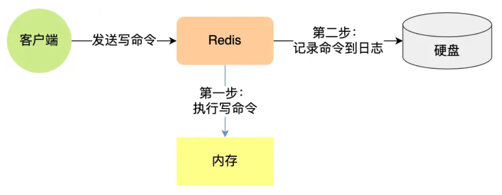

* AOF 默认关闭，需要修改 `redis.conf` 开启 AOF# 是否开启 AOF 功能，默认为 no

```bash
appendonly yes
# AOF 文件名称 
appendfilename "appendonly.aof"
```

#### 写入命令

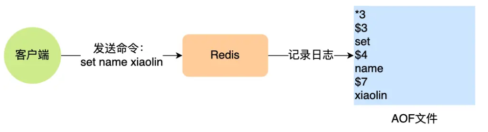

* `*3` 表示命令有三个部分
* `$3` 表示该条命令有三个字节
* 先执行写操作再记录到日志
  * 好处
    * 避免额外检查开销：如果命令语法有问题
    * 不会阻塞当前写操作执行
  * 风险
    * 还没将命令写入硬盘，服务器宕机，数据丢失
    * 命令写入日志是同步操作，如果 I/O 压力大，可能阻塞下一个写操作

#### 三种写回策略

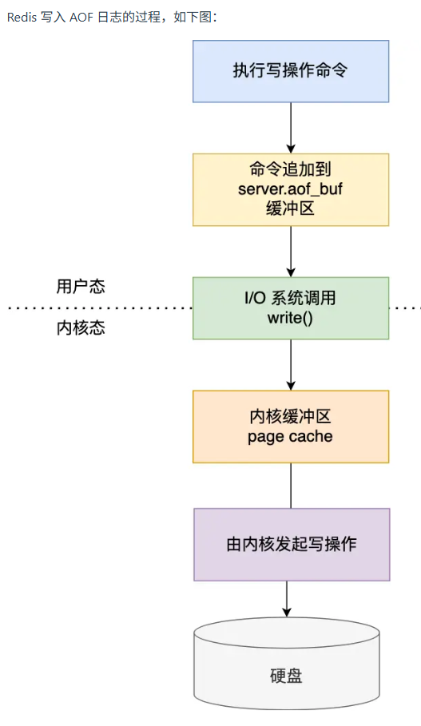

```bash
# redis.conf
# 每执行一次写命令，立即记录到 AOF 文件
appendfsync always
# 写命令执行完，先放入 AOF 缓冲区，每隔一秒将缓冲区数据写到 AOF 文件（默认方案）
appendfsync everysec
# 写命令执行完，先放入 AOF 缓冲区，操作系统决定何时将缓冲区内容写回磁盘
appendfsync no
```


* 实现原理：控制 `fsync()` 函数的调用时机
* 当应用程序向文件写入数据时，内核通常先将数据复制到内核缓冲区中，然后排入队列，由内核决定何时写入硬盘
  * Always 策略就是每次写入 AOF 文件数据后，就执行 fsync() 函数
  * Everysec 策略就会创建一个异步任务来执行 fsync() 函数
  * No 策略就是永不执行 fsync() 函数

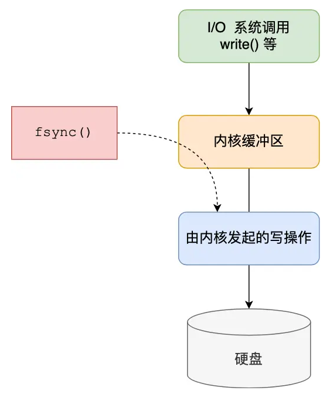

#### AOF 重写

* AOF 日志文件会随着写操作命令增加越写越大，影响恢复过程，因此提出 AOF 重写机制
* AOF 文件大小超过设定阈值时，会触发重写

```bash
# redis.conf
# AOF 文件比上次文件增长超过多少百分比则重写
auto-aof-rewrite-percentage 100
# AOF 文件体积最大多少以上触发重写
auto-aof-rewrite-min-size 64mb
```

* 重写机制：在重写时，读取当前数据库中的所有键值对，然后将每一个键值对用一条命令记录到新的 AOF 文件，全部记录完后，将新的 AOF 文件替换现有的 AOF 文件

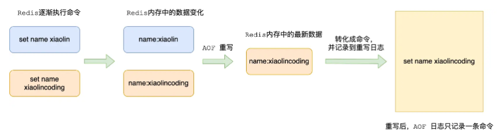

#### AOF 后台重写

* 重写过程很耗时，因此不能同步进行，而是由后台子进程 `bgrewriteaof` 完成
  * 子进程进行 AOF 重写期间，主进程可以继续处理命令请求，从而避免阻塞主进程
  * 子进程带有主进程的数据副本。如果使用线程，由于多线程共享内存，需要加锁保证数据安全性，反而降低性能。子进程则使用 COW ，不加锁保证数据安全
* 重写期间，Redis 执行完写命令后，会**同时将这个写命令写入到 「AOF 缓冲区」和 「AOF 重写缓冲区」**


* 主进程执行工作：
  * 执行客户端的命令
  * 将执行后的命令写入 AOF 缓冲区和 AOF 重写缓冲区
* 子进程完成 AOF 重写工作后，会向主进程发送信号，主进程收到后调用信号处理函数
  * 将 AOF 重写缓冲区中的所有内容追加到新的 AOF 的文件中
  * 新的 AOF 的文件进行改名，覆盖现有的 AOF 文件

### RDB 与 AOF

* 对比

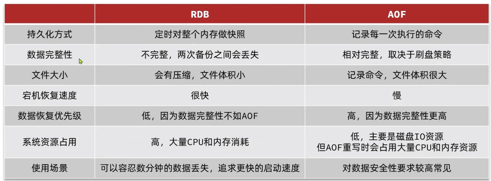

* 混合持久：工作在  **AOF 日志重写过程** 。

```bash
# redis.conf
aof-use-rdb-preamble yes
```

* AOF 重写时，先将共享数据以 RDB 方式写入 AOF 文件
* 主线程处理的操作命令会被记录在重写缓冲区里，重写缓冲区里的增量命令会以 AOF 方式写入到 AOF 文件
* 写入完成后替换文件
* AOF 文件的**前半部分是 RDB 格式的全量数据，后半部分是 AOF 格式的增量数据**

### 大 key 对持久化影响

#### 对 AOF 日志影响

* Always 策略：主线程执行 `fsync` 函数的时候，阻塞时间会比较久
* Everysec 和 No 策略：异步执行和不执行 `fsync` 函数，因此不会影响主线程

#### 对 AOF 重写和 RDB 影响

* 写入很多大 key ，AOF 日志文件的大小会很大，那么很快就会触发 **AOF 重写机制**
* 如果页表很大，复制时会发生阻塞现象
* 如果创建完子进程，父进程修改了大 key，会发生 COW，复制一份物理内存，父进程发生阻塞

#### 其他

* 客户端超时阻塞
* 网络阻塞
* 工作线程阻塞
* 内存分布不均匀
* 尽量避免设计大 key，而是拆成小 key，并定期检测和异步删除（unlink）

## 主从复制

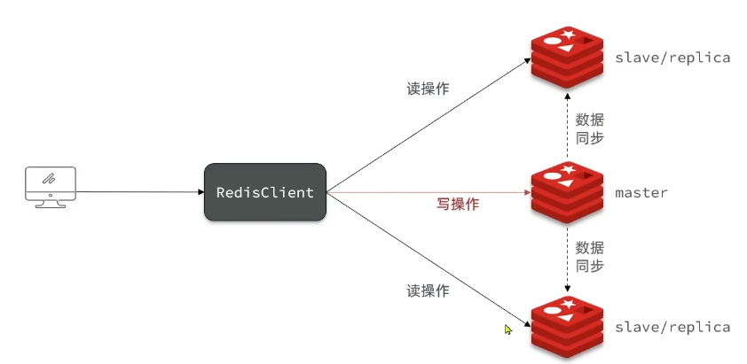

### 全量同步（第一次同步）

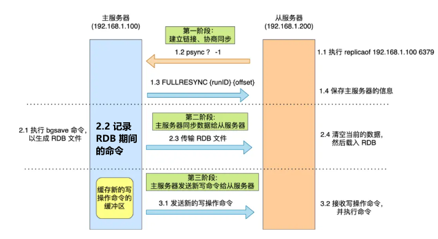

* 建立连接、协商同步
  * 执行 replicaof 命令，从服务器向主服务器发送 psync 命令，该命令包含两个参数
    * 主服务器 runID：Redis 服务器的唯一标识，第一次同步时由于从服务器不知道主服务器 ID 因此参数为 "?"
    * 复制进度 offset：表示复制进度，第一次同步时参数为 -1
  * 主服务器收到 psync 命令，用 `FULLRESYNC` 作为响应命令返回给对方，并带上这两个参数
* 主服务器同步数据给从服务器
  * 主服务器执行 bgsave 生成 RDB 文件，把文件发送给从服务器
  * 从服务器收到文件后，清空服务器数据，载入 RDB 文件
  * 主服务器在以下时间，会把收到的写操作命令写入 replication buffer 缓冲区
    * 主服务器生成 RDB 文件期间
    * 主服务器发送 RDB 文件给从服务器期间
    * 从服务器加载 RDB 文件期间
* 主服务器发送新写操作命令给从服务器
  * 从服务器加载完 RDB 文件后，通知主服务器
  * 主服务器将 replication buffer 缓冲区的命令发送给从服务器，从服务器执行其中命令
  * 至此，主从服务器数据一致

### 命令传播

* 主从服务器在完成第一次同步后，双方之间就会维护一个 TCP 连接
* 后续主服务器可以通过这个连接继续将写操作命令传播给从服务器，然后从服务器执行该命令

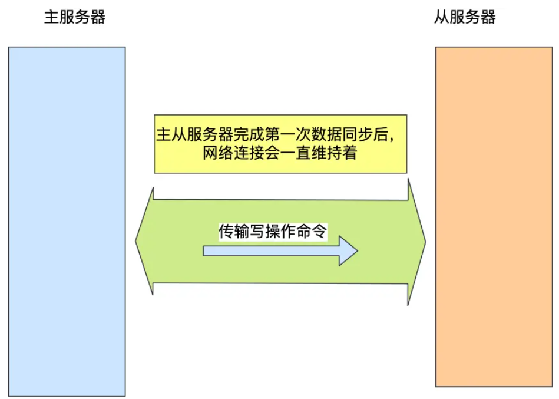

### 分担主服务器写压力

* 如果从服务器数量过多，且所有从服务器都和主服务器进行全量同步，会有以下问题：
  * 主服务器就会忙于使用 fork() 创建子进程，如果主服务器的内存数据非大，在执行 fork() 函数时是会阻塞主线程的，导致 Redis 无法正常处理请求
  * 传输 RDB 文件会占用主服务器的网络带宽，会对主服务器响应命令请求产生影响
* 设置经理服务器：在从服务器上面执行  `replicaof 目标服务器IP 6379`

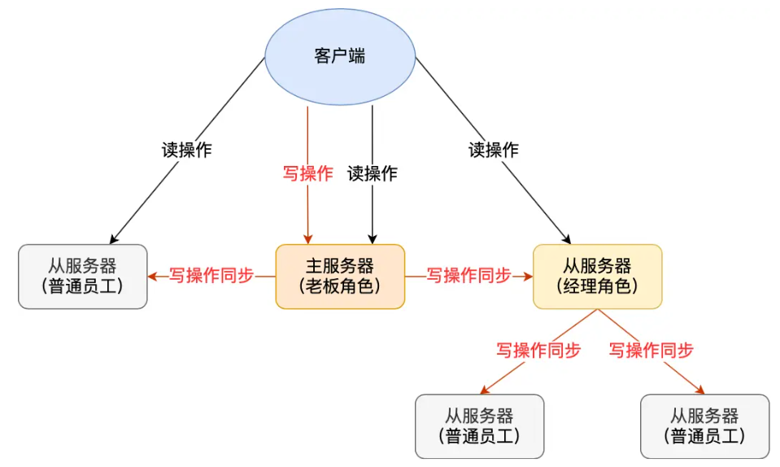

### 增量复制

* 从节点宕机重启后，执行增量同步

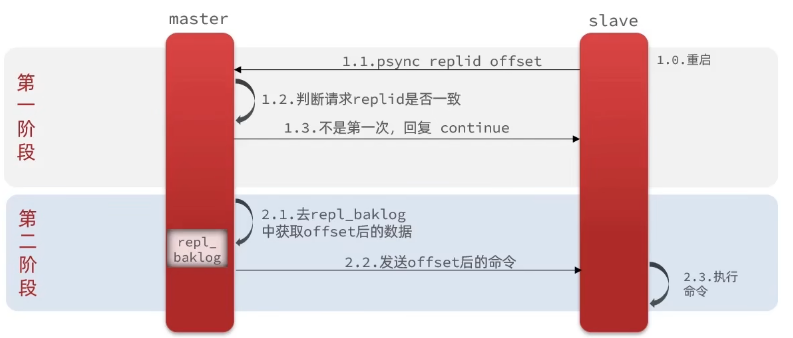

* 从服务器宕机重启后，发送 psync 命令给主服务器，并带有 replid 和 offset 参数
* 主服务器收到命令后，发送 continue 命令告诉从服务器使用增量复制
* 主服务器将从服务器断线期间，执行的写命令发送给从服务器，从服务器执行这些命令
  * **repl_backlog_buffer** ，是一个「 **环形** 」缓冲区，用于主从服务器断连后，从中找到差异的数据
  * **eplication offset** ，标记上面那个缓冲区的同步进度，主从服务器都有各自的偏移量 master_repl_offset 和 slave_repl_offset
* 从服务器重新连上主服务器时，通过 psync 命令将自己的复制偏移量发送给主服务器，主服务器根据二者偏移量差距决定同步方式
  * 从服务器要读取的数据还在 repl_backlog_buffer 缓冲区里，使用增量同步。反之则全量同步
* **repl_backlog_buffer** 大小计算：second * write_size_per_second
  * second：从服务器断线重连时间（秒）
  * write_size_per_second：主服务器平均每秒产生的写命令数据量大小

### 优化

* 思想：减少全量同步次数和所需时间
* 在主服务器配置 `repl-diskless-sync yes` 启动无磁盘复制（前提是网络性能好）
* 限制 Redis 单节点大小
* 提高 repl_baklog 大小

## 哨兵

* 哨兵（Sentinel）是一个运行在特殊模式下的 Redis 进程，所以它也是一个节点
  * 监控：检查主从节点是否预期工作
  * 自动故障恢复（选主）：主节点挂了，哨兵会自动将一个从节点提升为主节点，故障恢复后也是新的主节点
  * 通知：哨兵充当 Redis 客户端服务发现，集群发生故障转移时，会通知给 Redis 客户端

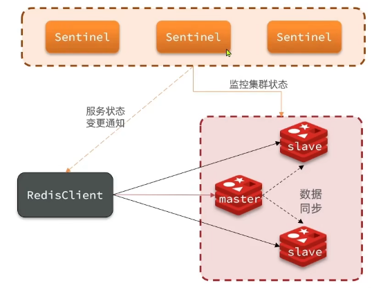

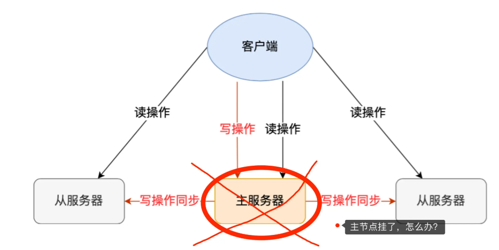

### 监控

* 哨兵会每隔 1 秒给所有主从节点发送 PING 命令，当主从节点收到 PING 命令后，会发送一个响应命令给哨兵
  * 主观下线：主节点或者从节点没有在规定的时间内响应哨兵的 PING 命令
  * 客观下线（只适用于主节点）：超过指定数量（最好一半以上）哨兵都认为主节点主观下线（当一个哨兵判断主节点为「主观下线」后，就会向其他哨兵发起命令）

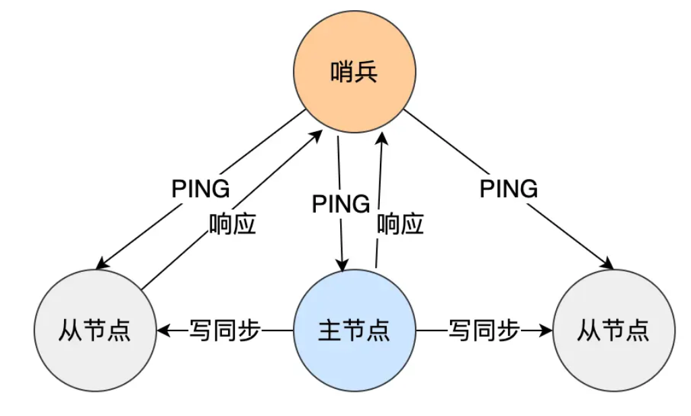

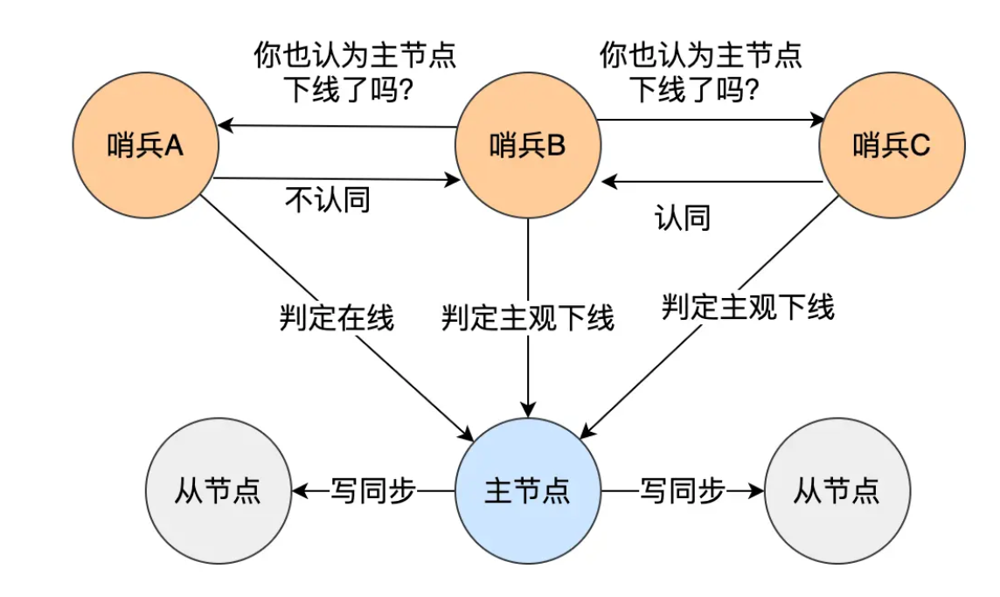

### 选取故障转移哨兵

* 选取成为 Leader（进行故障转移）的哨兵
  * 哨兵判断主节点主观下线后，就会给其他实例发送 is-master-down-by-addr 命令，其他哨兵会根据自己和主节点的网络连接情况，作出赞成或反对响应
  * 当哨兵 B 收到赞成票数达到哨兵配置文件中的 quorum 配置项设定的值后，将主节点记为客观下线，并作为 Leader 候选者
    * 候选者会向其他哨兵发送命令，表明希望成为 Leader 来执行主从切换，进行投票
    * 哨兵可以投给自己或投给别人，但是只有候选者才能把票投给自己
    * 成为 Leader
      * 拿到半数以上的赞成票
      * 拿到的票数大于等于哨兵配置文件中的 quorum 值
  * 如果哨兵集群中只有 2 个哨兵节点，此时如果一个哨兵想要成功成为 Leader，必须获得 2 票；如果一个哨兵挂了，票数就没办法达到 2 票，就无法成功成为 Leader，无法进行主从切换
  * **哨兵节点至少要有三个**

### 主从故障转移

#### 选出新主节点

* 判断主从节点断连时间长短，如果大于 `down-after-milliseconds * 10`，排除该节点（网络状态不好）。 `down-after-milliseconds` 是主从节点断连的最大连接超时时间
* 选择优先级高的从节点，slave-priority 越小优先级越高，为 0 则不参与选举
* 选择复制进度靠前的从节点，slave_repl_offset 越接近 master_repl_offset 复制进度越靠前
* 选择 ID 小的从节点

#### 将从节点指向新的主节点

* leader 哨兵给选出的从节点发送 `slave no one` 命令，将其转为主节点
* leader 哨兵给其他从节点发送 `slave 新主节点ip 新主节点port` 命令

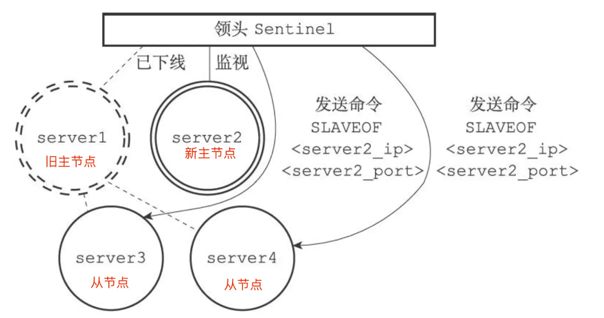

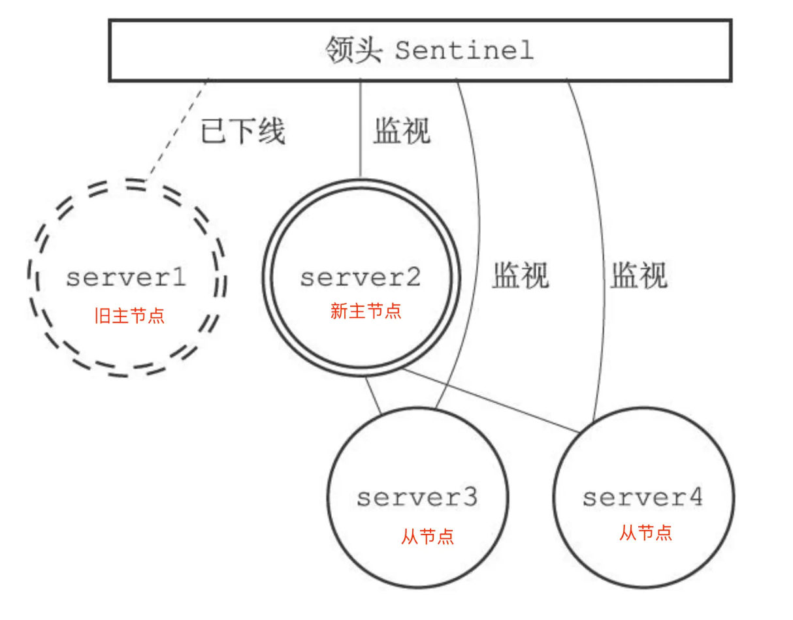

#### 通知客户端

* **通过 Redis 的发布者/订阅者机制来实现**
* 客户端和哨兵建立连接后，客户端会订阅哨兵提供的频道
* **主从切换完成后，哨兵就会向 `+switch-master`** **频道发布新主节点的 IP 地址和端口的消息，这个时候客户端就可以收到这条信息**

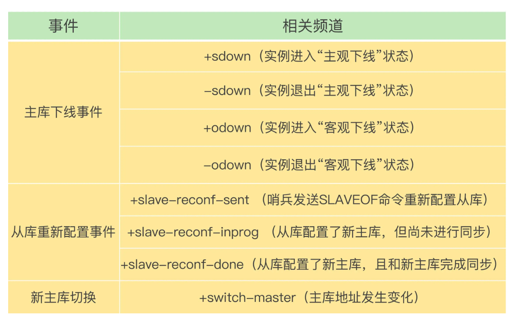

#### 将旧主节点变为从节点

* 旧主节点重新上线时，哨兵集群就会向它发送 `SLAVEOF` 命令，让它成为新主节点的从节点

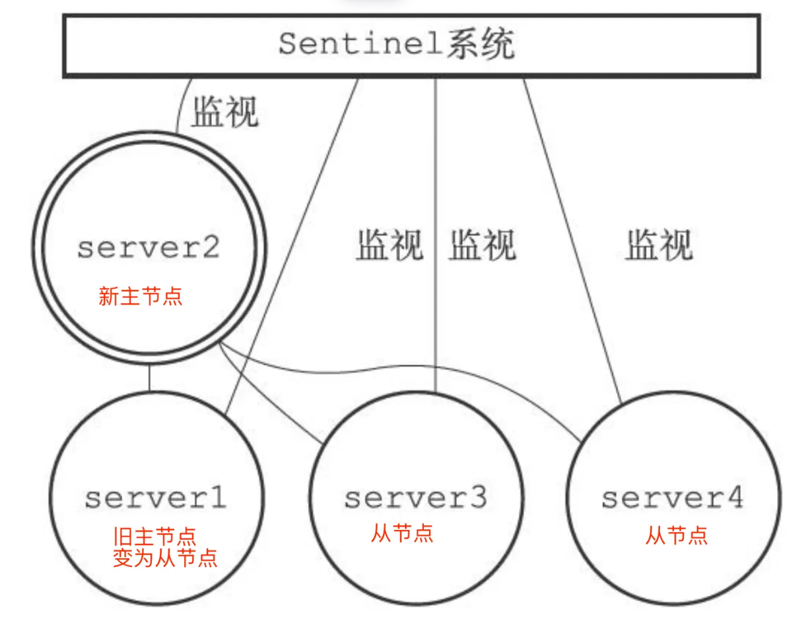

### 哨兵集群组成

* 搭建哨兵集群命令：

```c
sentinel monitor <master-name> <ip> <redis-port>
```

* **哨兵节点之间通过 Redis 的发布者/订阅者机制来相互发现的**
  * 主节点上有一个名为 `__sentinel__:hello`的频道，不同哨兵通过它来相互发现，实现互相通信
  * 哨兵 A 把自己的 IP 地址和端口的信息发布到 `__sentinel__:hello` 频道上，哨兵 B 和 C 可以通过订阅该频道获取哨兵 A 的信息，和哨兵 A 建立网络连接

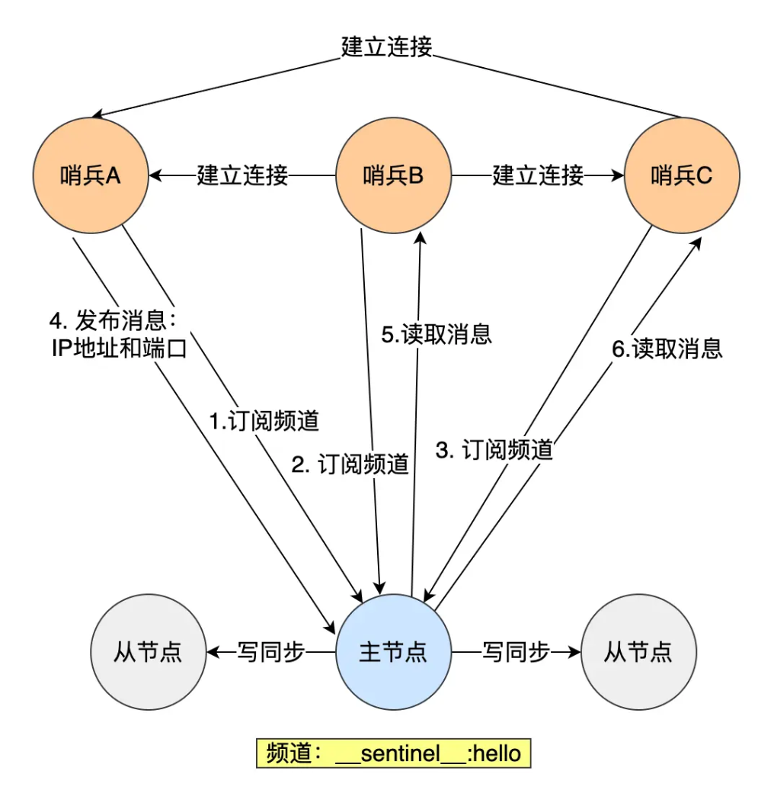

* 哨兵通过主节点获取从节点信息
  * 主节点知道所有「从节点」的信息，所以哨兵会每 10 秒一次的频率向主节点发送 INFO 命令来获取所有「从节点」的信息

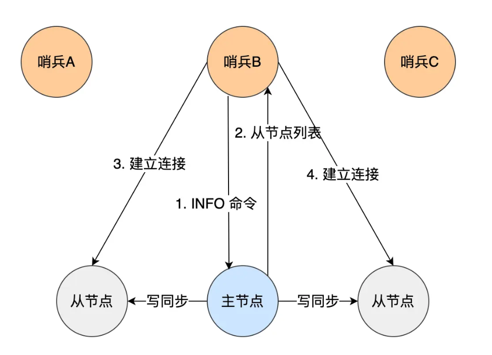

## 分片集群

* 哨兵模式**每个节点存储的数据是一样的，浪费内存，并且不好在线扩容**
* Reids Cluster集群，对数据进行分片，**每台Redis节点上存储不同的内容**，**还提供复制和故障转移的功能**
* 客户端可以访问任意集群节点，最后都会被转发到正确节点

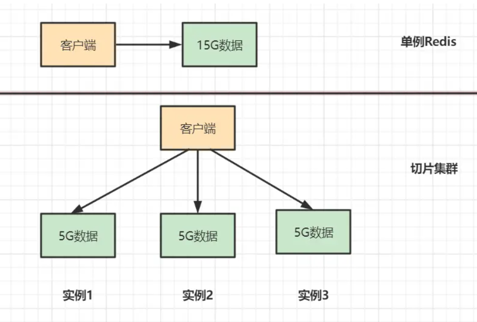

### 哈希槽

* 一个切片集群被分为16384个slot（槽），每个进入Redis的键值对，根据key分配到其中一个插槽
* 用CRC16算法计算出一个16bit的值，再对16384取模
* 如何将同一类数据固定在一个 Redis 示例？
  * 给 key 的 "{}" 中的字段设置相同的值

### 重定向

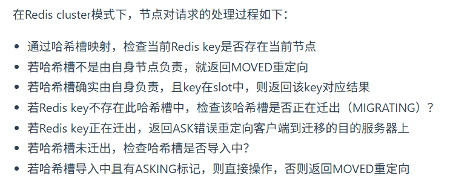

#### MOVED 重定向

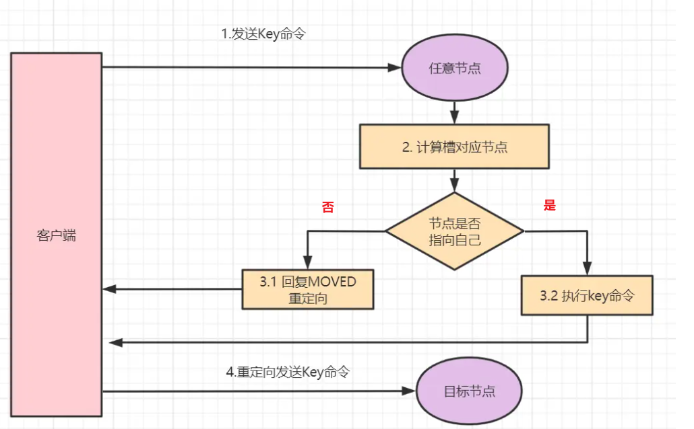

#### ASK 重定向

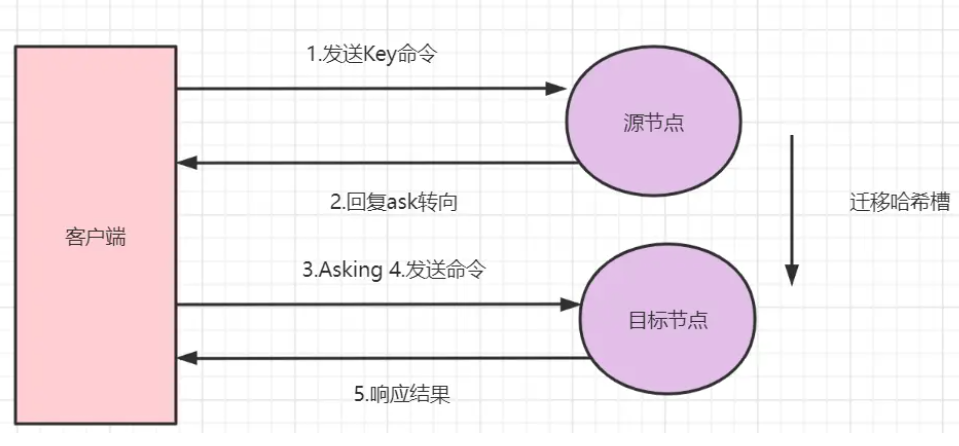

### 节点通信

* Redis 各节点通过 Gossip 协议通信，每个节点周期性地从节点列表中选择 k 个节点，将本节点存储的信息传播出去，直到所有节点信息一致
* gossip协议包含多种消息类型
  * meet消息：通知新节点加入
  * ping消息：节点每秒会向集群中其他节点发送 ping 消息
  * pong消息：当接收到ping、meet消息时，作为响应消息回复给发送方确认消息正常通信
  * fail消息：节点判定集群内另一个节点下线

### 故障转移

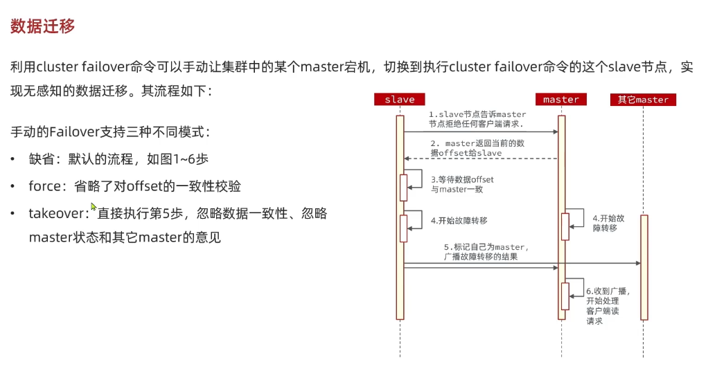
