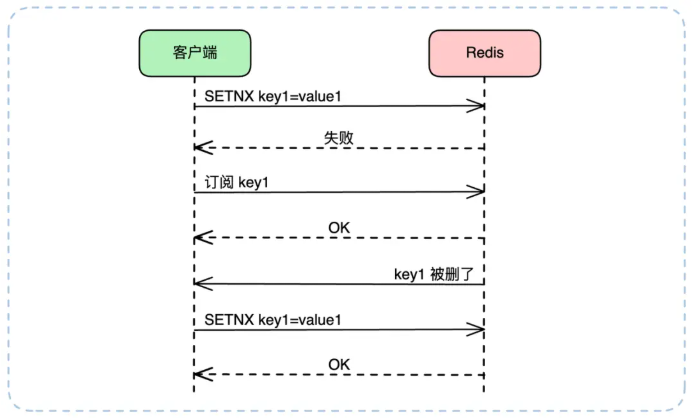
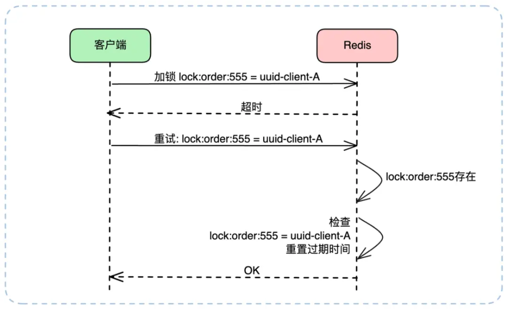
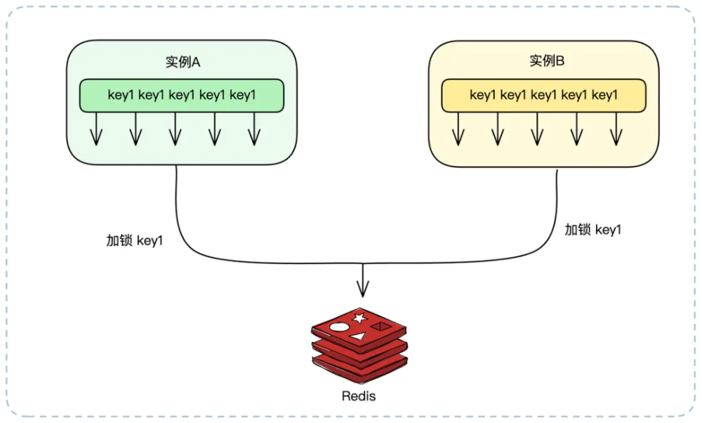
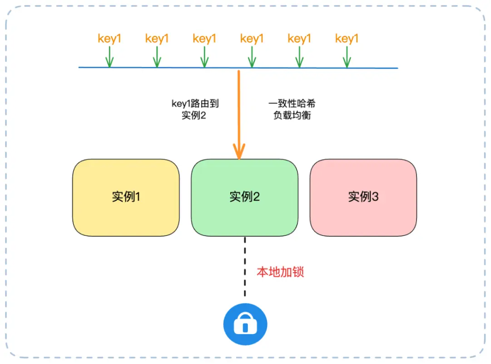

# Redis 分布式锁

## 导致冲突的原因

### 锁争抢：多节点抢一把锁

步骤 1 和步骤 2 是分开做的，导致会出现冲突，在很短的时间内，A 和 B 都会认为自己拿到了锁，引发数据错乱

### 僵尸锁：锁不释放

节点拿到锁后，忘了给锁设定过期时间，紧接着又因为节点宕机或程序报错，没法主动释放这把锁。于是锁变成了僵尸锁，霸占锁资源

### 锁过期：过期时间和任务时长不匹配

节点在拿到所后进行业务处理，但是业务没有处理完，锁就过期了

### 锁存储不可靠：单节点部署隐患

Redis 单节点如果宕机，所有锁操作就会卡壳，导致系统瘫痪

## Redis 锁机制

### 加锁

#### 单节点锁

Redis 单节点锁命令：`SET lock_key unique_value NX EX 30`

就是把抢锁（NX）和设过期时间（EX），变成了一步完成的原子操作，中间没有任何可中断的间隙

* `unique_value`：给每个节点生成的唯一标识。释放锁的时候，节点必须校验通过，才能删除自己持有的锁，不会误删别人的锁

* `NX` ：Not exists，仅当锁对应的 lock_key 不存在时，才执行加锁操作，保证了锁的互斥性

* `EX 30`：给锁设置 30s 过期时间，避免了节点宕机导致僵尸锁

#### 高可用锁

Redlock 算法：**只有超过半数节点都成功给资源加锁时，资源才算真的拿到了有效锁**

* 向 N 个独立的 Redis 锁节点依次发送 `SET NX EX` 加锁请求
* 统计成功给资源加锁的节点数量，若成功数量超过 N/2，就判定加锁成功
* 如果成功数量少于半数，则说明加锁失败，立即向所有锁节点释放锁，避免产生"僵尸锁"

即便部分锁节点宕机（不超过半数），剩余的多数锁节点仍能正常提供锁服务

### 等待锁

#### 轮询

加锁失败后，线程睡眠一定时间，然后再次尝试 SETNX，直到加锁成功或超出**总的等待超时时间**

总的等待超时时间：通过业务场景确定。**例如，如果我们通过监控统计，发现99%的业务执行时间都在800毫秒内**，**那么将总等待时间设为1秒就是个合理的选择。**

#### 监听

利用 Redis 的发布订阅（Pub/Sub）机制。加锁失败的客户端可以立即“订阅”`lock_key` 的“删除事件”（`DEL` 事件）。当锁被释放（`DEL`）时，Redis 会主动通知所有订阅者，它们再重新尝试加锁（`SETNX`）。

在实际工程中，**"检测到锁存在" 和 "发起订阅" 必须是一个原子化或有严密逻辑先后的操作**，否则可能在客户端检测到锁存在（`SETNX` 失败）和发起订阅的这个微小间隙，锁恰好被释放了（`DEL`），导致客户端错过通知，陷入永久等待

### 重试加锁

如果一个客户端发起 `SETNX` 命令后，收到了一个超时响应，此时客户端就不知道自己到底有没有加上锁。贸然重试会覆盖加锁状态

解决方案：**保证操作的幂等性，**在加锁时，`value` 不再是任意值，而是一个**全局唯一的ID**

* 假设为 `lock:order:555` 这把锁生成了唯一值 `uuid-client-A`。当重试时，逻辑如下：
* 客户端发起 `SETNX lock:order:555 uuid-client-A`，不幸超时。客户端发起重试。此时它不能直接 `SETNX`，而是应该先 `GET lock:order:555`：

**情况A：GET 返回 nil（key不存在）：** 这说明上一次的 SETNX 命令没有到达 Redis 或执行失败。客户端此时可以安全地再次执行加锁

**情况B：GET 返回 uuid-client-A：** 这说明上一次的 SETNX 执行成功了，只是响应包在路上丢了。此时客户端已经持有了锁，只需重置锁过期时间

**情况C：GET 返回 uuid-client-B：** 说明在客户端A超时和重试的间隙，锁被客户端B拿走。此时客户端A重试失败，应进入上述的等待逻辑

### 释放锁

核心：先验证身份，再加锁。

如果不验证身份直接删除，可能在执行业务的时候锁过期，此时第二个线程抢到了锁，第一个线程执行完业务代码后直接删除第二个线程抢到的锁，导致错乱

**Redis 将判断和删除这两个操作封装成一个原子操作**

### 性能优化

#### Singleflight 模式

在高并发下，可能一个服务实例内的几十个线程，和另外几十个实例的几百个线程，都在同一时刻竞争**同一把锁**

针对同一个 `key` 的加锁请求，在 **单个实例内部** ，只允许一个线程去 Redis 竞争分布式锁。其他线程则在本地等待这个代表的结果

假设有2个实例，每个实例上各有10个线程要去获得 key1 上的分布式锁：

* **无优化**：总共有 2 * 10 = 20 个线程会涌向 Redis 竞争锁
* **Singleflight**：实例A内部先选出1个线程，实例B内部也选出1个线程。最终只有2个线程去 Redis 竞争分布式锁

竞争越激烈，这种方案效果越好

#### 本地锁交接

当实例A的线程T1拿到了分布式锁并执行完业务后，它在释放锁（`DEL`）之前，先检查一下**本地**（即实例A的内存中）是否还有其他线程（如T2、T3）正在等待这把锁。

如果有，则直接在内存中把锁凭证转交给线程 T2，T1 不释放锁，而是交给 T2 释放，节省了一次 `DEL` 和 `SETNX` 的网络开销

缺点：

* 复杂度高，容错差，一旦实力崩溃，锁接力断掉，造成锁泄露
* 失去了分布式锁的原本意义

#### 分布式锁替换

有一些业务场景，实际并不需要分布式锁

##### 数据库乐观锁

对于“读取数据 -> 计算 -> 写回数据”的流程，比如扣减库存：**SETNX -> SELECT -> 业务计算 -> UPDATE -> DEL**。这个过程可以用乐观锁替换。给库存表加一个 `version` 字段：

* `select stock,version from inventory where sku_id = 's101'`
* 在内存中计算新库存 `new_stock = stock - 1`
* `update inventory set stock = new_stock, version = version + 1 where sku_id = 's101' and version = (第一步查询到的version) `

优点：如果 `UPDATE` 的返回行数为0，说明 `version` 已被他人修改（并发冲突）此时客户端只需从第1步开始重试即可。全程无锁，性能极高。

缺点：可能会有多个线程在做重复计算

##### 一致性哈希负载均衡

同一个业务请求（如处理订单 order_id=555）可能被负载均衡打到任何一个实例上

通过一致性哈希等手段，将**特定ID的请求（如按 `order_id` 哈希）固定路由到同一个实例**上，将问题从分布式退化为单机，只需使用本地所即可实现

## 使用指南

### 简单场景

使用单节点锁已经足够，注意事项：

* 锁的 ID 必须独一无二
* 过期时间需要预留缓冲
* 加锁失败后进行简单重试或者直接退出，避免无效等待

### 长任务场景

使用“看门狗”机制自动续期：

* 业务节点成功抢到锁之后，系统会在这个节点上启动一个后台线程（看门狗）
* 这只 “看门狗” 会按固定时间（比如每隔 10 秒）主动检查业务是否还在执行（客户端是否还持有锁），如果还在，立刻给锁续期

续约失败：

* 保守策略（推荐）：续约失败意味着锁的归属权已经丢失。业务逻辑必须**立即中断**并回滚，向上层抛出异常，保证数据一致性
* 激进策略（不推荐）：假设续约失败是小概率事件，业务逻辑继续执行。这可能会导致数据不一致

业务中断：

* 如果业务是一个大循环，可以在每个循环开始的时候，检测一下中断信号
* 如果业务没有循环，而是由多个步骤构成，可以在每一个关键步骤之后都检测一下

### 核心场景

使用高可用锁，至少部署三个独立 Redis 锁节点：

* **节点数量选择奇数**：便于快速计算 “超过半数” 的成功条件，确保锁机制的有效性
* **保证节点独立性** ：节点之间不能有主从复制关系
* **合理设置请求超时** ：向每个节点发送加锁请求时，建议设置 50-100ms 的超时时间，避免单个节点响应缓慢拖垮整个加锁流程

## 注意事项

### 看门狗并非万能

如果持有锁的服务器突然宕机，看门狗线程会随之终止，无法继续给锁续期

设计业务逻辑时，尽量要 “短平快”，能尽快释放锁就别长时间占用

做好异常兜底方案，避免锁过期后不同线程同时操作数据，导致数据不一致

### 不要滥用  Redlock

Redlock 算法性能开销更大，对于非核心业务场景，单节点锁 + 看门狗已经足够

### 锁的粒度需要把握适中

* **粒度太粗** ，比如整个系统共用一把锁，会导致所有请求排队等待，引发严重的性能瓶颈
* **粒度太细** ，比如为每个数据项都单独设锁，则会增加系统复杂性和运维开销，还可能出现 "锁爆炸" 问题

