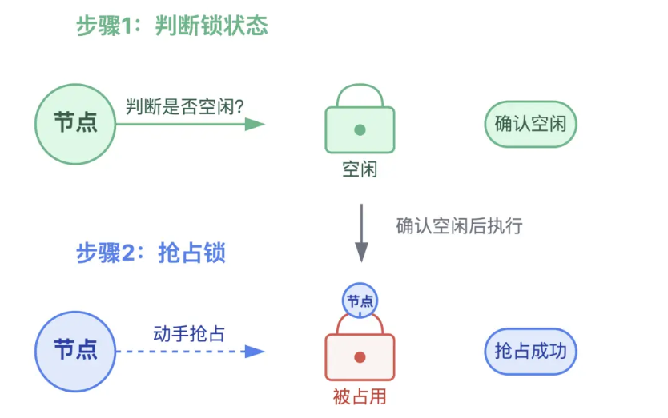
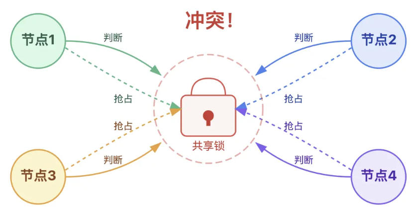
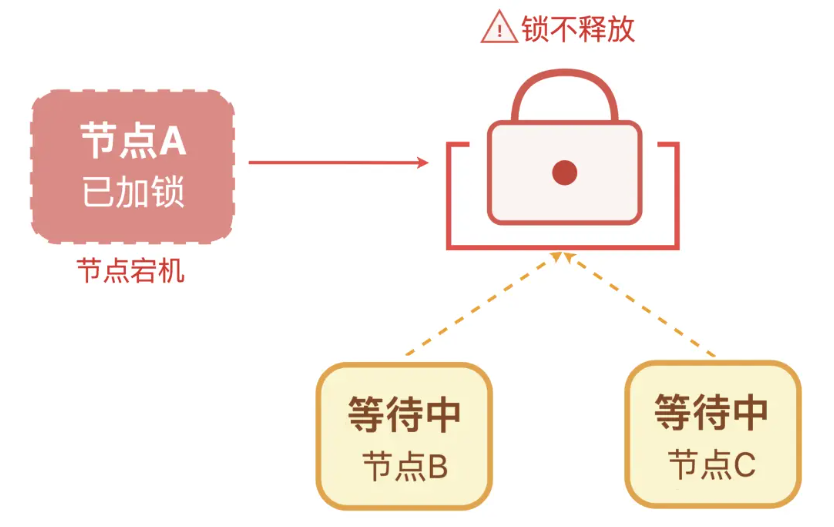
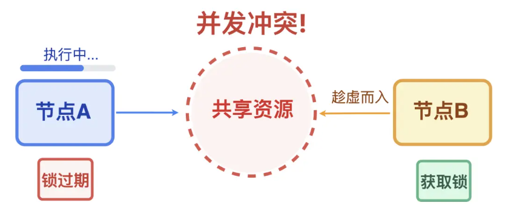
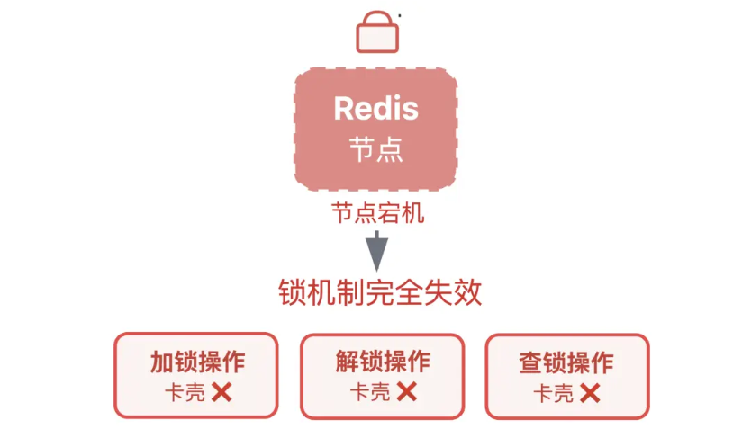
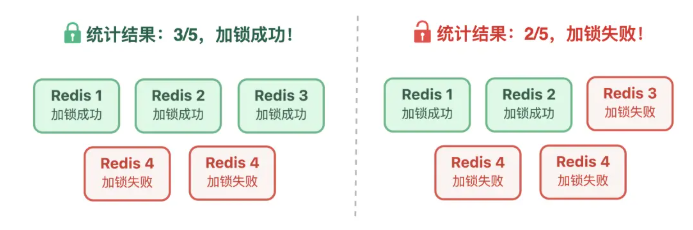
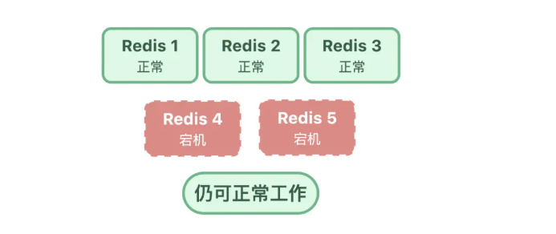
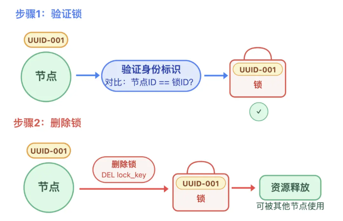
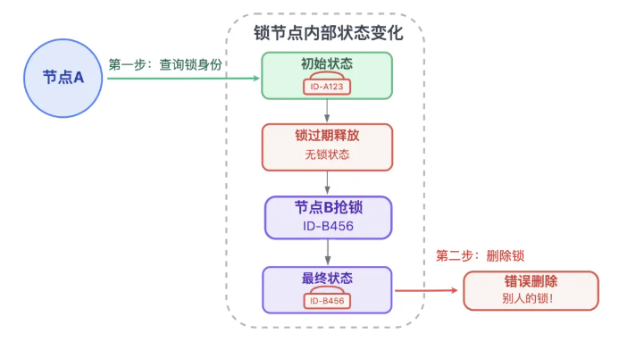

# Redis 分布式锁

## 导致冲突的原因

### 锁争抢：多节点抢一把锁

步骤 1 和步骤 2 是分开做的，导致会出现冲突，在很短的时间内，A 和 B 都会认为自己拿到了锁，引发数据错乱

### 僵尸锁：锁不释放

节点拿到锁后，忘了给锁设定过期时间，紧接着又因为节点宕机或程序报错，没法主动释放这把锁。于是锁变成了僵尸锁，霸占锁资源

### 锁过期：过期时间和任务时长不匹配

节点在拿到所后进行业务处理，但是业务没有处理完，锁就过期了

### 锁存储不可靠：单节点部署隐患

Redis 单节点如果宕机，所有锁操作就会卡壳，导致系统瘫痪

## Redis 锁机制

### 加锁

#### 单节点锁

Redis 单节点锁命令：`SET lock_key unique_value NX EX 30`

就是把抢锁（NX）和设过期时间（EX），变成了一步完成的原子操作，中间没有任何可中断的间隙

* `unique_value`：给每个节点生成的唯一标识。释放锁的时候，节点必须校验通过，才能删除自己持有的锁，不会误删别人的锁

* `NX` ：Not exists，仅当锁对应的 lock_key 不存在时，才执行加锁操作，保证了锁的互斥性

* `EX 30`：给锁设置 30s 过期时间，避免了节点宕机导致僵尸锁

#### 高可用锁

Redlock 算法：**只有超过半数节点都成功给资源加锁时，资源才算真的拿到了有效锁**

* 向 N 个独立的 Redis 锁节点依次发送 `SET NX EX` 加锁请求
* 统计成功给资源加锁的节点数量，若成功数量超过 N/2，就判定加锁成功
* 如果成功数量少于半数，则说明加锁失败，立即向所有锁节点释放锁，避免产生"僵尸锁"

即便部分锁节点宕机（不超过半数），剩余的多数锁节点仍能正常提供锁服务

### 释放锁

核心：先验证身份，再加锁。

如果不验证身份直接删除，可能在执行业务的时候锁过期，此时第二个线程抢到了锁，第一个线程执行完业务代码后直接删除第二个线程抢到的锁，导致错乱

**Redis 将判断和删除这两个操作封装成一个原子操作**

## 使用指南

### 简单场景

使用单节点锁已经足够，注意事项：

* 锁的 ID 必须独一无二
* 过期时间需要预留缓冲
* 加锁失败后进行简单重试或者直接退出，避免无效等待

### 长任务场景

使用“看门狗”机制自动续期：

* 业务节点成功抢到锁之后，系统会在这个节点上启动一个后台线程（看门狗）
* 这只 “看门狗” 会按固定时间（比如每隔 10 秒）主动检查业务是否还在执行，如果还在，立刻给锁续期

### 核心场景

使用高可用锁，至少部署三个独立 Redis 锁节点：

* **节点数量选择奇数**：便于快速计算 “超过半数” 的成功条件，确保锁机制的有效性
* **保证节点独立性** ：节点之间不能有主从复制关系
* **合理设置请求超时** ：向每个节点发送加锁请求时，建议设置 50-100ms 的超时时间，避免单个节点响应缓慢拖垮整个加锁流程

## 注意事项

### 看门狗并非万能

如果持有锁的服务器突然宕机，看门狗线程会随之终止，无法继续给锁续期

设计业务逻辑时，尽量要 “短平快”，能尽快释放锁就别长时间占用

做好异常兜底方案，避免锁过期后不同线程同时操作数据，导致数据不一致

### 不要滥用  Redlock

Redlock 算法性能开销更大，对于非核心业务场景，单节点锁 + 看门狗已经足够

### 锁的粒度需要把握适中

* **粒度太粗** ，比如整个系统共用一把锁，会导致所有请求排队等待，引发严重的性能瓶颈
* **粒度太细** ，比如为每个数据项都单独设锁，则会增加系统复杂性和运维开销，还可能出现 "锁爆炸" 问题

