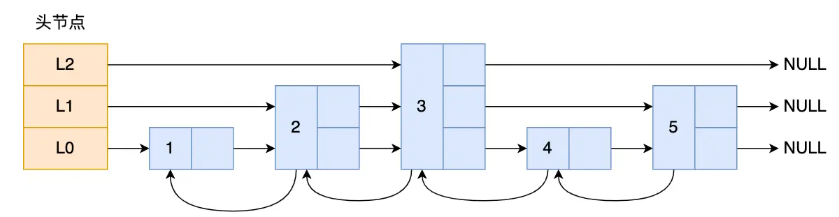
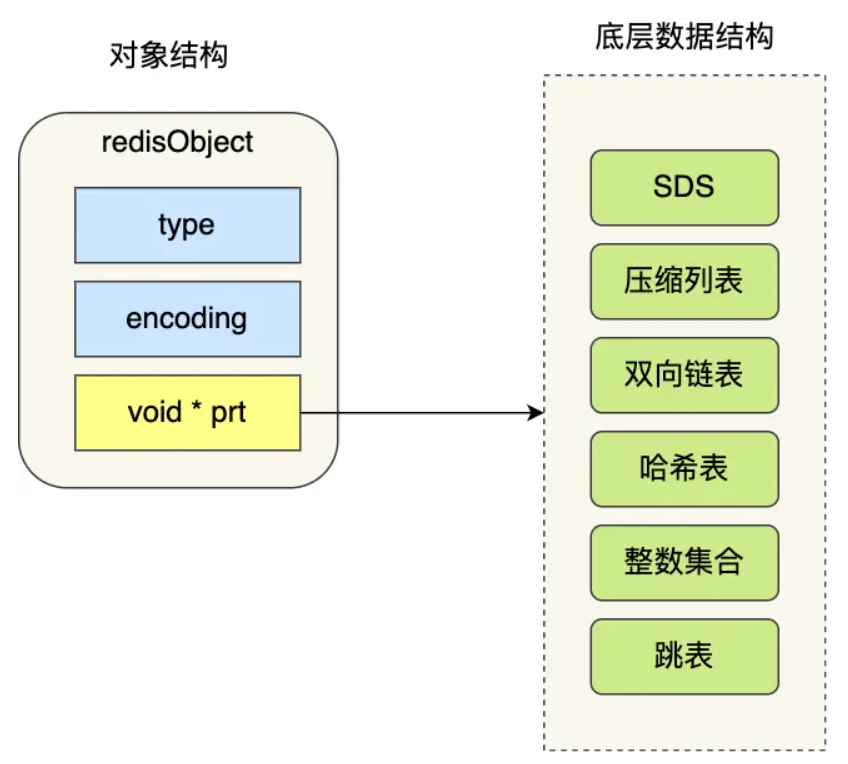
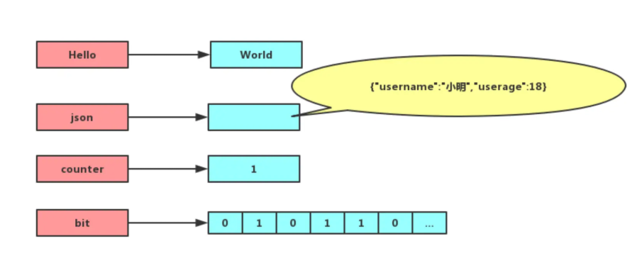
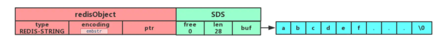
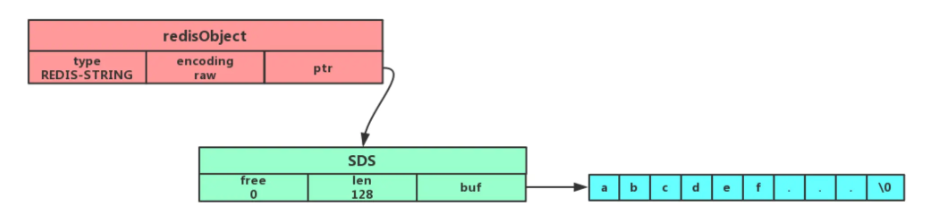
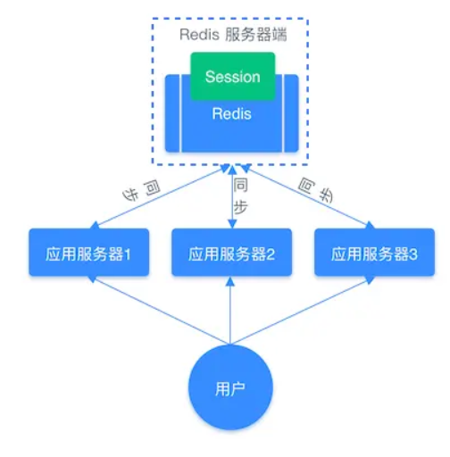
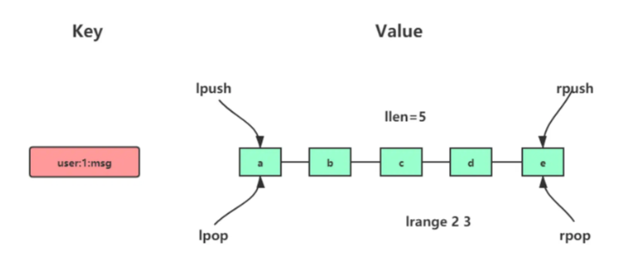
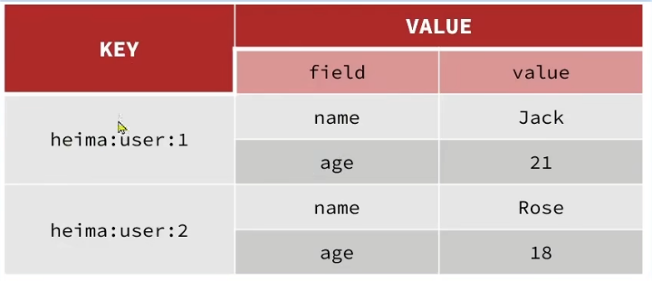
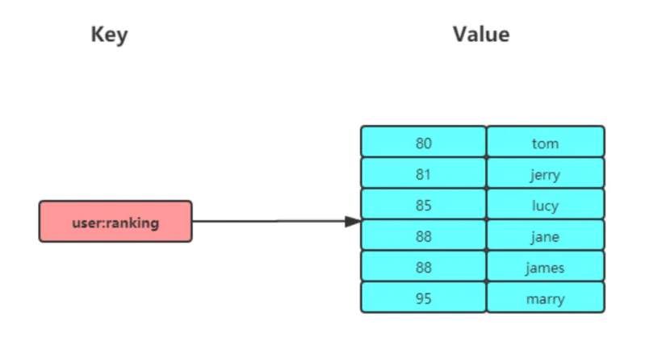
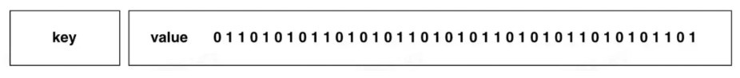

# Redis 数据结构

| 数据类型                               | 结构存储的值                  | 读写能力                                                | 典型应用场景                                     |
| -------------------------------------- | ----------------------------- | ------------------------------------------------------- | ------------------------------------------------ |
| **String（字符串）**             | 字符串、整数、浮点数          | 对整个字符串或子串进行读写；支持整数 / 浮点数自增、自减 | 缓存对象、计数器、分布式锁、验证码、共享 Session |
| **List（列表）**                 | 字符串元素组成的链表          | 支持两端 push / pop；按索引读取；按值删除               | 消息队列（不支持消费组，需自行实现唯一 ID）      |
| **Set（集合）**                  | 字符串的无序集合              | 增删查；支持交集、并集、差集运算                        | 点赞、共同关注、抽奖、标签系统                   |
| **Hash（散列）**                 | 无序的 key–field–value 结构 | 对单个 field 增删改查                                   | 对象缓存、购物车、用户信息                       |
| **Zset（有序集合 / SortedSet）** | member + score（浮点数）      | 增删查；按 score 范围查询；自动排序                     | 排行榜、成绩排名、姓名 / 电话排序                |
| **BitMap**                       | 位（0 / 1）                   | 位级操作（设置、清除、统计）                            | 签到系统、登录状态、连续签到统计                 |
| **HyperLogLog**                  | 概率性基数估算结构            | 基数统计（去重计数），误差极小，空间占用极低            | 海量 UV / DAU 统计                               |
| **GEO**                          | 地理位置（经度、纬度）        | 地理位置存储；距离、范围查询                            | 附近的人、外卖 / 打车定位                        |
| **Stream**                       | 消息流（ID + 内容）           | 自动生成全局唯一 ID；支持消费组；消息持久化             | 消息队列、事件流处理                             |

# 键值对数据库的设计

* Redis 中每个对象都由 redisObject 结构表示
  * type：标识对象类型
  * encoding：表示对象使用的底层数据结构
  * ptr：指向底层数据结构的指针



# Redis 基础数据结构

## String



* 最基本的 KV 类型，value 可以是：string、int和float
* 底层都是以字节数组形式存储（数值类型会直接转为二进制），最大不能超过 512 MB
* 层级结构：多个层级结构用冒号:隔开，`项目名:业务名:类型:id`

### 内部实现

* 主要是 int 和SDS（简单动态字符串）
* 关于 SDS

  * 可以保存文本数据和二进制数据
  * 使用 len 记录字符串长度，获取长度时间复杂度为 O(1)
  * 拼接字符串会自动扩容，不会导致缓冲区溢出
* 字符串对象内部编码：int、raw 和 embstr

  <pre class="vditor-reset" placeholder="" contenteditable="true" spellcheck="false"><p data-block="0"></p></pre>

  * 整数，可以用long表示：int 编码
  * 
  * 字符串、小于 32 字节（Redis 2.0+）：embstr 编码
  * 
  * 字符串、大于 32 字节（Redis 2.0+）：raw 编码
  * 
* embstr 编码的好处

  * 内存分配和是否从两次减少到一次
  * 字符串对象所有数据连接子啊一块连续的内存里面，更好利用CPU提升性能
* 缺点
* 字符串长度增加，redisObject 和 sds 都需要重新分配，embstr是只读的，如果需要修改，会先转化为 raw

### 常用指令

* 普通字符串操作

  ```
  # 设置 key-value 类型的值
  > SET name lin
  OK

  # 根据 key 获得对应的 value
  > GET name
  "lin"

  # 判断某个 key 是否存在
  > EXISTS name
  (integer) 1

  # 返回 key 所储存的字符串值的长度
  > STRLEN name
  (integer) 3

  # 删除某个 key 对应的值
  > DEL name
  (integer) 1
  ```
* 批量操作
* ```
  # 批量设置 key-value 类型的值
  > MSET key1 value1 key2 value2
  OK

  # 批量获取多个 key 对应的 value
  > MGET key1 key2
  1) "value1"
  2) "value2"
  ```
* 计数器
* ```
  # 设置 key-value 类型的值
  > SET number 0
  OK

  # 将 key 中储存的数字值增一
  > INCR number
  (integer) 1

  # 将 key 中存储的数字值加 10
  > INCRBY number 10
  (integer) 11

  # 将 key 中储存的数字值减一
  > DECR number
  (integer) 10

  # 将 key 中存储的数字值减 10
  > DECRBY number 10
  (integer) 0
  ```
* 过期设置（默认永不过期）
* ```
  # 设置 key 在 60 秒后过期（该方法是针对已经存在的 key 设置过期时间）
  > EXPIRE name 60
  (integer) 1

  # 查看数据还有多久过期
  > TTL name
  (integer) 51

  # 设置 key-value 类型的值，并设置该 key 的过期时间为 60 秒
  > SET key value EX 60
  OK

  > SETEX key 60 value
  OK 
  ```
* 插入
* ```
  # 不存在就插入（not exists）
  > SETNX key value
  (integer) 1
  ```

### 应用场景

* 缓存对象
  * 直接缓存 JSON
  * 将 key 分离，采用 MEST 存储，用 MGET 获取属性值
* 常规计数：计算访问次数、点赞、收藏等
* 分布式锁
* 共享 session 信息
  * 

## List

### 简单的字符串列表，**按照插入顺序排序，可以从头部或尾部向 List 列表添加元素**

* 最大长度为 `2^32 - 1`

### 内部实现

* Redis 3.2 之前，用双向链表或压缩链表实现
  * 如果列表的元素个数小于 `512` 个，列表每个元素的值都小于 `64` 字节，使用压缩列表
  * 否则使用双向链表
* Redis 3.2 之后，用 quicklist 实现

### 常用命令



```
# 将一个或多个值value插入到key列表的表头(最左边)，最后的值在最前面
LPUSH key value [value ...]

# 将一个或多个值value插入到key列表的表尾(最右边)
RPUSH key value [value ...]

# 移除并返回key列表的头元素
LPOP key

# 移除并返回key列表的尾元素
RPOP key

# 返回列表key中指定区间内的元素，区间以偏移量start和stop指定，从0开始
LRANGE key start stop

# 从key列表表头弹出一个元素，没有就阻塞timeout秒，如果timeout=0则一直阻塞
BLPOP key [key ...] timeout

# 从key列表表尾弹出一个元素，没有就阻塞timeout秒，如果timeout=0则一直阻塞
BRPOP key [key ...] timeout
```

### 应用场景

* 消息队列：List 满足消息保序、处理重复消息和保证消息可靠性的条件
  * 消息保序：先进先出
  * 处理重复消息：**每个消息生成一个全局唯一ID**
  * 保证消息可靠性：`BRPOPLPUSH` 命令。**让消费者程序从一个 List 中读取消息，同时 Redis 会把这个消息再插入到另一个 List（可以叫作备份 List）留存**
  * **List 不支持多个消费者消费同一条消息**，需要 stream 实现

## Hash

键值对集合



### 内部实现

* 压缩列表或哈希表实现
  * 哈希类型元素小于 `512` 个，所有值小于 `64` 字节，使用**压缩列表**作为 Hash 类型的底层数据结构；
  * 否则使用哈希表
* Redis 7.0 压缩列表废弃，由 listpack 实现

### 常用命令

```
# 存储一个哈希表key的键值
HSET key field value

# 获取哈希表key对应的field键值
HGET key field

# 在一个哈希表key中存储多个键值对
HMSET key field value [field value...]

# 批量获取哈希表key中多个field键值
HMGET key field [field ...]

# 删除哈希表key中的field键值
HDEL key field [field ...]

# 获取一个哈希表key中所有的field
HKEYS key

# 获取一个哈希表key中所有的value
HVALS key

# 返回哈希表key中field的数量
HLEN key

# 返回哈希表key中所有的键值
HGETALL key

# 为哈希表key中field键的值加上增量n
HINCRBY key field n
```

### 应用场景

* 缓存对象

  * String + Json也是存储对象的一种方式
  * 一般对象用 String + Json 存储，对象中某些频繁变化的属性可以考虑抽出来用 Hash 类型存储。
* 购物车

  * 以用户 id 为 key，商品 id 为 field，商品数量为 value

## Set

* 无序集合，存储顺序不按照插入元素顺序
* 最多存储 `2^32-1` 个元素
* 支持交并差集等操作

### 内部实现

* 由哈希表或整数集合实现
  * 集合元素小于 512 个使用整数集合
  * 否则使用哈希表

### 常用命令

* Set 操作
* ```
  # 往集合key中存入元素，元素存在则忽略，若key不存在则新建
  SADD key member [member ...]

  # 从集合key中删除元素
  SREM key member [member ...]

  # 获取集合key中所有元素
  SMEMBERS key

  # 获取集合key中的元素个数
  SCARD key

  # 判断member元素是否存在于集合key中
  SISMEMBER key member

  # 从集合key中随机选出count个元素，元素不从key中删除
  SRANDMEMBER key [count]

  # 从集合key中随机选出count个元素，元素从key中删除
  SPOP key [count]
  ```
* Set 运算操作（计算复杂度较高，数据量大容易阻塞）
* ```
  # 交集运算
  SINTER key [key ...]
  # 将交集结果存入新集合destination中
  SINTERSTORE destination key [key ...]

  # 并集运算
  SUNION key [key ...]
  # 将并集结果存入新集合destination中
  SUNIONSTORE destination key [key ...]

  # 差集运算
  SDIFF key [key ...]
  # 将差集结果存入新集合destination中
  SDIFFSTORE destination key [key ...]
  ```

### 应用场景

* 点赞、抽奖：数据唯一性
* 共同关注：交集

## Zset

* 相比于 Set 多了一个排序属性 score，元素可以排序



### 内部实现

* 压缩列表或跳表
  * 如果有序集合的元素个数小于 `128` 个，并且每个元素的值小于 `64` 字节，使用压缩列表
  * 否则使用跳表
* Redis 7.0 压缩列表废弃，由 listpack 实现

### 常用命令

```
# 往有序集合key中加入带分值元素
ZADD key score member [[score member]...]

# 往有序集合key中删除元素
ZREM key member [member...]

# 返回有序集合key中元素member的分值
ZSCORE key member

# 返回有序集合key中元素个数
ZCARD key

# 为有序集合key中元素member的分值加上increment
ZINCRBY key increment member

# 正序获取有序集合key从start下标到stop下标的元素
ZRANGE key start stop [WITHSCORES]

# 倒序获取有序集合key从start下标到stop下标的元素
ZREVRANGE key start stop [WITHSCORES]

# 返回有序集合中指定分数区间内的成员，分数由低到高排序。
ZRANGEBYSCORE key min max [WITHSCORES] [LIMIT offset count]

# 返回指定成员区间内的成员，按字典正序排列，分数必须相同。
ZRANGEBYLEX key min max [LIMIT offset count]

# 返回指定成员区间内的成员，按字典倒序排列，分数必须相同。
ZREVRANGEBYLEX key max min [LIMIT offset count]

# 并集计算(相同元素分值相加)，numberkeys一共多少个key，WEIGHTS每个key对应的分值乘积
ZUNIONSTORE destkey numberkeys key [key...]

# 交集计算(相同元素分值相加)，numberkeys一共多少个key，WEIGHTS每个key对应的分值乘积
ZINTERSTORE destkey numberkeys key [key...]
```

### 应用场景

* 排行榜
* 电话、姓名排序（分数需要相同）

## BitMap(位图)

* 一串连续的二进制数组（0和1），可以通过偏移量（offset）定位元素
* 用最小的单位bit来进行 `0|1`的设置，表示某个元素的值或者状态，时间复杂度为O(1)
* 非常节省空间，特别适合一些数据量大且使用**二值统计的场景**



### 内部实现

* 用 String 类型作为底层数据结构

### 常用命令

```
# 设置值，其中value只能是 0 和 1
SETBIT key offset value

# 获取值
GETBIT key offset

# 获取指定范围内值为 1 的个数
# start 和 end 以字节为单位
BITCOUNT key start end

# BitMap间的运算
# operations 位移操作符，枚举值
# AND 与运算 &
# OR 或运算 |
# XOR 异或 ^
# NOT 取反 ~
# result 计算的结果，会存储在该key中
# key1 ... keyn 参与运算的key，可以有多个，空格分割，not运算只能一个key
# 当 BITOP 处理不同长度的字符串时，较短的那个字符串所缺少的部分会被看作 0。返回值是保存到 destkey
BITOP [operations] [result] [key1] [keyn..]

# 返回指定key中第一次出现指定value(0/1)的位置
BITPOS [key] [value]
```

### 应用场景

* 签到统计
* 判断用户登录态
* 连续签到用户数

## HyperLogLog

* 一种用于「统计基数」的数据集合类型，基数统计就是指统计一个集合中不重复的元素个数
* HyperLogLog 是统计规则是基于概率完成的，标准误算率是 0.81%，**提供不精确的去重计数**
* 在输入元素的数量或者体积非常非常大时，计算基数所需的内存空间总是固定的，并且非常小

### 内部实现

* 很复杂，暂不描述

### 常用命令

```
# 添加指定元素到 HyperLogLog 中
PFADD key element [element ...]

# 返回给定 HyperLogLog 的基数估算值。
PFCOUNT key [key ...]

# 将多个 HyperLogLog 合并为一个 HyperLogLog
PFMERGE destkey sourcekey [sourcekey ...]
```

### 应用场景

* 百万级别网页 UV 计数

## GEO

* 存储地理位置信息

### 内部实现

* 使用 Zset
* 使用 GeoHash 编码方法实现了经纬度到 Sorted Set 中元素权重分数的转换

### 常用命令

```
# 存储指定的地理空间位置，可以将一个或多个经度(longitude)、纬度(latitude)、位置名称(member)添加到指定key中
GEOADD key longitude latitude member [longitude latitude member ...]

# 从给定的 key 里返回所有指定名称(member)的位置（经度和纬度），不存在的返回 nil。
GEOPOS key member [member ...]

# 返回两个给定位置之间的距离。
GEODIST key member1 member2 [m|km|ft|mi]

# 根据用户给定的经纬度坐标来获取指定范围内的地理位置集合。
GEORADIUS key longitude latitude radius m|km|ft|mi [WITHCOORD] [WITHDIST] [WITHHASH] [COUNT count]
```

### 应用场景

* 滴滴打车

## Stream

* Redis 专门为消息队列设计的数据类型

### 常用命令

- XADD：插入消息，保证有序，可以自动生成全局唯一 ID；
- XLEN：查询消息长度；
- XREAD：用于读取消息，可以按 ID 读取数据；
- XDEL：根据消息 ID 删除消息；
- DEL：删除整个 Stream；
- XRANGE：读取区间消息；
- XREADGROUP：按消费组形式读取消息；
- XPENDING 和 XACK：
  - XPENDING 命令可以用来查询每个消费组内所有消费者「已读取、但尚未确认」的消息；
  - XACK 命令用于向消息队列确认消息处理已完成；
