# Redis 底层数据结构

## SDS

* 简单动态字符串

### C 语言字符串缺陷

* 操作字符串时，char *只能指向字符串起始位置
* "\0" 表示字符串结束，因此字符串里面不能含有"\0"字符，因此**不能保存二进制数据**
* 获取字符串长度复杂度为 **O(N)**
* 不会记录自身缓冲区大小，**操作字符串时如果缓冲区溢出可能导致程序终止**

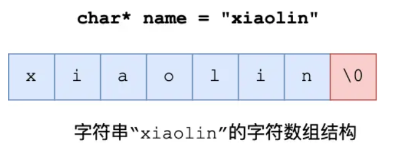

### SDS 设计

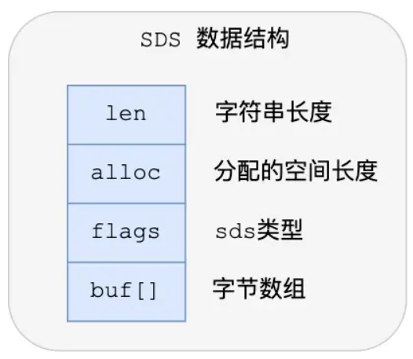

* 成员变量

  * **len** ，记录了字符串长度。
  * **alloc** ，分配给字符数组的空间长度。这样在修改字符串的时候，可以通过 `alloc - len` 计算出剩余的空间大小，用来判断空间是否满足修改需求，如果不满足的话，就会自动将 SDS 的空间扩展至执行修改所需的大小，然后才执行实际的修改操作。
  * **flags** ，用来表示不同类型的 SDS。一共设计了 5 种类型，分别是 `sdshdr5`、`sdshdr8`、`sdshdr16`、`sdshdr32` 和 `sdshdr64`
  * **buf[]** ，字节数组，用来保存实际数据。
* O(1) 获取字符串长度：直接返回 len字段
* 二进制安全：无需"\\0" 表示，buf[] 可以存储二进制数据
* 无缓冲区溢出：操作字符串前会自动计算和扩容

  * 如果所需的 sds 长度 **小于 1 MB** ，**翻倍扩容**
  * 如果所需的 sds 长度 **大于 1 MB ，扩容长度应该是 newlen  **+ 1MB**
* 节省内存空间

  * 不同的 `sdshdr`类型，len 和 alloc 的大小不同（大小为2^`sdshdr`后面的数字）
  * 使用 `__attribute__ ((packed))`，编译器取消对结构体的对优化齐，而是按照实际占用字节数对齐

## 链表

### 节点结构设计

```c
typedef struct listNode {
    // 前置节点
    struct listNode *prev;
    // 后置节点
    struct listNode *next;
    // 节点的值
    void *value;
} listNode;
```

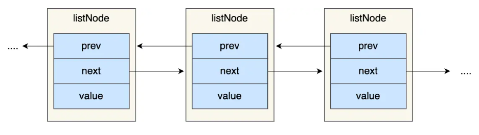

### 链表结构设计

```c
typedef struct list {
    // 链表头节点
    listNode *head;
    // 链表尾节点
    listNode *tail;
    // 节点值复制函数
    void *(*dup)(void *ptr);
    // 节点值释放函数
    void (*free)(void *ptr);
    // 节点值比较函数
    int (*match)(void *ptr, void *key);
    // 链表节点数量
    unsigned long len;
} list;
```

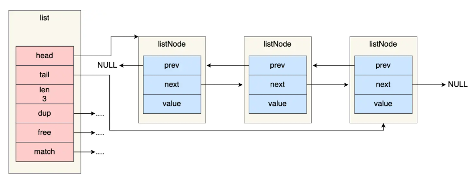

### 优缺点

* 优点
  * 获取前后置节点、头尾节点、链表长度的时间复杂度为 O(1)
  * 可以保存各种不同类型的值
* 缺点
  * 内存不连续，CPU 缓存利用不好
  * 需要额外内存头节点分配，内存开销大

## 压缩列表

* 内存紧凑型数据结构，占用连续的内存空间
* 缺点
  * 不同保存过多元素，否则查询性能降低
  * 新增/修改元素时，内存空间需要重新分配，可能导致**连锁更新**问题
  * 只适用于保存节点数量不多的场景

### 压缩列表结构设计

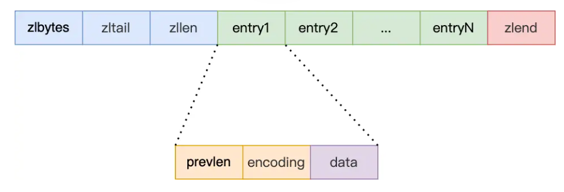

* 表头字段：
  * **zlbytes** ，记录整个压缩列表占用的内存字节数；
  * **zltail** ，记录压缩列表「尾部」节点距离起始地址多少字节，也就是列表尾的偏移量；
  * **zllen** ，记录压缩列表包含的节点数量；
  * **zlend** ，标记压缩列表的结束点，固定值 `0xFF`（十进制 255）。
* 查找第一个和最后一个元素的时间复杂度是O(1)，其他的是O(N)，**因此压缩列表不适合保存过多的元素**
* 节点字段
  * **prevlen** ，记录了「前一个节点」的长度，目的是为了实现从后向前遍历；
  * **encoding** ，记录了当前节点实际数据的「类型和长度」，类型主要有两种：字符串和整数。
  * **data** ，记录了当前节点的实际数据，类型和长度都由 `encoding` 决定；
* 压缩列表会根据数据类型是字符串还是整数，以及数据的大小，使用不同空间大小的 `prevlen` 和 `encoding` 这两个元素里保存的信息，节省内存
  * `prevlen` 属性的空间大小跟前一个节点长度值有关：
    * 如果前一个节点的长度小于 254 字节，那么 `prevlen` 属性需要用 **1 字节**的空间来保存这个长度值；
    * 如果前一个节点的长度大于等于 254 字节，那么 `prevlen` 属性需要用 **5 字节**的空间来保存这个长度值；
  * `encoding` 属性的空间大小跟数据是字符串还是整数，以及字符串的长度有关
    * 如果 **当前节点的数据是整数** ，则 encoding 会使用 **1 字节的空间**进行编码
    * 如果 **当前节点的数据是字符串，根据字符串的长度大小** ，encoding 会使用**1 字节/2字节/5字节的空间**进行编码
    * encoding 编码的前两个 bit 表示数据的类型，后续的其他 bit 标识字符串数据的实际长度

### 连锁更新

* 压缩列表新增某个元素或修改某个元素时，如果空间不够，压缩列表占用的内存空间就需要重新分配。而当新插入的元素较大时，可能会导致后续元素的 `prevlen` 占用空间都发生变化，从而引起 **「连锁更新」** 问题，导致每个元素的空间都要重新分配，造成访问压缩列表性能的下降。
* 假设一个压缩列表中有多个连续的、长度在 250～253 之间的节点。如果将一个长度大于等于 254 字节的新节点加入到压缩列表的表头节点，会产生连锁更新

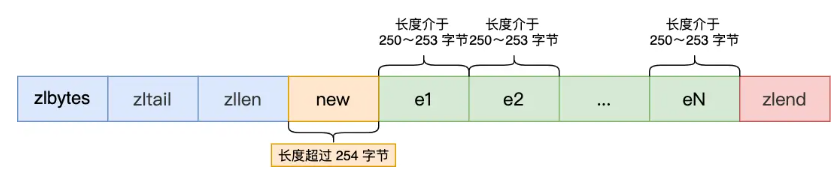


## quicklist

### quicklist 结构设计

```c
typedef struct quicklist {
    // quicklist 的链表头
    quicklistNode *head;
    // quicklist 的链表尾
    quicklistNode *tail;
    // 所有压缩列表中的总元素个数
    unsigned long count;
    // quicklistNodes 的个数
    unsigned long len;

    ...
} quicklist;
```

```c
typedef struct quicklistNode {
    // 前一个 quicklistNode
    struct quicklistNode *prev;
    // 后一个 quicklistNode
    struct quicklistNode *next;
    // quicklistNode 指向的压缩列表
    unsigned char *zl;
    // 压缩列表的的字节大小
    unsigned int sz;
    // 压缩列表的元素个数
    unsigned int count : 16;  // ziplist 中的元素个数

    ...
} quicklistNode;
```

* quicklistNode 结构体里包含了前一个节点和下一个节点指针，形成双向链表
* 链表节点的元素不再是单纯保存元素值，而是保存了一个压缩列表
* 向 quicklist 添加元素的时候，不会像普通的链表直接新建一个链表节点。
  * 检查插入位置的压缩列表是否能容纳该元素，如果能容纳就直接保存到压缩列表
  * 如果不能容纳，才会新建一个新的 quicklistNode 结构
* 并没有完全解决连锁更新问题

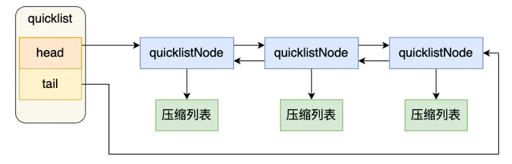

## listpack

* listpack 中每个节点不再包含前一个节点的长度

### listpack 结构设计

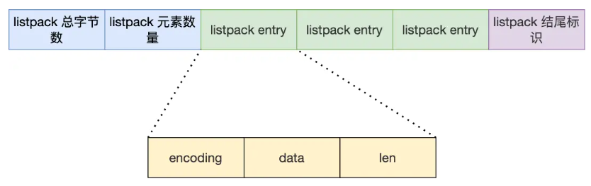

* **encoding** ，定义该元素的编码类型，会对不同长度的整数和字符串进行编码；
* **data** ，实际存放的数据；
* **len** ，encoding+data 的总长度；
* listpack 没有压缩列表中记录前一个节点长度的字段了，listpack 只记录当前节点的长度，当我们向 listpack 加入一个新元素的时候，不会影响其他节点的长度字段的变化，从而避免了压缩列表的连锁更新问题。

## 哈希表

**Redis 采用「链式哈希」来解决哈希冲突**

### 哈希表结构设计

哈希表是一个数组，数组元素是指向哈希表节点的指针

```c
typedef struct dictht {
    // 哈希表数组
    dictEntry **table;
    // 哈希表大小
    unsigned long size;
    // 哈希表大小掩码，用于计算索引值
    unsigned long sizemask;
    // 该哈希表已有的节点数量
    unsigned long used;
} dictht;
```

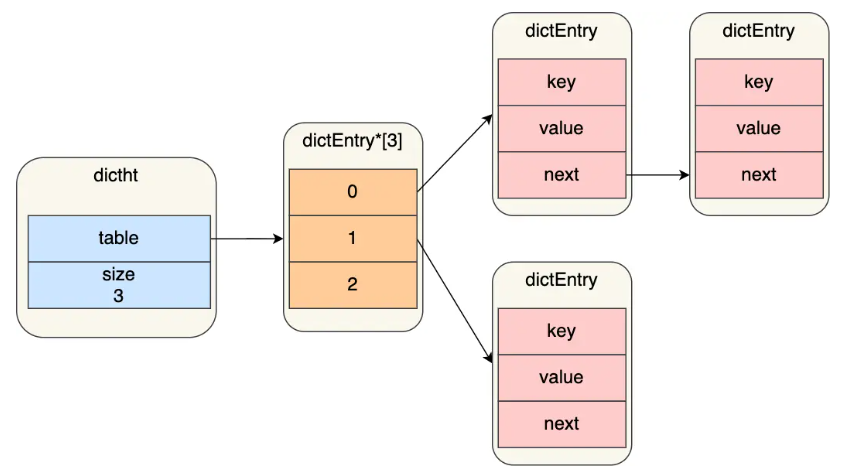

哈希表节点结构

```c
typedef struct dictEntry {
    // 键值对中的键
    void *key;

    // 键值对中的值
    union {
        void *val;
        uint64_t u64;
        int64_t s64;
        double d;
    } v;

    // 指向下一个哈希表节点，形成链表
    struct dictEntry *next;
} dictEntry;
```

### rehash

* 在实际使用哈希表时，Redis 定义一个 dict 结构体，结构体里面定义了两个哈希表
* ```c
  typedef struct dict {
      //两个Hash表，交替使用，用于rehash操作
      dictht ht[2];
  }dict;
  ```

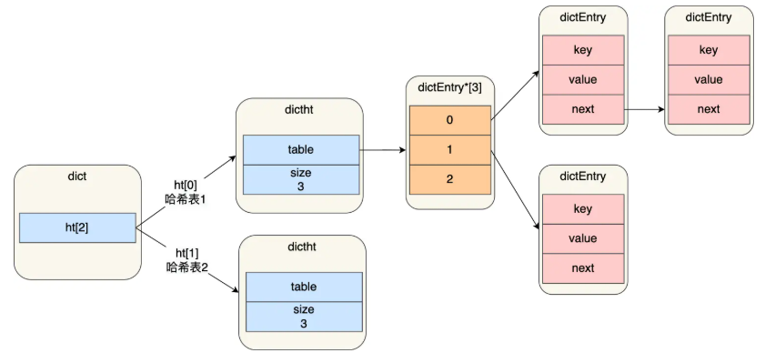

* 正常服务请求阶段，数据都写入哈希表 1，随着数据增多，触发 rehash 操作：
  * 给哈希表 2 分配空间，一般是哈希表 1 的两倍
  * 把哈希表 1 的数据迁移至哈希表 2
  * 释放哈希表 1 的空间，把哈希表 2 设置为哈希表 1，新建一个空白的哈希表
* 如果哈希表 1 数据很大，在迁移的过程，可能造成 Redis 阻塞

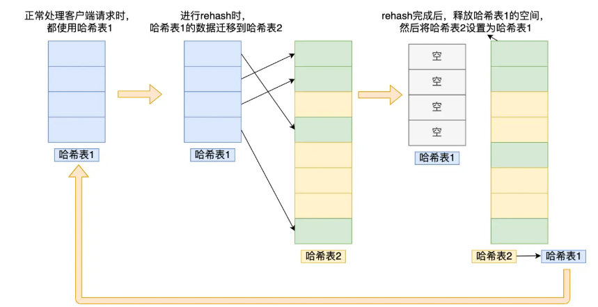

### 渐进式 rehash

* 数据迁移不再是一次性迁移完成，而是分多次迁移

  * 给哈希表 2 分配空间
  * **在 rehash 进行期间，每次哈希表元素进行新增、删除、查找或者更新操作时，Redis **会顺序将「哈希表 1 」中索引位置上的所有 key-value 迁移到「哈希表 2」 上****
  * 最终在某个时间点会把「哈希表 1 」的所有数据迁移到「哈希表 2」，从而完成 rehash 操作
* 在渐进式 rehash 进行期间，哈希表元素的删除、查找、更新等操作都会在这两个哈希表进行。

  * 查找一个 key 的值的话，先会在「哈希表 1」 里面进行查找，没找到则去哈希表 2 找
  * 新增的键值会被保存到哈希表 2 中，保证哈希表 1 的数据只会减少

### rehash 触发条件

* 当负载因子大于等于 1，并且 Redis 没有在执行 bgsave 命令或者 bgrewriteaof 命令，也就是没有执行 RDB 快照或没有进行 AOF 重写的时候，就会进行 rehash 操作。
* 当负载因子大于等于 5 时，此时说明哈希冲突非常严重了，不管有没有在执行 RDB 快照或 AOF 重写，都会强制进行 rehash。


## 整数集合

### 整数集合结构设计

* 整数集合本质上是一块连续内存空间
* 虽然 contents 被声明为 int8_t 类型的数组，但 contents 数组的真正类型取决于 intset 结构体里的 encoding 属性的值

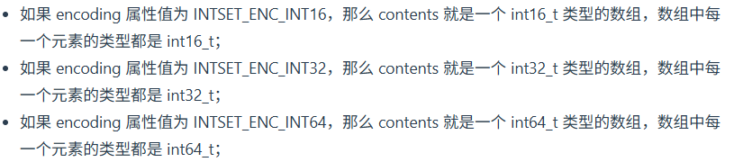

```c
typedef struct intset {
    // 编码方式
    uint32_t encoding;
    // 集合包含的元素数量
    uint32_t length;
    // 保存元素的数组
    int8_t contents[];
} intset;
```

### 升级操作

* 触发条件：将一个新元素插入集合，新元素类型（int32_t）比集合现有所有元素类型（int16_t）都要长
* 升级操作不会重新分配一个新类型的数组，而是在原本的数组上扩展空间，然后在将每个元素按间隔类型大小分割
* 过程
  * 计算需要的空间并扩容
  * 给新元素分配空间
  * 从后往前一次为现有元素扩容并迁移数据
  * 查询新元素数据

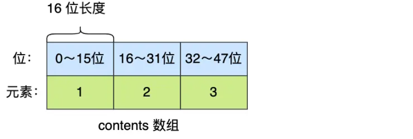

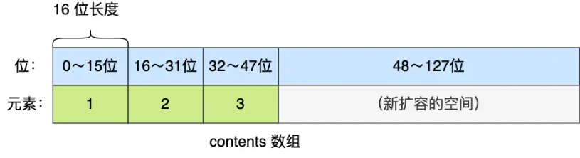

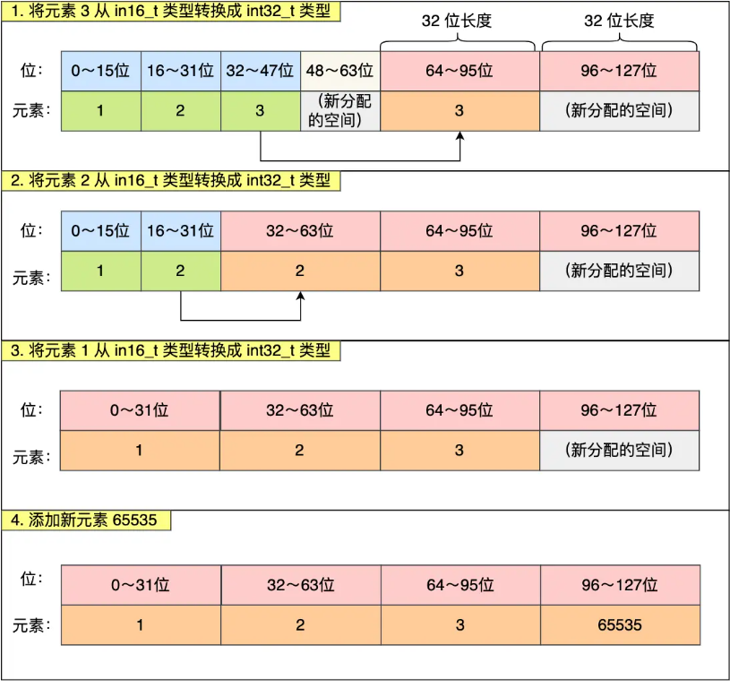

* 集合升级好处
  * 避免内存浪费，节省内存资源
* 不支持集合降级操作

## 跳表

* 跳表的优势是能支持平均 O(logN) 复杂度的节点查找
* Zset 结构体里有两个数据结构：跳表和哈希表。既能进行高效的范围查询，也能进行高效单点查询。
* Zset 对象在执行数据插入或是数据更新的过程中，会依次在跳表和哈希表中插入或更新相应的数据，从而保证数据一致性
* 哈希表只用于常数复杂度获取元素权重，大部分操作由跳表实现

```c
typedef struct zset {
    dict *dict;
    zskiplist *zsl;
} zset;
```

### 跳表结构设计

* 链表查询时间复杂度为 O(N)
* **跳表是在链表基础上改进过来的，实现了一种「多层」的有序链表**，能快速定位数据，数据量大时查找复杂度就是 O(logN)。


* 跳表节点数据结构
* **跨度实际上是为了计算这个节点在跳表中的排位**

```c
typedef struct zskiplistNode {
    // Zset 对象的元素值
    sds ele;
    // 元素权重值
    double score;
    // 后向指针
    struct zskiplistNode *backward;

    // 节点的level数组，保存每层上的前向指针和跨度
    struct zskiplistLevel {
        struct zskiplistNode *forward;
        unsigned long span;
    } level[];
} zskiplistNode;
```

* 跳表结构体
  * 跳表的头尾节点，便于在 O (1) 时间复杂度内访问跳表的头节点和尾节点；
  * 跳表的长度，便于在 O (1) 时间复杂度获取跳表节点的数量；
  * 跳表的最大层数，便于在 O (1) 时间复杂度获取跳表中层高最大的那个节点的层数量；

```c
typedef struct zskiplist {
    struct zskiplistNode *header, *tail;
    unsigned long length;
    int level;
} zskiplist;
```

### 跳表节点查询

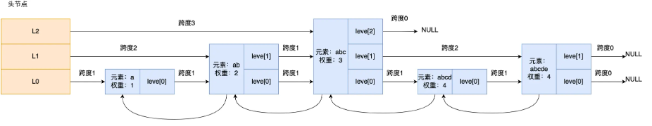

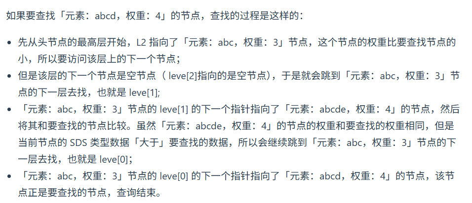

* 从头节点最高层开始，逐一遍历每一层，根据节点中的 SDS 类型元素和元素权重判断
  * 节点权重小于需要查找的权重，访问该层下一个节点
  * 节点权重等于需要查找的权重，且当前节点 SDS 数据小于要查找的数据，访问该层下一个节点
  * 若上面两个条件不满足，或下一关节点为空，则跳到下一层查找

### 跳表节点层数设置

* **跳表的相邻两层的节点数量最理想的比例是 2:1，**查找复杂度可以降低到 O(logN)****
* 如何实现
  * **跳表在创建节点的时候，随机生成每个节点的层数，并没有严格维持 2 : 1 的情况**
  * **跳表在创建节点时候，会生成范围为[0-1]的一个随机数，如果这个随机数小于 0.25，**那么层数就增加 1 层，然后继续生成下一个随机数**，直到大于 0.25**
  * 最高 64 层

### 为何用跳表而不是平衡树

| **对比维度**       | **跳表（Skip List）**                                                   | **平衡树（如红黑树）**                         |
| ------------------ | ----------------------------------------------------------------------- | ---------------------------------------------- |
| **内存占用**       | 更灵活，平均每个节点的指针数量更少，【1/(1-p)】可通过调整参数进一步优化 | 每个节点固定需要左右子树 2 个指针              |
| **范围查找支持**   | 找到起始节点后，在最底层链表上顺序遍历即可                              | 需要中序遍历，实现复杂，若不改造则难以高效完成 |
| **实现与维护难度** | 逻辑简单，插入/删除仅需修改相邻指针                                     | 插入/删除可能触发子树旋转等复杂调整，调试困难  |
| **缓存局部性**     | 链表遍历方式，缓存局部性好                                              | 树的遍历路径分散，缓存局部性相对较差           |
