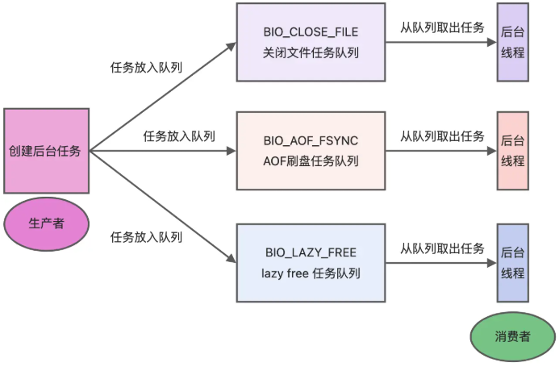
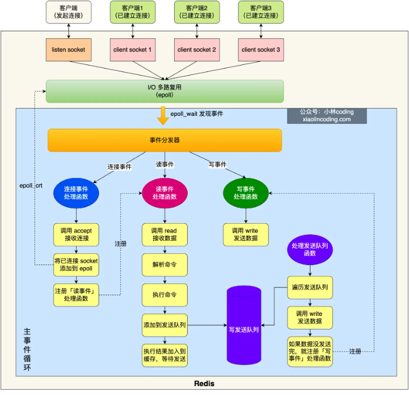

# Redis 线程模型

* Redis 不是完全单线程的
* Redis 的单线程是指 **「接收客户端请求->解析请求 ->进行数据读写等操作->发送数据给客户端」** 这个过程是由一个主线程完成的
* Redis 启动的其他线程（后台线程）
  * 2.6 版本后：会启动 2 个后台线程，分别处理关闭文件、AOF 刷盘这两个任务
  * 4.0 版本后：新增了一个新的后台线程，用来异步释放 Redis 内存，也就是 lazyfree 线程

## Redis 单线程模式

蓝色部分是一个事件循环，是由主线程负责的

Redis 初始化的时候，会做下面这几件事情

* 调用 `epoll_create()` 创建一个 epoll 对象和调用 `socket()` 创建一个服务端 socket
* 调用 `bind()` 绑定端口和调用 `listen()` 监听该 socket
* 将调用 `epoll_ctl()` 将 listen socket 加入到 epoll，同时注册「连接事件」处理函数

初始化完成后，主线程进入**事件循环函数**

* 先调用 **处理发送队列函数** ，看是发送队列里是否有任务，如果有发送任务，则通过 `write` 函数将客户端发送缓存区里的数据发送出去，如果这一轮数据没有发送完，就会注册事件处理函数，等待 `epoll_wait` 发现可写后再处理。
* 接着，调用 `epoll_wait` 函数等待事件的到来：
  * **连接事件**到来，调用 **连接事件处理函数** ：调用 `accept` 获取已连接的 socket -> 调用 `epoll_ctl` 将已连接的 socket 加入到 `epoll` -> 注册「读事件」处理函数；
  * **读事件**到来，调用 **读事件处理函数** ：调用 `read` 获取客户端发送的数据 -> 解析命令 -> 处理命令 -> 将客户端对象添加到发送队列 -> 将执行结果写到发送缓存区等待发送；
  * **写事件**到来，调用 **写事件处理函数** ：通过 `write` 函数将客户端发送缓存区里的数据发送出去，如果这一轮数据没有发送完，就会继续注册写事件处理函数，等待 `epoll_wait` 发现可写后再处理。

## Redis 单线程为什么这么快

**单线程的 Redis 吞吐量可以达到 10W/每秒**

* Redis 的大部分操作都在内存中完成，并且采用了高效的数据结构，因此 Redis 瓶颈可能是机器的内存或者网络带宽，而并非 CPU，既然 CPU 不是瓶颈，自然就采用单线程的解决方案
* 单线程模型可以避免了多线程之间的竞争，省去了多线程切换带来的时间和性能上的开销，而且也不会导致死锁问题
* Redis 采用了 **I/O 多路复用** 机制处理大量的客户端 Socket 请求，IO 多路复用机制是指一个线程处理多个 IO 流。Redis 只运行单线程的情况下，该机制允许内核中，同时存在多个监听 Socket 和已连接 Socket。内核会一直监听这些 Socket 上的连接请求或数据请求。一旦有请求到达，就会交给 Redis 线程处理

## 多线程引入

在 Redis 6.0 版本之后，也采用了多个 I/O 线程来处理网络请求，这是因为随着网络硬件的性能提升，Redis 的性能瓶颈有时会出现在网络 I/O 的处理上。

Redis 6.0 对于网络 I/O 采用多线程来处理。**但是对于命令的执行，Redis 仍然使用单线程来处理。线程数一定要小于机器核数。**

Redis 6.0 版本之后，Redis 在启动的时候，默认情况下会额外创建  **6 个线程** （不包括主线程）：

* `Redis-server`：Redis 的主线程，主要负责执行命令；
* `bio_close_file`、`bio_aof_fsync`、`bio_lazy_free`：三个后台线程，分别异步处理关闭文件任务、AOF 刷盘任务、释放内存任务；
* `io_thd_1`、`io_thd_2`、`io_thd_3`：三个 I/O 线程，`io-threads` 默认是 4，所以会启动 3（4-1）个 I/O 多线程，用来分担 Redis 网络 I/O 的压力。
