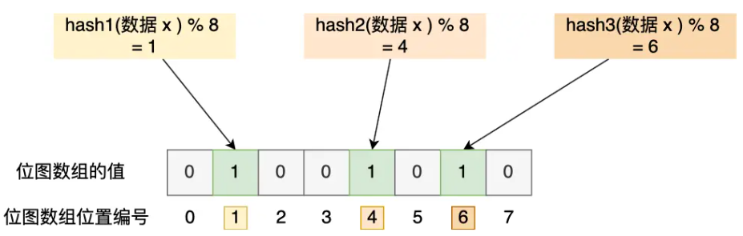
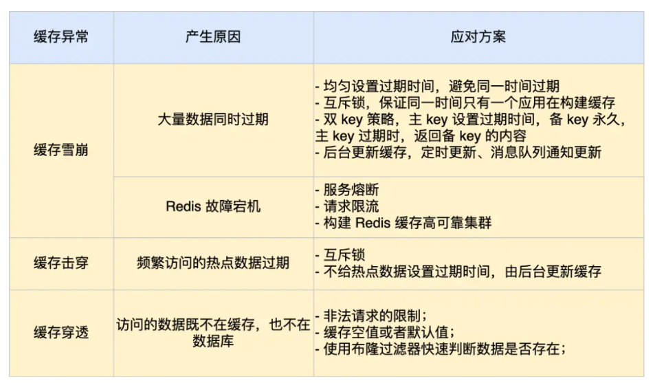
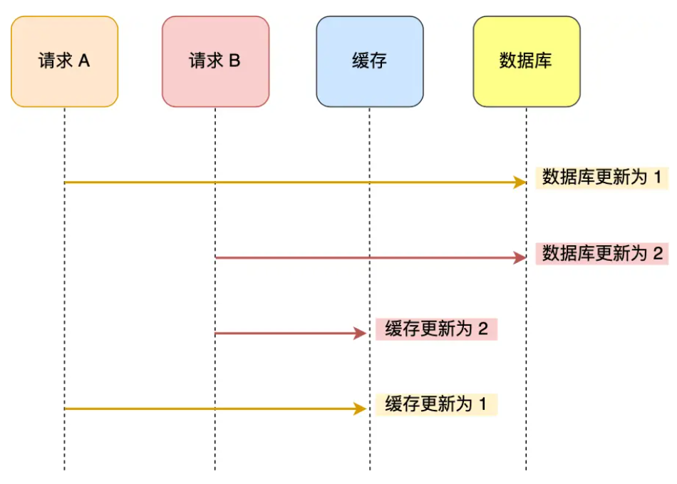
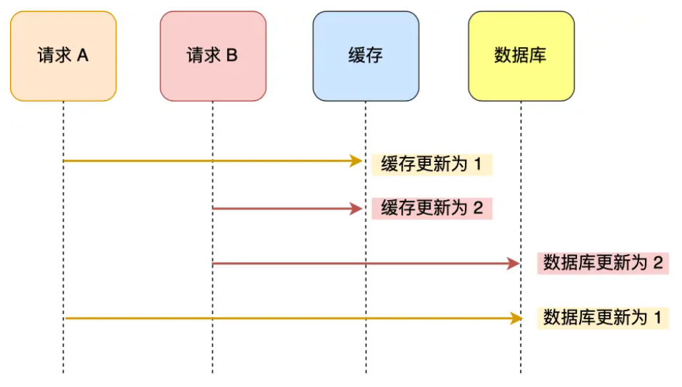
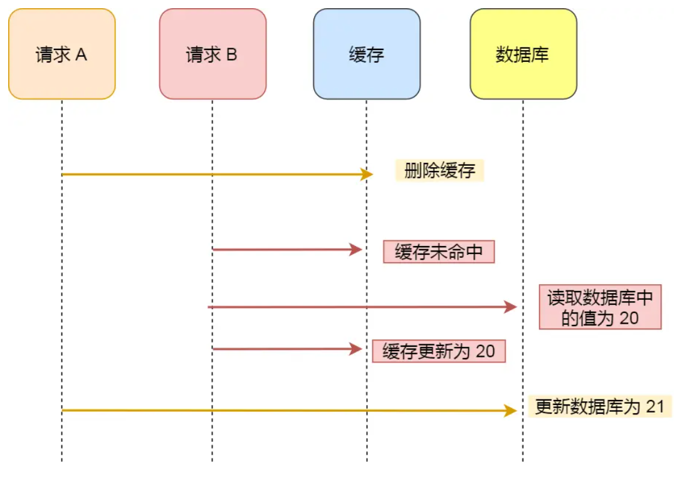
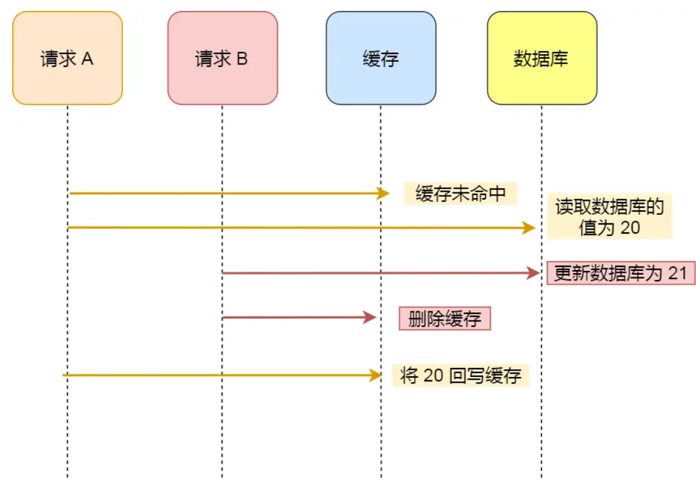

# Redis 缓存

## 缓存雪崩

* **大量缓存数据在同一时间过期（失效）或 Redis 故障宕机，大量用户请求直接访问数据库**
* 原因
  * 大量数据同时过期
  * Redis 故障宕机

### 大量数据同时过期

* 均匀设置过期时间
  * 设置过期时间时，**加上一个随机数**
* 互斥锁
  * **访问数据不在 Redis 时，添加互斥锁，保证同一时间只有一个请求构建缓存，缓存构建完成后再释放锁**
  * 未获取互斥锁的请求，要么等待锁释放重新读取缓存，要么返回空值/默认值
  * 最好给锁添加超时时间，这样拿到锁的请求就不会因为发生意外导致阻塞
* 后台更新缓存
  * 将更新缓存的工作，从业务线程交给后台线程定时更新
  * 方式一：后台线程频繁检测缓存是否有效（不推荐）
  * 方式二：业务线程发现缓存失效后，**通过消息队列发送消息通知后台线程**
  * 缓存预热

### Redis 故障宕机

* 服务熔断或请求限流机制
  * 服务熔断：**暂停业务应用对缓存服务的访问，直接返回错误。（会导致业务无法工作）**
  * 请求限流：**只将少部分请求发送到数据库进行处理，再多的请求就在入口直接拒绝服务**，Redis 恢复正常再接触限流机制
* 构建 Redis 缓存高可靠集群
  * 主从节点

## 缓存穿透

* **热点数据过期，大量请求访问该热点数据**
* 缓存穿透是缓存雪崩的一种特殊情况
* 解决方案
  * 互斥锁
  * 由后台异步更新缓存

## 缓存击穿

* **用户访问的数据既不在缓存中也不在数据库中**
* 发送情况
  * 业务异常
  * 黑客恶意攻击
* 解决方案
  * 非法请求限制
    * 在 API 入口判断请求参数是否合理
  * 缓存空值或默认值
    * 针对查询数据，在缓存中设置空值或默认值
  * 使用布隆过滤器判断数据是否存在
    * 写入数据库数据时，使用布隆过滤器做个标记
    * 可以通过查询布隆过滤器快速判断数据是否存在

### 布隆过滤器

* 由「初始值都为 0 的位图数组」和「 N 个哈希函数」两部分组成
* 标记过程
  1. 使用 N 个哈希函数计算数据，得到 N 个哈希值
  2. 用 N 个哈希值对位图数组长度取模，得到每个哈希值在位图中的位置
  3. 将这些位置的值设为 1
* 布隆过滤器存在哈希冲突的可能性，因此**过滤器说数据存在不一定存在，但是过滤说数据不存在一定不存在**

## 总结

# 数据库和缓存一致性保证

问题1：数据更新时，是删除缓存重建还是更新缓存？

问题2：是先更新数据库，还是先删除缓存？

## 问题 1

* 先更新数据库，再更新缓存，存在并发问题

* 先更新缓存，再更新数据库

* 两种方式都存在并发问题，因此不应更新缓存，而是删除缓存中的数据，再重新写入缓存

## 问题 2

* Cache Aside 策略：旁路缓存

### 先删除缓存再更新数据库

* 读写并发时，存在不一致问题
  * 缓存读写快
  * 磁盘读写慢

### 先更新数据再删除缓存

虽然也可能发生不一致情况，但这种概率很低（缓存读写速度远快于磁盘）

