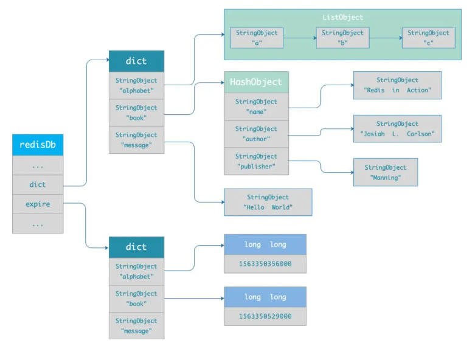

# Redis 过期删除

## 过期删除策略

### 判断是否过期

当我们对一个 key 设置了过期时间时，Redis 会把该 key 带上过期时间存储到一个**过期字典**

过期字典结构：

* key 是一个指针，指向某个键对象
* value 是一个 long long 类型的整数，这个整数保存了 key 的过期时间

```c
typedef struct redisDb {
    dict *dict;    /* 数据库键空间，存放着所有的键值对 */
    dict *expires; /* 键的过期时间 */
} redisDb;
```



当我们查询一个 key 时，Redis 首先检查该 key 是否存在于过期字典中：

* 如果不在，则正常读取键值
* 如果存在，则会获取该 key 的过期时间，然后与当前系统时间进行比对，如果比系统时间大，那就没有过期，否则判定该 key 已过期

### 定时删除

**在设置 key 的过期时间时，同时创建一个定时事件**，**当时间到达时，由事件处理器自动执行 key 的删除操作**。

优点：可以保证过期 key 会被尽快删除，也就是内存可以被尽快地释放。**定时删除对内存是最友好的**

缺点：过期 key 比较多的情况下，删除过期 key 可能会占用相当一部分 CPU 时间。**定时删除策略对 CPU 不友好**

### 惰性删除

**不主动删除过期键，每次从数据库访问 key 时，都检测 key 是否过期，如果过期则删除该 key**

优点：每次访问时，才会检查 key 是否过期，所以此策略只会使用很少的系统资源。**惰性删除策略对 CPU 时间最友好**

缺点：如果一个 key 已经过期仍然保留在数据库中，那如果这个 key 一直没有被访问，内存就不会释放，造成空间浪费。**惰性删除策略对内存不友好**

### 定期删除

**每隔一段时间「随机」从数据库中取出一定数量的 key 进行检查，并删除其中的过期key**

定期删除流程：

* 从过期字典中随机抽取 20 个 key
* 检查这 20 个 key 是否过期，并删除已过期的 key
* 如果本轮检查的已过期 key 的数量，超过 5 个（25%）则继续重复步骤 1，否则停止继续删除过期 key，然后等待下一轮再检查

这是一个循环过程，为了保证不会循环卡死，增加了定期删除循环流程的时间上限，默认不会超过 25ms

**优点：** 通过限制删除操作执行的时长和频率，来减少删除操作对 CPU 的影响，同时也能删除一部分过期的数据减少了过期键对空间的无效占用

**缺点：** 难以确定删除操作执行的时长和频率。如果执行的太频繁，就会对 CPU 不友好；如果执行的太少，那又和惰性删除一样了，过期 key 占用的内存不会及时得到释放

## 持久化对过期键的处理

### RDB

* RDB 文件生成阶段：生成文件时会对 key 过期检查，**过期的键「不会」被保存到新的 RDB 文件中**
* RDB 加载阶段：
  * 主服务器：**载入 RDB 文件时，程序会对文件中保存的键进行检查，过期键「不会」被载入到数据库中**
  * 从服务器：**在载入 RDB 文件时，不论键是否过期都会被载入到数据库中**。主从同步时，从服务器数据会被清空，一般过期键也不会有影响

### AOF

* AOF 写入阶段：**如果数据库某个过期键还没被删除，那么 AOF 文件会保留此过期键，当此过期键被删除后，Redis 会向 AOF 文件追加一条 DEL 命令来显式地删除该键值 。**
* AOF 重写阶段：会对 Redis 中的键值对进行检查，**已过期的键不会被保存到重写后的 AOF 文件中**

## 主从模式对过期键的处理

**从库不会进行过期扫描，从库对过期的处理是被动的。主库在 key 到期时，会在 AOF 文件里增加一条 del 指令，同步到所有的从库**
