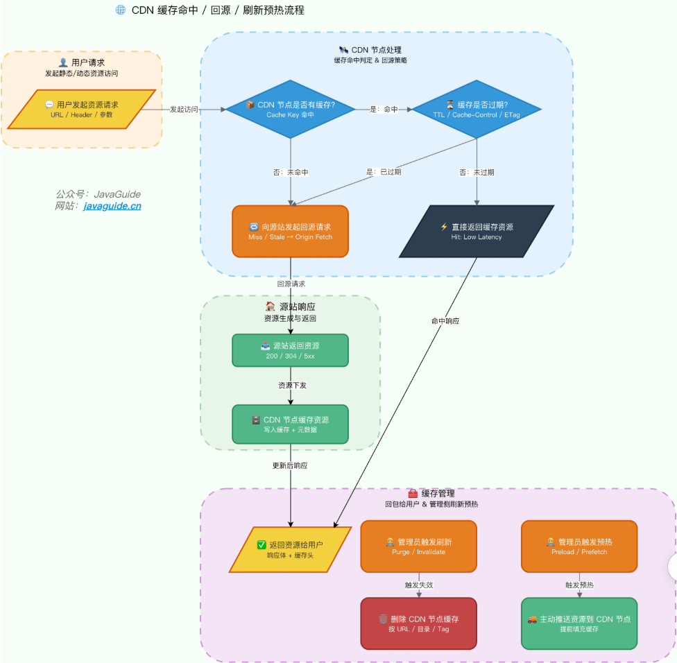
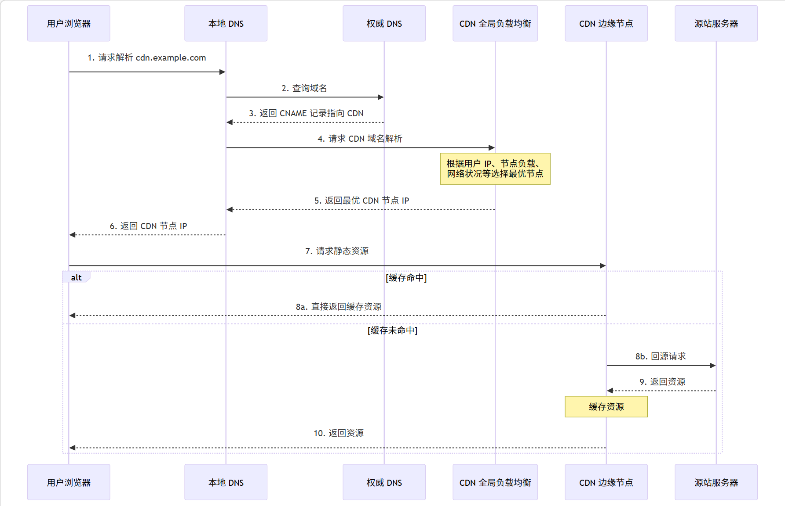

# CDN

* 中文名：内容分发网络
  * **内容** ：指的是静态资源，包括图片、视频、文档、JS、CSS、HTML 等。
  * **分发网络** ：指的是将这些静态资源分发到位于多个不同地理位置机房中的服务器上，从而实现**就近访问**
* 全称：Content Delivery Network/Content Distribution Network
* **CDN 将静态资源分发到多个不同的地方以实现就近访问，进而加快静态资源的访问速度，减轻源站服务器以及带宽的负担**

## 工作原理

### 静态资源缓存到 CDN 节点

* 主要方式：

  * **预热（Prefetch）** ：主动将源站的资源推送到 CDN 节点中。用户首次请求资源时可以直接从 CDN 节点获取，无需回源，适用于大促活动、热点内容发布等场景。
  * **回源（Origin Pull）** ：当 CDN 节点上没有用户请求的资源或该资源的缓存已过期时，CDN 节点需要从源站获取最新的资源内容。
* 当用户请求触发回源时，该请求的响应速度会比未使用 CDN 还慢，因为相比于直接访问源站，多了一层 CDN 节点的调用流程
* CDN 缓存完整生命周期：

### 寻找最合适的 CDN 节点

* **GSLB（Global Server Load Balance，全局负载均衡）** 是 CDN 的大脑，负责多个 CDN 节点之间的协调调度，最常用的实现方式是 **基于 DNS 的 GSLB**

 **详细流程说明** ：

1. 用户浏览器向本地 DNS 服务器发送域名解析请求。
2. 本地 DNS 向权威 DNS 查询，发现该域名配置了  **CNAME（Canonical Name）别名记录** ，指向 CDN 服务商的域名。
3. 本地 DNS 继续向 CDN 的 **GSLB** 发起解析请求。
4. GSLB 根据**用户 IP 地址、CDN 节点状态（负载、性能、响应时间、带宽）** 等指标，综合判断并返回最优 CDN 节点的 IP 地址。
5. 用户浏览器直接向该 CDN 节点（边缘服务器）发起资源请求。
6. CDN 节点检查本地缓存，若命中则直接返回；若未命中或已过期，则回源获取后再返回给用户。
