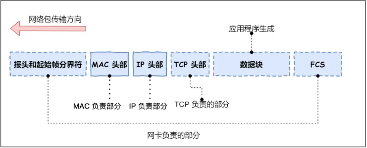

# 键入网址到网页显示

## HTTP

* 解析URL，确定Web服务器和文件名
  * URL实际上是服务器里面的文件资源
* 生成HTTP请求，发送请求报文（GET POST）

## DNS真实地址查询

* DNS 中的域名都是用句点分隔的，域名的层级关系类似一个树状结构

  * 根 DNS 服务器（.）
  * 顶级域 DNS 服务器（.com）
  * 权威 DNS 服务器（server.com）
* 域名解析：

  * 发送DNS请求，询问域名的IP地址，并发给本地DNS服务器
  * 本地服务器收到请求
    * 缓存中能找到，返回IP地址
    * 找不到，询问根域名服务器
  * 根DNS收到请求，发送顶级域名服务器的地址
  * 本地DNS，向顶级域名服务器请求
  * 顶级域名服务器收到请求，发送权威域名服务器的地址
  * 本地DNS，向权威域名服务器请求
  * 权威DNS查询后返回对应的IP地址
  * 本地DNS将IP地址返回客户端，客户端和目标建立连接

## 协议栈

* 通过 DNS 获取到 IP 后，就可以把 HTTP 的传输工作交给操作系统中的 **协议栈** 。
* 把浏览器生成的 HTTP 请求，通过 TCP/IP 分层封装，变成可以在互联网中传输的数据包，并确保它能正确、高效地送到服务器，再由服务器反向还原处理。

## TCP

* TCP包头格式

  
* 序号，解决乱序问题
* 确认号，确认对方是否收到，解决丢包问题
* **状态位** ，`SYN` 是发起一个连接，`ACK` 是回复，`RST` 是重新连接，`FIN` 是结束连接。
* TCP三次握手

* 建立连接后，网络包报文：TCP头部+HTTP报文

## IP

## 网卡

网卡驱动程序：将数字信息转化为电信号，通过网线发送出去

网卡驱动获取网络包之后，会将其**复制**到网卡内的缓存区中，接着会在其**开头加上报头和起始帧分界符，在末尾加上用于检测错误的帧校验序列**

## 交换机

将网络包**原样**转发到目的地

交换机将电信号转化为数字信号，然后通过包末尾的 `FCS` 校验错误，如果没问题则放到缓冲区

* 计算机网卡本身具有 MAC 地址，并通过核对收到的包的接收方 MAC 地址判断是不是发给自己的，如果不是则丢弃
* **交换机的端口不具有 MAC 地址**，不核对接收方 MAC 地址，而是直接接收所有的包并存放到缓冲区中

交换机的 MAC 地址表包含的信息：

* 设备的MAC地址
* 该设备链接在交换机哪个端口上

**交换机根据 MAC 地址表查找 MAC 地址，然后将信号发送到相应的端口**。 如果找不到，则会将包转发到除了源端口之外的所有端口上，**只有相应的接收者才接收包，而其他设备则会忽略这个包。** 接收到响应包，交换机就可以将它的地址写入 MAC 地址表

## 路由器

* **路由器**是基于 IP 设计的，俗称**三层**网络设备，路由器的各个端口都具有 MAC 地址和 IP 地址、
* **交换机**是基于以太网设计的，俗称**二层**网络设备，交换机的端口不具有 MAC 地址

执行操作：

* 将电信号转成数字信号，然后通过包末尾的 `FCS` 进行错误校验
* 检查 MAC 头部中的 **接收方 MAC 地址** ，看看是不是发给自己的包，如果是就放到接收缓冲区中，否则丢弃
* **去掉**包开头的 MAC 头部（**MAC 头部的作用就是将包送达路由器**）
* 路由器会根据 MAC 头部后方的 `IP` 头部中的内容进行包的转发操作
  * 查询**路由表**判断转发目标
    * 每个条目的子网掩码和目标地址 IP 做 **& 与运算**后，得到的结果与对应条目的目标地址进行匹配，匹配则转发，不匹配则和下个条目进行匹配
    * 如果都找不到，选择默认路由
  * 根据**路由表的网关列**判断对方的地址：
    * 如果网关是一个 IP 地址，则这个IP 地址就是我们要转发到的目标地址，**还未抵达终点，还需继续需要路由器转发**
    * 如果网关为空，则 IP 头部中的接收方 IP 地址就是要转发到的目标地址，说明**已抵达终点**
    *
